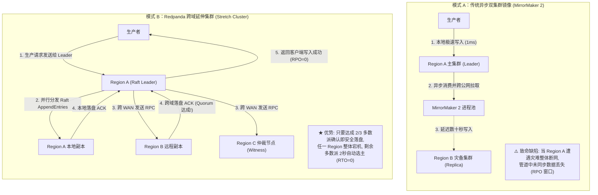

**TL;DR：** 在 Redpanda Operator 26.2 官方版本中，**Stretch Clusters（延伸集群）** 正式从实验特性走向全面可用（GA）。在传统 Apache Kafka 架构中，跨地域（Cross-Region/Cross-AZ）容灾主要依赖 MirrorMaker 2 等异步复制工具，但其天然存在 **数据丢失窗口（RPO > 0）** 与 **灾备切换停机人工介入（RTO > 0）** 的致命缺陷。Redpanda 借助自研的 C++ 原生 Raft 共识引擎，将单个逻辑集群的 Broker 节点与分区的 Raft 多数派（Quorum）物理分散在横跨多个数据中心或公有云 Region 的独立 Kubernetes 集群中，在物理层实现了 **真正的强一致性同步跨域写（RPO=0）** 与 **全自动毫秒级重新选主（RTO ≈ 0）**。然而，天下没有免费的午餐，物理光速限制下的跨域 WAN 往返时延（RTT）被直接引入了客户端每次生产请求的热路径中。本文将从分布式共识、网络物理模型与生产运维边界深入推导 Stretch Clusters 的本质代价与适用边界。

---

## 一、 为什么跨地域容灾是流存储的最大痛点？

在金融级交易、物联网实时控制与核心资产账本场景下，“Region 级物理灾难（如海底光缆中断、整机房断电、区域性自然灾害）”是必须防御的极端威胁。

在传统的分布式消息引擎中，架构师通常面临两难绝境：
1. **同城多可用区（Multi-AZ）**：RTT 通常在 1~3ms，虽然可以将副本跨 AZ 部署，但无法防御整个城市/Region 级的重大物理灾害；
2. **异地多地域（Multi-Region）**：两个独立的数据中心相距数百至上千公里，光纤往返时延（RTT）上升到 20ms~80ms。在此背景下，经典的消息中间件只能妥协采用“主备异步镜像模式”。

| 容灾维度 | 传统异步镜像（MirrorMaker 2） | 延伸集群（Redpanda Stretch Cluster） |
| :--- | :--- | :--- |
| **复制机制** | 独立主集群落盘后，通过独立消费进程异步复制至备集群 | 单个逻辑集群内部，Raft 复制日志直接跨 Region 同步写入多数派 |
| **数据丢失度（RPO）** | **RPO > 0**（主库突发宕机时，异步管道中未同步的积压数据永久丢失） | **RPO = 0**（只要客户端收到 `acks=all` 确认，数据必已持久化跨域多数派） |
| **恢复时间（RTO）** | **RTO > 0**（需要人工或 DNS 切换上游生产者，重设消费位点消费） | **RTO ≈ 0**（无需切换集群，存活的多数派在 2~3 秒内自动重新选举 Leader） |
| **写入网络延迟** | 仅受本地 Region 内部机房延迟影响（< 2ms） | **受跨 Region WAN 网络 RTT 物理瓶颈强约束**（20ms ~ 80ms+） |
| **运维复杂性** | 双集群元数据维护、Offset 双向映射混乱、易脑裂 | 单控制面统一纳管，依靠 Kubernetes Operator 统一生命周期管理 |

---

## 二、 架构对比：异步镜像 vs 跨域延伸集群

为了清晰展现数据流向与容灾机制的本质差异，我们将两种模式的控制面与数据面拓扑对比如下：



在 Redpanda 的 Stretch 架构下，核心创新在于：**将 Raft 的投票权与副本拓扑进行了地理拓扑感知（Rack / Zone / Region Awareness）的强制约束**。一个典型的五副本（5-Replica）或三副本+仲裁（3-Replica + Witness）分区，确保即使某个主力 Region 物理失联，剩余的存活节点依然能够构成严格的数学多数派（$\lfloor N/2 \rfloor + 1$），从而完全自主地完成新 Leader 选举，继续承接写入。

---

## 三、 跨域 Raft 的物理约束：WAN 延迟与多数派确认精算

虽然 Stretch Clusters 达成了理想中的 RPO=0 与 RTO=0，但它必须严格遵循物理学定律。

### 3.1 客户端请求端到端延迟模型
当客户端配置 `acks=all` 时，一条消息从发送到收到 Broker 确认的时延公式推导如下：

$$T_{\text{produce}} = T_{\text{client-leader}} + \max(T_{\text{local-fsync}}, T_{\text{WAN-RTT}} + T_{\text{remote-fsync}}) + T_{\text{ack-back}}$$

其中：
- $T_{\text{WAN-RTT}}$：跨 Region 物理光纤往返时延（例如美东至美西约 65ms，上海至北京约 25ms）；
- 假设同城两可用区间 $T_{\text{local}} \approx 2\text{ms}$，跨国/跨区间 $T_{\text{WAN-RTT}} \approx 40\text{ms}$；
- 无论本地 NVMe SSD 的 `fsync` 写入有多快（通常 < 0.5ms），**只要多数派中必须包含远程 Region 的 ACK，客户端观察到的单次阻塞延迟下限就被锁死在跨域 WAN RTT**！

```text
┌────────────────────────────────────────────────────────────────────────┐
│                        网络往返与 Raft 多数派时间线                      │
├────────────────────────────────────────────────────────────────────────┤
│ Client 发送请求 ──▶ Broker Leader (Region A)                          │
│                      │                                                 │
│                      ├─▶ 写入本地磁盘 (0.5ms) ──────▶ 本地已完成       │
│                      │                                                 │
│                      └─▶ 发送 Raft RPC ──(WAN 30ms)──▶ Region B 节点   │
│                                                          │             │
│                                                  落盘并返回 (30ms)     │
│                                                          ▼             │
│ Client 收到写入成功 ◀── Quorum 达成 (总耗时: ~61ms) ◀───────────────────┘
└────────────────────────────────────────────────────────────────────────┘
```

### 3.2 吞吐保全之道：流水线与批处理（Pipeline & Commit Batching）
如果在 Stretch Clusters 下仍然使用同步单条消息发送，客户端 QPS 将暴跌至 $1 / 0.06\text{s} \approx 16 \text{ ops/sec}$。
为了在 60ms 的 WAN 延迟下维持几十万 QPS 的超高吞吐，生产环境必须依赖 **批量提交（Commit Batching）与异步并发流（In-Flight Pipelining）**：
- 增大客户端的 `linger.ms`（如设置为 20ms~50ms）与 `batch.size`（如 512KB~1MB）；
- 允许每个连接维持多个未决请求（`max.in.flight.requests.per.connection = 5`）；
- 此时延迟依然是 60ms（高延迟），但吞吐（Throughput）可以充分填满整个跨域专线的带宽时延积（BDP: Bandwidth-Delay Product）。

---

## 四、 Redpanda Operator 26.2 的工程落地：拓扑感知与两阶段滚动探针

在真实生产 Kubernetes 集群中运维 Stretch Clusters，最大的危险在于**集群滚动升级或节点重启时的“非受控级联断网”**。如果 Operator 贸然同时重启位于不同 Region 的节点，极易瞬间击穿 Raft 多数派法定人数，导致整个分区陷入死锁。

Redpanda Operator 26.2 引入了 **两阶段滚动安全探针（Pre-Roll & Post-Roll Safe Probes）** 与基于 CRD 的拓扑装配：

```yaml
apiVersion: cluster.redpanda.com/v1alpha2
kind: Redpanda
metadata:
  name: production-stretch-cluster
  namespace: redpanda
spec:
  clusterSpec:
    tier: Enterprise
    features:
      stretchClusters:
        enabled: true
    configuration:
      developer_mode: false
      cloud_storage_enabled: true
    nodePools:
      - name: region-east-az1
        replicas: 2
        rack: "us-east-1a"
      - name: region-east-az2
        replicas: 2
        rack: "us-east-1b"
      - name: region-west-witness
        replicas: 1
        rack: "us-west-2a"
        witnessNode: true # 仅参与 Raft 仲裁投票，不持久化全量数据
    rolloutPolicy:
      maxUnavailable: 1
      preRollProbe:
        requireQuorumHealthy: true
        rebalanceWaitTimeoutSeconds: 300
```

### 两阶段滚动核心状态机：
1. **Pre-Roll 探针**：在准备驱逐或重启任何一个 Pod 前，Operator 调用内部 Admin API 校验：全集群所有分区的 Under-Replicated Partitions（URP）必须为 0，且该 Broker 所属故障域不是唯一的法定人数提供者；
2. **主动 Leader 优雅让渡（Leadership Transfer）**：在节点下线前，强行将该节点上所有的 Leader 角色平滑迁移至同 Region 的其余健康副本，耗时由原来的“选主超时 2 秒”压缩至毫秒级主动接管；
3. **Post-Roll 探针**：节点重启后，必须等待该节点完全追赶（Catch-up）全部增量 Raft 检查点并回到 In-Sync 集合，才允许轮转下一个节点。

---

## 五、 总结与架构选型决策矩阵

Stretch Clusters 的出现并不是为了完全淘汰 MirrorMaker 2，而是为企业在**“数据一致性”与“网络延迟成本”**之间提供了确定性的工程解：

| 业务场景 | 推荐选型 | 核心权衡逻辑 |
| :--- | :---: | :--- |
| **金融支付、风控账本、订单核心交易** | **★ Redpanda Stretch Clusters** | 业务容忍 30ms~60ms 的写入延迟，但**绝对无法容忍 1 条消息丢失（RPO=0）**，机房故障时要求秒级自愈。 |
| **海量物联网日志、埋点流、监控遥测** | **MirrorMaker 2 异步复制** | 产生海量高频事件，要求极低生产延迟（< 5ms）；允许在特大物理灾难时丢失数秒钟的非核心日志。 |
| **跨大洋全球跨国同步（中美 / 中欧）** | **业务层双写 + 异步事件最终一致** | 跨大洋物理光纤 RTT 普遍超过 150ms~250ms，Raft 强一致同步跨域复制会直接拖垮用户交互体验。 |

---

## 参考资料与权威出处

1. **Redpanda Official Architecture**: *Multi-Region High Availability with Kafka Stretch Clusters (Operator 26.2)*
   [https://www.redpanda.com/blog/multi-region-high-availability-kafka-stretch-clusters](https://www.redpanda.com/blog/multi-region-high-availability-kafka-stretch-clusters)
2. **Ongaro, D., & Ousterhout, J. (2014)**: *In Search of an Understandable Consensus Algorithm (Extended Version)*, USENIX ATC '14. (Raft 分布式共识协议奠基论文)
3. **Apache Kafka Documentation**: *MirrorMaker 2.0 (MM2) Architecture and Multi-Cluster Georeplication*
   [https://cwiki.apache.org/confluence/display/KAFKA/KIP-382%3A+MirrorMaker+2.0](https://cwiki.apache.org/confluence/display/KAFKA/KIP-382%3A+MirrorMaker+2.0)
4. **Kleppmann, M. (2017)**: *Designing Data-Intensive Applications*, O'Reilly Media. (Chapter 8: The Trouble with Distributed Systems & Clock/Network Latency)
