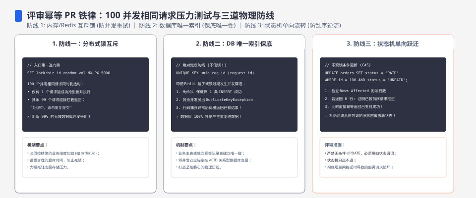
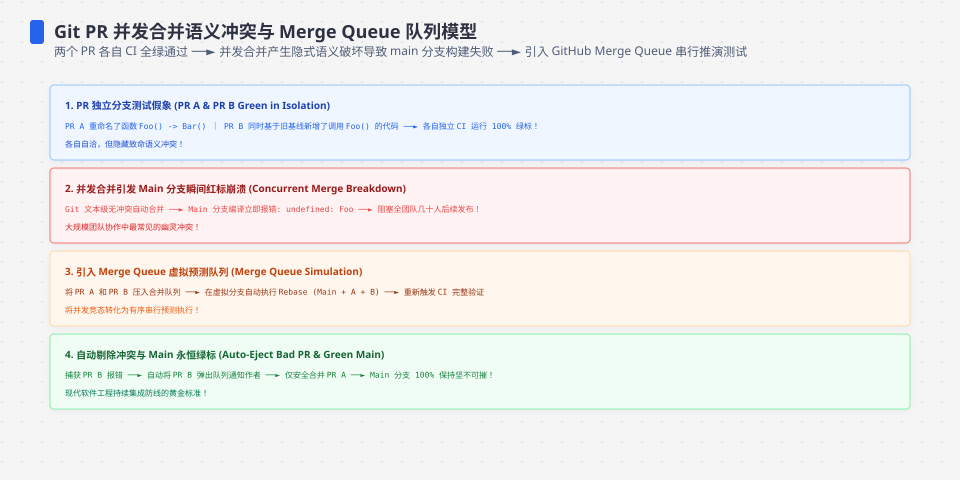
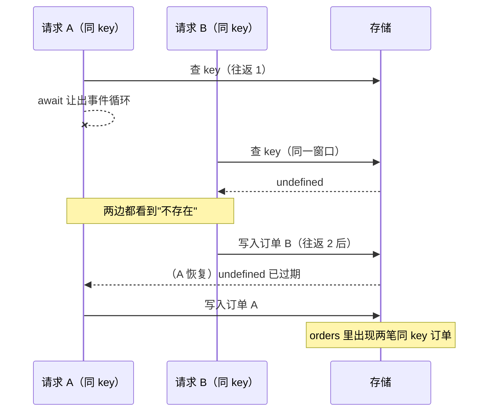
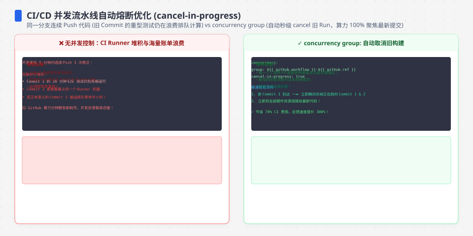

**TL;DR：** 幂等实现的缺陷几乎从不出现在 PR 自述的场景里：它藏在"两个相同请求同时到达"的间隙中。本文用仓库内可复现的评审工件演示标准流程——被评审实现（check 与 act 隔着两次存储往返）在 100 个同 key 并发请求下创建出 **100 个订单**（`expected 100 to be 1`）；把同一个测试对准合并后的实现则全绿。结论：评审幂等 PR 时不要先读 diff 的 happy path，先把并发反例写成可执行断言——红灯就是议价筹码。


---



## 一、PR 自述没有撒谎，它只是没说全

设想一个典型 PR：为订单服务补充幂等能力。描述写着"按幂等键去重，重复请求返回已创建订单"，附带三四个顺序用例，全部通过。它的核心逻辑长这样（`experiments/service/src/pr-review/before-store.ts`，节选）：

```ts
async saveByKey(idempotencyKey, order, requestFingerprint) {
  // check 与 act 之间隔着两次 await：检查时"没有"，不代表写入时仍然没有。
  const existing = await this.roundTrip(this.byKey.get(idempotencyKey));
  if (existing) {
    return { order: existing.order, created: false, /* ... */ };
  }
  await this.roundTrip(undefined); // 写入前的第二次往返：竞争窗口
  this.byKey.set(idempotencyKey, { order, fingerprint: requestFingerprint });
  this.orders.set(order.orderId, order);
  return { order, created: true, conflict: false };
}
```

逐行看没有任何"错误"：查一次、没有就写、有就返回旧值。`roundTrip` 用 `setTimeout(0)` 模拟一次异步存储往返——这不是故意埋雷，任何由数据库驱动的真实实现都长这样。问题不在某一行的写法，而在 **check 与 act 之间的时间间隙**：顺序用例永远不会踩进去。




## 二、评审的第一动作：把"同时到达"写成断言

读 diff 之前，先写这个测试（`experiments/service/src/pr-review/concurrent.test.ts`）：

```ts
const results = await Promise.all(
  Array.from({ length: 100 }, (_, i) =>
    store.saveByKey("same-key", order(i), "same-payload"),
  ),
);
expect(results.filter((r) => r.created)).toHaveLength(1);   // 只许一个 claim 成功
expect(new Set(results.map((r) => r.order.orderId)).size).toBe(1); // 所有人拿到同一订单
```

三个断言对应幂等合同的三条承诺：恰好一个创建者、无第二订单落库、所有并发调用者收到同一权威结果。缺一条，客户端就可能拿到两个 `orderId` 或一个 404。

对被评审实现运行（`PR_REVIEW_RED=1 npx vitest run src/pr-review`），原始输出保存在 `evidence/review-idempotent-pr-concurrency/2026-08-23-local/red-before-store.log`：

```text
AssertionError: expected 100 to be 1
- 1
+ 100
```

**100 个并发请求创建了 100 个订单。** 不是偶发的 2 个：两次 `await` 让出事件循环后，100 个请求全部挤进竞争窗口，每个都在检查时看到"键不存在"。环境与复现命令见该目录 README。

## 三、红在哪里：单进程 JavaScript 为什么仍会竞争

最常见的反驳是"Node 单线程，不会有并发"。它混淆了**执行互斥**和**事务原子性**：事件循环保证任意时刻只有一段同步代码在跑，但不保证一段逻辑的多次 `await` 之间不被别的请求插入。



这就是 check-then-act 竞争的本质：**检查结果的有效期只到下一个 `await`**。它与语言无关——Go 里不持锁跨 channel 查写、SQL 里两条独立语句之间，都是同一个缺口。[测试策略篇](/writing/service-testing-strategy)把它称为"最容易被顺序 happy path 掩盖的反例"，本篇是那个原则在评审场景的具体化。




## 四、修在哪一层：把 claim 收缩成存储的一个原子动作

评审要给出修法，而修法必须回答：**裁决权放在哪一层？** 三层各有一个位置可选：

| 层 | 做法 | 判定 |
| --- | --- | --- |
| handler 层 | 先 `findByKey` 再决定 create | 无效：只是把竞争窗口挪了个位置 |
| 应用层锁 | 进程内 mutex 包住查写 | 只护住单实例；多实例部署即失效 |
| 存储层 | claim 是存储的一个原子动作 | 当前原型的选择 |

合并后的实现把检查和写入收缩成**一个不含 `await` 的方法**（`experiments/service/src/store.ts:80`）：

```ts
async saveByKey(...) {
  // 这个方法没有 await：在单个 JS 事件循环中，检查和写入不会被另一个
  // handler 插入。它只证明单进程原型内的原子性，不能替代数据库唯一约束。
  const existing = this.byKey.get(idempotencyKey);
  if (existing) {
    return {
      order: existing.order,
      created: false,
      conflict: conflictWith(existing.requestFingerprint, requestFingerprint),
    };
  }
  this.writeNew(idempotencyKey, order, requestFingerprint);
  return { order, created: true, conflict: false };
}
```

同步段落一旦开始就不会被插入，这是 JS 运行时给的免费原子性——但它是**借来的**，条件写在注释里：方法体内不许出现 `await`。评审这类修复时要盯住这条纪律，将来有人往方法里加一次日志上报的 `await`，原子性就悄悄失效。

同一把尺子重新跑，绿灯（`green-current-store.log`）：`Tests 1 passed | 1 expected fail (2)`。注意那个 `expected fail`——测试文件用 `it.fails` 把被评审实现的红灯**固定在套件里**：只要有人改坏了当前实现，或者把 before-store 又接回路由，套件立刻变红。反例从此不再是评论区的口头描述，而是 CI 里的一条硬约束。

## 五、绿灯之后仍然不证明什么

这套工件的可信边界必须写进评审意见：

1. **单进程内存语义**。`setTimeout(0)` 构造的窗口证明了事件循环层面的竞争，但生产的多实例部署下，两个进程各自的事件循环互不知晓，进程内原子性毫无作用。
2. **数据库才是权威裁决层**。仓库里的 `experiments/service/src/store-pg.ts` 用 `idempotency_key UNIQUE` 唯一约束实现 Postgres 原子 claim——并发 INSERT 同 key 时数据库保证恰好一个事务成功。它需要本地 PostgreSQL 实例，本次未运行；在跑通之前，只能声称停在本地原型。
3. **100 这个数字属于本机本次运行**。窗口大小取决于往返次数与并发度，换参数会得到不同计数；不变的是方向——只要 check 与 act 分离，计数就大于 1。

## 六、结论：反例是评审里的议价筹码

顺序用例证明"作者想的那条路走得通"，并发反例证明"别人会走的路也走得通"。评审幂等 PR 时，diff 通读三遍不如先跑一把 100 并发同 key：红灯一出来，讨论就从"风格偏好"变成"事实裁决"。整个流程收敛成三句话：反例先行、红灯留档、修复后用 `it.fails` 让它永久站岗。下次合入幂等改动前，先把"两个相同请求同时到达会怎样"变成一条能跑的断言——答不出来的 PR，还没有到讨论合并的阶段。

## 参考资料

- 本篇实验工件与原始输出：`experiments/service/src/pr-review/`、`evidence/review-idempotent-pr-concurrency/2026-08-23-local/`
- Node.js 事件循环模型（为什么 `await` 之间会插入其他请求）：[Event loop, timers, and nextTick](https://nodejs.org/en/learn/asynchronous-work/event-loop-timers-and-nexttick)
- 站内相关：[测试值多少钱：先把并发反例写进断言](/writing/service-testing-strategy)、[重试会放大错误：幂等性工程的键、状态与未知结果](/writing/idempotency-engineering)
