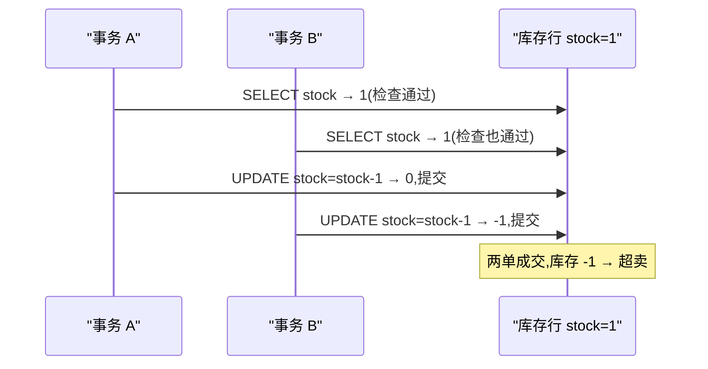

**TL;DR：** 秒杀方案里写最多的是削峰、限流、MQ 缓冲，但系统真正会出事的是**超卖**——只要扣减是"先查再改"（check-then-update），并发下必然超卖，削峰削得再平也救不了。正确性必须落到**最底层的一条原子扣减**上，前面三层各挡一段：第一层网关/边缘挡"不是人的流量"（静态化、限流、每人限购）；第二层缓存用 Redis 的 DECR/Lua 原子预扣把并发拍平、扛住读；第三层 DB 用 `UPDATE ... WHERE stock>0` 做兜底原子扣减。面试官想听的正是你亲手证明第三层：检查与扣减被行锁合并成一个原子操作后，成功次数不可能超过初始库存，所以不会超卖；去掉这层原子性，前两层全部失效。

## 一、反例先行：check-then-update 为什么必然超卖

先立反例，其余都是给这个反例擦屁股。库存剩 1 件，两个请求几乎同时到达：

```sql
-- 事务 A                                 事务 B
BEGIN;                                    BEGIN;
SELECT stock FROM sku WHERE id=42;       -- 读到 1
                                          SELECT stock FROM sku WHERE id=42;  -- 也读到 1
UPDATE sku SET stock=stock-1 WHERE id=42; -- 1 → 0
                                          UPDATE sku SET stock=stock-1 WHERE id=42; -- 0 → -1
COMMIT;                                   COMMIT;
-- 结果:卖出 2 单,库存 -1 → 超卖 1 件
```



关键点在于：**问题不在 UPDATE，在 SELECT**。单条 `UPDATE stock=stock-1` 本身是原子的（InnoDB 对单行的修改在行锁下串行执行），两条 UPDATE 都会真的把数字减下去。超卖来自"检查"和"扣减"是两个独立语句：事务 B 在事务 A 提交**之前**读了库存，读到的是同一份旧值。`BEGIN/COMMIT` 包住这三步也不能让它变原子——在 REPEATABLE READ 下，普通 SELECT 是快照读（consistent read），读的是事务开始时的快照，天然滞后；两个事务各自持有"库存=1"的快照，互不知情。这是 REPEATABLE READ 下 check-then-update 失效的机制根源，详见[MVCC 快照隔离的账单](/writing/mvcc-isolation-snapshot)。注意 READ COMMITTED 下同样超卖：两次读都在任一方提交前发生、读到同一旧提交值，只是机制不同——失败的根源永远是同一个：**「读」与「改」没有合成一个原子操作**。

把场景搬到并发代码里，反例可复现。`experiments/seckill` 用 1000 个并发用户抢 100 件库存，`naive` 方案把"检查"和"扣减"分成两步、中间留一个模拟窗口（真实系统的这个窗口是两条独立 SQL 或一次网络往返，只大不小），结果每轮超卖几十到两百件不等（数值随调度交错变化，见过 67~143、163~222 两种样本），`-race` 跑过仍成立——因为每一步都是原子操作，错的是**这三步没有合成一个原子操作**，这不属于数据竞争，属于并发正确性错误。

## 二、第一层闸门：网关/边缘挡的是"不是人的流量"

第一层闸门部署在流量入口，回答"这是不是人"。

- **静态化**：秒杀详情页、商品可售数量、倒计时这些信息要么静态化、要么走弱一致缓存，让读请求别打到库存服务上。剩余量数字显示"紧张"而不是真实数字，是刻意为之。
- **限流**：入口令牌桶按容量基线限流，超出的请求直接返回"繁忙"。限流算法与阈值来源见[限流、熔断与降级](/writing/rate-limiting-circuit-breaker)，这里不展开。
- **每用户限购 + 风控**：同一账号/手机号/IP 限购 1 件，是用户维度的细粒度限流——全局限流挡不住单一来源的刷量，维度限流挡得住。

这一层的语义承诺：**把到达库存扣减的并发压到"人肉可及"的量级**，并给下面两层留出判断时间。它挡的是机器、脚本、黄牛，不挡也不承诺解决正确性问题——即便只剩 10 个真人同时点，check-then-update 照样超卖，只是超卖数量从"万级"变成"个位数"。为什么挡不住：网关手上没有库存状态，它只看流量形态，看不到"这 10 个请求都读了 stock=1"。

## 三、第二层闸门：缓存层做原子预扣

流量压进系统后，第一件事是别让所有请求直接打 DB。Redis 在秒杀窗口内充当"可售库存"的权威，同时它的单线程模型让原子扣减变得便宜。

**DECR 是单条原子命令。** Redis 是单线程处理命令队列的，`DECR key` 要么执行完要么不执行，中间没有别的命令插进来。所以"减一"天然原子，不用加锁。但 `DECR` 只能减，不能先判断"够不够"。要"判断 + 扣减"整体原子，就得把判断放进脚本，让单线程在脚本执行期间不处理任何其他命令：

```lua
-- KEYS[1] = 库存键, ARGV[1] = 购买件数;整个脚本单线程内执行,无人能插队
local cur = tonumber(redis.call('GET', KEYS[1]))
if cur == nil or cur < tonumber(ARGV[1]) then
    return 0 -- 售罄
end
redis.call('DECRBY', KEYS[1], ARGV[1])
return 1 -- 扣减成功
```

这就是"原子预扣"：脚本的读-判-扣被 Redis 的单线程执行模型保护，等价于数据库里一条条件 UPDATE，但吞吐更高、不占用 DB 连接。注意它的局限：脚本只保证 Redis 这把锁内部的原子性，**Redis 之外的世界它管不到**。典型错误是拿"Redis 分布式锁"包住 DB 的 check-then-update——锁把并发串行化了，但锁本身的租约、过期、异常释放语义在崩溃下不干净，正确性仍然悬空，详见[分布式锁的 fence 与租约](/writing/distributed-lock-fence-lease)。

**预扣的语义与缺口。** 预扣的意思是：Redis 先扣掉"承诺给用户"的数量，DB 订单落库后再兑现。这个方案的一致性是"最终对账"级别的，有两个必须说清的缺口：

1. **Redis 崩溃丢预扣**：预扣值在内存，主从切换或宕机可能丢一部分，于是 Redis 认为没扣、实际订单已生成 → 超卖。兜底是**对账**：用 DB 已确认订单数 + 预留额度重建 Redis 预扣值。对账是异步的，存在一个可接受的窗口，窗口内的极端请求可能失败。
2. **预扣后订单失败**：预扣成功但后续下单失败，要主动回补库存（`INCR`），否则预扣被占用不释放 → 少卖。回补和预扣是两次独立操作，中间有人插队也回不到原状，这就是不一致窗口。

**为什么 MQ 解耦是"收单"不是"扣库存"。** 这是面试最常见的错误答案：把扣库存丢进 MQ 异步执行，认为"削峰了就不超卖"。MQ 是管道不是锁——它异步化的是**订单创建和后续流程**，而"确认你能买"这个判断必须在入队那一刻原子完成。如果扣库存发生在消费端，N 个消费者并发处理扣减消息，又回到 check-then-update。正确的切分是：入队前先做一次原子预扣（Redis Lua 或 DB 条件 UPDATE），入队后订单服务异步落库；此时 MQ 只负责把"已承诺"的订单持久化，不承担"防超卖"的职责。

## 四、第三层闸门：DB 的原子条件扣减兜底

缓存层挡得住量，挡不住自己的崩溃窗口。正确性最终落在数据库的一条 SQL 上：

```sql
UPDATE sku SET stock = stock - 1
 WHERE id = 42 AND stock > 0;   -- 影响行数 = 1 → 抢到;= 0 → 售罄
```

**为什么这一条不会超卖，是全文的证明核心。** 并发 UPDATE 同一行时，InnoDB 用行锁把它们**串行化**：后到的 UPDATE 要等先到的提交释放锁，拿锁后执行时读到的是最新已提交值。于是"检查 `stock>0`"和"减一"在行锁保护下成为一个原子操作——每个成功 UPDATE 都对应一次真实的库存扣减，而 `WHERE stock>0` 保证库存为 0 后不再有 UPDATE 成功。两个条件合起来就是一个不变量：**成功次数 ≤ 初始库存**。应用层用影响行数判断胜负：返回 1 说明这单成交，返回 0 说明售罄，永远不会出现"判定成功但实际没扣到"。

对比另外两种 DB 做法，落到语义差异上：

- **悲观锁 `SELECT ... FOR UPDATE` + 业务判断**：把串行化提前到"读"，锁内再判断再更新。正确，但把锁持有时间拉长到整个事务（含业务逻辑），吞吐下降、死锁面变大。单行扣减用不上它——条件 UPDATE 已经把"锁 + 判断 + 扣减"折叠成一条语句。多行扣减（购物车一次买多个 SKU）必须给行排序锁，否则两个事务按不同顺序锁行直接死锁，见[数据库死锁的等待图](/writing/database-deadlock-wait-graph)。
- **乐观锁 version + CAS 重试**：`UPDATE ... SET stock=stock-1, version=version+1 WHERE id=? AND stock>0` 本质上就是条件扣减，version 是给"业务读多改少"的场景看的。单独用 `WHERE version=?` 做 CAS，冲突时应用层要重读重试——秒杀恰恰是最高热点的场景，重试风暴让乐观锁在最该用它的地方最狼狈。条件 UPDATE 把版本比较折叠进 WHERE，一次成功，不靠重试。
- **为什么 check-then-update 里 SELECT 看到的是旧值，而这里的 WHERE 是准的**：前者是快照读，后者是当前读（锁读）。条件 UPDATE 的 `stock>0` 在行锁内、基于最新已提交值判断；`SELECT` 走 MVCC 读已提交快照。同一个"库存"字段，读法不同，正确性完全不同。这也是为什么 `UPDATE ... WHERE id=?` 必须走主键——`EXPLAIN` 里主键扫描才能锁到精确单行而不是整表，代价模型见[MySQL 为什么不走你的索引](/writing/mysql-optimizer-explain-cost)。

**别忘了幂等。** 条件扣减防超卖，防不了重复下单：用户手抖点两下、网关重试一次，同一笔请求可能扣两次库存生成两单。重复由唯一约束/幂等键兜底，和扣减是正交的两件事，完整方案见[幂等性工程的完整账本](/writing/idempotency-engineering)。库存扣减与订单创建建议放同一事务，避免"库存扣了、订单没建成"的中间态。

## 五、三层闸门的总账与四种故障模式

三层不是同一件事的三个版本，是三种语义的分工：

| 层 | 挡住什么 | 语义承诺 | 主要代价 | 单独上这一层够吗 |
| :--- | :--- | :--- | :--- | :--- |
| 网关/边缘 | 机器流量、刷子、超预期并发 | 把到达扣减的并发压到人肉量级 | 误伤真人（限流过严）；静态化牺牲信息实时性 | 否：10 个真人同时点照样超卖 |
| 缓存（Redis） | 直接打向 DB 的读与扣减并发 | 单线程内"判 + 扣"原子，扛住读 | 一致性是最终对账级；崩溃有丢预扣窗口；多一层要保的设施 | 否：崩溃窗口内超卖；对账有延迟 |
| DB 条件 UPDATE | 正确性本身 | 行锁下"检查 + 扣减"原子，成功次数 ≤ 库存 | 行锁串行化限制吞吐；是整条链路的吞吐瓶颈 | 是（正确性）；但没了前两层会直接把 DB 打爆 |

三层各付各的账：前两层决定**多快能卖完**（容量），第三层决定**卖完这件事对不对**（正确性）。去掉任何一层，另外两层都补不上它的语义。

四种故障模式按根因归位，面试时对照这张表答：

| 故障模式 | 表现 | 根因 | 主要责任层 | 兜底/修法 |
| :--- | :--- | :--- | :--- | :--- |
| 超卖 | 成交单数 > 库存，库存为负 | check-then-update 非原子；Redis 崩溃丢预扣未对账 | DB 条件扣减缺失；Redis 预扣对账缺失 | 底层条件 UPDATE + 影响行数判胜；对账重建预扣值 |
| 少卖 | 明明有货却卖不出去/卖不满 | 预扣后订单失败未回补；悲观锁把并发全串行 | 缓存预扣的回补逻辑 | 预扣失败主动 INCR 回补 |
| 重复下单 | 同一用户/请求扣两次库存、生成两单 | 重试、双击、网关重放 | 幂等键（与扣减正交） | 唯一约束 + 幂等键，见[幂等性工程](/writing/idempotency-engineering) |
| 库存订单不一致 | Redis 预扣数 ≠ DB 订单数 | Redis 与 DB 是两套权威，无对账 | 缓存预扣 | 对账任务：以 DB 订单数重建 Redis 预扣值 |

结论一句话：**网关与缓存两层挡不住超卖；正确性只由最底层那条条件 UPDATE 兜底。** 任何"只有前两层、没有底层原子扣减"的方案都不完整——网关不碰库存，Redis 有崩溃窗口，只有行锁下那条条件 UPDATE 把"判断"和"扣减"焊成一个原子操作，不变量才成立；去掉最底层，前两层全部失效。面试官追问"为什么原子扣减不会超卖"，答案就是：并发 UPDATE 被行锁串行化，每个拿锁者看到的都是最新已提交值，`stock>0` 保证库存归零后无人再成功，成功次数恒 ≤ 初始库存。

## 六、实验入口：把反例和三层闸门跑出来

反例不是口头断言，`experiments/seckill` 里有一个纯标准库的 Go 程序，模拟 1000 个并发用户抢 100 件库存，依次跑三种方案，输出超卖次数与吞吐。运行命令：

```bash
cd experiments/seckill
go run .                              # 默认:stock=100, 1000 并发, 3 轮
go run . -stock 100 -n 1000 -gap 50us -runs 3
go run . -addr localhost:6379         # 连上 Redis 后,luascript 走真实 EVAL
go run -race ./                       # 三方案全是原子操作,无数据竞争
```

`-gap` 是 naive 方案"检查通过 → 扣减"之间的模拟窗口，真实系统的窗口是两条独立 SQL 或一次网络往返，只大不小。连不上 Redis 时 `luascript` 退化为互斥锁串行化——语义等价于 Redis 单线程执行脚本。

本机一次结果（Go 1.25.1 darwin/arm64，`-stock 100 -n 1000 -gap 50us -runs 3`，Redis 未连接；2026-08-19 原始输出见 `evidence/seckill-inventory-atomic-gates/2026-08-19-local/run.out`）：

```text
scheme      sold  final_stock   oversell        ops/s    elapsed
naive        263         -163        163      1126866      887µs
naive        269         -169        169      3758819      266µs
naive        322         -222        222      4308785      232µs
cas          100            0          0      3839376      260µs
cas          100            0          0      4628751      216µs
cas          100            0          0      5485734      182µs
luascript    100            0          0      3710575      270µs
luascript    100            0          0      4087890      245µs
luascript    100            0          0      4218679      237µs

naive      平均超卖 184.7 件/run
cas        平均超卖 0.0 件/run
luascript  平均超卖 0.0 件/run
```

naive 每轮超卖数不固定（本文此前一轮为 67~143，本轮为 163~222）不是误差，是它该有的样子——超卖量由调度交错决定，数值每次不同，但"必然超卖"是结构性的；cas 与 luascript 三轮全部为 0。注意 `ops/s` 是进程内模拟吞吐，不代表真实 MySQL/Redis 延迟：本机一次结果只证明正确性差异，不构成性能分界线。真实依赖的延迟对比（DB 条件 UPDATE 的 P99、Redis EVAL 的 P99、MQ 端到端延迟）不在本文范围——正确性语义是本文的账，性能排序需要真实存储与监控才能写。

## 参考资料

1. Redis 官方文档：DECR/DECRBY 命令（单线程原子递减）—— https://redis.io/docs/latest/commands/decr/
2. Redis 官方文档：EVAL 命令（脚本在服务端原子执行）—— https://redis.io/docs/latest/commands/eval/
3. MySQL 官方文档：InnoDB Locking Reads（`SELECT ... FOR UPDATE` 与当前读/锁读语义）—— https://dev.mysql.com/doc/refman/8.0/en/innodb-locking-reads.html
4. MySQL 官方文档：InnoDB 行锁与一致性读（快照读 vs 当前读）—— https://dev.mysql.com/doc/refman/8.0/en/innodb-consistent-read.html
