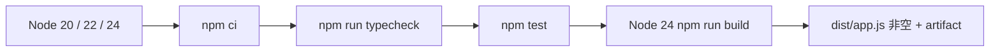

**TL;DR：** 原稿引用的嵌套 workflow 看起来像一条管线，但 GitHub Actions 只发现仓库根目录 `.github/workflows/` 下的 workflow，而且它没有 service 工作目录、独立 typecheck 或真实 build。现在生效配置是根目录的 `service-ci.yml`：Node 20/22/24 测试矩阵 → 独立 typecheck → Node 24 build → 非空 artifact 校验。它还没有 deploy、staging、健康检查或回滚，因此这篇讨论的是“如何让 CI 先说真话”，不是“一条 commit 到生产”。

## 一、workflow 放在哪里，决定它是否存在

GitHub Actions 的发现边界是仓库根目录 `.github/workflows/`。嵌套在 `experiments/service/.github/workflows/` 的 YAML 不会因为写得完整就自动执行。

当前有效文件是：

```text
.github/workflows/service-ci.yml
experiments/service/package.json
experiments/service/package-lock.json
experiments/service/tsconfig.json
```

workflow 还显式设置了：

```yaml
defaults:
  run:
    working-directory: experiments/service
```

没有这个边界，`npm ci` 会装博客根依赖，`npm test` 会跑博客测试，`tsc` 会读取根 `tsconfig.json`。根配置排除了 `experiments`，所以“根目录 typecheck 通过”不能证明 service 被检查。

### 1.1 `paths` 也是一条发布合同

当前 workflow 只在以下路径变化时触发：

```yaml
paths:
  - "experiments/service/**"
  - ".github/workflows/service-ci.yml"
```

这对当前独立 package 是合理的：service 不导入博客根目录的 `lib/`、组件或根 lockfile，所以改文章不会无谓触发 service CI。但它也定义了一个容易被忽略的边界：一旦 service 开始依赖根目录共享代码，必须把共享目录和对应 lockfile 加进触发范围；否则“绿色”可能只是 workflow 根本没有运行。路径过滤不是优化细节，而是 CI 对依赖图的声明。

## 二、先把 CI 的四个可验证阶段接起来

现在的 pipeline 只承诺本地可验证的四件事：



service 的 package scripts 与 pipeline 同步。下面是配置节选：

```json
{
  "test": "vitest run",
  "typecheck": "tsc -p tsconfig.json --noEmit",
  "build": "tsc -p tsconfig.json"
}
```

`build` 不再使用 `--if-present`。这个参数会把“没有 build 脚本”变成成功跳过，随后再上传一个不存在的 `dist/`，制造假绿。现在 build job 用 `test -s dist/app.js` 把空产物变成失败。

### 2.1 每个 job 需要写清楚“它证明什么”

| job/步骤 | 当前配置 | 它能证明什么 | 它不能证明什么 |
| --- | --- | --- | --- |
| Node matrix | 20、22、24，`fail-fast: false` | 三个 job 都完成后，可比较各版本的 typecheck/test 结果 | 没有真实 Actions run 时，不能声称三版本已经通过 |
| `npm ci` | service `package-lock.json` + `cache-dependency-path` | 使用锁定依赖安装独立 package | 不能证明依赖没有已知漏洞或供应商可用 |
| typecheck/test | `npm run typecheck`、`npm test` | 当前源码合同和 18 个测试在该 Node 版本下成立 | 不覆盖 PostgreSQL、网络、进程重启和真实端口 |
| build | Node 24 `npm run build` + `test -s dist/app.js` | 编译产物存在且不是空文件 | 不证明 artifact 已被部署或可回滚 |
| upload artifact | `if-no-files-found: error` | CI 保存了该 job 产生的 `dist/` | 没有 digest、staging 回显和 smoke 时，不证明线上正在运行它 |

`fail-fast: false` 的意义是让一次提交收集完所有版本的结果，不是把失败变成成功；`build.needs: test` 的意义是 build 等待完整矩阵结束，也不是部署闸门。把这些语义写进文章，读者才不会把 YAML 的存在误读成发布完成。

## 三、矩阵是支持范围的承诺，不是装饰

本机 Node 24.19.0 的独立验证结果：

```text
typecheck: pass
build: pass, dist/app.js 非空
test files: 3 passed
tests: 18 passed
```

本机 gate 的环境、命令和原始输出保存在 `evidence/service-ci-cd/2026-08-17-local/`；它是可复跑的本地镜像，不是 GitHub Actions 的替代品。

这证明当前 checkout 在 Node 24 能编译和测试。仓库配置了 Node 20/22/24 矩阵，但没有本机三个版本，也没有当前 GitHub Actions run URL，所以不能把矩阵 YAML 写成“20/22/24 已全部通过”。真正发布前应保存每个 job 的 run URL、Node 精确版本和原始日志。

## 四、CI 绿灯和部署成功是两份证据

旧文章把 artifact 下载与 `curl PROD_URL` 叫作 deploy，但它没有部署命令，`steps.deploy.outputs.url` 也没有对应的 `id: deploy` step。健康检查只能检查某个已经存在的 URL，不能证明本次 commit 进入了那个环境。

当前文章故意不补一个虚构部署平台。要恢复“部署”这层，至少还需要：

- 明确的容器或制品发布命令，以及版本/校验值；
- staging 环境和本次 commit 的版本回显；
- `/healthz`、`/readyz` 和一个只读业务 smoke test；
- 数据库迁移的前向兼容策略；
- 失败时停止流量、恢复旧制品和重放 artifact 的记录。

这些证据尚未进入仓库，也没有在线 run，因此本系列当前的准确边界是“本地教学原型 + 根目录 CI 设计”。

### 4.1 五层证据不能跨层借用

| 层 | 当前状态 | 通过条件 | 当前缺口 |
| --- | --- | --- | --- |
| source | commit 中存在 service 源码和 lockfile | checkout 可还原 | 需要记录提交 SHA |
| CI | 根 workflow 有 matrix/typecheck/test/build | 所有 required job 通过 | 当前没有可引用的 Actions run URL |
| artifact | Node 24 产生非空 `dist/app.js` 并上传 | artifact 可下载、校验值匹配 | 当前没有 digest 和下载记录 |
| staging | 未配置 | commit/version 回显、健康检查、只读 smoke | 没有环境和 URL |
| production | 未配置 | 流量切换、SLO、回滚与恢复记录 | 没有部署、监控和回滚证据 |

因此，“CI 绿灯”最多覆盖第二层，“artifact 存在”最多覆盖第三层。把第三层写成第四层，或者把第四层写成第五层，都是发布事故的常见来源。

## 五、结论：先让 CI 只证明它真正执行过的事

这次修复把三个容易混淆的命题分开：

1. 根目录 workflow 是否被平台发现，是配置路径问题。
2. service 是否被测试、类型检查和构建，是工作目录与独立 package 的问题。
3. artifact 是否部署并通过线上 smoke，是外部环境证据问题。

当前代码和本机输出已经覆盖前两层，第三层仍未完成。读者可以先用 `experiments/service` 的 `npm ci && npm run typecheck && npm test && npm run build` 验证本地闭环，再决定使用哪个部署平台；不要用一个没有 deploy step 的 YAML 替代发布记录。

本地验证也要保留边界：本机 `npm run build` 只证明当前机器能编译，不能代替 Ubuntu runner、Node 20/22/24 矩阵；根目录 `npm test` 只证明博客测试，不能代替 service 的独立 package 测试。真正的发布检查应把 commit SHA、workflow run、artifact digest、环境版本和 smoke 响应放在同一份记录中。

## 参考资料

- [GitHub Docs：Workflows](https://docs.github.com/en/actions/concepts/workflows-and-actions/workflows)
- [GitHub Docs：依赖的 job](https://docs.github.com/en/actions/using-jobs/using-jobs-in-a-workflow)
- [GitHub Docs：Dependency caching](https://docs.github.com/en/actions/using-workflows/caching-dependencies-to-speed-up-workflows)
