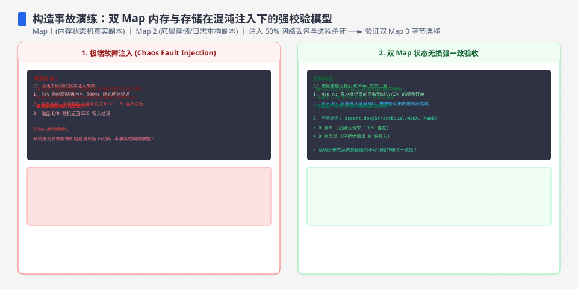
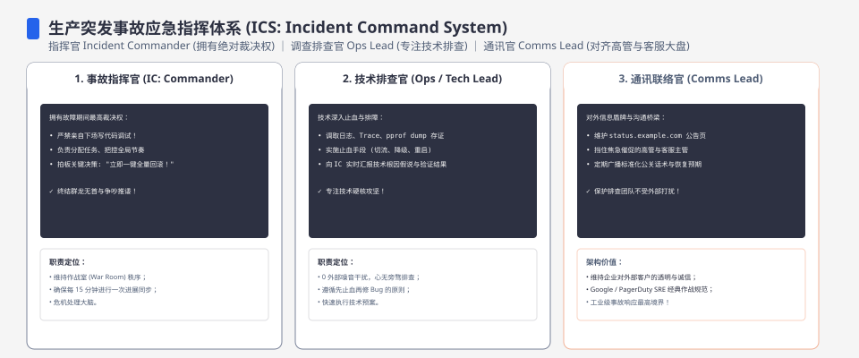
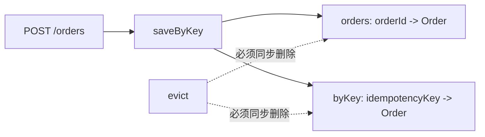
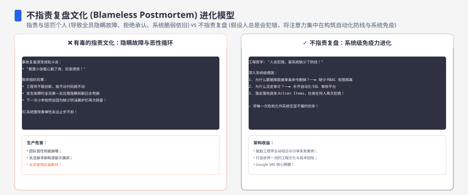

**TL;DR：** 原稿把一组找不回原始输出的 RSS、订单数和吞吐数字写成“47 分钟真实事故”，但当前仓库既不能启动那个历史版本，也无法证明那些数字使用了同一分母。本次修订把文章降级为可重跑的构造演练：`UnboundedInMemoryStore` 让 `orders` 与 `byKey` 各增长 500 条，`BoundedInMemoryStore(100)` 让两张表都停在 100 条。事故排查的可迁移判断仍然保留：修复内存上限时，必须沿数据流检查所有索引，而不是只修第一张 Map。


---



## 一、先区分历史事故与当前可复现演练

审计发现旧文至少混用了五组口径：RSS 增量、订单数、请求数、吞吐对照和可能来自另一轮的 heap 数据。比如 `97.8MB → 241.2MB` 的增量是 `143.4MB`，不能同时写成“+180MB”；`5834 → 6274 req/s` 的相对增量约为 `7.54%`，也不能写成 3%。没有 raw 输出、源码 commit、机器环境和分母，直接挑一个数字留下仍然是猜测。

因此本文不再声称“真实事故”“每订单 9.5KB”“10 万订单 1GB”或“压测 RSS 236.8MB”。这些旧说法和原始反例保留在仓库根目录 `review.md` 的 P0-04 条目里，作为待找回证据，而不是继续出现在读者可见的结论中。




## 二、构造最小反例：两个索引只进不出

订单服务在写入时同时维护业务查询表和幂等键表：



构造基线 `app-buggy.ts` 使用 `UnboundedInMemoryStore`。它的价值不是模拟某次历史部署，而是把“写入有两条落点、读取只有一条主路径”变成可以启动的反例。下面是类的关键方法节选，不是完整文件：

```ts
export class UnboundedInMemoryStore implements OrderStore {
  private orders = new Map<string, Order>();
  private byKey = new Map<string, IdempotencyEntry>();

  async saveByKey(key, order, requestFingerprint) {
    if (this.byKey.has(key)) return { order: this.byKey.get(key)!.order, created: false, conflict: false };
    this.byKey.set(key, { order, requestFingerprint });
    this.orders.set(order.orderId, order);
    return { order, created: true, conflict: false };
  }
}
```

业务请求通常只通过 `orders` 读取，不能由一次成功的 GET 推断 `byKey` 没有增长。内存泄漏的排查第一步不是看某个绝对 RSS，而是列出每个写入点、每个索引和每个删除条件。

## 三、当前工件能证明什么

`experiments/service/scripts/store-growth.ts` 不依赖网络和 GC，它只验证两个实现的容量不变量：

```bash
cd experiments/service
node scripts/store-growth.ts 500 100
```

Node 24.19.0 本机输出：

```json
{"count":500,"boundedLimit":100,"unbounded":{"orders":500,"keys":500},"bounded":{"orders":100,"keys":100}}
```

本次命令、环境和原始 JSON 保存在 `evidence/service-incident-drama/2026-08-16-local/`；这份快照只支持容量不变量，不支持历史事故、RSS 或生产 OOM 结论。

这个输出可以证明：

- 构造基线的两个 Map 都按唯一 key 增长；
- 修复版在 500 次写入后两张表都不超过配置上限；
- `keyByOrderId` 反向索引让驱逐可以同步删除对应幂等键。

它不能证明 RSS 峰值、V8 保留堆、吞吐、线上 OOM 或某次历史事故的时间线。那些问题需要独立进程、固定压测参数、GC/heap profile 和 raw 输出，不能从 Map 的 size 外推。




## 四、修一半仍然是错误：容量和一致性要成对测试

下面这类测试比“插入成功”更接近事故不变量：

```ts
it("500 次插入后两张表都不超过容量上限", async () => {
  const store = new BoundedInMemoryStore(100);
  for (let i = 0; i < 500; i++) {
    await store.saveByKey(`key-${i}`, order(i), `fingerprint-${i}`);
  }
  expect(store.size).toBeLessThanOrEqual(100);
  expect(store.keySize).toBeLessThanOrEqual(100);
});
```

只断言 `orders.size` 会漏掉最危险的修一半版本：业务查询表看起来有界，幂等索引仍然只进不出。当前实现也把 eviction 的边界写成 `size > maxOrders`，因此上限 100 的语义确实是“最多 100”，不是旧实现中插入后只剩 99 的隐含行为。

## 五、不要把内存上限误写成生产存储方案

有界 Map 只是教学原型的内存不变量。生产订单系统还要回答：

- 订单和幂等记录是否需要重启后保留；
- 多实例是否共享唯一约束；
- 驱逐是否会让同一个 key 再次触发副作用；
- 备份、恢复、TTL、迁移和数据库故障如何处理；
- RSS、heap、external、GC 后保留量和请求延迟分别由什么指标观测。

如果业务数据不能丢，正确方向是把权威记录放进持久化存储，内存只做有明确失效合同的缓存。当前仓库没有 PostgreSQL、部署和恢复演练，因此这里的准确称呼是“构造事故演练”，不是“生产内存泄漏已修复”。

## 六、结论：事故复盘先保住分母，再保住不变量

这次改写保留了故障的工程价值，但撤掉了无法由当前工件支持的故事性数字：

1. 历史事实要有 raw 输出、源码快照和分母，找不回就标待复核。
2. 两个写入索引必须同时拥有容量和删除路径。
3. `Map.size` 回归测试能证明局部不变量，不能替代 RSS、profile、部署和恢复证据。

下一步如果要恢复真实事故文章，应先建立 `unbounded / half-fixed / fixed` 三个可启动快照，再保存至少三轮压测的原始 stdout、RSS/heap 曲线和派生公式。没有这些，继续增加精确数字只会让文章更像事故，而不会让它更可信。

## 参考资料

- [Node.js：`process.memoryUsage()`](https://nodejs.org/api/process.html#processmemoryusage)
- [Node.js：诊断内存问题](https://nodejs.org/en/learn/diagnostics/memory/using-heap-snapshot)
