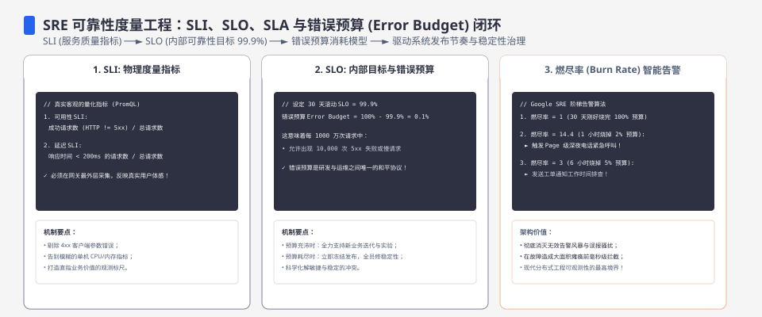
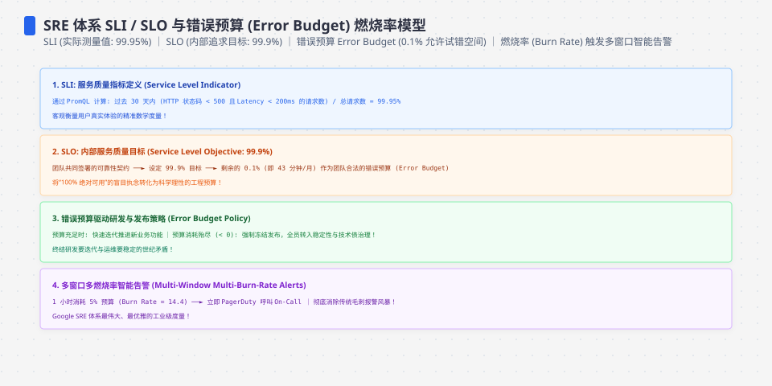
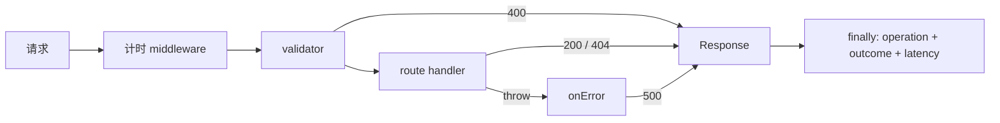
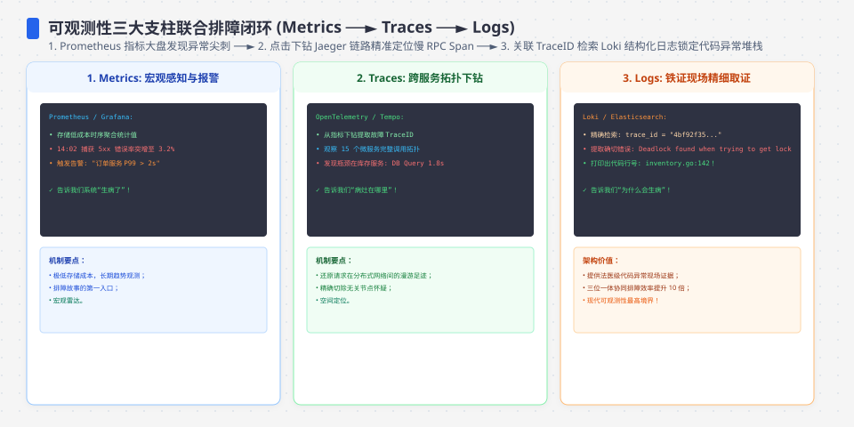

**TL;DR：** 监控不是把数字放进 `/metrics` 就结束了。当前订单服务的 middleware 会在成功、404、400 和 500 的退出路径统一记录延迟，并按 `operation + outcome` 分桶；真实端口压测（120 并发，404/409 各占独立样本桶）让“404 不进分布”的修复可以直接重跑，但 SLI 分母口径会把同一份样本变成 100% 或 25%，月度可用性仍需要生产窗口与真实依赖证据。


---



## 一、先写 good event：可用性不是“有 HTTP 响应”

SLO 需要先定义 SLI 的分子、分母和时间窗口。对订单查询，至少要拆成两个问题：服务是否处理了请求，以及业务对象是否存在。

| SLI | 分子 | 分母 | 404 怎么算 | 窗口 |
| --- | --- | --- | --- | --- |
| 服务可用性 | 路由返回非 5xx 的请求 | 合法且已路由的请求 | 服务可用，但业务未找到 | 28 天或 30 天，先固定一种 |
| 业务成功率 | 返回订单的 200 | 合法查询请求 | 不算 good event | 同上 |
| 下单延迟 | 满足延迟阈值的下单请求 | 所有合法下单请求 | 不适用 | 例如滚动 28 天 |

“200/200 有响应”不能同时证明这三件事。200 个样本的失败率步长是 `1/200 = 0.5%`，它既不能验证 `99.9%`，也没有月度时间窗口。error budget 也必须从同一个 SLI 计算，例如 30 天的 99.9% 目标允许的预算是总请求数的 0.1%，不是从某次 handler 测试的结果倒推。




## 二、用 middleware 覆盖每条退出路径

指标的第一个 bug 往往不是分位数算法，而是某条 `return` 没有记账。下面是当前实现的 middleware 关键节选；计时放在请求 middleware 的 `try/finally`，validator 直接返回 400、handler 返回 404、`onError` 生成 500，都经过同一个出口：

```ts
app.use("*", async (c, next) => {
  const t0 = performance.now();
  try {
    await next();
  } finally {
    metrics.observe(
      operationFor(c.req.method, c.req.path),
      performance.now() - t0,
      outcomeFor(c.res.status),
    );
  }
});
```

`Metrics` 不是生产监控后端，它只是把关键语义显式化：`orders_get.ok`、`orders_get.not_found`、`orders_create.validation_failed` 和 `orders_get.error` 是四个不同分布。旧实现虽然接收了 `name`，却把 GET 与 POST 推进同一个数组；参数存在不等于标签生效。



## 三、当前测试证明的是覆盖完整，不是生产 p99

四条回归路径现在由 `experiments/service/src/app.test.ts` 固定：

```text
GET hit       -> 200 -> orders_get.ok
GET missing   -> 404 -> orders_get.not_found
POST invalid  -> 400 -> orders_create.validation_failed
store throw   -> 500 -> orders_get.error
```

测试还确认 500 的响应不会把内部错误消息返回给调用方。`/healthz` 只回答进程是否能处理请求；`/readyz` 才是依赖准备状态的预留出口。当前内存 store 的 `ready()` 永远返回 true，这是原型的事实，不是数据库 ready check。

这组测试解决了一个实现缺陷：审计时对 10 个不存在订单的旧实现得到 `not_found=10`、延迟 `n=0`。修复后，404 进入自己的样本桶。它仍然没有解决网络层延迟，因为 Hono 的 `app.request()` 不经过真实监听端口、TLS、反向代理或远程数据库。




## 四、什么时候才能把数字叫 API p99

要把本机观察升级成 API 实验，命令和结果至少需要绑定这些变量：

- Node、OS、CPU、依赖锁文件和服务 commit；
- 真实监听端口，固定连接数、并发数、读写比和请求体；
- 预热轮次、重复轮次、总请求数和失败响应数；
- p50/p95/p99 的样本分母、统计窗口与异常请求处理；
- store 是内存、SQLite 还是 PostgreSQL，以及依赖故障时的结果；
- 原始 stdout、stderr 和从原始数据生成表格的脚本。

当前仓库没有这些生产证据，所以本文的合法说法是“handler 级指标原型”。`p99 < 100ms` 可以作为候选 SLO，不能从一轮 `app.request()` 自动变成已达成的用户承诺。

当前本机指标 raw、环境和命令保存在 `evidence/service-observability-slo/2026-08-16-local/`；其中 JSON 只证明进程内 middleware 的分桶形状，不证明真实端口或月度 SLO。

## 五、把同一组请求搬到真实端口：本机能证明的边界

`app.request()` 不经过监听 socket，上一节的数字一直是进程内微基准。`experiments/service/scripts/slo-port-probe.ts` 把服务真正起在 `127.0.0.1:4111`，发 120 个并发 HTTP 请求（404/201/400/409 各 30 个），再从 `/metrics` 等价物拉同一份快照：

```text
端口压测: 120 个并发真实 HTTP 请求 耗时=558ms
  状态分布: 2xx=30 404=30 400=30 409=30 5xx=0
  分母口径A(所有业务分支=good): SLI=100.00%
  分母口径B(仅2xx=good):       SLI=25.00%
  分布 orders_create.ok: n=31 p50=0.08ms p99=6.02ms
  分布 orders_create.validation_failed: n=30 p50=0.12ms p99=49.94ms
  分布 orders_create.conflict: n=30 p50=0.10ms p99=38.12ms
  分布 orders_get.not_found: n=30 p50=0.02ms p99=0.21ms
```

这轮实验把上一节的三个判断往前推了一步：404 和 409 在真实端口路径下也各占独立样本桶（`n=30`），且 p99 门槛（本机 3 秒窗口下 `orders_create.ok p99=6.02ms`）仍然低于 100ms 候选阈值。它同时暴露了比吞吐更值得注意的事实：**SLI 口径变了，结论就变**——同一份 120 个请求，口径 A（所有业务分支都算 good）是 100%，口径 B（只有 2xx 算 good）是 25%。“SLI 高分”首先要交代分母定义，否则在事故复盘里会把业务错误算成可用性。

这组数字仍然来自单进程内存 store、无 TLS、无代理、无数据库、3 秒本地窗口，不构成月度承诺。命令、环境与原始输出见 `evidence/service-observability-slo-port/2026-08-19-local/`；与 08-16 的 handler 级快照并存，前者证明代码路径，后者证明本机真实端口路径。

## 六、结论：指标先闭合，SLO 再接受生产检验

这次修改留下三个可复核判断：

1. 每条退出路径都应进入延迟分布，404、validator 400 和 500 不能被成功路径掩盖——本机真实端口已验证这一点。
2. 延迟样本必须按操作和结果分组；把 GET、POST、错误和成功混桶，会让分位数失去问题定位能力。
3. SLI 的 good event、分母和窗口决定 SLO 的含义；真实端口压测仍不能替代月度窗口、多实例与真实依赖故障下的可用性证据。

读者可以先运行 `experiments/service` 的 18 个测试，再运行 `npx tsx scripts/slo-port-probe.ts` 把同一组请求通过真实端口重跑。下一步不是把 p99 数字写得更精确，而是补齐固定环境、原始输出和真实依赖，直到数字有资格代表用户看到的服务。

## 参考资料

- [Google SRE：Service Level Objectives](https://sre.google/sre-book/service-level-objectives/)
- [Node.js：Performance hooks](https://nodejs.org/api/perf_hooks.html)
