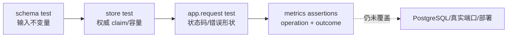

**TL;DR：** 测试的价值不在一张漂亮的覆盖率表，而在它能否把最容易被顺序 happy path 掩盖的反例固定下来。当前 `experiments/service/` 在 Node 24.19.0 下有 3 个测试文件、18 个测试通过：schema 约束、store 原子 claim、100 并发同 key、不同 payload 的 409、404/400/500 指标路径和双表容量不变量都被断言。当前覆盖率是 80% statements、71.62% branches、81.48% lines；它证明测试跑过了这些路径，不证明 PostgreSQL、多实例或部署闭环。

## 一、第一层不是“测框架”，而是钉住业务合同

`orders.test.ts` 只测 `OrderSchema` 的三个产品决策：合法订单通过、`qty=0` 拒绝、未知状态拒绝。schema 看起来像声明，实际上决定了 API 能接受什么；它值得用小测试把行为固定，而不是把责任交给类型检查器。下面是测试节选：

```ts
it("拒绝未知 status", () => {
  const result = OrderSchema.safeParse({
    orderId: "A-1", sku: "sku-1", customerId: 7, qty: 2,
    status: "REFUNDED", createdAt: "2026-08-16T00:00:00Z",
  });
  expect(result.success).toBe(false);
});
```

## 二、store 测试要证明“权威结果”而不只是“不覆盖”

现在 `saveByKey` 返回 `{ order, created, conflict }`。这比 `Promise<void>` 更重要：竞争失败的调用者必须知道自己拿到的是已经存在的权威订单，而不是自己刚构造但没有保存的临时对象。

store 层的回归包括：

| 反例 | 断言 |
| --- | --- |
| 同 key 第二次写入 | `created=false`，首次订单不被覆盖 |
| 同 key 不同 fingerprint | `conflict=true`，表中仍只有一个订单 |
| 500 次写入、上限 100 | `orders` 和 `byKey` 都不超过 100 |
| 100 次并发 claim | 只有一个 `created=true`，所有结果指向同一订单 |

顺序测试只能证明顺序语义；最后一行才真正对 check-then-act 竞争施压。

## 三、API 集成测试让状态码和指标一起过关

Hono 的 `app.request()` 不启动真实端口，但它能让路由、validator、store 和 `onError` 共同跑一遍。当前 API 测试覆盖：

```text
GET hit       -> 200
GET missing   -> 404 + ORDER_NOT_FOUND
POST invalid  -> 400 + details[]
POST duplicate -> 201 then 200
POST concurrent same key -> 1x 201 + 99x 200
POST same key different body -> 409
store throw   -> 500 + generic public error
```

另一个测试在同一组请求之后读取 `Metrics.snapshot()`，确认 GET 命中、GET 404、POST 400 分别进入不同的延迟桶。它防止实现退回“counter 有数字、latency n 仍为 0”的假观测状态。

这些测试不是按“单测/集成测试”标签机械分层，而是沿一条业务合同穿过不同边界：



因此“18 个测试通过”只能把左侧四层固定下来；右侧不是再补几条内存单测就会自动出现，而要换证据类型和运行环境。

## 四、当前本机结果：数字绑定环境，不能冒充历史快照

运行命令：

```bash
cd experiments/service
npm ci
node ./node_modules/vitest/vitest.mjs run --coverage
```

Node 24.19.0、Vitest 4.1.10 本机一次结果：

```text
Test Files  3 passed (3)
Tests       18 passed (18)
Statements  80%      (120/150)
Branches    71.62%   (53/74)
Functions   67.56%   (25/37)
Lines       81.48%   (110/135)
```

这些数字随依赖、机器和源码变化；原文旧的 11 tests、83.67% statements 和 90% branches 属于另一份代码状态，当前 checkout 不再复现，不能继续放在正文。覆盖率报告也只覆盖 service 的 3 个源文件，根目录 `tsconfig.json` 和 ESLint 明确排除 `experiments`。

本次覆盖率命令、Node/依赖版本和原始输出保存在 `evidence/service-testing-strategy/2026-08-16-local/`；它是本机 evidence snapshot，不是 Actions 矩阵或生产测试报告。

## 五、哪些信任仍然没有买到

当前测试明确是本地内存替身：

- 没有 PostgreSQL 唯一约束、事务、重启恢复或两实例竞争；
- `app.request()` 没有 socket、代理、真实网络和远程数据库延迟；
- `Metrics` 是进程内数组，不证明 Prometheus/OTel 的标签基数与告警行为；
- Node 20/22/24 的矩阵已经写入根 workflow，但本机只实际运行了 Node 24，尚无 Actions run 证据。

这不是测试“不够多”，而是证据类型不同。再加 100 个内存单测，也不能把 Map 变成分布式存储。

## 六、结论：覆盖率是导航，反例才是安全网

本次测试资产的改进点有三个：

1. 由顺序幂等升级到并发 claim 和冲突合同。
2. 把异常、validator 失败和观测路径作为 API 行为的一部分断言。
3. 把容量不变量和“权威结果”写成测试，而不是靠实现者记忆。

下一步应为 PostgreSQL 实现补同一组测试矩阵，再保存真实运行记录。到那之前，18 个本机通过只能称为“service 教学原型的局部安全网”。

## 参考资料

- [Vitest：Coverage](https://vitest.dev/guide/coverage.html)
- [Hono：Testing](https://hono.dev/docs/guides/testing)
