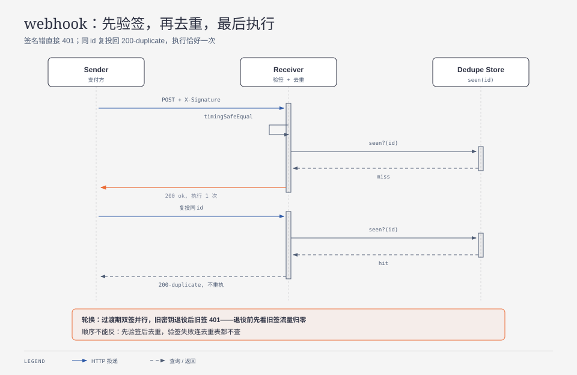

**TL;DR：** webhook 接收端三断言：合法投递执行恰好 1 次（`executions=1`），同 id 复投回 `200-duplicate` 不重执，篡改体与错密钥双双 `401`。加固：密钥轮换三步——过渡期双签并行（新旧各 1 次通过）、旧密钥退役后旧签 `401`、新签正常。8 断言全过。两条铁律：比对必须 `timingSafeEqual`（防时序侧信道），执行必须先查重（至少一次投递是常态，重试、超时、LB 都会复投）。



## 一、合同

| 维度 | 保证 | 不保证 | 调用者仍负责 |
| --- | --- | --- | --- |
| 真实性 | 签名对上才执行 | 密钥不泄漏 | 密钥轮换（双密钥过渡期） |
| 幂等 | 同 id 复投不重执 | 乱序到达有序 | 接收端去重表 TTL |
| 比对 | 常量时间 | 明文密钥传输安全 | HTTPS + 最小权限密钥 |

## 二、实测

`experiments/webhook-hmac/hook.mjs`，`evidence/webhook-hmac/2026-09-14-local/run.out`，8 PASS（H1–H4 签名与去重，H5–H6 轮换三步）。

## 三、密钥轮换：双签并行三步走

```text
activeSecrets=[old] → 新签 401（未加入）
  → activeSecrets=[old,new] → 新签 200(new)、旧签 200(old)
  → activeSecrets=[new] → 旧签 401、新签 200
```

响应里带 `key: old/new` 是故意的：轮换期间必须可观测“还有多少流量走旧密钥”，归零才能退役。退役前删旧密钥等于自断调用方——这是轮换事故的第一来源。

## 四、证据卡与边界

环境 Node v24.19.0。不支持：密钥轮换演练、重放窗口（nonce/时间戳）、生产网关行为。

## 参考资料

- 前篇：幂等工程（去重语义），`/writing/idempotency-engineering`
