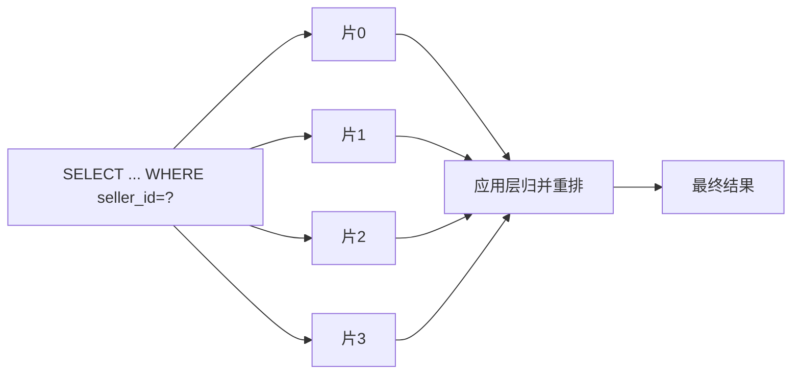

**TL;DR：** 分库分表不是"加机器扩容"，它做的是把**单点一致性**换成**跨片复杂度**——一笔交换，不是免费。三本账要一起算：①**分片键这本账**：分布均匀 / 查询走单 / 不突变三条标准，选错（按自增、按时间、按 uid 却按别的维度查）会出现写入热点、数据倾斜和每条查询的全片扇出，比不分片更糟；②**跨片这本账**：扇出查询放大 N 倍、跨片分页要每片取 offset+limit 再归并重排、跨片事务从 ACID 退化成 2PC 或最终一致+对账；③**搬家这本账**最贵：取模扩容 `%N→%N+1` 理论上要重排 N/(N+1) 的数据（确定性实验 3→4 实测 74.828%，翻倍 4→8 实测 49.618%），停服迁移 / 双写+对账 / 平滑搬迁三条路都逃不掉"数据迁移 + 一致性校验 + 路由切换"三件事。先问查询模式，再谈分片。

## 一、反直觉：取模分片是"查询走单片"的反推，不是默认答案

分库分表的动机经常被讲反。它解决的不是"数据库写不下了"，而是"**查询只走一片**"：一个查询如果只命中一小片，10 片和 100 片在延迟上没有差别。分片的全部价值，在于把一个大集合切成若干小集合，让主查询定位到其中一块。

所以 `key % N` 不是默认答案，它只是**在"查询必须走单片"这个约束下最省事的路由**：O(1) 算出目标片，没有路由表、没有中心节点。倒过来问：如果你的查询天生要扫全量（"查最近一周所有订单"、"按卖家维度拉明细"），分片救不了——它只会把一次全表扫变成 N 次半片扫加归并。

路由算法的本质是在三件事里取舍，它们各卖不同的东西：

| 路由方案 | 写分布 | 扩容搬迁 | 范围/排序查询 | 路由成本 | 语义承诺 |
| :--- | :--- | :--- | :--- | :--- | :--- |
| 取模 `%N` | 均匀 | `%N→%N+1` 理论 N/(N+1) 全量重排 | 跨片 | O(1) | 写均匀 + 零路由状态 |
| 幂等取模 `%2^k` 翻倍 | 均匀 | 恰好一半，映射可推导 | 跨片 | O(1) | 只翻倍扩容，每片只和固定 partner 交换 |
| 一致性哈希 | 统计均匀（vnode） | 平均 1/(N+1)，单次环位置相关 | 跨片 | 环查找/查表 | 节点增删最小重映射 |
| 范围分片（ID/时间区间） | 尾部热点/倾斜 | 可局部拆片，不重排 | 单片 | 查表 | 保区间有序性 |

为什么取模要付出扩容全量重排：`%N` 把键的**顺序信息抹掉了**，谁在哪个片只由取模结果决定，集群变大时旧归属几乎全部失效（实测见第四节）。为什么一致性哈希救不了数据：它解决的是"**节点位置**变更时的最小重映射"，不是"**数据量**的最小搬迁"——缓存里搬 14.6% 的 key 只是回源，数据库里 14.6% 是物理搬 14.6 TB。为什么范围分片不热：它把有序性留在键里，换取区间查询走单片，代价是新数据永远聚到最大区间的末端片，写入热点随之而来。

## 二、分片键选型：三条标准与三个典型错误

分片键是路由的输入，选它只有三条标准：

1. **分布均匀**：各片写入量与数据量接近，不出现热点和倾斜；
2. **查询走单**：主查询能由该键直接定位到单片；
3. **不突变**：键值在生命周期内稳定，不能一改就全量搬片。

三条互相冲突时先保"查询走单"——分布可以靠哈希摊匀，键值突变可以选不可变字段，但"每条查询都扇出"没有任何补救。三个典型错误，按踩得多到少排：

**错误一：按自增 ID 分片（两个变体，一个伪均匀一个真热点）。** `id % N` 的写入是均匀的（新 ID 轮流落片），陷阱不在写入，在查询维度被锁死：自增 ID 与创建时间强相关，"查最新 100 条"这个最热的查询要 N 片各取再归并。真正的写入热点是懒人版变体——按 ID 区间切（`[1,1e6)` 片 0、`[1e6,2e6)` 片 1……）：新 ID 全落在最大区间所在片，末片独自扛全部新写入，其他片闲置。确定性模拟里 40 万个 ID 切 4 片，**最新 10 万条全部落到片 3**（`experiments/sharding/shard_sim.py` 的 `[1a]`）。两者都说明：自增 ID 适合当物理主键，不适合当分片键。

**错误二：按时间分片。** 订单表按月建（`orders_202601`、`orders_202602`）是最典型的冷热不均：当月表承接几乎全部写入和大部分读取，历史表闲置却占着磁盘。模拟里业务线性增长时，最末月独吞全年 **13.3%** 的写入，末月/首月写入比 **3.9x**（`[1b]`）；分片数量还会随时间无限增长，把"扩容"从偶发事件变成每月例行。时间适合做二级维度（归档、冷热分层），不适合当分片键。

**错误三：按 uid 分片，但业务按别的维度查。** 订单按用户查，于是按 `uid % N` 分。一旦要"按卖家查这个卖家的所有订单"，或"按订单号查单笔"，每一笔都是全片扇出。分片键必须是**最高频查询的定位维度**，其余维度靠冗余表（额外按卖家分的一套表）或搜索系统兜底。

**热点 vs 数据倾斜，先分清楚：** 热点是**写入/访问集中在某片**的动态现象（按时间分片当月、一个头部 uid 打爆单片）；数据倾斜是**存量分布不均**的静态前提（少数大租户占了大半数据量）。倾斜不必然产生热点，但倾斜的片在同等访问率下更容易先被打热。模拟里 400 个帕累托租户（最大租户约占两成数据）按租户哈希分 4 片，片间行数比 **4.22x**（`[2]`）——均匀哈希挡不住"分片粒度本身不均"。排查时先看片间数据量（倾斜），再看片间 QPS/写入（热点），两个数字不是一回事。

## 三、跨片的三笔代价：扇出、聚合分页、事务

一旦查询跨片，单库免费的三样东西要重新付费。

**扇出查询**：需要全片遍历的查询，成本从"一次索引查找"变成"N 次并行查找 + 归并"。4 片的"查最近一周"要 4 次查询，不是 1 次快 4 倍。



**跨片分页要重排。** 正确做法是每片取 `offset + limit` 条，再在应用层按排序键归并、取第 `offset..offset+limit`。直接"每片 LIMIT 20 再拼起来"会得到错误顺序——片 0 的前 20 条全局不一定排前 20。深分页更糟：OFFSET 到 10000 时，每片都要取 10020 条回来再裁，4 片就是 4 倍传输与排序。两个缓解：用"上一页最后一条"的游标（keyset）替代 OFFSET；或把跨片排序结果预聚合（榜单、报表落到单独表）。

**跨片事务从 ACID 退化成协议选择。** 单库一行锁是全局串行点，分片后这个点不存在了，两条路各卖各的：

- **强一致（2PC/XA）**：语义承诺"跨片原子提交"，代价是协调者单点、两阶段锁持有时间长、协调者故障会阻塞参与者——用可用性和吞吐换一致性；
- **最终一致（SAGA/补偿/本地消息表+CDC）**：语义承诺"逐步收敛 + 可对冲"，代价是引入**对账、冲正、幂等**三件事——写侧的一致性靠读侧的对账与补偿兜底，这条线在[缓存一致为什么比缓存命中难](/writing/cache-consistency)和[主从复制延迟的三种读路径](/writing/replication-lag-read-paths)里已经收过尾。

为什么订单场景几乎没人用 2PC：分片本来就是为吞吐和可用性做的，2PC 把这两个目的都毁掉。分片键选得好，事务天然被约束在单片内（按 uid 分片后"一个用户下一单"只在片内），跨片事务是分片键选错的漏网之鱼——这又绕回第二节。

## 四、扩容的三本账：停服 / 双写 / 平滑搬迁

分片之后加机器，最贵的是搬家这本账。先把搬多少算清楚（下方数字均为 `experiments/sharding/shard_sim.py` 的确定性输出，任意机器可复现，原始证据在 `evidence/sharding-partition-key-migration/2026-08-16-local/`）：

- **取模 `%N→%N+1`**：理论上 N/(N+1) 的键换片。3→4 实测 **74.828%**、4→5 实测 **80.195%**（理论 80%）——与上一篇同组 key，可交叉复现[一致性哈希的数学直觉](/writing/consistent-hashing-minimal-remap)的 74.828%；
- **幂等翻倍 `%4→%8`**：实测 **49.618%**（理论恰好一半），且映射可推导——旧片 s 的 key 要么留 s，要么搬去 s+4，**每片只和一个固定 partner 交换数据**，能按片独立校验；
- **一致性哈希 4→5**：平均期望 1/5=20%，但单次取决于环位置，本入口的 N0..N4 配置实测只有 **2.296%**——这正是上一篇说的"环位置方差"：加节点的落点恰在稀疏区，搬家就少，落点在稠密区，搬家就多，别把单次当承诺。

但请先看懂这一格：**对数据库，20% 和 74.8% 都是天文数字**。一致性哈希帮的是缓存（14.6% 只是回源，miss 了再查一次上游），数据库的 14.6% 意味着物理搬 14.6 TB。一致性哈希解决"最小重映射"，不解决"最小数据搬迁"——数据片一旦落盘，任何比例的重分布都是钱。

所以生产分库分表几乎不用"3→4"这种非 2 倍扩容，规约成**只翻倍**：`4→8→16`，每次搬迁恰好一半、映射干净、能按片灰度切。真正贵的不是"算出谁搬谁"，是搬家过程中的三件事，对应三种策略各有各的账：

| 策略 | 停机 | 迁移成本 | 一致性风险 | 语义承诺 | 为什么 |
| :--- | :--- | :--- | :--- | :--- | :--- |
| 停服迁移 | 有 | 最低（关读写，全量搬+校验） | 最低 | 迁移期间不可用 | 用停机换最简单的一致性 |
| 双写+对账 | 无 | 中（双写放大 + 对账） | 中（两次写的竞态窗） | 迁移期可用，但可能读到旧数据 | 用冗余写和事后对账换不停机 |
| 平滑搬迁 | 无（按片切） | 最高（增量同步+逐片切换+回滚） | 可控但复杂 | 逐片灰度切换 | 用协调复杂度换最小影响 |

**停服迁移**：量少、可信，成本是一次业务停机。校验就是全量对账：行数、关键字段校验和（对每片算 `sum(id)`、抽样 crc），一致才切路由。数据量级决定它是不是选项——几百 GB 可停，几十 TB 没人停得起。

**双写迁移**：迁移期写请求同时写新旧两套，存量数据后台搬。账在两点：一是**双写竞态窗**——先写旧库再写新库的间隙，新库缺了这条，后台搬迁又恰好搬了这条的旧版本，两边就不一致，所以双写两边必须带**幂等键**（写重放不重复、可对账去重）；二是**对账要跑完才敢切**——不停机迁移的本质是"边写边搬边对"，对账发现差异要能定位到具体 key 重新补偿，比"搬完一次比对"复杂一个量级。

**平滑搬迁**：按片切换，先搬完的片先切，一次只动一片，切坏能回滚单片。成本全在协调：增量同步要跟得上写入（binlog/CDC 追平 → 停写片刻 → 对账 → 切路由 → 放量），每片一次"追平窗口"，N 片就是 N 次窗口和 N 次回滚演练。

三种策略逃不掉同一件事：**数据迁移、一致性校验、路由切换**。路由切换是最后也是最容易炸的一步——路由表或客户端哈希算法的发布要有灰度、有回滚，切换后旧片数据保留到"对账再次确认 + 观察期"结束再清理，而不是切完就删。

## 五、结论：先问查询模式，再谈分片

回到开头的反问，决策顺序应当是：

1. **查询模式**：主查询能不能定位到单一维度？"查最近一周"这种天然全扫的，先想想是不是需要搜索/汇总层，而不是分片；
2. **分片键**：选最高频查询的定位维度，满足分布均匀 / 查询走单 / 不突变，宁可哈希摊匀，不要按自增/时间直接切；
3. **路由算法**：`%N` 省事但扩容全量重排，幂等翻倍 `%2^k` 映射干净，范围分片保区间有序但管尾部热点；
4. **迁移预案**：扩容量级先算出来（翻倍约一半 vs 非 2 倍约八成），停服 / 双写 / 平滑三本账里选一本，对账脚本和路由灰度提前写好。

分片键的 ID 配合在[分布式 ID 不是随机数](/writing/distributed-id-snowflake-segment)收过尾：自增主键在分片后要么撞号要么单点发号，雪花/号段给出"全局唯一 + 近似有序 + 写入均匀"的 ID，配合 `%N` 或哈希分片才谈得上无热点——ID 生成和分片键是同一件事的两半。

最后承认局限：本篇的搬迁与分布数字全部来自确定性脚本（可复现，证据路径见第四节），但一致性哈希的"平均 20%"和"单次 2.296%"都不是承诺值——同一算法换个节点哈希位置，单次结果可远低于平均（本次仅 2.3%），也可显著高于平均（因为平均就是 20%，换个稠密落点即可超过），这与上一篇 3→4 从 25% 期望漂到 14.553% 是同一个现象。生产上要用你自己的节点名、键分布和访问热度重跑模拟，再决定路由算法和迁移策略。

## 附录：实验入口

`experiments/sharding/shard_sim.py`（Python 3，确定性输出，无第三方依赖）分三段模拟：①分片键热点——自增 ID 区间分片的末片写入集中（[1a]）、按时间分片的当月冷热不均（[1b]）、单热 key 打爆单片（[1c]）；②数据倾斜——帕累托租户按租户哈希分片后的片间行数差（[2]）；③扩容搬迁——取模 3→4 / 4→5 / 翻倍 4→8 与一致性哈希 4→5 的搬迁比例（[3]）。其中 3→4 与 `experiments/consistent-hashing-boundary/consistent_hash.py` 共用 key 生成与节点命名，两篇数字可互相复现。

```bash
cd experiments/sharding
python3 shard_sim.py
```

运行后把输出与 `evidence/sharding-partition-key-migration/2026-08-16-local/` 比对；若想改节点名或键分布看方差，改 `ch_ring` 里的 `N{i}` 命名或 key 前缀再跑即可（改完就不是确定性输出，需按 evidence 格式重记环境）。

## 参考资料
1. 上一篇确定性实验与环位置方差——[一致性哈希的数学直觉：本例加一台只搬 14.6%](/writing/consistent-hashing-minimal-remap)
2. 分布式 ID 与分片键的配合——[分布式 ID 不是随机数：雪花与号段的两种账单](/writing/distributed-id-snowflake-segment)
3. 写侧一致与读侧补偿——[缓存一致为什么比缓存命中难](/writing/cache-consistency)、[主从复制延迟的三种读路径](/writing/replication-lag-read-paths)
4. Redis Cluster 哈希槽（16384 槽），槽 = 一致性哈希的槽位化工程对照—— https://redis.io/docs/latest/operate/oss_and_stack/reference/cluster-spec/

> 延伸阅读：取模重排的数学直觉见[一致性哈希的数学直觉](/writing/consistent-hashing-minimal-remap)；分片后写扩散与幂等见[缓存一致为什么比缓存命中难](/writing/cache-consistency)；读路径上的旧数据权衡见[主从复制延迟的三种读路径](/writing/replication-lag-read-paths)。
