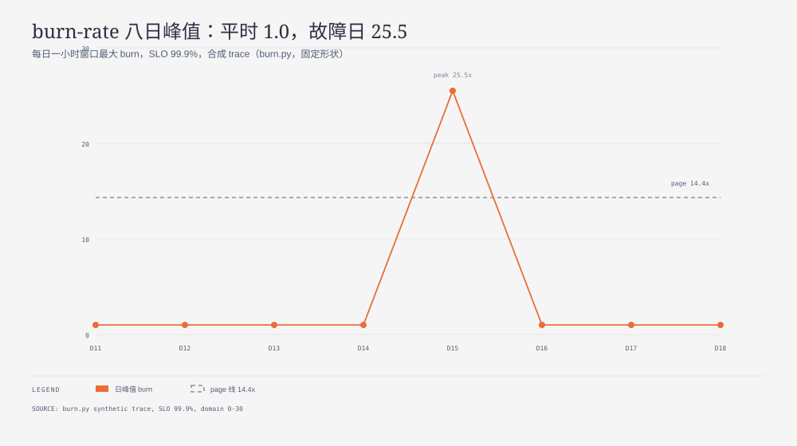

**TL;DR：** burn-rate 告警的关键不是阈值，是快慢双窗：ticket 窗（6h>2 且 1h>2）故障后 +7 分钟响，page 窗（1h>14.4 且 5m>14.4）+16 分钟确认，30 天基线零误报。3 断言全过。单窗方案要么误报（窗太短），要么迟到（窗太长）——双窗是唯一同时解两者的形状。



## 一、完整路径：一次故障如何变成两次告警

```text
t+0 故障起（5% 错误）
  → t+7 ticket（6h 窗刚越 2x，值班先看）
  → t+16 page（1h 窗越 14.4x 且 5m 确认，起床）
  → t+30 故障止（burn 回落，告警自愈）
```

ticket 与 page 的差（9 分钟）是留给值班的预判窗口，不是延迟 bug。

## 二、合同

| 维度 | 快窗（page） | 慢窗（ticket） |
| --- | --- | --- |
| 抓什么 | 急性大故障 | 缓慢泄漏 |
| 代价 | 阈值高（14.4x），小故障不响 | 阈值低（2x），需二次确认防误报 |
| 调用者负责 | 预算耗尽速度换算（14.4x ≈ 2 天烧完月预算） | 值班手册分级 |

## 三、实测

`experiments/burn-rate-alert/burn.py`（30 天分钟级合成 trace），`evidence/burn-rate-alert/2026-09-14-local/run.out`，3 PASS。

## 四、证据卡与边界

纯算术合成 trace，非生产流量。不支持：真实告警延迟、多服务聚合、预算窗口（30 天滚动 vs 自然月）差异。

## 参考资料

- Google SRE Workbook：Alerting on SLOs（多窗 burn-rate 原始出处）
- 前篇：SLO handler 指标原型，`/writing/service-observability-slo`
