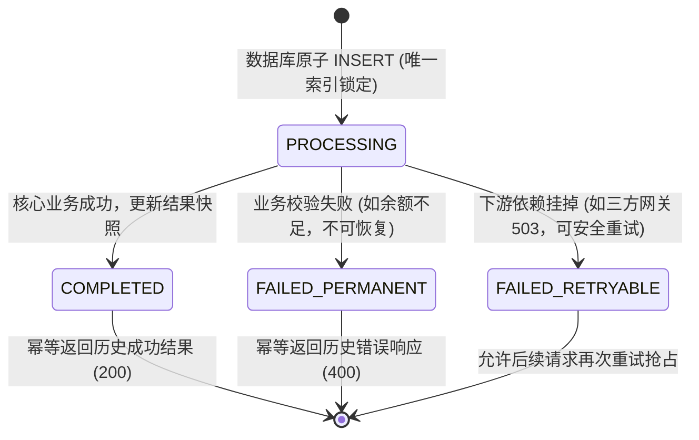

**TL;DR：** 在任何可能发生丢包、超时或乱序的真实异步网络中，**“网络层绝对恰好一次（Exactly-Once Delivery）”是一个在数学上被证明不可解的伪命题**。Jim Gray 在 1978 年形式化证明的“两将军问题（Two Generals Problem）”断言：在不可靠信道上，没有任何有限消息轮次的确定性协议能让双方达成共同知识（Common Knowledge）。因此，所有宣称实现 Exactly-Once 的工业级系统（包括 Kafka、Flink、Stripe 支付网关），本质上都是重新定义了观察边界：**底层网络只能老老实实做“至少一次（At-Least-Once）”传输，而“恰好一次”的业务效果完全是由应用层的幂等状态机（Idempotency State Machine）背负的**。许多后端工程师误以为加个 Redis `SETNX` 就能搞定幂等，却在并发重试下遭遇经典的 Check-then-Act 竞态击穿（导致双重扣款），或因 Worker 发生 GC 假死与网络分区产生僵尸写入。本文将拆解从数学不可能定理到生产级防击穿幂等引擎的完整设计边界。

---

## 一、 数学判决：两将军问题的反证法证明

在讨论一切分布式架构之前，我们必须先直面计算机科学底座上那堵不可逾越的高墙。

```text
两将军通信模型：
  将军 A (发送进攻提议 m1) 
    → 信使穿越敌占区 (信道不可靠，可能被截杀)
    → 将军 B (收到 m1，发送确认 ack1)
    → 信使穿越敌占区 (ack1 可能丢失)
    → 将军 A 收到 ack1，但将军 B 无法确认 A 是否收到！
    → 将军 A 必须发送 ack2 ("我收到你的确认了")
    → ...陷入无限递归，双方永远无法同时拥有确信
```

### 1.1 严格数学证明（为什么有限轮次不可能？）

我们采用经典的**最小协议归纳反证法**：
1. **假设**：存在一个能在不可靠信道上保证双方达成共识的最优确定性协议 $P$，其在最坏情况下需要传递恰好 $N$ 条消息 $(m_1, m_2, \dots, m_N)$。
2. **考察最后一条消息 $m_N$**：
   - 设 $m_N$ 由将军 A 发送给将军 B。
   - 由于信道是不可靠的，$m_N$ 在物理上有可能在半路丢失；
   - 既然协议 $P$ 被假设为一个**确定性成功的协议**，那么在 $m_N$ 丢失的最坏情况下，将军 A 也必须能够按照协议约定安全发起进攻；
   - 这意味着：**无论将军 B 有没有收到 $m_N$，将军 A 都会发起进攻；将军 B 在没有收到 $m_N$ 时也必须能够决定是否进攻**！
3. **矛盾产生**：
   - 如果 $m_N$ 无论送达与否都不影响最终系统的动作决策，那么 **$m_N$ 根本就是一条冗余废话消息！**
   - 我们可以直接将 $m_N$ 从协议中剔除，从而得到一个只需要 $N-1$ 条消息的更短有效协议 $P'$；
   - 重复上述推理，$N$ 将一路递减直至 $N = 0$。但在 0 条消息交互的前提下，物理隔离的双方显然不可能就发起时间达成一致。
4. **结论**：**不存在任何有限轮次的消息交换，能让双方在不可靠信道上达成真正的绝对共识。**

### 1.2 映射到微服务体系：RPC 的三种生死未卜

将两将军模型投射到现代微服务调用 `Client -> Server`：
当 Client 调用 Server 的支付接口超时未收到响应时，Client 面临着三条平行的物理可能性：
- **分支 A（请求根本没到）**：请求在反向代理或公网丢包，Server 完全没执行扣款；
- **分支 B（Server 执行中卡死）**：Server 拿到请求后死锁或 OOM，处于未决状态；
- **分支 C（执行成功但 ACK 丢了）**：Server 已经成功把钱扣了，但在返回 HTTP 200 给 Client 的瞬间网络断开！

在这三种完全不同的底层物理现实面前，Client 在应用层看到的现象**完全一模一样：`Connection Timeout`**。
如果 Client 不重试，分支 A 会导致交易静默丢失；如果 Client 盲目重试，分支 C 会导致严重的**重复扣款**！

---

## 二、 语义转换：Exactly-Once 的工程真实等式

既然端到端的绝对 Exactly-Once 在网络层物理不可行，那么现代工业界是如何对外兜售这一概念的？

答案就是**语义边界降级**：
$$\text{At-Least-Once Transport（至少一次传输）} + \text{Idempotent State Machine（幂等状态机）} = \text{Exactly-Once Side-Effects（恰好一次副作用）}$$


- **传输层合同**：发送方必须承担 At-Least-Once 的重试责任（带有指数退避与随机抖动，直到收到服务端的显式确认为止）；
- **消费层合同**：服务端必须提供幂等屏障，保证同一个业务操作被重复喂入 $N$ 次时，其产生的数据变更与外部副作用与执行 1 次完全等价。

---

## 三、 生产事故高发区：伪幂等反模式与并发击穿

许多工程师在实现幂等时，写出了如下看似合理、实则致命的“教科书代码”：

### 3.1 致命反模式：Check-Then-Act（非原子竞态）

```python
# 生产经典车祸代码：非原子的 Check-Then-Act
def handle_payment(request):
    key = request.headers.get("Idempotency-Key")
    
    # 步骤 1: 检查是否已经处理过
    if redis_client.get(key):
        return redis_client.get(f"result:{key}")  # 缓存命中，直接返回
        
    # 步骤 2: 执行扣款 (耗时 50ms)
    charge_user_account(request.user_id, request.amount)
    
    # 步骤 3: 记录幂等标记
    redis_client.set(key, "DONE", ex=86400)
    redis_client.set(f"result:{key}", "SUCCESS", ex=86400)
    return "SUCCESS"
```

#### 事故推演：并发重试窗口击穿
1. 用户网络轻微抖动，前端 SDK 或网关在 100ms 内连续重发了两次带有相同 `Idempotency-Key` 的支付请求（Req A 与 Req B）；
2. Req A 与 Req B 几乎在同一毫秒到达后端的两个不同 Pod 实例；
3. **两个实例同时执行 `redis_client.get(key)`，此时步骤 3 尚未完成，两者均返回 `None`！**
4. 两个实例同时越过防线，各自执行了一次 `charge_user_account()`！
5. **用户被扣款两次！** 系统发生了严重的资产双花事故（Double Spend）。

---

## 四、 工业级方案：四状态机与单调 Fencing Token

要抵御极端的网络重试与并发洪峰，生产级幂等系统必须依托**底层存储的原子唯一约束**，并建立完备的状态转移闭环。



### 4.1 数据库原子占位：唯一索引是唯一真相

在关系型数据库（如 PostgreSQL / MySQL）中，通过建表唯一约束锁定幂等键：

```sql
CREATE TABLE idempotency_keys (
    idempotency_key VARCHAR(128) PRIMARY KEY,
    user_id BIGINT NOT NULL,
    request_hash CHAR(64) NOT NULL,    -- 校验请求体是否被篡改
    status VARCHAR(32) NOT NULL,        -- PROCESSING / COMPLETED / FAILED
    fencing_token BIGINT NOT NULL,      -- 单调自增 Epoch
    response_code INT,                  -- 历史 HTTP 状态码
    response_body JSONB,                -- 历史响应完整快照
    lease_expires_at TIMESTAMP NOT NULL,-- 租约过期时间 (防 Worker 假死)
    created_at TIMESTAMP DEFAULT NOW()
);
```

### 4.2 当并发请求撞上 `PROCESSING` 时怎么办？

当第一个请求正在执行核心扣款（处于 `PROCESSING` 状态）时，第二个重试请求到达，此时数据库唯一约束拦截了第二个请求的插入。服务端该如何响应？

1. **绝对禁止返回空或伪成功**：因为第一个请求随时可能失败回滚！
2. **方案一（HTTP 409 Conflict 契约）**：
   立即返回 `HTTP 409 Conflict`，并附带响应头 `Retry-After: 2`，明确告知调用方：“本操作正在处理中，请在 2 秒后再试”。
3. **方案二（短长轮询等待）**：
   利用 Redis Pub/Sub、PostgreSQL `LISTEN/NOTIFY` 或轻量级循环 Polling，在当前连接挂起等待最多 2~3 秒。一旦第一个请求转为 `COMPLETED`，立即读取其生成的结果快照返回给客户端，消除客户端的额外报错重试。

### 4.3 僵尸 Worker 与 Fencing Token（击碎 GC 假死）

设想如下极端场景：
- Worker 1 拿到了幂等锁，将状态置为 `PROCESSING`，随后进入了长达 60 秒的 JVM Full GC 停顿（或遭遇网络分区）；
- 幂等系统的租约监控判定 Worker 1 已经超时宕机，将租约释放并允许 Worker 2 重新接管并完成了任务；
- 此时 Worker 1 突然从 GC 停顿中苏醒，继续往下走并尝试将旧数据写入数据库，**导致已完成的状态被旧数据覆盖篡改**！

为了防御这种“僵尸写”，必须引入 Martin Kleppmann 提出的 **Fencing Token（单调防护令牌）**：
- 每次租约分配或重新调度，全局递增 `fencing_token`（Epoch）；
- 最终写入数据库时执行 CAS 比较更新：
  ```sql
  UPDATE idempotency_keys 
  SET status = 'COMPLETED', response_body = :result
  WHERE idempotency_key = :key AND fencing_token = :my_token;
  ```
- 若 Worker 1 的 token 已经落后于数据库中的当前 epoch，**更新行数为 0，写操作被内核强行拒绝**！

---

## 五、 本地确定性实验：两将军不可行性与幂等状态机

本工程在 `experiments/distributed-idempotency/sim.py` 中编写了一套严谨的模拟套件，复现了两将军问题在不可靠网络下的递归死结、非原子 Check-Then-Act 的双重支付反例，以及四状态幂等引擎在并发与僵尸 Worker 场景下的坚挺表现。

### 5.1 运行命令

```bash
python3 experiments/distributed-idempotency/sim.py
```

### 5.2 核心输出证据

```text
PASS 两将军问题在不可靠信道下无有限解
PASS 反模式 Check-then-act 在并发重试下发生双重扣款
PASS 首次请求扣款成功并返回 200
PASS 实际扣款执行次数为 1
PASS 重复请求直接命中 COMPLETED 状态返回历史结果
PASS 重复请求未触发第二次业务扣款 (依然为 1)
PASS 并发到达的重试被拦截并返回 409 Conflict
PASS Stale Fencing Token 成功拦截僵尸 Worker 的脏写
PASS 原始正确数据未被篡改
============================================================
ALL CHECKS PASSED: True (Total checks: 8)
============================================================
```

### 5.3 证据边界声明
- **本实验证明**：基于不可靠传输通道，有限消息轮次无法达成绝对共识；基于原子占位、状态机与单调 Fencing Token，能够彻底杜绝并发重试击穿与僵尸覆写。
- **本实验不证明**：在跨机房物理分区极端断网下，客户端无法连接任何服务端节点的极端高可用问题；在 CAP 定理约束下，此时系统必须在一致性（拒绝写入）与可用性之间做出物理取舍。

---

## 六、 总结：资深工程师的接口设计守则

1. **不带幂等键的写接口是反人类的**：对于任何涉及转账、下单、发货等具有金钱或实体状态变更的 POST 接口，强制要求客户端在上游生成 UUIDv4 / UUIDv7 形式的 `Idempotency-Key`。
2. **幂等存储必须具备强一致原子性**：永远不要依赖非原子的 `GET` 然后 `SET`；使用数据库唯一索引（`UNIQUE KEY`）作为最终的真理守门人。
3. **区分瞬时错误与终态错误**：
   - 如果下游返回 `400 Bad Request`（参数错误），幂等记录应记为 `FAILED_PERMANENT`，后续重试直接返回 400，防止重放轰炸；
   - 如果下游返回 `503 Service Unavailable`（网络闪断），状态应允许释放回滚，给客户端重试修复的机会。

---

## 参考资料与形式化依据

1. **Jim Gray: Notes on Data Base Operating Systems (1978)** - 首次形式化提出两军问题（Two Generals Problem）及其在分布式系统中的数学限制。
2. **Martin Kleppmann: Designing Data-Intensive Applications (Chapter 8 & 9)** - 深度论述了网络不可靠性、Fencing Token 与共识机制。
3. **IETF RFC 7231 (HTTP/1.1 Semantics and Content)** - 定义了关于 Safe 与 Idempotent 方法的官方规范。
4. **Stripe API Reference: Idempotent Requests** - 工业界大并发金融支付场景下幂等键设计的标准实施参考。
