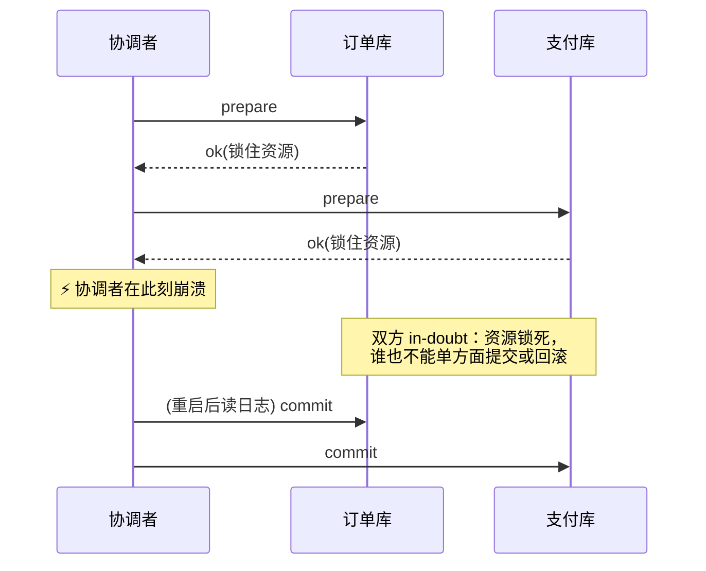

**TL;DR：** 2PC / SAGA / Outbox 的选型争论大多聚焦"性能与复杂度"，真正的分歧是**故障之后谁负责收拾、收拾期间谁被阻塞**。本篇用统一的确定性故障注入矩阵（`experiments/distributed-tx-faults/`，10 个注入点）对照三者：2PC 在每个中途崩溃点都把参与者锁进 in-doubt 状态、靠协调者日志解救；SAGA 无锁但中间态对外可见，补偿失败即降级人工；Outbox 干脆取消分布式事务，让重复投递成为正常路径、由幂等消费吸收。三者的恢复后终态都可以一致——**选型问题因此变成：你的业务能接受哪种"不一致的形状"，以及谁来当那个收拾的人。**

## 一、先固定考题：订单 ⇔ 扣款

[系列开篇](/writing/lamport-vector-clocks)定义了因果；这一篇把因果用到最实际的裁决上：两个服务的本地事务如何表现得像一个事务。[双写窗口篇](/writing/outbox-cdc-dual-write-atomicity)已经证明"两边各写一份"必然存在丢失或脏事件的窗口；本篇比较的是三种正经解法在崩溃下的行为差异。

统一模型：订单服务 O 与支付服务 P，目标是"订单创建"与"扣款"要么都发生、要么都不发生。对每种模式注入同一组崩溃点，记录两列事实——**崩溃瞬间外部看到了什么**，以及**恢复后终态由谁保证**。

## 二、注入矩阵：10 个崩溃点的完整答案

原始输出 `evidence/two-phase-commit-vs-saga-outbox/2026-08-23-local/run.log`：

| 模式 | 故障注入点 | 崩溃瞬间 | 恢复后终态 | 恢复者 |
| --- | --- | --- | --- | --- |
| 2PC | prepare 前 | 无人行动 | 一致 | — |
| 2PC | 单边已准备 | 单边 in-doubt | 一致(恢复后裁决) | 协调者日志 |
| 2PC | 双方已备未提交 | 双方 in-doubt | 一致(恢复后裁决) | 协调者日志 |
| 2PC | commit 单边执行 | 单边已提交 | 一致(恢复后补齐) | 协调者日志 |
| SAGA | 第一步前 | 无人行动 | 一致 | — |
| SAGA | 订单已建/未扣款 | 中间态可见 | 一致(补偿撤销) | SAGA 编排器 |
| SAGA | 同上且补偿失败 | 补偿失败 | 不一致→人工对账 | **人工** |
| Outbox | 无故障 | 全链完成 | 一致 | — |
| Outbox | relay 投递未标记 | 事件可能重复投递 | 一致(幂等去重) | relay 重试 |
| Outbox | 消费端扣款丢 ACK | 重复投递中 | 一致(幂等拒绝二扣) | relay 重试 |

## 三、三种不一致的形状

**2PC：用阻塞买原子性。** 注意矩阵第 2~4 行的共同点：无论崩在哪，参与者都被卡在 in-doubt——资源已锁定、结果悬而未决，必须等协调者的日志说话。协调者活着时这是纯开销（两轮往返 + 锁持有期拉长）；协调者死了这是全局停摆。2PC 买到的东西同样真实：**中间态对外完全不可见**，恢复前后其他事务看到的都是干净状态。适合的场景恰恰是"不可见"值钱的地方——数据库内部的跨节点提交。

**SAGA：把不一致摆到台面上。** SAGA 不加锁，每步都是独立本地事务，代价是矩阵第 6 行——"订单存在但未扣款"这个中间态**对外真实可见**，别的请求可能查到一个尚未支付的订单。恢复交给补偿事务，而第 7 行是它的软肋：补偿本身也是会失败的事务，一旦失败只能人工对账。选 SAGA 前先回答：业务上"看得见的半成品"可容忍吗？补偿路径有没有设计且演练过？

**Outbox：承认重复比阻止重复容易。** Outbox 根本不发起跨服务事务：订单和事件在同一条本地事务里原子落库（这层原子性由数据库保证），relay 负责至少一次投递。于是故障的表现形式变成了矩阵最后两行的样子——**重复投递**。它不再试图消灭不一致窗口，而是把窗口内的混乱收敛为一种形态：同一条消息可能到达多次，由消费端幂等键裁决。代价转移到了消费端设计上（[幂等键怎么落地](/writing/idempotency-engineering)、并发窗口怎么审见[幂等 PR 评审](/writing/review-idempotent-pr-concurrency)）。

## 四、选型的三个判断题

1. **中间态能被看见吗？** 不能 → 2PC（或避免拆分）；能 → 进入下一题；
2. **补偿链可靠吗？** 每步都有设计过的、演练过的补偿 → SAGA；没有 → 不要硬上；
3. **下游能做幂等吗？** 能 → Outbox + 至少一次 + 幂等消费，这是运维成本最低的组合；不能 → 回到第 2 题把补偿做好。

还有一个隐含变量：团队愿意养一个"收拾的人"吗？2PC 需要协调者高可用，SAGA 需要编排器 + 人工兜底流程，Outbox 需要 relay 监控。**没有免维护的方案，只有你更清楚在哪维护的方案。**

## 五、边界

声明四点：注入粒度是步骤级（"某步之后"），不覆盖分区中的消息乱序组合；未模拟协调者日志损坏、补偿与新请求并发交互；模拟不含真实网络延迟与重试风暴；三种模式的实现细节（如 XA vs TCC、编排式 vs 协同式 SAGA）远多于本文模型，结论只覆盖结构性分歧。

## 六、结论：先选"不一致的形状"，再选机制

1. 列出你业务里所有跨服务写操作，逐个标注可接受的中间态形状：不可见 / 可见+可补偿 / 可见+可重放；
2. 每种形状对应唯一合理解：2PC / SAGA / Outbox——顺序对不上就说明需求本身矛盾；
3. 为"收拾者"建监控：in-doubt 时长、补偿失败率、relay 积压深度，这三个指标就是各自模式的事故前兆。

矩阵里每一行都对应一种真实工单形态。把你系统里最近一次"数据对不上"的记录翻出来对号入座——它落在哪一行，你现在隐性使用的就是哪种模式；而那一行的"恢复者"一栏如果是空的，那就是这次事故真正的根因。

## 参考资料

- 本篇实验与原始输出：`experiments/distributed-tx-faults/faults.mjs`、`evidence/two-phase-commit-vs-saga-outbox/2026-08-23-local/`
- 站内相关：[双写的结构性窗口](/writing/outbox-cdc-dual-write-atomicity)、[Lamport 时钟与向量时钟](/writing/lamport-vector-clocks)、[重试会放大错误](/writing/idempotency-engineering)
- 经典文献：Gray, *Notes on Database Operating Systems*（2PC 的 in-doubt 分析）；Garcia-Molina & Salem, *Sagas*, SIGMOD 1987
