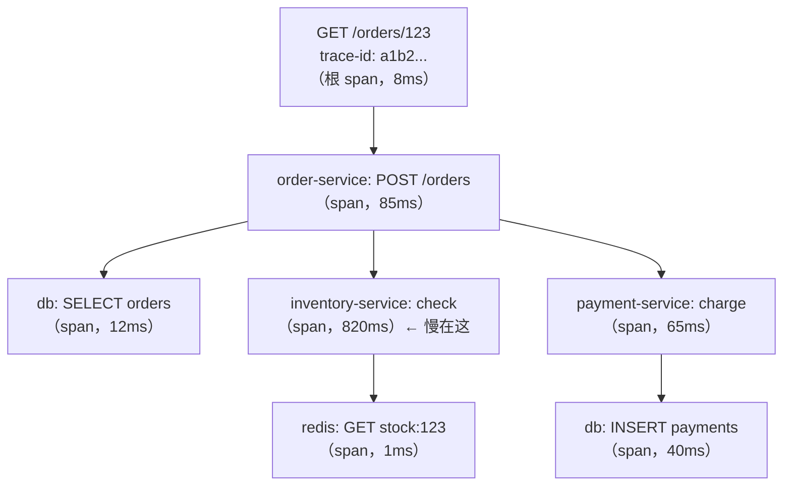

**TL;DR：** 分布式追踪把"一次请求"还原成一颗 span 树：每个服务处理这一段请求的时间都成为一个 span，span 之间通过一个 16 字节的 trace id 串起来。它解决的是日志和指标都回答不了的问题——"这一秒变慢，慢在哪一跳？"。落地最大的坑不是接入，而是采样：100% 采样的存储成本高到不可持续，而错误的采样策略会让排查时找不到那条慢请求。理解 trace/span 模型、traceparent 传播、三类采样策略和三支柱关联，就掌握了追踪的全部骨架。

## 一、 单机监控的三个盲区

假设一个下单请求慢了三秒，日志和指标分别告诉你什么：

- **日志**：订单服务里 `order.created` 打了，库存服务里 `inventory.checked` 打了。每条日志都带时间戳，但**它们之间没有因果**——你不知道 order 在等 inventory，还是 inventory 在等 order。跨机器的日志排序（时钟同步）本身就是个坑。
- **指标**：`inventory.check` 的 P99 从 20ms 涨到 800ms。你知道"变慢了"，但不知道**是哪一次请求**、**是哪一个调用链**。指标是聚合，聚合天然丢掉了"单个请求的完整故事"。

两个盲区指向同一个需求：**把一次请求的完整旅程还原出来**。这就是 trace。日志回答"发生了什么"，指标回答"总体多慢"，trace 回答"这一次请求，时间都花在哪了"。

## 二、 trace 与 span：请求的因果树

分布式追踪的核心模型只有两个概念：

- **span（跨）**：一次操作的最小单位，记录"做什么、何时开始、持续多久、成功与否、附加属性"。例如 `POST /orders`、`db.query`、`http GET inventory/check` 各是一个 span。
- **trace（迹）**：一次请求的所有 span 组成的树。树上每个 span 有唯一的 span id，通过 parent span id 挂在树上；同一棵树的所有 span 共享同一个 trace id。

一次下单请求的 span 树长这样：



看树的第一眼就能定位：总耗时 85ms，其中 820ms 花在 `inventory.check` 上——**跨进程的延迟一目了然**。单机 profiling（火焰图）只能回答"这个进程的 CPU 时间去哪了"，回答不了"跨了三个服务的时间去哪了"，两者互补。

span 上还能挂**属性与事件**：`http.method`、`db.statement`、`error.message`、关键节点埋点。排查时按属性过滤（"所有 inventory 失败的 trace"），比翻日志快一个数量级。

## 三、 传播：trace id 怎么穿过进程边界

树要跨服务长出来，trace id 必须跟着请求走。HTTP 场景的标准是 W3C 的 **`traceparent` 头**：

```text
traceparent: 00-4bf92f3577b34da6a3ce929d0e0e4736-00f067aa0ba902b7-01
              │ └─────── trace-id（16 字节）──────┘ └── span-id（8 字节）─┘ └flags
              └ 版本
```

下游服务收到请求时：取出 `traceparent` 里的 trace id 作为自己的根，新建自己的 span id，把"上一跳的 span id"记作 parent——于是每个服务只做一件事：**生成 span、透传 traceparent**，服务端聚合端根据这些字段把碎片拼成树。gRPC 场景等价物是 metadata 里的 `traceparent`，消息队列则把 traceparent 塞进消息头。

传播链上最脆弱的环节是**异步和队列**：请求经过 Kafka 中转时，消费端需要从消息头里取 traceparent（而不是重新生成）。绝大多数"链路断了"的排查，最后都落在某一段异步代码忘了透传上下文。OpenTelemetry 在各类 SDK 里把"自动注入 traceparent"做到了框架层（HTTP 中间件、gRPC interceptor、MQ consumer 钩子），手动代码里唯一要遵守的纪律是：**新建 goroutine/线程/回调时，把 span context 显式传进去**，不要靠全局变量。

## 四、 采样：追踪真正的成本账

全量追踪的账要算清楚：一个每秒 10 万请求的服务，按每次请求 20 个 span、每 span 200 字节算，每秒产生 400MB、每月约 1000TB 的追踪数据。存储和查询成本让"100% 采样"在规模上来后必然不可持续。采样策略是追踪架构里唯一需要业务决策的部分，三类策略：

**1. Head-based（头部采样）：请求进来时决定。**
入口处按概率决定"这个 trace 要不要收"。实现最简单、开销最低，但有一个致命盲区：**慢请求/错误请求是随机出现的**，固定 1% 采样率意味着 99% 的慢请求根本没被记录——而排查慢请求恰恰是追踪最重要的用途。

**2. Tail-based（尾部采样）：等 trace 结束后决定。**
所有 span 先流进采集端，等整棵树（或超时窗口）收齐后，按规则决定保留：错误 trace 全留、P99 以上的慢 trace 全留、其余按低比例抽。慢请求和错误请求的覆盖率接近 100%，存储成本可以压到 1% 级别。代价是需要一个"等 trace 收齐"的缓冲组件（如 OpenTelemetry Collector 的 tail sampling processor），集群节点间还要共享一致性（同一个 trace 的 span 必须汇聚到同一个判断点）——部署复杂度高一个台阶。

**3. 自适应采样（adaptive）：让采样率跟着流量走。**
预算驱动：设定"每秒最多 1000 条 trace"的预算，入口端用算法把采样率动态调到刚好花完预算。流量翻倍时采样率自动降，流量低谷时采样率自动升。适合"想无脑保证预算"的场景，但慢请求覆盖率不如 tail-based 有保障。

落地建议一句话：**小规模 100% 采样；中等规模 head-based 固定比例 + 错误/慢请求强制采样；大规模 tail-based 或自适应**。选型时先回答"排查一次慢请求，多久能定位"——如果现在的答案是"找不到当时的 trace"，先别谈成本，把采样策略里"错误与慢请求必留"这条先做到。

## 五、 三支柱：trace 不是孤岛

trace 单独用价值有限，与日志、指标联动才有意义：

- **trace × 日志**：把 trace id 注入每条业务日志（OTel 的 span 里挂日志，或日志里打印 trace id）。排查路径变成：指标发现异常 → 找到代表性 trace → 打开 trace 看 span → 顺着 trace id 拉出该请求的全部日志。这要求日志系统支持按 trace id 检索，否则联动只是口号。
- **trace × 指标**：span 的耗时天然可以聚合成 histogram（`db.query` 的 P99），这就是"RED 指标"（Rate/Errors/Duration）的来源——追踪系统在采集的同时把关键 span 的延迟指标导给指标系统，两个系统共用一份埋点数据。
- **trace × profiling**：trace 告诉你"慢在哪个服务哪个接口"，火焰图告诉你"慢在这个接口的哪个函数"。OpenTelemetry 的 Profiling 集成、或者把 trace id 与 `pprof` 样本关联，是"从宏观到微观"的最后一跳——我在火焰图采样那篇里说过，on-CPU 采样对等待区间是盲的，把 trace 的 span 耗时和火焰图叠在一起看，能同时看见"等在哪"和"算在哪"。

## 六、 落地实践：时钟、采样与排查闭环

**时钟同步是第一道坎。** span 的父-子关系靠 traceparent 建立，但**耗时计算靠的是各服务本地的时钟**。服务间时钟偏移（NTP 校时误差、虚拟机漂移）会让"子 span 耗时 > 父 span"这种物理上不可能的事反复出现——这正是时钟偏移那篇文章的机制在可观测性上的直接体现。云上要用 NTP 保证主机时钟同步，容器/虚拟机里同样要校；出现"负耗时"span 时，先查时钟再查代码。

**Collector 是标准架构的中间层。** 现代部署形态是：各服务 SDK → 本地 OpenTelemetry Collector（聚合、过滤、降采样）→ 后端（Jaeger、Tempo、Datadog 等）。Collector 不只是转发：过滤冗余 span、按规则降采样、给 span 补统一属性（集群、环境），让 SDK 保持轻薄。SDK 直连后端是反模式——一是成本失控，二是 SDK 和后端强耦合。

**排查闭环的验收标准**：一次线上故障从报警到"打开那条 trace、看清是哪一跳慢"应该在两分钟以内。如果做不到，先检查三件事：错误和慢请求是否强制采样、trace id 是否进了日志、Collector 是否在丢数据（`dropped` 指标不为零）。

最后回到开头的问题：三秒慢请求，日志给了一堆碎片，指标说库存服务 P99 涨了——但只有 trace 能告诉你，那一次请求在 `inventory.check` 的 820ms 里，有 780ms 是在等一把跨服务的锁。可观测性的终极形态不是工具多，而是**任何一个"为什么慢"的问题都能在十分钟内从 trace 里找到答案**[^1]。

[^1]: 延伸阅读：W3C Trace Context 规范（traceparent 头）一页能读完；OpenTelemetry 文档里 Concepts → Traces 章节是模型定义的标准答案；《分布式系统模式》里"跨进程追踪"一章把 span 树的拼装讲得很清楚。
