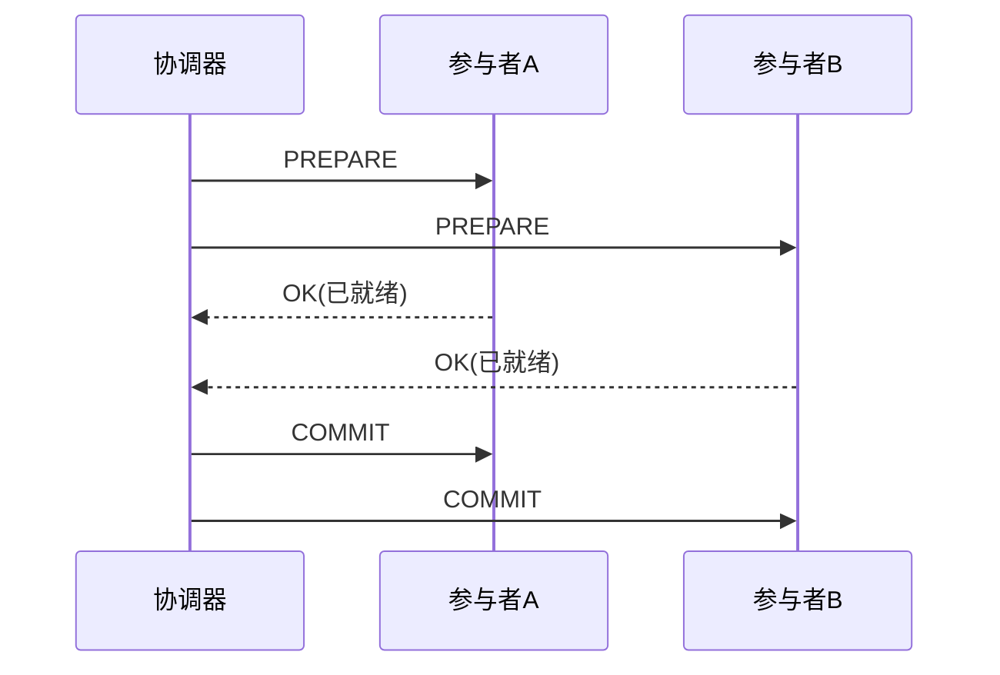

**TL;DR：** 分布式事务的全部困境，可以压缩成一句话：**想在多个独立数据库之间维持原子性，但没人能保证所有参与者一定在同一时刻都愿意提交**。2PC 的思考模型是"协调者问所有人、然后一起提交"——数学上干净，工程上致命：**协调者自己也会崩**，它崩在 prepare 之后 commit 之前，所有参与者进入"不知道自己该提交还是回滚"的悬挂状态。SAGA 换了个思路：不做原子，做**补偿**——每步提交，失败则逆序跑补偿事务。补偿思路解决了悬挂，但把"补偿一定成功"这个更难的假设扔给了业务代码。本文拆开两套模型的故障错与真实代价，解释为什么生产里最常见的是"本地消息表"这条折中路。

## 一、先定义问题：分布式事务到底在保什么

单机事务的 ACID 是数据库用**锁 + WAL** 单点实现的。分布式事务的对偶问题是：有两台或更多台 MySQL/PostgreSQL/Redis，A 库扣了钱、B 库要加钱，**两个"提交"动作中间任何一个失败，系统就处于"钱不见了"的病态**。看起来只要把"提交"做成同步两阶段就行——2PC 就是这个直觉的工程化。

但要先指出问题的形状：**分布式事务之所以难，不是协议难写，是"崩溃模型"难处理**。假如进程不崩溃、网络不失联，2PC 一次就能跑完。真实世界里执行到一半协调器断电、一个参与者失联——接下来的行为必须由"故障模型"决定，而这里没有任何一个方案能同时满足"原子 + 高可用 + 低延迟"：CAP 定理落到工程上就是这个形状。

## 二、2PC：协调者的单点悬挂

2PC 的流程教科书里都有，关键是记住它**两个阶段 + 一个假设**：



问题出在"OK（已就绪）"这个状态的内涵：**参与者说 OK 之前，已经锁定资源、写好了自己的日志（WAL），处于'可能提交可能回滚'的中间态**。此时协调器给两边发 COMMIT——只要协调器还活着，故障都能靠重发收敛。**但协调器自己崩溃在发 COMMIT 之前呢？**

- 协调器倒了 → 参与者永远等不到 COMMIT/ROLLBACK → **悬挂（stuck）**。
- 协议规定：协调器在崩溃前把决策写进日志；恢复后凭日志决定是 COMMIT 还是 ROLLBACK。**但恢复需要时间**，而参与者的锁在这期间不能释放——挂锁就是悬挂，悬挂 = 整个资源的吞吐归零，直到协调器重启。
- 如果协调器**永不恢复**（被 /dev/null 了、K8s 重建了、旧版本的日志丢了），参与者的锁永远不释放——**悬挂变成永久锁死**。

所以 2PC 的工程体验是：**不崩的时候毫无存在感，一崩就是全局卡死**。这也是为什么 XA 事务在生产里从未流行——它把"协调器高可用"这个要命的点整个押了出去，而很多团队连协调器本身都没有。

## 三、SAGA：用补偿代替回滚

SAGA（Sagas，1987 年由 Garcia-Molina 与 Salem 提出）的模型很优雅：**把一个大事务拆成若干小事务 T1..Tn，每个 Tk 带一个补偿事务 Ck；按顺序执行 Tk，若 Tk 失败，则逆序执行之前定过的补偿**。它完全不依赖"所有参与者在同一时刻提交"——因为**压根没有"所有参与者同时在线的提交时刻"**。


SAGA 的弱点是原子性：它是"**最终一致**"——执行中间，系统可能长期处于"钱扣了但没加"的中间态，对外可见。它的正确性建立在一条假设上：**补偿必然成功**。这意味着：

- 每一笔补偿事务 Ck **本身必须可靠**（能重试、能幂等）。
- 若 T1 成功、T2 失败、C1 补偿也失败——SAGA 会怎样？它**不再保证结果正确**，只能靠告警人工介入。
- 补偿的正确性完全由**业务**承担，框架只负责"调补偿函数"。

所以 SAGA 不是"解决了 2PC 的悬挂"，它是**换了一个错误模型**：不再追求"要么全有要么全无"，而是"要么全成功要么全失败（靠补偿）"，然后把"补偿必须成功"的假设压给业务。这个交易对很多业务太贵——这就是为什么它在生产里经常只以内嵌 if（Transaction Outbox / 本地消息）的形态出现。

## 四、工程折中：本地消息表（Outbox）就是最落地的答案

读到这里你应该已经明白，分布式事务没有一个"好答案"，只有**在故障模型里选一种**。而工程上出现频次最高的其实是**本地消息表 / Transactional Outbox**：把"发消息"和"改主库"放进**同一个本地事务**：

```sql
-- 与业务写同一事务
BEGIN;
UPDATE accounts SET balance = balance - 100 WHERE id=1;   -- 业务数据
INSERT INTO outbox(user_id, amount, status) VALUES (1, 100, 'PENDING');  -- 待发消息
COMMIT;                                                    -- 一起提交

-- 后台线程
-- 读 outbox 中 PENDING → 发给下游 → 标记 SENT
```

三个原则让它绕开 2PC 与 SAGA 的问题：

1. **没有两阶段提交**：本地边一笔事务写完业务 + 消息，原子性由单库保证。
2. **下游消费是幂等的**（见[exactly-once 是营销话术](/writing/exactly-once-message-delivery)与[重试会放大一切错误](/writing/idempotency-engineering)）——消息消费/重试是 at-least-once，业务靠幂等吸收重复。
3. **"提交状态"由 outbox**决定，协调器完全不存在，单点消失。

它的**代价是**：本地事务提交后，若消费端或网络故障，outbox 里 PENDING 的消息会被**延迟**投递（延迟多久取决于重试间隔）——不是丢，是慢。这就把分布式事务的语义从"原子"摊成"**最终会一致 + 可对账**"，而这恰恰是大多数业务真正能用的形状。

## 五、选型摊牌：拿故障模型说话

| 方案 | 原子性 | 协调器 | 需要补偿 | 真实故障代价 | 常用场景 |
| :--- | :--- | :--- | :--- | :--- | :--- |
| 2PC | 强 | 必须高可用 | 无 | 协调器崩溃 = 悬挂锁 | 几乎没人用 |
| SAGA | 最终一致 | 无 | 业务自编 | 补偿失败的中间态 | 长事务微服务 |
| Outbox | 最终一致 | 无 | 消费幂等 | 投递延迟 | **最常被实选** |

三个方案的排序，与其说是"哪个协议好"，不如说"**哪个错误模型你背得起**"。2PC 背的是"协调器永不崩"，SAGA 背的是"补偿永远成功"，Outbox 背的是"消息会迟到但不会丢"——工程上愿意为前两者背书的团队极少，愿意背第三条的团队多得多。

## 结论：分布式事务是在故障模型之间做选择

分布式事务没有银弹，只有**换一种故障模型**：2PC 把故障押在协调器（悬挂代价），SAGA 押在"补偿必然正确"（中间态可见），Outbox 押在"消息反正会到、下游自幂等"（延迟但一致）。选择的标准不是"谁更严谨"，而是**你的业务和运维更愿意吞哪一种故障**。生产上没见到几套 2PC 常驻，却常见监控 outbox 表大小——这就是市场用脚投票的结果。

下一步：如果你的系统现在"两个库要原子改"，先用 Outbox + 幂等消费试一遍（30 分钟能搭）；如果业务真是强一致要求，先问自己"协调器挂了怎么办"——如果答不出来，2PC 就不是你的答案。

## 参考资料

1. X/Open Distributed Transaction Processing (XA) 规范（2PC 的工业定义）—— https://pubs.opengroup.org/onlinepubs/009680699/toc.pdf
2. SAGA 原始论文：Sagas（1987, Garcia-Molina & Salem）—— https://www.cs.cornell.edu/andru/cs711/2002fa/reading/sagas.pdf
3. Transactional Outbox 经典方案（Microservices.io）—— https://microservices.io/patterns/data/transactional-outbox.html
4. 分布式事务综合讨论（Martin Kleppmann：设计数据密集型应用第 9 章）—— https://dataintensive.net/

> 延伸阅读：分布式事务的"幂等消化重复"是所有方案共同的前置，见[重试会放大一切错误：幂等性工程的完整账本](/writing/idempotency-engineering)；Outbox 里的消息发送支持，见[exactly-once 是营销话术](/writing/exactly-once-message-delivery)；事务落库后还要跨节点读到的时序，见[主从复制延迟 300ms 的账单](/writing/replication-lag-read-paths)。
