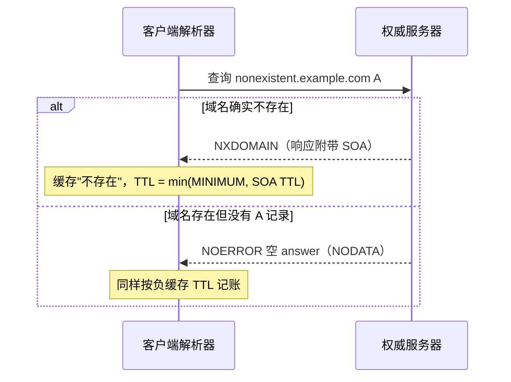

**TL;DR：** 改完 DNS 记录"不生效"，几乎总是被误判成"缓存不肯刷新"的运维故障。事实是：**TTL 是权威区在记录上盖的许可，不是缓存的承诺**——每个解析器拿到响应后都拿它当倒计时的初始值，到 0 才丢弃重查；所以一条记录的旧版本会在解析链路里逐跳"冷却"，改完之后全网仍能在**最长 TTL** 内给出旧答案，这是协议设计的预定行为，不是 BUG。另外还有个被绝大多数人忽略的**账本**：查询不存在的名字（NXDOMAIN）或类型（NODATA）得到的负响应也有自己的 TTL，默认取权威区 SOA 的 `MINIMUM` 字段并与 SOA 自己的 TTL 取较小者——这才是上线新记录"访问不到半小时"的真正元凶。现实中要快速收敛就把 TTL 降到约 30–60 秒，要压低全球解析压力就设 3600 秒以上；要真正把旧记录热替换掉，唯一手段是提前降低 TTL、等它全链路铺开，再做变更。

## 一、事故现场：改了记录，十分钟没生效，后台全在催

一个真实例子：凌晨做故障切换，把域名的 `A` 记录指向新机房的 IP，发布完盯监控。几十分钟过去，健康检查连的还是旧 IP。值班群立刻出现两种声音——"DNS 有缓存，要等"、"缓存是不是挂了？要不要 flush"。

先别急着怪缓存。把"改 DNS 要不要等"换成一手数据的问题：**这条记录的 TTL 是多少？谁在递减它？** 回答都在这条输出里：

```bash
$ dig example.com A +noall +answer
example.com.  300  IN  A  203.0.113.10
```

`300` 就是权威区盖的许可：任何拿到这条响应的解析层，最多只信它 300 秒，然后删除、重新请求。**TTL 越大，改完全网吃到旧值的时间就越长**。这是名字系统与生俱来的滞性，跟"缓存有没有捣乱"无关。

## 二、TTL 归谁管：权威画押，解析器倒计时

DNS 记录在**权威服务器**上带一条 TTL，定义"这条记录在任意缓存中被信任的最大时长"。每个解析器从上游拿到响应后，以它为初始值**开始倒计时**，归零即丢。在同一台机器上连续敲两次 `dig example.com`，第一次拿到权威答案，第二次命中缓存，TTL 变小、`Query time` 接近 0ms：

```text
$ dig example.com A +noall +answer          # 第一次：从权威拿到
example.com.  300  IN  A  203.0.113.10     # TTL = 300
$ dig example.com A +noall +answer          # 立刻再查：命中本机缓存
example.com.  299  IN  A  203.0.113.10     # TTL 减一
```

第二次的 `Query time: 0 msec` 就是命中缓存。**全网的收敛速度 = "最长的 TTL + 每一跳的传播延迟"**。链路大约是这样：


每一跳既当"读者"又当"写作者"：从上游读到一个值就开始倒计时，倒到 0 就删掉、触发重新查询；在它幸存的时间里，下游看到的永远是这一跳内缓存的那份副本。**收敛时间账本 = 每跳各自的剩余 TTL 之和**，不是一条记录一把锁。

## 三、第二本账：负缓存——"查不到"也有保质期

很多事故改的是根本不存在的记录（或新子域名），结果"明明建了，怎么全世界都查不到"。这段的关键不是正缓存，是 **负缓存（RFC 2308）**：

- 查询一个**不存在的域**返回 `NXDOMAIN`（整棵名字树里没有）；
- 查询存在但**该类型无记录**（有域，但只有 `CNAME` 而不是 `A`）返回 `NODATA`（状态 `NOERROR` 但 answer 区为空）。

这两种"没有"也是响应，同样被缓存。不缓存的话，每个 querier 都要问权威，权威会被击穿。**负缓存用什么 TTL？** RFC 2308 给出的默认规则是：**负 TTL = min(权威 SOA 的 `MINIMUM` 字段, SOA 记录自身的 TTL)**。权威 `SOA` 长这样：

```bash
$ dig example.com SOA +noall +answer
example.com.  3600 IN SOA ns1.example.com. hostmaster.example.com. 2026080801 7200 3600 1209600 600
#               TTL          MNAME              RNAME                 serial   refresh  retry  expiry  MINIMUM
```

最后那个数字 `600` 就是 `MINIMUM`。解析器拿到 `NXDOMAIN` 时会参考 SOA 值，按 `min(MINIMUM, SOA TTL)` 缓存"这名字不存在"。**这就是"新域名半小时查不到"的元凶**：人只记得"DNS 有缓存"，忘了"查无此记录"这本身也被腌进了缓存里，还有保质期。

注意负缓存 TTL 常见上限是 3600 秒（BIND、Unbound 都做了钳制），但那是兜底不是推荐。RFC 2308 希望负 TTL 保持在一小时之内，实际建议在几百秒量级。



**反直觉的工程结论**：从 `CNAME` 切到 `A`、或新增记录时，如果目标位置原来一直返回 `NODATA`，负缓存会把这个"无记录"的状态锁住几分钟到几十分钟。上了新资源后四处 QPS 探不到，第一嫌疑是负缓存，不是"没生效"。

## 四、两本账对照：正、负、权威三张时

| 对象 | TTL 谁定 | 用什么值 | 典型时长 | 变更后的行为 |
| :--- | :--- | :--- | :--- | :--- |
| 正记录（A/AAAA/CNAME） | 权威区 | 记录自带 TTL | 300–3600 | 每跳倒计时归零后重查，最多 TTL 内吃到旧值 |
| NXDOMAIN 负缓存 | RFC 2308 | `min(SOA.MINIMUM, SOA TTL)` | 300–600 推荐 | "不存在"到期后才能查到 |
| NODATA 负缓存 | RFC 2308 | 同上 | 同上 | 同型，需等负 TTL 到期 |
| 服务器内部（非缓存） | 无 | 无 | 0 | 变更多年都不可能逐跳消失 |

## 五、唯一对策：把"变更"放进 TTL 的时间窗口

缓存本身的"立即生效"是做不到的，能做的只有**安排**：

1. 变更前 24–72 小时先把 TTL 降到 30–60 秒，并等它铺满全链路。注意：**降 TTL 只影响之后的新解析**，已缓存住、按原 TTL 倒计时的旧版本，该走完的还是会走完——所以过渡窗口要给足。
2. 窗口打开后，才真正改变量值。
3. 变更完成并稳定一段时间后，再把 TTL 提回 3600 之类。

容易记错的一句："降 TTL 立即生效"是假的；**TTL 降低后，已扩散出去的两份价值（每跳一份）仍按原倒计走到头**，只是之后的存活期变短。

## 六、账本与决策：你家的 TTL 该设多大

| 场景 | TTL 建议 | 为什么 |
| :--- | :--- | :--- |
| 长期稳定域名（API、CDN CNAME） | 3600–86400 | 解析命中高，权威压力小；代价是变更磨叽 |
| 演示/上线窗口紧的临时域 | 30–60 | 变更约 1 分钟收敛；代价是刷新压力增大 |
| 刚上线的新子域名 | 300–600 | 再调小往往要查负缓存管道 |
| 故障切换（DR/双活） | 不要只靠 TTL | TTL 是兜底，快切请走 LB/Service 等路径 |

原则就一条：**你想要的"立即生效"，其实是"全网尽快走完旧值"**。TTL 大 = 本地负担小、收敛慢；TTL 小 = 收敛快、刷新负载高、但对权威的查询压力越大。没有第四个参数让"旧记忆立刻消失 + 新值立刻全见"同时成立。

## 七、结论：TTL 是变更设计的时间约束

"改了 DNS 不生效"不是玄学，是权威盖章的 TTL 倒计时 + 负缓存（RFC 2308）的第二账本在按表走。想让新记录尽快全网可见，你唯一能改的是**安排**：提前降 TTL 并等它铺满，把变更本身做进 TTL 窗口。误以为"清一下缓存就能全球刷新"的，最终收获的只是同一批旧值。

**下一步可以动手三分钟跑一遍：** 连续 `dig` 两次同名看 TTL 变小（正缓存倒计时）；对 `nonexistent.你的域名` 查一次，看 SOA 的 `MINIMUM`，记下要多久后才查得到（负缓存到期）。把两条输出拼在一起，你家"缓存"的黑箱就成了看得见的压力表。

## 参考资料

1. RFC 2308, *Negative Caching of DNS Queries (NXDOMAIN Responses)* —— https://www.rfc-editor.org/rfc/rfc2308
2. RFC 1035, *Domain names - implementation and specification*（TTL 与 SOA 字段语义）—— https://www.rfc-editor.org/rfc/rfc1035
3. BIND 9 文档, *Negative caching* —— https://bind9.readthedocs.io/en/latest/reference.html
4. Unbound 文档（`cache-max-negative-ttl` 等参数）—— https://unbound.docs.nlnetlabs.nl/en/latest/manpages/unbound.conf.html
5. `dig(1)` 与 `resolvectl status(1)` 手册

> 延伸阅读：HTTP 缓存是另一套"保质期"账，见[缓存的保质期，不止 TTL](/writing/http-cache-control-etag)；DNS 负缓存其实是"写后读不一致"最隐蔽的样本之一，见[缓存、一致性、风险的三角账本](/writing/cache-consistency)；把"改前先建、建好再切"的纪律推广到后端，见[两阶段提交与 Saga/Outbox 的选择](/writing/distributed-transactions-2pc-saga)。
