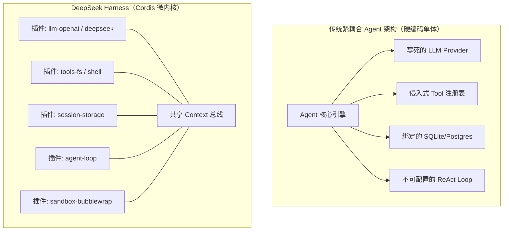

**TL;DR：** DeepSeek Harness（简称 `dsh`）是由 DeepSeek AI 团队开源的工业级 Agent Harness（智能体宿主运行时）。与市面上大多数将模型调用、工具执行、会话持久化与状态机紧耦合的传统 Agent 框架不同，`dsh` 确立了**“一切皆插件”**的核心哲学，底层完全构建在 [Cordis](https://github.com/cordiverse/cordis) 微内核之上。在 `dsh` 中，不存在特权的核心层：模型适配器、工具注册表、会话日志、沙箱策略乃至 Agent 核心循环本身，都只是挂载在 Cordis 共享 Context 上的可插拔插件。这种架构通过“时空可组合性”实现了副作用的可逆回滚（插件卸载时所有注册自动清理），并通过 Profile、Bundle 与 Patch 的三层级联配置，让开发者无需修改源码即可热插拔整个运行时。

---

## 一、为什么传统 Agent 框架走向死胡同：硬编码宿主的痛点

在构建复杂的自主 Agent（如代码助理、系统运维助手、长流程分析智能体）时，开发者通常会遇到以下架构瓶颈：



1. **特权核心与侵入式修改**：新增一个权限校验规则或更改会话存储后端，必须修改核心 Agent 类源码，难以支持不同业务线的多租户差异化定制；
2. **生命周期污染与泄漏**：当某个动态能力（如临时调试工具）在运行时被卸载时，传统框架往往残留事件监听器、全局路由或悬挂句柄，导致内存泄漏与行为污染；
3. **环境隔离与环境迁移极其痛苦**：当 Agent 从本地 CLI 搬迁到浏览器 Web UI 或无头服务器（Headless CI）时，不得不重写大量的接入胶水代码。

DeepSeek Harness 给出的答案是：**彻底剥离特权核心，基于 Cordis 微内核重塑 Agent 宿主环境**。

---

## 二、Cordis 微内核机制：时空可组合性与副作用可逆

Cordis 提出了一种全新的面向插件的编程范式（详见论文 *A Programming Paradigm for Spatiotemporal Composability*）。在 `dsh` 中，Cordis 提供了三大核心原语：

### 2.1 共享 Context 与依赖注入

每个插件接收一个 `ctx: Context` 实例。插件可以通过 `ctx.provide()` 声明自己提供的服务，或通过 `ctx.inject()` 声明自己依赖的服务：

```ts
// packages/core/agent/src/index.ts
import { Context, Service } from 'cordis';

export class AgentService extends Service {
  constructor(ctx: Context) {
    // 声明向外部提供 'agents' 服务，并依赖 'sessions' 与 'llm'
    super(ctx, 'agents', true);
  }

  createAgent(options: AgentOptions) {
    // 基于当前上下文派发 Agent
    return new AgentInstance(this.ctx, options);
  }
}

// 插件入口
export function apply(ctx: Context) {
  ctx.plugin(AgentService);
}
```

### 2.2 可逆副作用（Reversible Effects）

在 Cordis 中，插件所做的一切注册都是**可逆的**。当一个插件被卸载（Unload）或热重载（HMR）时，它在 `ctx` 上注册的：
- 工具（Tools）
- 事件监听器（Event Listeners）
- HTTP API 路由
- 定时任务与守护子进程

都会被 Cordis 框架**自动、静默、彻底地清理回滚**，无需编写繁琐的手动反注册逻辑。这从根本上杜绝了插件动态升级时的内存泄漏与状态脏读。

---

## 三、三层级联配置：Profile、Bundle 与 Patch

DeepSeek Harness 是如何在不改动一行代码的情况下，同时支持桌面 Web 应用、CLI 命令行和无头评测集群的？答案在于其严密的三层配置体系：

```text
┌─────────────────────────────────────────────────────────────┐
│ 1. Bundle 层 (dsh-base / dsh-web-app / dsh-headless)        │
│    定义开箱即用的插件集合（模型适配、工具集、存储引擎）     │
└──────────────────────────────┬──────────────────────────────┘
                               │ 继承 & 叠加
┌──────────────────────────────▼──────────────────────────────┐
│ 2. Profile 层 (~/.dsh/profiles/web.yml)                     │
│    用户命名的组合拓扑，声明包含哪些 bundles 与扩展插件      │
└──────────────────────────────┬──────────────────────────────┘
                               │ 覆盖 & 补丁
┌──────────────────────────────▼──────────────────────────────┐
│ 3. Patch 层 (cordis.patch.yml & --patch overlay)            │
│    通过针对性 ID 替换行配置，重写任意插件参数或注入自定义中间件│
└─────────────────────────────────────────────────────────────┘
```

### 3.1 Bundle（分发单元）

每个 Bundle 是一个标准的 npm 包，在其 `package.json` 的 `dsh` 字段中声明：

```json
{
  "name": "@deepseek-ai/dsh-base",
  "dsh": {
    "bundle": "./cordis.yml"
  }
}
```

- [`dsh-base`](#)：基础底座，包含模型适配器、核心工具、文件持久化、沙箱审批策略与遥测；
- [`dsh-web-app`](#)：浏览器交互层，注入 Vite 前端驱动、WebSocket/SSE 传输层与会话渲染器；
- [`dsh-headless`](#)：无头执行器，用于 CI/CD 自动化批处理与离线基准测试。

### 3.2 查看与导出实际启动树

通过内置的 `--dump-config` 命令，可以直观查看当前环境经过层层叠加后生效的完整插件树：

```sh
dsh --profile web --dump-config
```

终端将打印出所有挂载的 Service、Event 监听器和活跃插件，任何一行配置都可以通过 `--patch` 进行精准热重写。

---

## 四、核心模块全景：Context 挂载关键服务一览

在 `dsh` 启动完成后，`ctx` 上挂载的核心服务如下表所示：

| 服务 Key (`ctx.*`) | 归属包路径 | 核心工程职责 |
|---|---|---|
| `ctx.sessions` | `packages/core/session` | 维护 Append-only 的 `SessionEvent` 日志流与内存状态 |
| `ctx.systemPrompt` | `packages/core/system-prompt` | 动态组装多段 System Prompt 与 Tool JSON Schema |
| `ctx.tools` | `packages/core/tools` | 具备作用域隔离与审批拦截的工具执行流水线 |
| `ctx.agents` | `packages/core/agent` | Agent 实例生命周期管理与事件广播中枢 |
| `ctx.agentLoop` | `packages/core/agent-loop` | 默认的状态机驱动器（实现 Turn / Step 循环调度） |
| `ctx.llm` | `packages/llm/llm` | 统一的流式 Token 生成与多模型 Provider 适配 Seam |
| `ctx.fs` / `ctx.shell` | `packages/fs/*` / `packages/shell/*` | 操作系统文件与进程执行能力缝隙（可指向本地或远程容器） |

---

## 五、架构启示与工程收获

1. **解耦不是拆分文件，而是消除特权依赖**：`dsh` 将 Agent Loop 本身也降级为一个普通插件，如果团队需要研发树搜索算法（如 MCTS）或多 Agent 辩论循环，只需注册一个新的 `AgentLoop` 插件替换原有点位即可；
2. **状态必须可追溯与可反解**：由于微内核高度动态，所有的运行时状态必须通过不可变事件日志（Session Log）进行持久化，确保任何阶段崩溃均可 100% 幂等恢复；
3. **能力缝隙（Seams）保障平台无关性**：工具不需要知道自己在本地 macOS 还是在 Kubernetes Pod 中运行，它只依赖 `ctx.fs` 和 `ctx.subprocess`，底层通过切换 Provider 即可无缝实现远程沙箱挂载。

---

## 六、参考资料与延伸阅读

1. [DeepSeek Harness 开源仓库 (GitHub)](https://github.com/deepseek-ai/deepseek-harness)
2. [Cordis 官方文档与设计论文 (*Spatiotemporal Composability*)](https://github.com/cordiverse/cordis)
3. [DeepSeek-V3 / DeepSeek-R1 架构与 API 官方规范](https://deepseek.com)
