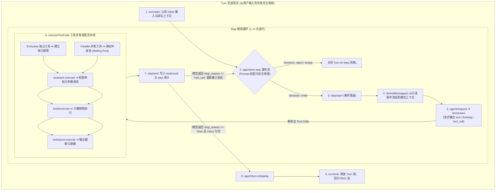
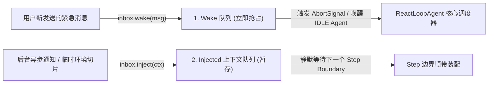
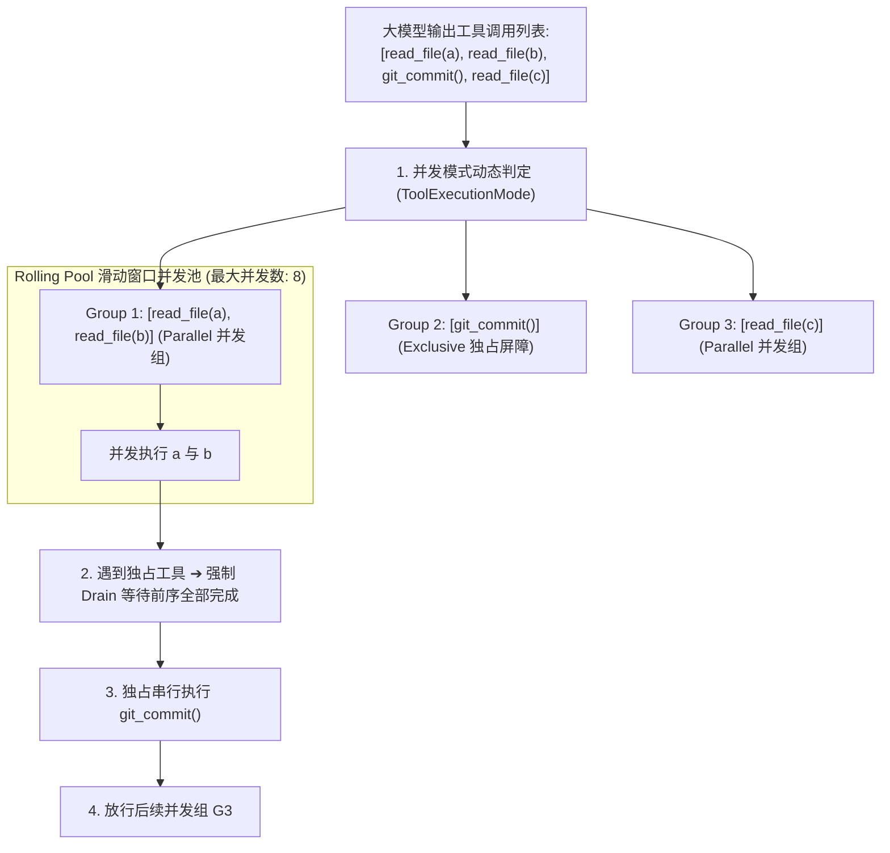

**TL;DR：** 在自主 Agent 的运行时设计中，最容易混淆的概念是“单次大模型问答”与“一个完整的任务目标执行闭环”。DeepSeek Harness（`dsh`）在调度器内核（`packages/core/agent-loop`）中建立了严密的 **Turn（任务轮次）** 与 **Step（步骤）** 双层状态机。**Step** 是一次原子化的“模型请求 + 工具并发执行 + 结果收集”操作；而 **Turn** 则是从接收外部输入开始、经历 0 到 $N$ 次 Step 迭代、直至 Agent 彻底解决问题或无待办工作时的收敛闭环。`dsh` 通过在关键状态转移点引入洋葱模型式的**瀑布流（Waterfall）**中间件体系与**双级收件箱（Two-Tier Inbox）**，让插件系统能够在不修改核心调度循环的前提下，实现动态提示词装配、模型请求拦截、独占工具屏障并发调度与全链路级联取消。

---

## 一、心智模型：Turn 与 Step 的精确状态拓扑

在 `dsh` 中，调度驱动器 `ReactLoopAgent` 的核心状态机流转如下图所示：



### 1.1 Phase 状态机内部定义

在 `ReactLoopAgent` 内部，实例的生命周期状态被严格定义为一个带判别联合类型的 `Phase`：

```ts
// packages/core/agent-loop/src/agent.ts
type Phase =
  | { kind: 'idle'; lastTurn: number }
  | {
      kind: 'maintenance';
      abort: AbortController;
      lastTurn: number;
      wakeRequested: boolean;
    }
  | {
      kind: 'running';
      abort: AbortController;
      turn: number;
      step: number;
      wakeRequested: boolean;
    };
```

- **`idle`**：当前无任何活动任务，Agent 挂起等待 Inbox 唤醒；
- **`maintenance`**：正在执行内部会话整理（如会话快照压缩 Compaction、数据迁移），若收到紧急 Wake 信号可平滑打断；
- **`running`**：正在推进具体的 Turn 与 Step 循环，持有当前 Turn 级别的 `AbortController`。

---

## 二、双级收件箱 (Two-Tier Inbox) 与并发唤醒机制

在真实的生产应用中，用户经常在 Agent 正在流式打字或正在执行长时间工具时追加文字，或者后台系统任务（如代码构建完成）需要给 Agent 注入上下文。

传统 Agent 往往由于单线程阻塞导致“用户输入丢失”或“引发状态机竞态崩溃”。`dsh` 创新性地引入了 **双级收件箱（Two-Tier Inbox）** 体系：



### 2.1 两类消息的精确语义

1. **Wake 消息（唤醒消息）**：
   - 如果 Agent 处于 `idle` 状态，立即触发状态转移进入 `running`；
   - 如果 Agent 正在执行大模型推理，会向当前的 `stepSignal` 发出取消信号，优雅截断当前输出，迅速将用户最新输入合并到下一次 `agent/pre-step` 中进行思考；
2. **Injected 上下文消息（注入消息）**：
   - 绝不打断当前正在进行的流式输出；
   - 暂存在内存收件箱中，直到当前 Step 结束、进入下一个 Step 的 `agent/pre-step` 阶段时，与系统提示词一同装配，保证大模型注意力不被随机碎片化信息打散。

---

## 三、瀑布流 (Waterfall) 中间件架构：控制每一次状态转移

在 `dsh` 中，关键生命周期并非简单的发布/订阅（Pub/Sub）事件，而是采用了类似 Koa 洋葱模型的 **Waterfall（瀑布流）** 拦截机制。

### 3.1 `agent/pre-step` 决策契约

在 Step 真正发起前，调度器调用 `agent/pre-step` 瀑布流，允许所有挂载的插件做出 `PreStepDecision` 裁决：

```ts
// packages/core/agent/src/types.ts
export type PreStepDecision =
  | { kind: 'reject'; reason: string }
  | { kind: 'enter'; messages: UserMessage[]; assembly: PromptAssembly };
```

```ts
// 插件拦截示例：Token 配额保护插件
ctx.on('agent/pre-step', async (args, next) => {
  const currentCost = await ctx.telemetry.getSessionCost(args.agent.sessionId);
  if (currentCost > MAX_BUDGET_LIMIT) {
    // 短路拦截：直接拒绝进入大模型，不消耗任何 Token
    return { kind: 'reject', reason: 'Session budget exceeded.' };
  }
  
  // 放行并传递给下一个中间件
  return next(args);
});
```

- **`reject`**：直接拒绝当前步骤，调度器将优雅关闭当前 Turn，不在日志中留下无效的空白 Step；
- **`enter`**：放行并允许中间件就地改写即将进入大模型的 `messages` 列表或动态补充 `PromptAssembly` 切片。

---

## 四、工具并发流水线：Exclusive 屏障与 Rolling Pool

当大模型单次输出了多个工具调用时（如同时调用 `read_file("a.ts")`, `read_file("b.ts")`, `execute_bash("npm test")`），调度器如何确保并发性能与执行安全？

`packages/core/agent-loop/src/tool-calls.ts` 实现了业界领先的 **混合并发调度器（Hybrid Tool Scheduler）**：



### 4.1 混合调度的核心原则

1. **Exclusive 独占工具屏障**：涉及状态突变、Git 提交或 Shell 执行的高危工具被声明为 `exclusive`。调度器在遇到独占工具时，会暂停分发新任务，等待之前所有已启动的并行工具完全收敛后，再单独串行执行独占工具；
2. **Model-Ordered 结果保序**：尽管底层的网络 I/O 可能因为响应耗时不同而发生乱序到达，调度器在向 Session Log 写入 `tool/result` 时，**严格按照大模型最初生成的顺序排序回填**，确保重放与上下文投影的绝对确定性；
3. **合成取消回执 (Synthetic Abort Results)**：若在多工具执行期间收到取消信号，已发起的工具等待其优雅 Drain，尚未发起的工具自动写入包含 `TOOL_ABORTED_BEFORE_DISPATCH` 错误码的合成回执，保证 Session 日志的拓扑完整。

---

## 五、三段式工具执行流水线 (`tools/*`)

每次具体工具执行时，必须经过严密的三段式管道：

```ts
// packages/core/tools/src/pipeline.ts 核心执行流
export async function runToolPipeline(
  ctx: Context,
  input: ToolExecutionInput,
  signal: AbortSignal
): Promise<ToolExecutionResult> {
  // 1. tools/pre-execute: 权限校验、HITL 人工审批、参数防注入过滤
  const preResult = await ctx.waterfall('tools/pre-execute', { input, signal });
  if (preResult.blocked) {
    return { isError: true, output: `Tool call blocked: ${preResult.reason}` };
  }

  // 2. tools/execute: 派发给具体的 Provider (本地系统 / Linux 沙箱 / 远程 RPC)
  const execResult = await ctx.waterfall('tools/execute', { input: preResult.input, signal });

  // 3. tools/post-execute: 超大输出截断 (Spill 转移)、敏感凭据脱敏清洗
  const postResult = await ctx.waterfall('tools/post-execute', { result: execResult, signal });

  return postResult.result;
}
```

---

## 六、架构启示与工程收获

1. **Turn 与 Step 的分离是状态机的定海神针**：模糊二者的界限是大部分 Agent 陷入死循环的元凶。将单步执行与任务收敛分层治理，才能构建出可预测、可审计的自主循环；
2. **洋葱模型是拦截治理的最佳实践**：通过 Waterfall 中间件，权限审查、Prompt 动态注入、Token 预算熔断均能与调度核心彻底解耦；
3. **并发必须以保序为前提**：在处理大模型生成的批量工具调用时，既要利用并发滑动池压榨 I/O 吞吐，又必须在日志落地时维持模型原始意图的绝对顺序。

---

## 七、参考资料与延伸阅读

1. [DeepSeek Harness Agent Loop 源码实现](https://github.com/deepseek-ai/deepseek-harness/tree/main/packages/core/agent-loop)
2. [Reactive State Machine Patterns for Autonomous Agents](https://martinfowler.com/articles/patterns-of-distributed-systems/)
3. [Concurrency in TypeScript: Promises, Cancellation, and Task Draining](https://developer.mozilla.org/en-US/docs/Web/JavaScript/Reference/Global_Objects/Promise)
