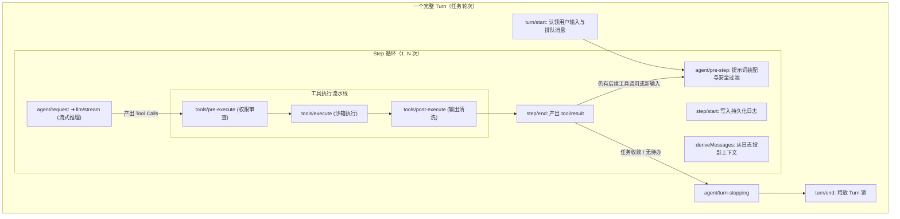

**TL;DR：** 在自主 Agent 的运行时设计中，最容易混淆的概念是“单次大模型问答”与“一个完整的任务目标执行闭环”。DeepSeek Harness（`dsh`）在调度器内核中建立了严密的 **Turn（轮次）** 与 **Step（步骤）** 双层状态机。**Step** 是一次原子化的“模型请求 + 工具执行”操作；而 **Turn** 则是从接收用户输入开始、经过零次或多次 Step 工具交互、直到 Agent 彻底解决问题或无未尽工作时的完整闭环。`dsh` 通过在关键状态转移点引入瀑布流（Waterfall）事件总线，让外部插件可以在不修改调度器主循环的前提下，实现动态提示词重写、工具权限阻断、流式思考链分发与实时中断响应。

---

## 一、心智模型：Turn 与 Step 的精确边界

在 `dsh` 中，调度生命周期的层次关系如下图所示：



### 1.1 关键定义对比

- **Step（单步）**：
  - 发起一次 `llm/stream` 请求；
  - 接收模型返回的文本 Delta 或工具调用提案；
  - 并发/串行执行所有提案的工具并收集执行结果；
  - 产出不可变的 `step/start` 与 `step/end` 日志事件。
- **Turn（轮次）**：
  - 在认领到外部输入（用户 Query、外部 Webhook、定时 Trigger）时开启；
  - 驱动内部 Step 循环不断向前推进；
  - 当模型不再调用工具（`stop_reason === 'stop'`）且没有新的排队输入时，优雅关闭 Turn。

---

## 二、瀑布流 (Waterfall) 中间件设计：掌控每一次转移

在很多传统 Agent 框架中，生命周期钩子往往是简单的广播通知（如 `onMessage`）。而在 `dsh` 中，关键生命周期事件采用了类似 Koa / Express 中间件的 **Waterfall（瀑布流）** 模式。

### 2.1 什么是 Waterfall 事件？

监听 Waterfall 事件的插件接收一个 `next()` 回调函数：
- **放行**：调用 `await next()`，控制权移交给下一个插件或默认执行器；
- **改写**：修改输入参数后调用 `await next()`；
- **短路阻断**：不调用 `next()` 直接返回自定义结果，终止后续流转。

```ts
// packages/core/agent-loop/src/waterfall.ts 核心设计示意
export type WaterfallHandler<TArgs, TResult> = (
  args: TArgs,
  next: (args?: TArgs) => Promise<TResult>
) => Promise<TResult>;

export async function composeWaterfall<TArgs, TResult>(
  handlers: WaterfallHandler<TArgs, TResult>[],
  initialArgs: TArgs,
  terminalAction: (args: TArgs) => Promise<TResult>
): Promise<TResult> {
  let index = -1;

  async function dispatch(i: number, currentArgs: TArgs): Promise<TResult> {
    if (i <= index) throw new Error('next() called multiple times');
    index = i;
    const fn = handlers[i];
    if (i === handlers.length) {
      return terminalAction(currentArgs);
    }
    return fn(currentArgs, (nextArgs) => dispatch(i + 1, nextArgs ?? currentArgs));
  }

  return dispatch(0, initialArgs);
}
```

---

## 三、核心流转时序：从用户输入到工具落地的每一步

让我们跟随一个完整的 Step 走一遍 `dsh` 的核心调度时序：

### 3.1 阶段一：认领输入与 `agent/pre-step`

调度器从 Agent 的 Inbox 队列中拉取最新消息。此时触发 `agent/pre-step` 瀑布流：
- **插件权限检查**：检测用户是否被限制（如 Token 配额耗尽）；
- **动态上下文注入**：插件可以在进入模型前注入实时的外部环境信息（如当前 Git 分支状态、当前打开的文件路径）；
- **静默拦截**：若插件判定该输入无需消耗 LLM（例如用户输入 `/help` 内部命令），可直接短路并返回空消息，关闭 Turn 而无需消耗大模型 Token。

### 3.2 阶段二：上下文投影 `deriveMessages()`

模型不能直接读全局内存对象，必须从历史不可变事件流中通过 `deriveMessages(sessionEvents)` 实时投影出满足 OpenAI / Anthropic 规范的上下文消息列表。这一步杜绝了历史记录被意外篡改的可能。

### 3.3 阶段三：`agent/request` ➔ `llm/stream`

调度器调用 `ctx.llm` 适配器发起流式请求：
- 实时广播 `assistant/chunk`（供 Web UI 渲染打字机动画）；
- 若大模型支持思考链（如 DeepSeek-R1），发射 `thinking_delta` 事件；
- 聚合解析出 `tool/call` 事件对象。

### 3.4 阶段四：工具三段式流水线 (`tools/*`)

模型输出工具调用意图后，进入严格的三段式执行流水线：

```text
1. tools/pre-execute   --> 权限审查、用户人机交互确认 (HITL)、参数防注入清洗
2. tools/execute       --> 派发给实际的 Provider (本地进程 / Docker 沙箱 / Remote API)
3. tools/post-execute  --> 输出截断 (防止 10MB 大日志塞爆上下文)、敏感密钥脱敏
```

执行完毕后，工具输出被包装为持久化的 `tool/result` 消息存入 Session Log。

---

## 四、并发与取消：优雅打断的艺术

在真实的工业生产中，用户经常在大模型流式输出或工具长时间执行时点击【取消】或追加新的输入。

`dsh` 在设计调度器时引入了严格的并发控制：
1. **单一活动 Turn 互斥锁**：同一个 Session 在任意时刻只能有一个活动的 Turn，防止多请求导致状态机内部竞争脏写；
2. **两级 Inbox 机制**：
   - **Wake 消息**：如用户紧急发送的文字，会立即唤醒处于等待状态的 Agent，或给当前 Step 传入 `AbortSignal` 触发快速软中断；
   - **Context 注入消息**：如后台编译完成的通知，暂存在 Inbox 中，静默等待下一次常规 Step 启动时顺带装配，不打扰当前正在流式生成的思考过程。

---

## 五、架构启示与工程收获

1. **状态机粒度决定了系统的可控性**：将执行划分为清晰的 Turn 与 Step，让状态回滚、重试和断点继续拥有了精确的原子锚点；
2. **中间件洋葱模型是扩展的利器**：通过 Waterfall 机制，鉴权、计费、Prompt 注入、安全审计等横切关注点都可以独立解耦为独立插件，调度器核心保持绝对极简；
3. **取消必须是级联的一等公民**：利用 `AbortController` 贯穿 HTTP 请求、LLM Stream 与底层子进程，杜绝由于网络断开或用户取消导致的“僵尸进程”消耗服务端算力。

---

## 六、参考资料与延伸阅读

1. [DeepSeek Harness 核心架构与状态机规范](https://github.com/deepseek-ai/deepseek-harness/blob/main/docs/architecture.md)
2. [Koa 与 洋葱中间件架构设计原理](https://koajs.com/)
3. [W3C AbortController 与 DOM 取消标准规范](https://dom.spec.whatwg.org/#abortcontroller)
