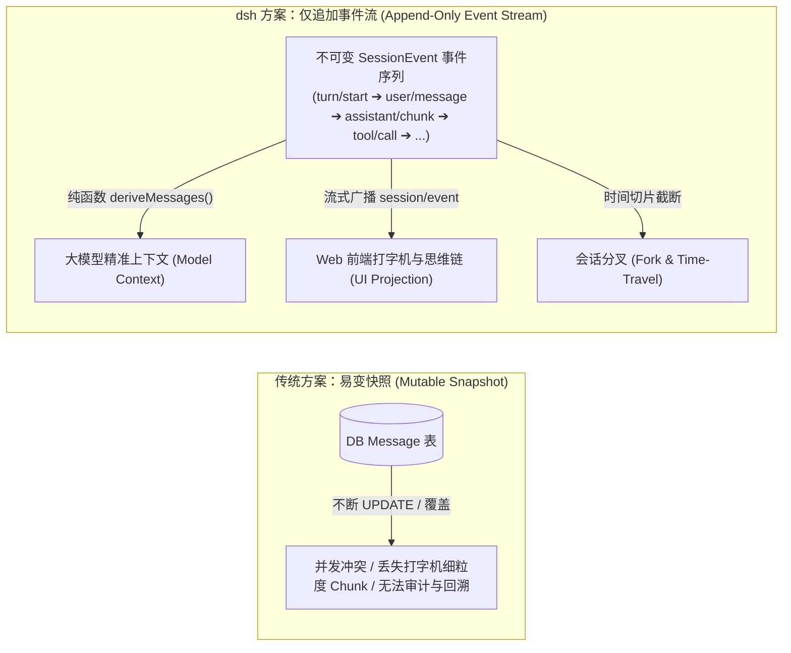
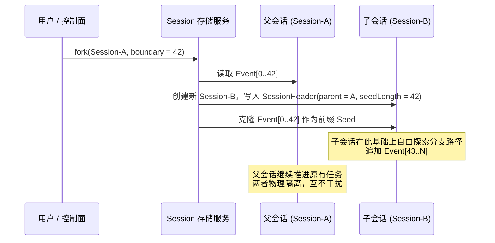

**TL;DR：** 许多 Agent 系统在运行几天后经常出现“状态与界面不同步”、“刷新页面后历史丢失”或“无法精确复现特定 Bug”等顽疾。其根本原因在于采用了易变的“对象状态快照（Stateful Snapshot）”存储。DeepSeek Harness（`dsh`）彻底颠覆了这种做法，确立了以 **Append-Only（仅追加）Session Log** 为单一事实源（Single Source of Truth）的架构，并立下铁律：**“模型所见必留痕”（Model-visible means logged）**。整个系统的内存状态、UI 界面展示、大模型上下文装配、会话分叉（Fork）与故障回放，全部由不可变事件流通过纯函数 `deriveMessages()` 动态投影计算而来。

---

## 一、为什么放弃快照？事件溯源 (Event Sourcing) 的必然性

在传统的 Agent 存储设计中，开发者习惯于直接把 `messages: Message[]` 数组作为 JSON 存入数据库。当需要修改单条消息、插入工具结果或压缩上下文时，直接原地 `UPDATE` 数据库记录。

这种做法在工业级场景下存在三大致命缺陷：



1. **细节丢失与回放失真**：流式打字机过程中的思考链 Delta、Token 统计细粒度数据、工具执行的中间诊断在 `UPDATE` 后被冲刷殆尽，无法精确还原用户当时的交互体验；
2. **多端并发写入脏读**：当后台子 Agent 和用户同时交互时，原地修改消息数组极易造成数组下标错位或数据覆盖；
3. **不可逆性**：一旦发生错误操作（如错误的上下文截断），历史数据永久丢失，无法回滚到任意历史步骤重新决策。

`dsh` 采用 **Event Sourcing（事件溯源）** 模式：**Session 唯一的物理实体就是一条只增不减的事件序列文件（`.jsonl` 或持久化存储）**。

---

## 二、“模型所见必留痕”铁律 (Model-Visible Means Logged)

在 `dsh` 源码中，有一条写入架构规范的绝对不变量（Invariant）：

> **Model-visible means logged.** 任何能够被大模型在 Prompt / Context 中感知到的信息，必须能够从 Session Log 中完整重构反解出来；系统在运行时通过断言保证该不变量不被打破。

这意味着：
- **禁止在内存中私藏隐式状态**：禁止在 Agent 类内部维护未持久化的私有上下文变量；
- **新增输入类型必须扩展事件契约**：如果插件想要向大模型注入一种全新的环境感知数据（如摄像头截图、LSP 诊断信息），必须首先在 `SessionEventMap` 中声明对应的事件类型并落盘，再参与投影。

### 2.1 SessionHeader 与 SessionEvent 核心数据结构

```ts
// packages/core/session/src/types.ts
export interface SessionHeader {
  readonly version: number;            // 持久化协议版本号 (SESSION_FORMAT_VERSION)
  readonly id: SessionId;              // Branded 唯一会话 ID
  readonly createdAt: number;          // 会话创建时间戳 (Epoch ms)
  readonly cwd?: string;               // 绑定的工作区绝对路径
  readonly parentSession?: SessionId;  // 若为 Fork 会话，指向父会话 ID
  readonly seedLength?: number;        // 继承自父会话的历史事件切片长度
  readonly origin?: 'subagent';        // 若为子智能体，标记来源
  readonly delegationDepth?: number;   // 递归委派深度 (防止子 Agent 无限循环生成)
  readonly agentPreset?: string;       // 绑定的 Agent 预设配置指纹
}

export interface SessionEvent<T = unknown> {
  readonly id: string;                 // 单调唯一事件 ID
  readonly type: string;               // 事件类型标识
  readonly timestamp: number;          // 事件发生物理时间
  readonly data: T;                    // 结构化事件载荷
  readonly ignorable?: boolean;        // 向后兼容标记 (旧版本读者遇到未知类型可安全跳过)
}
```

---

## 三、`deriveMessages()` 投影引擎：从事件流到大模型契约

当 Agent 准备发起下一次大模型推理时，`deriveMessages` 函数负责扫描当前 Session 的事件流，将其转换为大模型可理解的标准 `Message[]` 数组。

### 3.1 核心投影算法逻辑

```ts
// packages/core/session/src/derive-messages.ts 核心实现
import type { SessionEvent } from './types.ts';
import type { Message, AssistantMessage, ToolCallBlock } from '@deepseek-ai/dsh-llm';

export function deriveMessages(events: readonly SessionEvent[]): Message[] {
  const messages: Message[] = [];
  let pendingAssistant: AssistantMessage | null = null;

  for (const event of events) {
    switch (event.type) {
      case 'user/message':
        // 用户输入进入消息历史
        messages.push({
          role: 'user',
          content: event.data.content,
        });
        break;

      case 'assistant/message':
        // 完整的 assistant 消息直接入列
        pendingAssistant = {
          role: 'assistant',
          content: event.data.content,
          tool_calls: event.data.toolCalls || [],
        };
        messages.push(pendingAssistant);
        break;

      case 'tool/call':
        // 如果是流式逐步追加的工具调用，聚合到当前 assistant 消息中
        if (pendingAssistant) {
          pendingAssistant.tool_calls = pendingAssistant.tool_calls || [];
          pendingAssistant.tool_calls.push({
            id: event.data.callId,
            type: 'function',
            function: {
              name: event.data.toolName,
              arguments: JSON.stringify(event.data.arguments),
            },
          });
        }
        break;

      case 'tool/result':
        // 投影为 tool 角色的回填消息，绑定 tool_call_id
        messages.push({
          role: 'tool',
          tool_call_id: event.data.callId,
          content: typeof event.data.output === 'string'
            ? event.data.output
            : JSON.stringify(event.data.output),
        });
        break;

      case 'compaction/summary':
        // 遇到压缩摘要锚点：截断前序消息，仅保留系统核心指令与最新摘要
        messages.length = 0;
        messages.push({
          role: 'system',
          content: `[Previous conversation summary]: ${event.data.summary}`,
        });
        break;
    }
  }

  return messages;
}
```

由于 `deriveMessages` 是**纯函数（Pure Function）**，它不产生任何系统副作用：
- 相同的事件序列在任何机器、任何时间计算，结果 100% 相同；
- 单元测试极其简单，只需传入静态的 JSON 事件数组即可断言上下文构造是否准确；
- 内存开销极小，可以利用不可变切片实现 Zero-Copy 上下文重构。

---

## 四、高级能力：会话分叉 (Fork) 与时间旅行 (Time-Travel)

得益于 Append-Only 的设计，`dsh` 轻松实现了在复杂 Agent 研发中极具价值的**会话分叉（Session Fork）**能力：

```ts
// 调用 sessions 服务快速分叉当前会话
const childSession = await ctx.sessions.fork({
  parentSessionId: sourceSession.id,
  boundaryIndex: 42, // 在第 42 个事件处截断分叉 (时间旅行)
  meta: {
    origin: 'subagent',
    delegationDepth: (sourceSession.header.delegationDepth || 0) + 1,
  },
});
```



---

## 五、架构启示与工程收获

1. **状态是事件的累加，不是存储的基准**：在 AI Agent 这种高度动态、依赖长链路上下文的系统中，存储原始事件远远比存储处理后的快照更有生命力；
2. **读写分离与精准广播**：写入端只需保证单调追加（Append-Only）并获取全局唯一时间戳，读取端则根据不同业务需求（Web 前端打字机 vs LLM Context 装配 vs 计费账单审计）分别投影出不同的视图；
3. **可复现性是系统稳定性的试金石**：任何线上报错，只需要将用户的 `session.log` 导出并在本地回放，就能 1:1 精确复现当时模型看到的每一轮输入与工具返回值，彻底告别“偶发性玄学 Bug”。

---

## 六、参考资料与延伸阅读

1. [Martin Fowler: Event Sourcing 设计模式解析](https://martinfowler.com/eaaDev/EventSourcing.html)
2. [DeepSeek Harness Session 子系统实现源码](https://github.com/deepseek-ai/deepseek-harness/tree/main/packages/core/session)
3. [CQRS (Command Query Responsibility Segregation) 架构原则](https://learn.microsoft.com/en-us/azure/architecture/patterns/cqrs)
