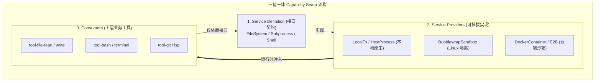
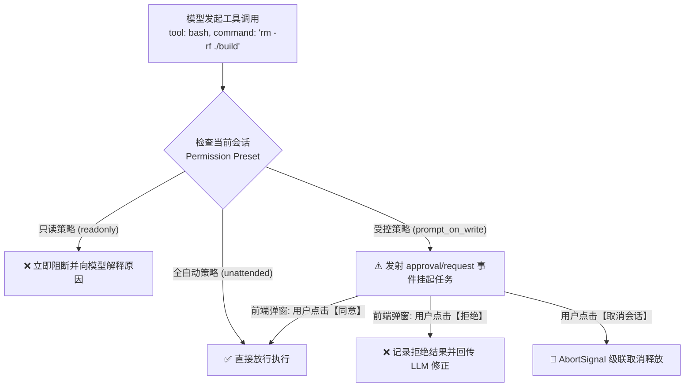

**TL;DR：** 自主 Agent 要成为生产力工具，就必须具备读写文件、执行 Shell 脚本与调用网络工具的真实系统能力；但直接给大模型裸跑 `child_process.exec()` 或任意写盘无异于“引狼入室”。DeepSeek Harness（`dsh`）在架构设计中开创性地提出了**能力缝隙（Capability Seams）**范式，将系统能力严格解耦为 **Service Definition（契约定义）**、**Service Provider（能力提供者）** 与 **Consumer（消费调用端）** 三层。结合 Linux Bubblewrap、Docker 容器隔离与细粒度人机确认（HITL）审批守卫，`dsh` 做到了无论将 Agent 部署在本地开发机、云端多租户集群还是隔离无网沙箱，工具代码一行不改，底层安全防线牢不可破。

---

## 一、心智模型：为什么需要“能力缝隙 (Capability Seam)”？

在许多 Agent 实现中，工具（Tool）通常直接硬编码 `node:fs` 或 `child_process`：

```ts
// ❌ 传统紧耦合写法：工具直接操作本地系统
export async function executeBash(cmd: string) {
  return execSync(cmd).toString(); // 无法远程化，无法注入沙箱，无法跨平台
}
```

这种设计的致命缺陷在于：**工具与物理环境强绑定**。一旦要把 Agent 迁移到云端容器运行，或者限制 Agent 只能访问某一个特定目录，就必须修改所有工具源码。

`dsh` 提出了**三位一体能力缝隙（Seam）**模型：



### 1.1 Seam 的三要素

1. **Service Definition**：声明纯 TypeScript 接口（如 `ctx.fs.readFile(path)`），不包含任何物理实现；
2. **Service Provider**：实现具体的挂载逻辑（本地宿主、Linux cgroups/Bubblewrap、Docker 容器、或者远程 gRPC 沙箱）；
3. **Consumer**：大模型面向的工具集（如 `read_file`, `execute_command`），只面向 `ctx.fs` 编程，完全感知不到底层是本地还是远端沙箱。

只需在 Cordis 配置中替换一行 Provider，整个 Agent 的所有工具执行世界瞬间平移到隔离沙箱中。

---

## 二、核心能力缝隙一览：操作系统与环境抽象

在 `dsh` 中，操作系统的物理访问被收敛在以下几组核心 Seam 中：

| Seam 抽象 (`ctx.*`) | 接口职责与定义 | 默认本地 Provider | 沙箱隔离 Provider |
|---|---|---|---|
| `ctx.fs` | 文件读写、Stat、移动、Glob 搜索 | `dsh-fs-local` | `dsh-fs-sandbox` (只读挂载与白名单限制) |
| `ctx.subprocess` | 单次子进程派生、超时与退出码管理 | `dsh-subprocess-local` | `dsh-sandbox-bubblewrap` / `dsh-e2b` |
| `ctx.terminals` | 维持长生命周期的 PTY 伪终端交互会话 | `dsh-terminal-local` | 容器内 PTY 桥接转发 |
| `ctx.credentials` | 系统敏感凭据（API Keys、SSH Keys）安全管理 | `dsh-credentials-env` | OS Keychain / 内存受保护存储 |

---

## 三、零信任沙箱防护：Bubblewrap 与权限物理隔离

当 Agent 需要执行不受信的 Python 脚本或由 LLM 自主生成的 Shell 管道时，`dsh` 提供了基于 Linux 原生 **Bubblewrap (`bwrap`)** 的超轻量无 root 沙箱方案。

### 3.1 Bubblewrap 隔离原理

Bubblewrap 利用 Linux User Namespaces 技术，无需 root 权限即可为子进程创建完全隔离的命名空间：

```ts
// packages/sandbox/bubblewrap/src/index.ts 核心参数组装示意
export function buildBubblewrapArgs(config: SandboxPolicy): string[] {
  return [
    'bwrap',
    '--ro-bind', '/usr', '/usr',       // 系统目录只读绑定
    '--ro-bind', '/lib', '/lib',
    '--ro-bind', '/lib64', '/lib64',
    '--dir', '/tmp',                   // 独立私有 /tmp 目录
    '--bind', config.workspaceDir, config.workspaceDir, // 仅放开工作区读写
    '--unshare-all',                   // 隔离所有命名空间 (IPC, PID, Net, UTS)
    '--die-with-parent',               // 父进程退出时子进程立即销毁
    ...(config.allowNetwork ? [] : ['--unshare-net']), // 默认物理断网
  ];
}
```

- **物理断网**：默认通过 `--unshare-net` 移除网络设备，阻断恶意反弹 Shell 与私密数据外发；
- **只读根文件系统**：宿主机的 `/etc`, `/usr`, `/bin` 以只读（`--ro-bind`）挂载，防止 Agent 破坏系统；
- **工作区局部读写**：Agent 只能在指定的 Workspace 目录下创建与修改文件。

---

## 四、动态权限审批流 (Guard & HITL Policy)

除了操作系统层面的硬隔离，`dsh` 还内置了应用层的人机协同确认（Human-in-the-Loop）防线。

在工具执行的 `tools/pre-execute` 阶段，Guard 模块会进行意图与风险评估：



### 4.1 核心防护特性

1. **权限不可静默提权**：工具无法通过二次封装绕过权限检查；
2. **异步挂起与非阻塞**：当等待用户人工点击确认时，当前 Turn 保持挂起，不占用系统工作线程；
3. **取消联动**：若用户在确认弹窗等待期间点击了取消任务，`AbortSignal` 立即释放挂起的 Promise，杜绝死锁。

---

## 五、架构启示与工程收获

1. **接口先行，抹平环境异构性**：在 Agent 项目第一天就建立 `ctx.fs` 与 `ctx.subprocess` 的 Seam 抽象，是系统未来能够平滑支持 WebContainer、Docker、E2B 和 Kubernetes 的最大底牌；
2. **多层纵深防御 (Defense in Depth)**：单一维度的防护必然会被绕过。`dsh` 通过“应用层 Schema 校验 ➔ 中间件权限 Guard 审批 ➔ 内核级 Bubblewrap/cgroups 隔离”构建了三道纵深防线；
3. **给用户明确的掌控权**：Agent 不是脱缰的野马，可观察、可干预、可审批是 Agent 迈入企业级生产环境的必备准入条件。

---

## 六、参考资料与延伸阅读

1. [Linux Bubblewrap (bwrap) 官方仓库与命名空间规范](https://github.com/containers/bubblewrap)
2. [DeepSeek Harness Capability Seams 设计文档](https://github.com/deepseek-ai/deepseek-harness/blob/main/docs/capability-seams.md)
3. [NIST SP 800-207: Zero Trust Architecture (零信任架构标准)](https://csrc.nist.gov/publications/detail/sp/800-207/final)
