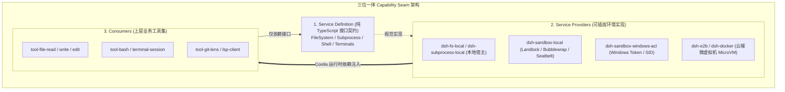
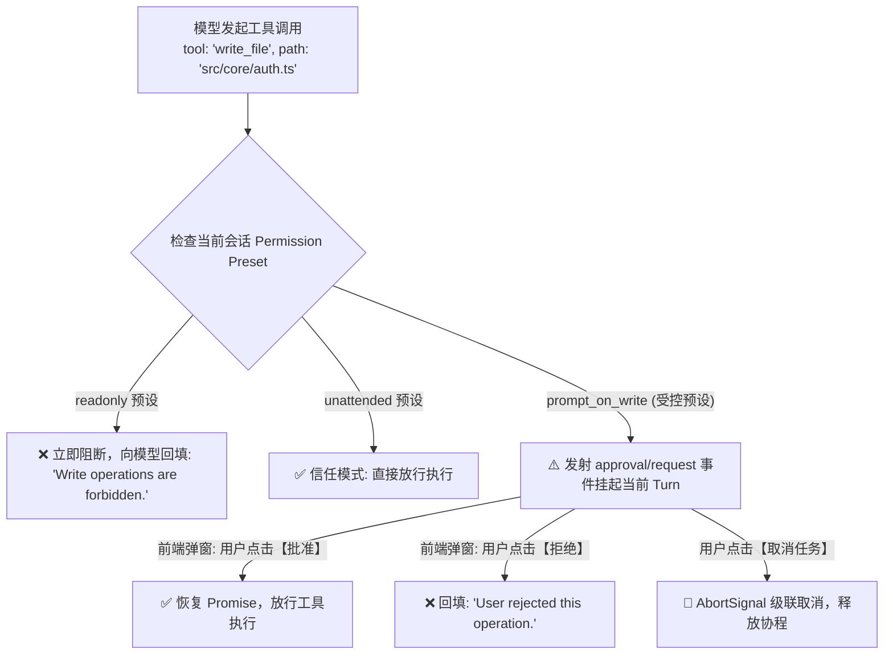

**TL;DR：** 自主 Agent 要成为真正的生产力工具，就必须具备读写工作区、执行 Shell 脚本与派生子进程的真实操作系统能力；但直接给大模型裸跑 `child_process.exec()` 或任意写盘无异于“引狼入室”。DeepSeek Harness（`dsh`）在架构设计中开创性地提出了**三位一体能力缝隙（Capability Seams）**范式，将物理能力严格解耦为 **Service Definition（契约定义）**、**Service Provider（实现提供者）** 与 **Consumer（业务调用端）** 三层。在沙箱层（`packages/sandbox`），`dsh` 原生集成了 **Linux Landlock / Bubblewrap**、**macOS Seatbelt (`sandbox-exec`)** 与 **Windows Restricted Token / ACLs** 跨平台沙箱矩阵，配合细粒度人机确认（HITL）审批流，实现了“工具代码一行不改，底层安全物理封印”的企业级安全底座。

---

## 一、心智模型：为什么需要“三位一体能力缝隙 (Capability Seam)”？

在许多开源 Agent 实现中，工具（Tool）通常直接硬编码宿主机的系统调用：

```ts
// ❌ 传统紧耦合反模式：工具直接侵入本地物理系统
export async function executeBash(cmd: string) {
  // 无法重定向到 Docker，无法无侵入注入沙箱，无法跨平台隔离
  return execSync(cmd, { cwd: process.cwd() }).toString();
}
```

这种设计的致命缺陷在于：**工具与物理环境强耦合**。一旦要把 Agent 迁移到云端多租户容器，或者需要在严格断网的沙箱中执行不受信代码，就必须推倒重写所有工具源码。

`dsh` 确立了**三位一体能力缝隙（Seam）**模型：



### 1.1 Seam 的三要素

1. **Service Definition**：声明纯接口抽象（如 `ctx.fs.readFile(path)`, `ctx.subprocess.spawn(spec)`），不包含任何物理实现代码；
2. **Service Provider**：实现具体的挂载逻辑（本地文件、Linux Landlock 规则树、Docker 容器或远程 gRPC RPC 沙箱）；
3. **Consumer**：大模型面向的业务工具集，仅面向 `ctx.fs` 与 `ctx.subprocess` 编程，对底层物理环境完全无感。

在 Cordis 配置文件中只需切换一行 Provider，整个 Agent 所有的文件读写与命令执行瞬间无缝平移至隔离沙箱。

---

## 二、跨平台零信任沙箱矩阵 (`packages/sandbox`)

`dsh` 的沙箱并非简单的容器套壳，而是在操作系统内核级别实现了针对不同 OS 的原生轻量沙箱适配矩阵：

```text
 ┏━━━━━━━━━━━━━━━━━━━━━━━━━━━━━━━━━━━━━━━━━━━━━━━━━━━━━━━━━━━━━━━━━━━━━━━━━━━━━┓
 │                     dsh 跨平台零信任沙箱适配矩阵                            │
 ┣━━━━━━━━━━━━━━━━━┳━━━━━━━━━━━━━━━━━━━━━━━━━━━━━━━━━━━━━━━━━━━━━━━━━━━━━━━━━━━┫
 │ 操作系统平台     │ 底层沙箱机制与内核隔离技术                                │
 ┣━━━━━━━━━━━━━━━━━╋━━━━━━━━━━━━━━━━━━━━━━━━━━━━━━━━━━━━━━━━━━━━━━━━━━━━━━━━━━━┫
 │ Linux (现代内核) │ Linux Landlock LSM (无需 root 权限的文件系统路径访问控制)  │
 │ Linux (通用环境) │ Bubblewrap (bwrap Namespaces + 只读 bind-mount + 无网隔离)│
 │ macOS           │ Apple Seatbelt 内核沙箱 (利用 sandbox-exec Scheme 描述符)  │
 │ Windows         │ Restricted Token + 低完整性级别 (Low Integrity SID) + ACL │
 │ 云端多租户       │ E2B Firecracker MicroVM / Docker Remote Sandbox          │
 ┗━━━━━━━━━━━━━━━━━┻━━━━━━━━━━━━━━━━━━━━━━━━━━━━━━━━━━━━━━━━━━━━━━━━━━━━━━━━━━━┛
```

### 2.1 Linux Bubblewrap 隔离原理与参数构造

当在 Linux 下以非 root 权限启动沙箱子进程时，`dsh` 自动合成严格受限的 bwrap 命令链：

```ts
// packages/sandbox/sandbox-local/src/profiles.ts
export function buildBubblewrapArgs(policy: SandboxPolicy): string[] {
  return [
    'bwrap',
    '--unshare-all',                         // 隔离 IPC, PID, UTS, Cgroup 等全部命名空间
    '--die-with-parent',                     // 父进程销毁时子进程同步自毁，防孤儿逃逸
    '--ro-bind', '/usr', '/usr',             // 系统二进制与库文件严格只读
    '--ro-bind', '/lib', '/lib',
    '--ro-bind', '/lib64', '/lib64',
    '--ro-bind', '/etc/resolv.conf', '/etc/resolv.conf', // 最小网络配置只读
    '--dir', '/tmp',                         // 独立私有 /tmp 内存盘
    '--bind', policy.workspaceDir, policy.workspaceDir, // 仅放开当前工作区读写
    ...(policy.allowNetwork ? [] : ['--unshare-net']), // 默认物理拔除网线
  ];
}
```

- **物理断网**：通过 `--unshare-net` 移除所有网络接口（仅保留 `lo` 回环），阻断恶意反弹 Shell 与窃取 Token 外发；
- **文件系统白名单**：宿主机除 `/usr` 和 `/lib` 外对子进程完全不可见；
- **资源限制**：通过 Linux cgroups v2 注入 `pids.max = 32` 与 `memory.max = 512MB`，防止 Fork 炸弹与 OOM 击穿宿主机。

---

## 三、动态权限审批流 (Guard & HITL Policy)

除了操作系统底层的物理沙箱，`dsh` 在应用层设计了严密的 **Human-in-the-Loop（HITL）** 权限守卫。

在工具执行的 `tools/pre-execute` 瀑布流拦截点，Guard 模块依据当前会话的权限预设（Permission Preset）进行风险评估：



### 3.1 权限风控的核心防线

1. **不可静默提权（No Silent Escalation）**：任何尝试修改 `.dsh/` 配置文件或尝试安装未授权全局包的行为会被硬编码拦截；
2. **异步挂起与非阻塞**：等待用户审批时，当前 Turn 进入 `maintenance/suspended` 状态，不占用 Node.js 事件循环的 CPU 算力；
3. **级联取消防死锁**：若用户在等待审批期间点击了取消按钮，`AbortSignal` 会立即触发并拒绝等待 Promise，彻底清理资源。

---

## 四、架构启示与工程收获

1. **接口先行，抹平环境异构性**：在项目第一天就确立 `ctx.fs` 与 `ctx.subprocess` 的 Seam 契约，是系统未来能够平滑支持 Docker、E2B、Wasm 和 Kubernetes 的最大底牌；
2. **纵深防御 (Defense in Depth)**：单一维度的防护必然会被绕过。`dsh` 通过“应用层 Schema 校验 ➔ 中间件权限 Guard 审批 ➔ 内核级 Bubblewrap/Seatbelt 物理隔离”构建了三道纵深防线；
3. **给用户明确的掌控权**：Agent 不是脱缰的野马，可观察、可干预、可审批是 Agent 迈入企业级生产环境的必备准入条件。

---

## 五、参考资料与延伸阅读

1. [Linux Landlock: Unprivileged Access Control](https://landlock.io/)
2. [Bubblewrap: Unprivileged Sandboxing Tool (GitHub)](https://github.com/containers/bubblewrap)
3. [DeepSeek Harness Capability Seams 设计规范](https://github.com/deepseek-ai/deepseek-harness/blob/main/docs/capability-seams.md)
