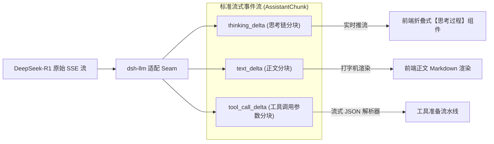
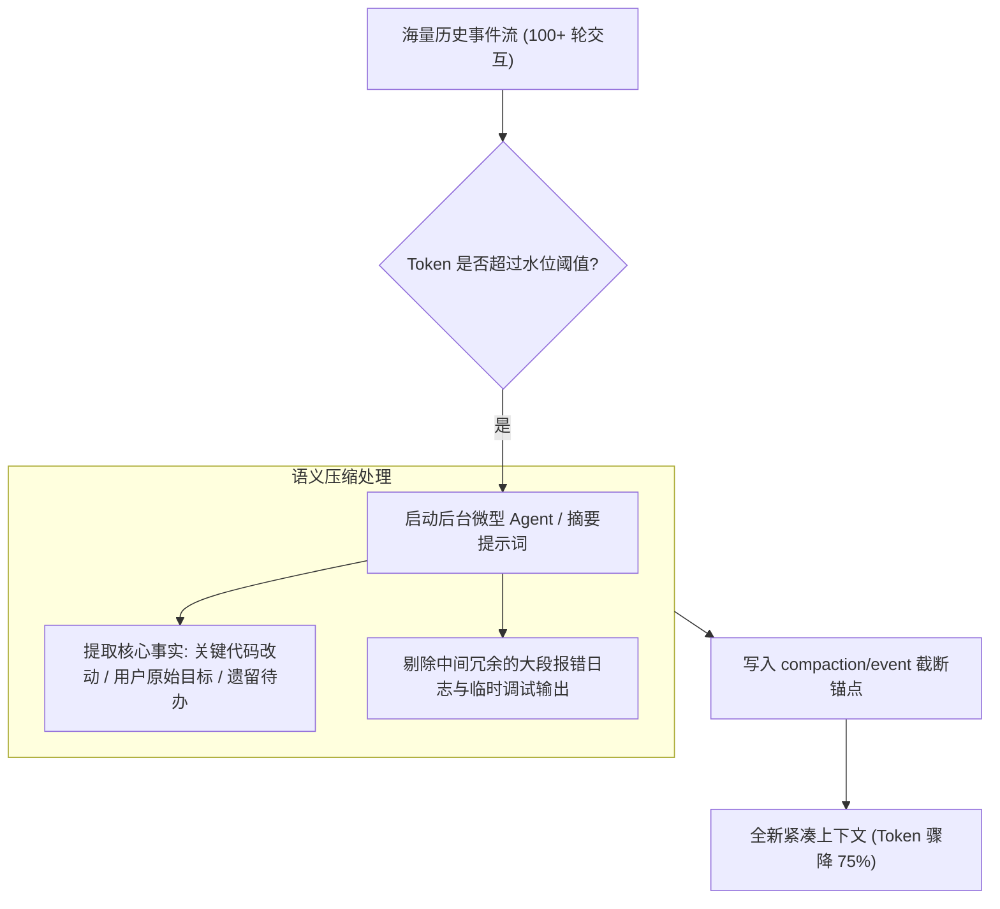

**TL;DR：** 随着 DeepSeek-R1 等具备强推理能力模型的普及，Agent 框架面临两个全新的工程挑战：一是如何原生支持**深度思考链（Reasoning / Thinking Delta）**与文本生成的实时流式分离渲染；二是在长达数百轮的交互中，如何应对上下文窗口爆炸与昂贵的推理成本。DeepSeek Harness（`dsh`）在 LLM 传输层构建了统一的流式事件适配器，在提示词层采用了 **KV Cache 友好** 的静态前缀分段装配，并在存储与运行时引入了 **Compaction（智能压缩）** 与 **Spill（溢出外置）** 双引擎，既保障了大模型在超长对话下的逻辑连贯，又将 Token 成本与首字延迟压制在极致水平。

---

## 一、DeepSeek-R1 思考链流式流控架构

DeepSeek-R1 / V3 在流式响应时，通常输出两种截然不同的内容载荷：
1. **`<think>` 内部思考链**：模型推导逻辑、假设验证与自我纠错过程；
2. **正式回复 / 工具调用**：面向用户呈现的最终结论或发起的系统指令。

`dsh` 在 `packages/llm/llm` 中设计了统一的流式分发协议：



### 1.1 核心流式事件模型

```ts
// packages/llm/llm/src/types.ts 核心流式分块契约
export interface AssistantChunk {
  chunkId: string;
  type: 'thinking' | 'text' | 'tool_call';
  delta: string;
  usageSnapshot?: {
    promptTokens: number;
    completionTokens: number;
  };
}
```

通过将 `thinking` 与 `text` 分流，前端可以实现优雅的“思考折叠面板”，用户不仅能清晰洞察 Agent 的决策思维路径，而且不会干扰正文输出的格式与复制体验。

---

## 二、KV Cache 命中优化：静态前缀对齐法则

大模型 API（尤其是 DeepSeek 与 Anthropic）普遍支持 **Prompt Caching（前缀缓存）**。若两个请求的前 $N$ 个 Token 字符完全一致，命中缓存的输入 Token 费用可直降 50%~90%，且首字延迟（TTFT）降低数倍。

很多开发者常犯的致命错误是在 System Prompt 头部插入动态变量（如动态时间戳、动态随机数、频繁变动的 Git 状态）：

```text
❌ 错误写法（彻底破坏 KV Cache）：
[System Prompt 头部]
当前时间是: 2026-08-24 08:30:15 (每秒都在变，导致缓存每次全量失效！)
你的角色是...
```

### 2.1 `dsh` 的分段装配器 (`ctx.systemPrompt`)

`dsh` 将 Prompt 拆解为多个具有明确缓存优先级的 Sections：

```text
┌─────────────────────────────────────────────────────────────┐
│ 1. 静态核心指令 (Static System Instructions) - 100% 缓存命中   │
│    - 角色定位、安全准则、基础响应格式规范                     │
├─────────────────────────────────────────────────────────────┤
│ 2. 工具声明集合 (Tool JSON Schemas) - 稳定缓存               │
│    - 静态注册的工具参数定义与描述                           │
├─────────────────────────────────────────────────────────────┤
│ 3. 动态环境切片 (Dynamic Workspace Context) - 局部刷新       │
│    - 工作区目录结构、活动文件路径、当前时间戳 (沉底放置)      │
└─────────────────────────────────────────────────────────────┘
```

把最高频变动的动态环境信息**严格沉底**，确保前 80% 的静态指令与工具 Schema 能够稳定命中服务端的 KV Cache。

---

## 三、上下文治理双引擎：Compaction 与 Spill

当自主 Agent 执行大型重构任务时，多轮对话可能迅速突破 64K 甚至 128K Token 上限。`dsh` 提供了两种互补的治理手段：

### 3.1 引擎一：Compaction（智能摘要压缩）

当当前会话的 Token 估算值接近设定的水位线（如达到窗口容量的 80%）时，`packages/compaction` 插件被自动激活：



`compaction/event` 在 Session Log 中作为一个新的快照锚点，后续的 `deriveMessages` 会从最新的压缩锚点开始投影，既保证了关键记忆不丢失，又释放了巨大的上下文空间。

### 3.2 引擎二：Spill（大内容外置存储）

如果某个工具输出了一条 5MB 的日志文件或 10 万行数据库查询结果，直接塞入 Context 会瞬间打爆模型上下文。

`packages/spill` 实现了透明的大内容外置机制：
1. **阈值拦截**：工具输出一旦超过指定大小（如 16KB）；
2. **落盘保存**：自动将完整结果存入磁盘临时存储，生成唯一文件哈希 URI；
3. **内容切片**：只将前 50 行和后 20 行摘要以及 `[Full output spilled to uri: spilt://xxx]` 回传给大模型；
4. **按需检索**：模型如果需要深入分析细节，可调用专门的 `read_spill_chunk` 工具定向分页读取。

---

## 四、Token 计量与成本控制 (TokenMeter)

在多租户与企业环境中，每一次大模型调用的成本必须清晰可见。`packages/telemetry` 提供了精确的 Token 计量器：
- 每次 Step 结束时，记录真实计费数据：`prompt_tokens`, `completion_tokens`, `cached_tokens`；
- 计算当前会话的实时累计开销（美元 / 人民币）；
- 发射 `telemetry/usage` 事件，驱动前端实时仪表盘更新。

---

## 五、架构启示与工程收获

1. **协议层应当向未来模型看齐**：深度推理模型（如 DeepSeek-R1）已将“思考过程”变为一等公民，流式协议必须具备原生承载多通道 Delta 的能力；
2. **缓存友好是免费的超能力**：通过简单的 Prompt 分层与静态前缀对齐，可以在不牺牲功能的前提下，让 API 响应速度倍增、调用成本折半；
3. **永远防范上下文溢出**：没有自我压缩与溢出防护的 Agent 跑不过 50 轮；建立自动化 Compaction 与 Spill 机制，是 Agent 能够稳定运行长程任务的底层基石。

---

## 六、参考资料与延伸阅读

1. [DeepSeek-R1: Incentivizing Reasoning Capability in LLMs via Reinforcement Learning](https://arxiv.org/abs/2501.12948)
2. [DeepSeek 官方 Prompt Caching (KV Cache) 最佳实践指南](https://api-docs.deepseek.com/guides/kv_cache)
3. [DeepSeek Harness Compaction 与 Spill 子系统源码](https://github.com/deepseek-ai/deepseek-harness/tree/main/packages/compaction)
