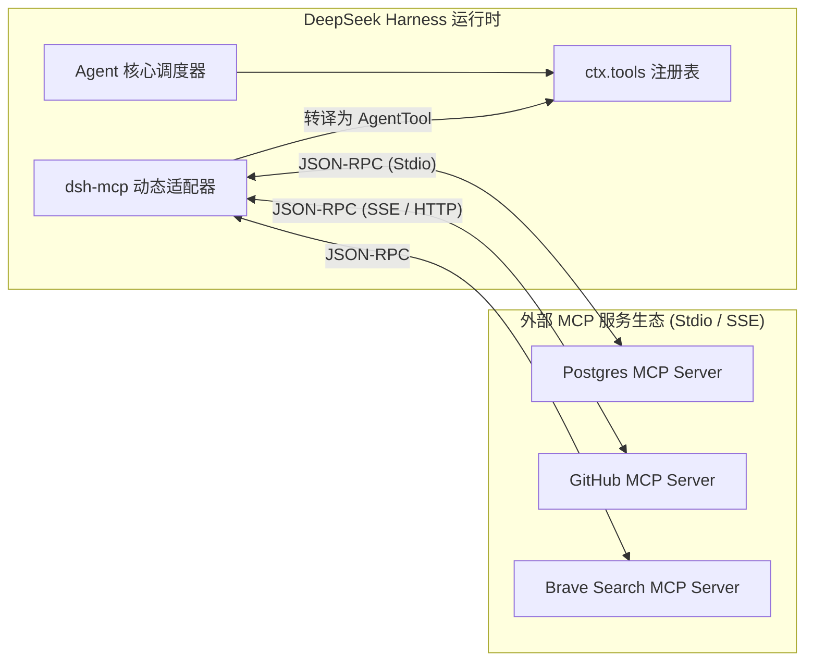
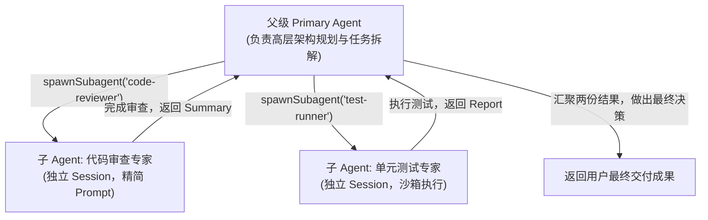

**TL;DR：** 经过前五篇文章对 DeepSeek Harness（`dsh`）微内核架构、状态机生命周期、事件日志持久化、能力缝隙沙箱与流式压缩机制的深入剖析，本文进入终极实战环节。我们将手把手编写一个工业级的 `dsh` 自定义插件，演示如何基于 Cordis 注册具备运行时校验的强类型工具与管理路由；随后，我们将深入解析 `dsh` 如何通过 Model Context Protocol（MCP）桥接外部丰富的生态工具，并揭秘父子多 Agent（Subagent）的拓扑隔离与协同调度机制。

---

## 一、手把手：开发你的第一个 DSH 插件

在 `dsh` 的“一切皆插件”体系中，开发一个功能模块极其简单直接。

### 1.1 插件结构与契约定义

假设我们要为一个智能代码助手编写一个“Git 智能分支分析与冲突探测”插件：

```ts
// packages/plugins/git-analyzer/src/index.ts
import { Context, Schema } from 'cordis';
import { Type } from '@sinclair/typebox';

// 1. 定义插件配置 Schema (用于 Web UI / YAML 可视化配置)
export interface Config {
  defaultBranch?: string;
  enableAutoFetch?: boolean;
}

export const Config: Schema<Config> = Schema.object({
  defaultBranch: Schema.string().default('main').description('默认主分支名称'),
  enableAutoFetch: Schema.boolean().default(true).description('是否在分析前自动 fetch 远程分支'),
});

// 2. 插件主逻辑实现
export function apply(ctx: Context, config: Config) {
  // A. 向系统工具注册表注册大模型可调用的 Tool
  ctx.tools.registerTool({
    name: 'analyze_git_conflicts',
    description: '分析当前工作区与目标分支之间的差异与潜在合并冲突',
    parameters: Type.Object({
      targetBranch: Type.Optional(Type.String({ description: '目标合并分支，默认使用配置的主分支' })),
      includeUntracked: Type.Optional(Type.Boolean({ description: '是否包含未跟踪的新增文件' })),
    }),
    // 运行时执行逻辑 (面向 ctx.fs / ctx.subprocess Seam 编程)
    execute: async (args, toolCtx) => {
      const branch = args.targetBranch || config.defaultBranch || 'main';
      
      // 通过 Seam 执行命令，保证在本地或沙箱中表现一致
      const result = await ctx.subprocess.run('git', ['diff', '--name-status', branch], {
        cwd: toolCtx.workspacePath,
      });

      return {
        targetBranch: branch,
        changes: result.stdout,
        exitCode: result.exitCode,
      };
    },
  });

  // B. 注册 HTTP 管理路由 (供 Web 前端面板调用)
  if (ctx.web) {
    ctx.web.get('/api/git-analyzer/status', async (req, reply) => {
      return { active: true, defaultBranch: config.defaultBranch };
    });
  }

  // C. 监听 Agent 事件进行实时审计
  ctx.on('agent/turn-stopping', (agent) => {
    ctx.logger.info(`Agent session ${agent.sessionId} finished turn.`);
  });
}
```

### 1.2 为什么这段代码无比优雅？

- **完全无侵入**：没有继承臃肿的基础类，只依赖标准的 `Context` 实例；
- **自包含与自清理**：当该插件被卸载时，注册的 `analyze_git_conflicts` 工具、`/api/git-analyzer/status` 路由和 `agent/turn-stopping` 事件监听器会被 Cordis 自动一键回滚。

---

## 二、作用域隔离：全局 Context vs Agent 局部 Context

在构建复杂 Agent 系统时，常常需要给特定 Agent 赋予不同的能力集（例如：主 Agent 拥有所有系统工具，而专门负责联网搜索的子 Agent 只能访问 HTTP 查询工具）。

`dsh` 提供了优雅的**作用域上下文（Scoped Context）**机制：

```ts
// 在全局 Context 注册：所有 Agent 均可看见
ctx.tools.registerTool(globalSearchTool);

// 在特定 Agent 的局部 Context 注册：仅该 Agent 实例可见
agent.ctx.tools.registerTool(privateScratchpadTool);
```

通过基于 `agent.ctx` 的派生机制，不同会话、不同租户之间的工具集合天然实现了内存级的作用域隔离。

---

## 三、深度融合 Model Context Protocol (MCP)

Model Context Protocol（MCP）是由 Anthropic 提出的开放标准，用于在 AI 应用和外部数据源/工具之间建立统一的 JSON-RPC 桥梁。

`dsh` 在 `packages/mcp` 中内置了工业级的 MCP 动态适配器：



### 3.1 动态转译机制

当在 `dsh` 配置文件中声明一个 MCP Server 时：

```yaml
# cordis.yml 挂载 MCP 外部服务
- id: mcp-postgres
  package: "@deepseek-ai/dsh-mcp"
  config:
    transport: "stdio"
    command: "npx"
    args: ["-y", "@modelcontextprotocol/server-postgres", "postgresql://localhost/mydb"]
```

`dsh-mcp` 插件会自动完成以下动作：
1. **握手与发现**：通过 Stdio 启动进程并发送 `tools/list` RPC 请求；
2. **Schema 动态映射**：将远程返回的 JSON Schema 包装为 `dsh` 标准的 `AgentTool` 契约；
3. **超时与沙箱代理**：将大模型发起的工具调用包装为带有熔断和超时保护的 `tools/call` RPC 转发。

---

## 四、多 Agent 协作体系：Subagent 的派生与汇聚

单体大 Agent 在处理庞大任务时往往受制于注意力发散和上下文污染。`dsh` 在 `packages/subagent` 中实现了原生的 **Subagent（子智能体）** 调度框架。



### 4.1 Subagent 的三大设计优势

1. **上下文隔离**：子 Agent 的海量中间调试日志完全封印在其独立的 Session 内，仅将最终的关键摘要回传给父 Agent，父级上下文保持高度精简；
2. **独立角色与权限**：子 Agent 可配置不同的模型温度、不同的 System Prompt，甚至完全不同的工具白名单；
3. **确定性生命周期**：父 Agent 结束或被取消时，派生的所有子 Agent 进程与网络流会被级联注销。

---

## 五、全系列总结：构建现代 Agent Harness 的核心方法论

经过全系列的拆解，我们可以提炼出构建现代自主 Agent 系统的五大黄金准则：

```text
 ┏━━━━━━━━━━━━━━━━━━━━━━━━━━━━━━━━━━━━━━━━━━━━━━━━━━━━━━━━━━━━━━━━━━━━━━━━━━━━━┓
 ┃                   DeepSeek Harness 架构方法论五大黄金准则                    ┃
 ┣━━━━━━━━━━━━━━━━━━━━━━━━━━━━━━━━━━━━━━━━━━━━━━━━━━━━━━━━━━━━━━━━━━━━━━━━━━━━━┫
 ┃  1. 微内核化 (Microkernel)     : 剥离特权核心，一切皆插件，副作用必须可逆回滚 ┃
 ┃  2. 事件溯源 (Event Sourcing)  : 放弃易变快照，模型所见必留痕，纯函数投影上下文 ┃
 ┃  3. 能力缝隙 (Capability Seam) : 接口/提供者/调用端三层解耦，轻松平移远程沙箱 ┃
 ┃  4. 缓存友好 (Cache-First)     : 静态前缀对齐，最大化利用服务端 KV Cache 降低成本┃
 ┃  5. 纵深防御 (Deep Defense)    : Schema 校验 + HITL 人机审批 + 内核 cgroups 隔离┃
 ┗━━━━━━━━━━━━━━━━━━━━━━━━━━━━━━━━━━━━━━━━━━━━━━━━━━━━━━━━━━━━━━━━━━━━━━━━━━━━━┛
```

DeepSeek Harness 为开源社区树立了现代 Agent Harness 的工程标杆。理解其背后的微内核设计、状态机流转与安全隔离思想，将为我们构建高可靠、高扩展、可进化的自主智能体系统提供最坚实的架构指引。

---

## 六、参考资料与延伸阅读

1. [Anthropic Model Context Protocol (MCP) 规范文档](https://modelcontextprotocol.io/)
2. [DeepSeek Harness 完整开源代码库](https://github.com/deepseek-ai/deepseek-harness)
3. [TypeBox: JSON Schema Type Builder with Static Type Inference](https://github.com/sinclairzx81/typebox)
