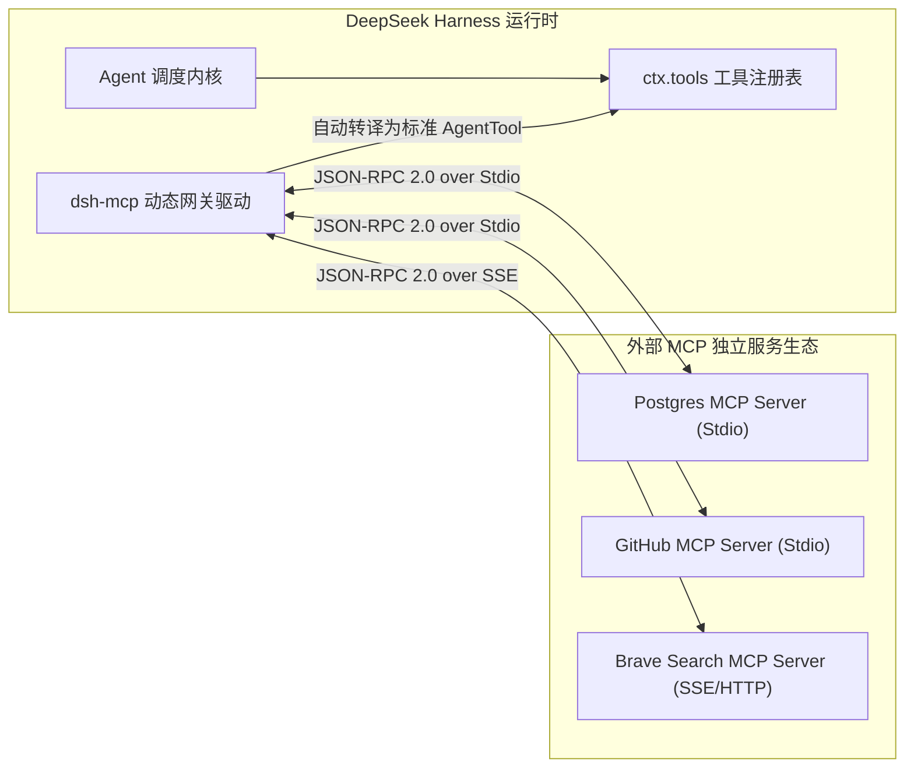
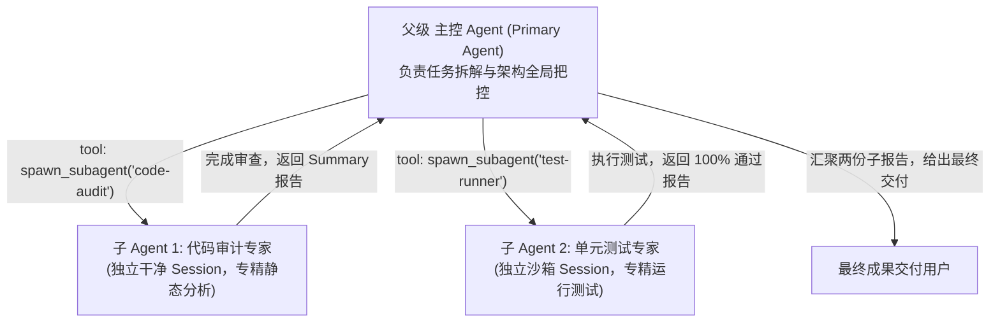

**TL;DR：** 经过前五篇文章对 DeepSeek Harness（`dsh`）微内核架构、状态机调度、事件日志持久化、能力缝隙沙箱与流式压缩机制的全面拆解，本文进入最核心的工程实战环节。我们将手把手编写一个工业级 `dsh` 自定义插件，演示如何基于 Cordis 注册具备运行时校验的强类型工具、管理路由与生命周期监听；随后，我们将深入剖析 `dsh` 如何通过 Model Context Protocol（MCP）桥接外部丰富的生态工具；最后，我们将揭秘 `packages/subagent` 子智能体框架的**深度预算（Delegation Depth）**与父子拓扑隔离机制。

---

## 一、手把手：开发一个生产级 DSH 自定义插件

在 `dsh` 的“一切皆插件”世界中，扩展功能不需要继承任何沉重的抽象基类，只需要导出一个标准的 `apply` 函数。

### 1.1 需求：编写一个“Git 智能分支分析与冲突探测”插件

假设我们要为一个自动化研发 Agent 编写一个 Git 分析插件：
1. 声明可视化配置项（主分支名、是否自动 fetch）；
2. 注册大模型可调用的 `analyze_git_conflicts` 工具，带有精确的 TypeBox JSON Schema；
3. 注册内部管理 Web 路由供前端控制台探测状态；
4. 监听 `agent/turn-stopping` 事件记录审计日志。

```ts
// packages/plugins/git-analyzer/src/index.ts
import { Context, Schema } from 'cordis';
import { Type, type Static } from '@sinclair/typebox';

// 1. 定义插件配置契约 (供 cordis.yml 解析与 Web UI 可视化配置)
export interface Config {
  defaultBranch?: string;
  enableAutoFetch?: boolean;
  timeoutMs?: number;
}

export const Config: Schema<Config> = Schema.object({
  defaultBranch: Schema.string().default('main').description('默认基准主分支名称'),
  enableAutoFetch: Schema.boolean().default(true).description('是否在分析前自动 fetch 远程分支'),
  timeoutMs: Schema.number().default(10000).description('Git 命令执行超时时间 (毫秒)'),
});

// 2. 工具输入参数 Schema (双向契约: 既导出 JSONSchema 给大模型，又导出静态类型给 TS)
const AnalyzeGitConflictsParams = Type.Object({
  targetBranch: Type.Optional(Type.String({ description: '目标对比分支，默认使用主分支' })),
  includeUntracked: Type.Optional(Type.Boolean({ description: '是否检测未跟踪的新增文件' })),
});

type AnalyzeGitConflictsInput = Static<typeof AnalyzeGitConflictsParams>;

// 3. 插件实现入口
export function apply(ctx: Context, config: Config) {
  // A. 向系统注册具备强类型的 Tool
  ctx.tools.registerTool({
    name: 'analyze_git_conflicts',
    description: '分析当前工作区与目标分支之间的文件修改差异与潜在合并冲突',
    parameters: AnalyzeGitConflictsParams,
    // 运行时执行器：面向 ctx.subprocess Seam 编程，天然支持沙箱与远端环境
    execute: async (args: AnalyzeGitConflictsInput, toolCtx) => {
      const branch = args.targetBranch || config.defaultBranch || 'main';

      if (config.enableAutoFetch) {
        await ctx.subprocess.run('git', ['fetch', 'origin', branch], {
          cwd: toolCtx.workspacePath,
          timeout: config.timeoutMs,
        });
      }

      const diffResult = await ctx.subprocess.run(
        'git',
        ['diff', '--name-status', `origin/${branch}...HEAD`],
        {
          cwd: toolCtx.workspacePath,
          timeout: config.timeoutMs,
        }
      );

      return {
        baseBranch: branch,
        hasConflicts: diffResult.exitCode !== 0,
        changedFiles: diffResult.stdout.trim().split('\n').filter(Boolean),
      };
    },
  });

  // B. 注册 Web API 路由 (若当前 Profile 启用了 Web Server)
  if (ctx.web) {
    ctx.web.get('/api/git-analyzer/status', async (req, reply) => {
      return {
        enabled: true,
        defaultBranch: config.defaultBranch,
        autoFetch: config.enableAutoFetch,
      };
    });
  }

  // C. 监听生命周期事件实施审计
  ctx.on('agent/turn-stopping', (agent) => {
    ctx.logger.info(`[GitAnalyzer] Session ${agent.sessionId} finished turn.`);
  });
}
```

### 1.2 为什么这段代码具备顶级的工程质量？

- **零侵入与强内聚**：所有的功能都在 `apply` 函数内闭环声明；
- **面向能力缝隙（Seam）编程**：命令执行调用 `ctx.subprocess.run`，无论底层是本地 macOS 还是 Linux Bubblewrap 沙箱，插件逻辑完全一致；
- **自动回滚（Reversible Effects）**：当用户在配置中停用该插件时，Cordis 会在纳秒级时间内自动注销该工具、移除 `/api/git-analyzer/status` 路由并解绑事件监听器，不留丝毫内存残留。

---

## 二、作用域隔离：全局 Context vs Agent 局部 Context

在多智能体系统或多租户场景下，不同会话往往需要差异化的能力集（例如：普通问答 Agent 只能使用只读搜索工具，而运维 Agent 拥有完整终端执行权限）。

`dsh` 利用 Cordis 的分层上下文提供了优雅的**作用域隔离（Scoped Context）**机制：

```ts
// 1. 全局 Context 注册：全平台所有 Session 共享
ctx.tools.registerTool(globalDocumentationSearchTool);

// 2. 局部 Agent 作用域注册：仅绑定在特定会话实例上
agent.scope.tools.registerTool(privateSessionScratchpadTool);
```

当特定 Agent 会话销毁时，`agent.scope` 会自动执行局部回滚，私有工具从内存中销毁，而全局工具保持稳定运行。

---

## 三、深度融合 Model Context Protocol (MCP)

Model Context Protocol（MCP）是由 Anthropic 主导的开源标准，旨在解决 AI 应用与外部数据源（如 GitHub, PostgreSQL, Linear, Brave Search）之间的标准化通信问题。

`dsh` 在 `packages/mcp` 中内置了原生的 MCP 网关驱动：



### 3.1 声明式挂载 MCP 外部服务

只需在 `cordis.yml` 中声明配置：

```yaml
- id: mcp-postgres
  package: "@deepseek-ai/dsh-mcp"
  config:
    transport: "stdio"
    command: "npx"
    args: ["-y", "@modelcontextprotocol/server-postgres", "postgresql://localhost:5432/mydb"]
    timeoutMs: 15000
```

`dsh-mcp` 插件会自动完成三项核心动作：
1. **自动握手与能力发现**：启动子进程并发送 `initialize` 与 `tools/list` JSON-RPC 请求；
2. **Schema 动态转译**：将 MCP Server 返回的远程 JSON Schema 动态包装为 `dsh` 标准的 `AgentTool` 契约，自动注入到大模型的 System Prompt 中；
3. **安全熔断与异常代理**：在模型调用该工具时，自动施加超时保护与沙箱隔离，若远程 MCP 崩溃，自动构造友好错误回传给大模型。

---

## 四、多 Agent 协作体系：Subagent 拓扑与递归深度防线

单体大 Agent 面对庞大任务时极易发生注意力分散和上下文污染。`dsh` 在 `packages/subagent` 中实现了原生的 **Subagent（子智能体）** 调度框架。



### 4.1 Subagent 的三大防御机制

1. **上下文物理隔离**：子 Agent 在其独立的 Session 中可能产生了 50 轮细碎的调试报错，这些海量噪音被完全封印在子会话内，仅将提炼出的最终纯净结果回传给父 Agent；
2. **递归深度预算 (Delegation Depth Budget)**：为了防止 Agent 编写代码时意外进入“子 Agent 派生孙 Agent，孙 Agent 无限递归派生”的死循环，`dsh` 在 SessionHeader 中持久化了 `delegationDepth`，一旦深度超过阈值（如最大深度 3），直接硬编码拦截派生请求；
3. **生命周期级联销毁**：父 Agent 收到取消信号或异常退出时，其派生出的所有子 Agent 进程和网络流会被立即触发级联关闭，杜绝后台僵尸进程。

---

## 五、全系列总结：现代 Agent 架构的五大黄金定律

```text
 ┏━━━━━━━━━━━━━━━━━━━━━━━━━━━━━━━━━━━━━━━━━━━━━━━━━━━━━━━━━━━━━━━━━━━━━━━━━━━━━┓
 ┃                   DeepSeek Harness 架构方法论五大黄金准则                    ┃
 ┣━━━━━━━━━━━━━━━━━━━━━━━━━━━━━━━━━━━━━━━━━━━━━━━━━━━━━━━━━━━━━━━━━━━━━━━━━━━━━┫
 ┃  1. 微内核化 (Microkernel)     : 剥离特权核心，一切皆插件，副作用必须可逆回滚 ┃
 ┃  2. 事件溯源 (Event Sourcing)  : 放弃易变快照，模型所见必留痕，纯函数投影上下文 ┃
 ┃  3. 能力缝隙 (Capability Seam) : 接口/提供者/调用端三层解耦，轻松平移远程沙箱 ┃
 ┃  4. 缓存友好 (Cache-First)     : 静态前缀对齐，最大化利用服务端 KV Cache 降低成本┃
 ┃  5. 纵深防御 (Deep Defense)    : Schema 校验 + HITL 人机审批 + 内核沙箱物理隔离 ┃
 ┗━━━━━━━━━━━━━━━━━━━━━━━━━━━━━━━━━━━━━━━━━━━━━━━━━━━━━━━━━━━━━━━━━━━━━━━━━━━━━┛
```

DeepSeek Harness 为开源社区树立了工业级 Agent Harness 的全新工程标杆。理解其背后的微内核哲学、状态机调度与安全隔离思想，将为我们构建高稳定、高扩展、可进化的自主智能体平台提供最坚实的架构基石。

---

## 六、参考资料与延伸阅读

1. [Anthropic Model Context Protocol (MCP) 规范文档](https://modelcontextprotocol.io/)
2. [DeepSeek Harness 完整开源代码库](https://github.com/deepseek-ai/deepseek-harness)
3. [TypeBox 官方文档与 TypeScript 静态类型推导](https://github.com/sinclairzx81/typebox)
