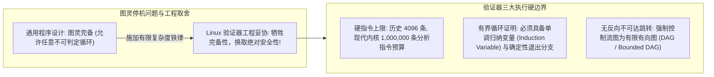
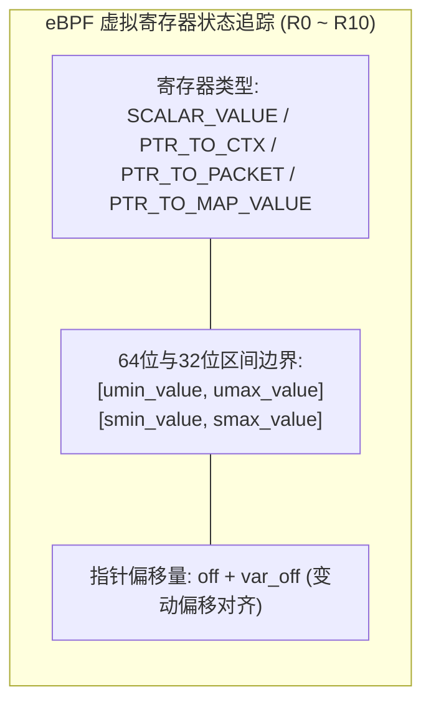
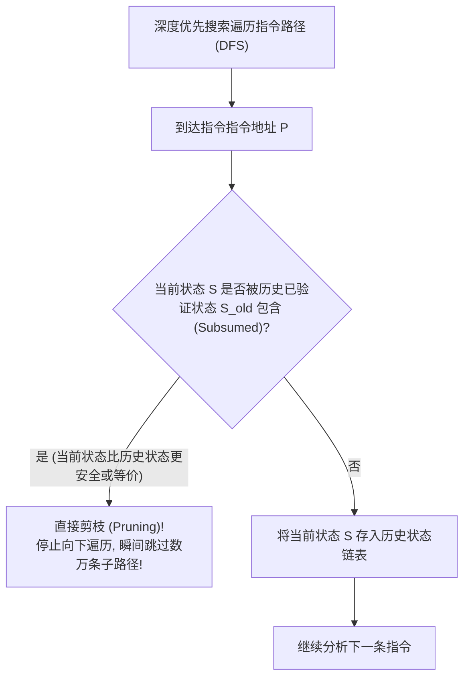
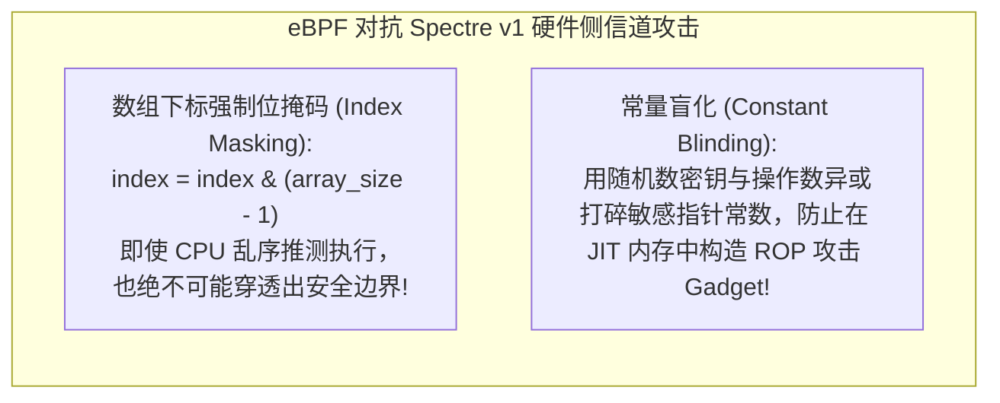

**TL;DR：** 在 Linux 操作系统发展的前三十年里，“向内核态注入自定义代码”是一件极其凶险的操作：编写传统内核模块（LKM, `.ko`）时，只要出现一个空指针解引用（NULL Pointer Dereference）、一次数组越界访存、或一个无意中写出的死循环，就会瞬间引爆 **Kernel Panic（内核崩溃）**，导致整台物理服务器宕机重启。然而，**eBPF（Extended Berkeley Packet Filter）** 彻底终结了这一噩梦——它允许开发者在无需重新编译内核或重启机器的前提下，在内核态安全执行沙箱化程序。这份“绝对不宕机”的绝对底气，完全来自于 Linux 内核源码 `kernel/bpf/verifier.c` 中长达两万行的静态形式化分析守护神——**eBPF 验证器（Verifier）**。验证器在字节码真正加载执行前，对有向控制流图进行穷尽遍历：它通过**有界循环归纳分析（Bounded Loops）**规避图灵停机问题；利用**抽象解释（Abstract Interpretation）与区间代数（Interval Arithmetic）**严格追踪 11 个虚拟寄存器的值域边界；借助**状态剪枝（State Pruning）与寄存器存活性分析（Liveness Analysis）**粉碎指数级路径爆炸；并注入防范 **Spectre 幽灵推测执行漏洞** 的常量盲化（Constant Blinding）。本文从静态程序分析第一性原理出发，系统解构 Linux 内核中最严密的逻辑安全防线。

---

## 一、 停机问题的幽灵：验证器如何跳出不可判定陷阱？

计算机科学经典理论告诉我们：**图灵停机问题（Halting Problem）证明了不存在一个通用算法，能判定任意一段代码是否会在有限步内停止。**

如果停机问题在数学上不可解，Linux 内核验证器凭什么向全世界保证“注入的代码绝对不会死锁内核”？



### 1. 牺牲完备性，换取确定性安全

验证器的设计原则非常冷酷：**“宁可错杀一万，绝不放过一个！”**
- 验证器并不试图解决所有程序的停机问题；
- 它只接受那些**能被形式化数学归纳法证明为有界（Bounded）的代码**；
- 如果一段合法的代码因为逻辑过于复杂导致验证器无法在预算内证明其安全性，验证器会直接返回 `-EACCES` 拒绝加载！

### 2. 指令复杂度预算（Complexity Limit）

在现代 Linux 内核（5.2+）中，验证器设置了严格的硬性上限：
- 单个 eBPF 程序分析过程中的**最大探索状态步数限制为 1,000,000 条指令（`BPF_COMPLEXITY_LIMIT_INSNS`）**；
- 一旦分支过多导致探索步数耗尽，验证器直接抛出 `program too large, processed 1000001 insns` 异常中断加载。

---

## 二、 抽象解释与寄存器区间算术（Interval Arithmetic）

验证器在静态检查代码时，并不知道真实的运行时数据是什么。它采用编译器领域著名的**抽象解释（Abstract Interpretation）**技术：为每个虚拟寄存器维护一个“抽象状态（Abstract State）”。



### 1. 区间代数（Interval Arithmetic）的步步推导

假设我们编写了如下代码：

```c
// 伪代码：从网络包中根据偏移读取数据
unsigned int offset = ctx->data_offset;
if (offset < 10) {
    // 此时在 True 分支内，验证器更新寄存器值域！
    char *ptr = ctx->data + offset;
    char val = *ptr; // 验证器检查：ptr 是否越界？
}
```

验证器的抽象推导过程如下：
1. **初始状态**：`offset` 刚读出时，被标记为 `SCALAR_VALUE`，其值域为全集：
   $$u_{\min} = 0, \quad u_{\max} = 0xFFFFFFFF$$
2. **分支判断剪枝**：遇到 `BPF_JMP` 指令 `if (offset < 10)`：
   - 在 **True 分支** 中，验证器将 `offset` 对应的寄存器上界硬性收敛为：
     $$u_{\min} = 0, \quad u_{\max} = 9$$
   - 在 **False 分支** 中，下界收敛为 $u_{\min} = 10$；
3. **指针加法推导**：当执行 `ptr = data + offset` 时：
   - `ptr` 寄存器类型变为 `PTR_TO_PACKET`；
   - 其可变偏移范围被严格约束在 $[0, 9]$ 字节之间；
4. **访存越界安全断言**：如果代码没有前置校验 `ptr + 1 <= data_end`，验证器发现 $ptr + 1$ 可能会超出网络报文实际长度，**立即掐断编译并拒绝加载！**

---

## 三、 状态爆炸与状态剪枝（State Pruning）

当一个 eBPF 程序包含大量的条件判断（例如解析复杂的网络协议头）时，控制流图的分支会呈指数级爆炸：$N$ 个独立的 `if-else` 分支将产生 $2^N$ 条可能的执行路径！

如果 $N = 25$，$2^{25} \approx 33,554,432$ 条路径，远远超出 100 万步分析预算。验证器如何生存？答案是 **状态剪枝（State Pruning）**。



### 1. 状态包含（Subsumption）的数学定义

如果在指令位置 $P$，当前状态 $S$ 的所有寄存器范围都是历史已验证通过状态 $S_{\text{old}}$ 的**子集（Subset）**：

$$S.\text{reg}[i].u_{\min} \ge S_{\text{old}}.\text{reg}[i].u_{\min} \quad \land \quad S.\text{reg}[i].u_{\max} \le S_{\text{old}}.\text{reg}[i].u_{\max}$$

由于更严格的取值范围必然更安全，既然在较宽范围的 $S_{\text{old}}$ 下后续代码都被证明不会崩溃，那么在更狭窄更安全的 $S$ 下**后续代码必然绝对安全**！
**验证器直接截断当前遍历分支，实现对数级的惊人剪枝加速！**

### 2. 寄存器存活性分析（Liveness Analysis）

在真实的机器状态中，完全一模一样的子集极难完美命中。为此，Linux 内核引入了 **寄存器存活性追踪（Register Liveness）**：
- 验证器从程序退出点反向标记每个寄存器：该寄存器在后续指令中**是否会被读取**？
- 如果寄存器 $R_3$ 在后续路径中根本没有被读取、而是在下一句就被直接覆写（`REG_LIVE_NONE`）；
- 那么在做状态等价对比时，**完全忽略 $R_3$ 的值域差异！**
这一优化让状态剪枝的命中率提高了两个数量级，使得拥有数十个复杂分支的大型 eBPF 程序（如 Cilium 复杂的 XDP 路由包）能够在一秒内快速通过验证。

---

## 四、 幽灵（Spectre v1）推测执行漏洞的内核防御

2018 年曝光的 CPU 硬件漏洞 **Spectre v1（CVE-2017-5753）** 彻底动摇了软件沙箱的安全假设：
即使 eBPF 验证器证明了数组访问不会越界，现代 CPU 的**分支预测器（Branch Predictor）**在执行未决时依然会推测性越界加载（Speculative Load），并通过 CPU 缓存行状态把敏感的内核主存数据泄露出去！

为了在存在硬件设计缺陷的 CPU 上依然保证 100% 安全，eBPF 验证器在生成最终 JIT 汇编时强制注入两道硬防线：



---

## 五、 生产级 C++20 验证器区间算术与剪枝引擎仿真

以下代码用纯 C++20 实现了一个高保真的 eBPF 抽象验证器核心：包含 64 位无符号寄存器区间代数推导、条件分支状态派生、以及基于状态包含（Subsumption）的剪枝判定引擎：

```cpp
#include <iostream>
#include <vector>
#include <cstdint>
#include <iomanip>
#include <cassert>
#include <algorithm>

// 寄存器抽象类型枚举
enum class RegType : uint8_t {
    NOT_INIT,
    SCALAR_VALUE,
    PTR_TO_STACK,
    PTR_TO_MAP_VALUE
};

// 抽象寄存器状态：维护区间代数与存活性
struct AbstractRegister {
    RegType type = RegType::NOT_INIT;
    uint64_t umin = 0;
    uint64_t umax = UINT64_MAX;
    bool is_live = true; // 存活性标记

    // 判断当前寄存器状态是否为旧状态的更安全子集
    [[nodiscard]] bool is_subsumed_by(const AbstractRegister& old) const noexcept {
        if (!old.is_live) return true; // 若旧状态后续根本不读本寄存器，直接视为等价包含
        if (type != old.type) return false;
        if (type == RegType::SCALAR_VALUE) {
            // 当前范围必须严格收敛在旧范围内部
            return (umin >= old.umin) && (umax <= old.umax);
        }
        return true;
    }
};

// 整个虚拟机的抽象状态
struct VerifierState {
    AbstractRegister regs[11]; // R0 ~ R10

    [[nodiscard]] bool is_subsumed_by(const VerifierState& old) const noexcept {
        for (size_t i = 0; i < 11; ++i) {
            if (!regs[i].is_subsumed_by(old.regs[i])) {
                return false;
            }
        }
        return true;
    }
};

// 生产级 eBPF 验证器区间分析与剪枝仿真器
class EbpfVerifierSimulator {
public:
    EbpfVerifierSimulator() {
        // 初始化 R1 为输入参数，R10 为只读栈帧指针
        init_state_.regs[1].type = RegType::SCALAR_VALUE;
        init_state_.regs[1].umin = 0;
        init_state_.regs[1].umax = 1000;

        init_state_.regs[10].type = RegType::PTR_TO_STACK;
        init_state_.regs[10].umin = 0;
        init_state_.regs[10].umax = 512;
    }

    // 模拟针对条件跳转的区间收敛推导: if (R1 < 64)
    static void evaluate_branch_refinement(
        const AbstractRegister& in_reg,
        uint64_t imm_val,
        AbstractRegister& true_branch_reg,
        AbstractRegister& false_branch_reg
    ) {
        true_branch_reg = in_reg;
        false_branch_reg = in_reg;

        // True 分支: R1 < imm_val -> umax 收敛
        true_branch_reg.umax = std::min(in_reg.umax, imm_val - 1);

        // False 分支: R1 >= imm_val -> umin 收敛
        false_branch_reg.umin = std::max(in_reg.umin, imm_val);
    }

    // 状态剪枝算法演示
    static void test_state_pruning() {
        std::cout << "========== [eBPF 状态剪枝 (State Pruning) 算法仿真] ==========" << std::endl;

        VerifierState old_state;
        old_state.regs[1].type = RegType::SCALAR_VALUE;
        old_state.regs[1].umin = 10;
        old_state.regs[1].umax = 100;
        old_state.regs[2].is_live = false; // R2 标记为非存活 (Dead)

        VerifierState current_state;
        current_state.regs[1].type = RegType::SCALAR_VALUE;
        current_state.regs[1].umin = 20; // 范围更收敛 (20 >= 10)
        current_state.regs[1].umax = 80;  // 范围更收敛 (80 <= 100)
        current_state.regs[2].umin = 9999; // 虽然 R2 差异极大，但因非存活被跳过

        bool can_prune = current_state.is_subsumed_by(old_state);

        std::cout << "历史已验证状态 S_old: R1 ∈ [" << old_state.regs[1].umin << ", " << old_state.regs[1].umax << "]" << std::endl;
        std::cout << "当前待检查状态 S_cur: R1 ∈ [" << current_state.regs[1].umin << ", " << current_state.regs[1].umax << "]" << std::endl;
        std::cout << "判定结果: " << (can_prune ? "✅ 成功剪枝 (Subsumed)! 立即终止后续路径遍历" : "❌ 无法剪枝") << std::endl;
        assert(can_prune);
    }

private:
    VerifierState init_state_;
};

int main() {
    std::cout << ">>> 启动 eBPF 验证器区间算术与状态剪枝形式化仿真 <<<" << std::endl;

    // 1. 验证区间代数收敛
    AbstractRegister r1{RegType::SCALAR_VALUE, 0, 1000, true};
    AbstractRegister r1_true, r1_false;

    EbpfVerifierSimulator::evaluate_branch_refinement(r1, 64, r1_true, r1_false);

    std::cout << "\n[1] 条件分支区间推导: if (R1 < 64)" << std::endl;
    std::cout << "  原始 R1 范围     : [" << r1.umin << ", " << r1.umax << "]" << std::endl;
    std::cout << "  True 分支 R1 范围 : [" << r1_true.umin << ", " << r1_true.umax << "] (上界收敛)" << std::endl;
    std::cout << "  False分支 R1 范围 : [" << r1_false.umin << ", " << r1_false.umax << "] (下界收敛)" << std::endl;

    assert(r1_true.umin == 0 && r1_true.umax == 63);
    assert(r1_false.umin == 64 && r1_false.umax == 1000);

    // 2. 验证状态剪枝
    std::cout << std::endl;
    EbpfVerifierSimulator::test_state_pruning();

    std::cout << "\n>>> 形式化仿真通过：eBPF 验证器数学逻辑在编译期彻底阻断了非法内存越界！ <<<" << std::endl;

    return 0;
}
```

---

## 六、 总结与下篇预告

eBPF 验证器是 Linux 内核有史以来最精密的工程奇迹：
- 它用**区间代数与抽象解释**，在编译期精准预测了每一行字节码可能触碰的内存边界；
- 依托**状态剪枝与存活性分析**，将原本无法承受的指数级路径爆炸化解在微秒尺度；
- 结合**硬件推测执行盲化**，在物理缺陷层出不穷的现代 CPU 上筑起了不可穿透的安全沙箱。

然而，仅仅让程序在内核中安全运转还不够——内核态与用户态之间如何实现高频、无锁、低延迟的数据交互？如果每秒产生上百万个监控事件，传统的系统调用和用户态拷贝如何被彻底终结？

下一篇，我们将深入内核内部的通信数据结构，深度解构 **《BPF Maps 内存与无锁并发：Hash、Array、Per-CPU 与 RingBuffer 极速状态共享》**！
