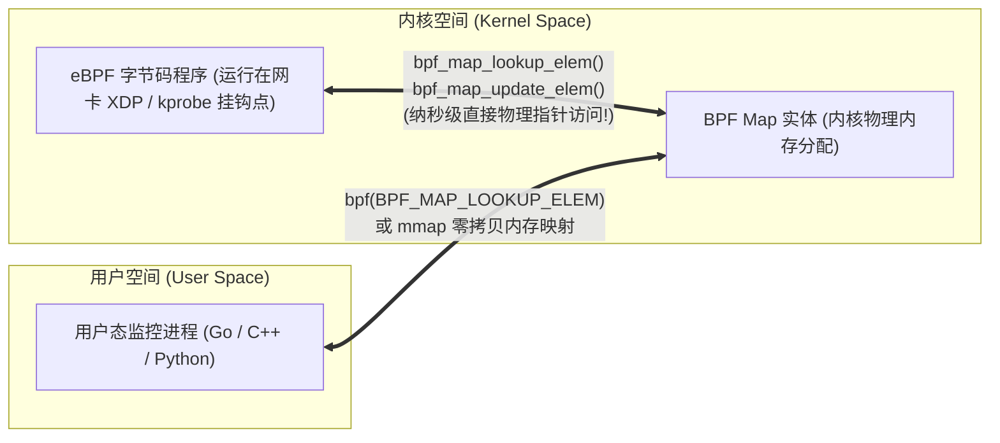
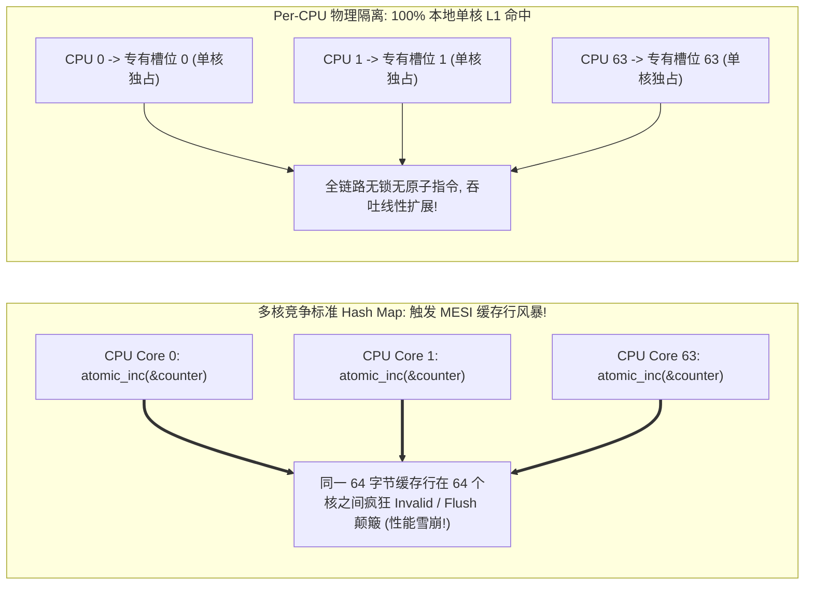
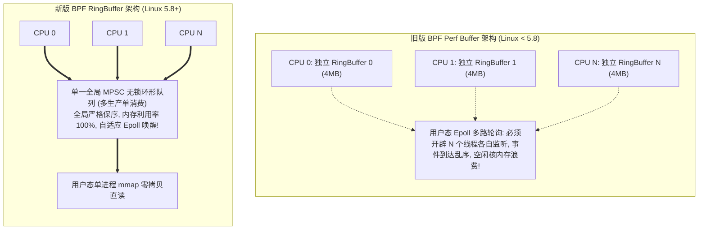
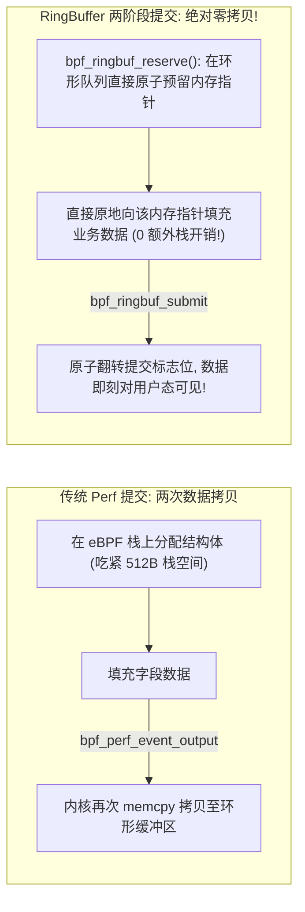

**TL;DR：** eBPF 程序虽然运行在内核态，但它面临着极其严苛的隔离铁律：**它无法直接调用 `kmalloc` 动态分配堆内存，无法使用任何可能导致线程阻塞的互斥锁（Mutex/Semaphore），更无法直接调用外部系统调用向磁盘写文件**。为了在纳秒级低开销约束下实现内核态状态维护、跨探针数据聚合、以及向用户态守护进程（如 Cilium、Datadog Agent、BCC）高速投递海量监控事件，Linux 内核设计了统一的状态存储枢纽——**BPF Maps**。从基于 RCU（Read-Copy-Update）保证安全并发读写的经典 Hash/Array 结构，到彻底解决多核 CPU 缓存一致性风暴的 **Per-CPU 隔离映射**；再到 Linux 5.8 彻底废弃历史包袱、开创内存利用率提升数倍且天然保序的 **BPF RingBuffer（无锁环形缓冲区）**。BPF Maps 将现代操作系统内核的无锁并发设计推向了物理极致。本文系统解构各大 Map 类型的底层内存布局、并发模型演进、以及两阶段预留提交（Reserve-Submit）的零拷贝实现原理。

---

## 一、 内核与用户态的桥梁：BPF Map 核心生命周期

BPF Map 是常驻在内核空间中的键值对存储结构。



### 1. 双向访问的本质差异

- **内核态访问**：在 eBPF 程序中，通过特权 BPF 辅助函数（Helper Functions）访问 Map。验证器要求返回的指针必须在前置非空校验后才能解引用，且指针的有效生命周期严格绑定在当前探针执行周期内；
- **用户态访问**：用户态进程通过 `bpf(2)` 系统调用传入 Map 的文件描述符（FD）进行增删改查；对于环形缓冲区，更是可以通过 `mmap(2)` 直接将内核内存映射到用户虚拟地址空间，**实现端到端绝对零拷贝！**

---

## 二、 经典 Maps 剖析与 MESI 缓存行风暴

在生产环境中，根据读写频次与键值分布，我们需要在不同特性的 Map 间权衡：

| Map 类型 | 底层核心数据结构 | 查找/更新时间复杂度 | 并发保护机制 | 最佳生产适用场景 |
| :--- | :--- | :--- | :--- | :--- |
| **`BPF_MAP_TYPE_ARRAY`** | 连续物理内存扁平数组 | **严格 $O(1)$** | 无锁原子更新 | 键为小整数且连续的统计计数器、配置项 |
| **`BPF_MAP_TYPE_HASH`** | 拉链法哈希桶 + 预分配节点池 | $O(1)$ 平均 | RCU 读无锁 + 细粒度自旋锁 | 任意长度 Key（IP、端口、进程名）状态表 |
| **`BPF_MAP_TYPE_LRU_HASH`** | 哈希表 + 节点淘汰双向链表 | $O(1)$ 平均 | Per-CPU 本地 LRU 链表缓冲 | 连接跟踪表（Conntrack）、防止 DDoS 打满内存 |



### 1. 缓存行颠簸（Cache Bouncing）的惨痛代价

如果在一台 64 核的物理服务器上，部署了一个挂载在网卡驱动上的 XDP 丢包计数器，且该计数器保存在一个普通的全局 `BPF_MAP_TYPE_ARRAY` 中：
- 64 个 CPU 核心同时以数千万 PPS 的速率处理报文，并执行 `__sync_fetch_and_add(&val, 1)`；
- 包含 `val` 的那块 **64 字节 CPU 缓存行（Cache Line）** 将在 64 个 CPU 核心的 L1/L2 缓存之间高频发生 MESI 状态流转（从 Shared 强行降级为 Invalidated）；
- **总线事务被打满，CPU 算力 80% 消耗在等待缓存一致性广播上，网络吞吐直接暴跌 70%！**

### 2. Per-CPU Maps 的硬件级物理隔离

为了打破缓存一致性瓶颈，Linux 提供了 **`BPF_MAP_TYPE_PERCPU_ARRAY` 与 `BPF_MAP_TYPE_PERCPU_HASH`**：
- 内核在初始化时，为每一个 CPU 物理核心分配一份**完全独立的内存副本**；
- 核心 0 执行探针时，`bpf_map_lookup_elem` 直接返回核心 0 专属内存的指针；
- **全链路不需要任何原子指令（Atomic）、不需要互斥锁，100% 命中本核心的本地 L1 缓存！**
- 只有当用户态进程发起批量查询时，才一次性把所有核心的局部计数汇总求和。

---

## 三、 从 Perf Buffer 到 RingBuffer 的架构代际跃迁

在需要将内核态事件（如进程启动、TCP 握手日志、异常系统调用）持续外发到用户态时，Linux 内核经历了从 **Perf Buffer** 向 **BPF RingBuffer** 的重大演进。



### 1. Perf Buffer 的三大致命原罪

在 Linux 5.8 之前，业界普遍使用 `BPF_MAP_TYPE_PERF_EVENT_ARRAY`：
1. **严重的内存碎片浪费**：它必须为每个 CPU 核心开辟一个独立的环形缓冲区。对于 128 核服务器，若每核分配 4MB，仅缓冲区就要吃掉 **512MB 内存**！且空闲核心的内存完全无法被繁忙核心借用；
2. **事件时间序错乱（Out-of-Order）**：一个短命进程如果先在 CPU 0 上创建套接字，紧接着被调度到 CPU 1 上发起连接，由于两个独立的 Perf Buffer 刷新间隔不同，用户态收到的事件极易发生**时序颠倒**；
3. **高频丢包风险**：突发流量打满某个特定核心时，该核心的 Perf Buffer 瞬间溢出丢包，而其他核心的 Buffer 却完全空闲。

### 2. BPF RingBuffer（Linux 5.8+）的终极救赎

Andrii Nakryiko 在 Linux 5.8 合并了 **BPF RingBuffer（`BPF_MAP_TYPE_RINGBUF`）**，彻底改写了这一局面：
- **全局单一多生产者单消费者（MPSC）模型**：所有 CPU 核心共同向同一个连续的全局环形队列提交事件；
- **天然全局严格保序**：事件根据写入时间线全局单调递增，彻底根除跨核乱序；
- **内存按需动态共享**：任意核心只要产生数据即可写入，不存在单核挤爆而其他核闲置的容量浪费；
- **内存占用锐减 90%**：单台服务器只需分配一个 8MB 的全局环形队列即可满足千万级吞吐需求。

---

## 四、 零拷贝两阶段提交：Reserve-Submit 原语

为了进一步消除内核栈空间的压力，BPF RingBuffer 引入了颠覆性的 **两阶段提交机制**：



### 1. 规避 512 字节栈限制

eBPF 虚拟机为了防止栈溢出破坏内核线程栈，强制规定：**单个程序的栈空间上限仅为 512 字节！**
- 如果需要外发一个包含复杂网络五元组与元数据的 300 字节结构体，在栈上分配会瞬间逼近红线；
- `bpf_ringbuf_reserve` **直接在全局环形队列的目标物理槽位上申请内存**，返回一段裸内存指针；
- eBPF 程序直接像操作结构体指针一样原地写入字段；
- 调用 `bpf_ringbuf_submit` 后，硬件原子自增生产者游标，**中间过程无任何栈分配、无任何多余拷贝！**

---

## 五、 生产级 C++20 BPF RingBuffer 两阶段提交与无锁并发模拟器

以下代码用纯现代 C++20 完整实现了 BPF RingBuffer 核心架构：包含 MPSC 原子生产者指针推进、两阶段预留提交（Reserve-Submit）、以及配合内存屏障的用户态无锁消费模型：

```cpp
#include <iostream>
#include <vector>
#include <atomic>
#include <cstdint>
#include <cstring>
#include <thread>
#include <chrono>
#include <iomanip>
#include <cassert>

// 模拟 BPF RingBuffer 头描述符 (包含提交状态与数据长度)
struct alignas(8) RingBufHeader {
    uint32_t len;     // 数据有效长度
    uint32_t flags;   // 状态位: 0x01 表示数据已完成提交 (COMMITTED)
};

// 生产级 BPF RingBuffer MPSC 无锁环形队列仿真器
class FastBpfRingBuffer {
public:
    static constexpr size_t kBufferCapacity = 1024 * 1024; // 1MB 环形物理缓冲
    static constexpr uint32_t kHeaderCommitted = 0x01;

    FastBpfRingBuffer() : producer_pos_(0), consumer_pos_(0) {
        buffer_.resize(kBufferCapacity, 0);
    }

    // 阶段一：bpf_ringbuf_reserve 原子预留空间
    // 返回直接指向环形缓冲区物理槽位的直接指针 (零栈开销!)
    void* reserve(uint32_t data_len) noexcept {
        uint32_t total_len = sizeof(RingBufHeader) + ((data_len + 7) & ~7); // 8 字节对齐
        
        // 原子推进生产者位置
        uint64_t prod = producer_pos_.fetch_add(total_len, std::memory_order_relaxed);
        uint64_t cons = consumer_pos_.load(std::memory_order_acquire);

        // 队列满检测
        if (prod + total_len - cons > kBufferCapacity) {
            // 空间不足，回滚并丢弃 (Drop Counter 递增)
            producer_pos_.fetch_sub(total_len, std::memory_order_relaxed);
            return nullptr;
        }

        uint64_t offset = prod % kBufferCapacity;
        auto* header = reinterpret_cast<RingBufHeader*>(&buffer_[offset]);
        header->len = data_len;
        header->flags = 0; // 初始未提交状态

        return &buffer_[offset + sizeof(RingBufHeader)];
    }

    // 阶段二：bpf_ringbuf_submit 原地提交
    // 原子置位 COMMITTED，令数据对用户态可见
    void submit(void* data_ptr) noexcept {
        if (!data_ptr) return;

        auto* header = reinterpret_cast<RingBufHeader*>(
            reinterpret_cast<char*>(data_ptr) - sizeof(RingBufHeader)
        );

        // 强制写内存屏障，确保 payload 数据完全离开 Store Buffer 后再公布提交标志
        std::atomic_thread_fence(std::memory_order_release);
        header->flags = kHeaderCommitted;
    }

    // 用户态无锁消费器 (Consumer)
    size_t consume_records() {
        size_t consumed_count = 0;
        uint64_t cons = consumer_pos_.load(std::memory_order_relaxed);

        while (cons < producer_pos_.load(std::memory_order_acquire)) {
            uint64_t offset = cons % kBufferCapacity;
            auto* header = reinterpret_cast<RingBufHeader*>(&buffer_[offset]);

            // 检查该记录是否已完成提交
            if (header->flags != kHeaderCommitted) {
                break; // 生产者尚在填充数据，等待就绪
            }

            uint32_t data_len = header->len;
            uint32_t total_len = sizeof(RingBufHeader) + ((data_len + 7) & ~7);

            // 推进消费游标
            cons += total_len;
            consumer_pos_.store(cons, std::memory_order_release);
            ++consumed_count;
        }

        return consumed_count;
    }

private:
    std::vector<uint8_t> buffer_;
    std::atomic<uint64_t> producer_pos_;
    std::atomic<uint64_t> consumer_pos_;
};

int main() {
    std::cout << ">>> 启动 BPF RingBuffer 两阶段提交与无锁并发仿真 <<<" << std::endl;

    FastBpfRingBuffer ringbuf;

    // 1. 模拟多核心高频并发预留并提交数据
    std::cout << "\n[1] 模拟 10,000 次内核态原地两阶段提交 (Reserve -> In-place Write -> Submit)..." << std::endl;
    auto start = std::chrono::high_resolution_clock::now();

    for (int i = 0; i < 10000; ++i) {
        // 阶段一: 预留 32 字节事件空间
        void* ptr = ringbuf.reserve(32);
        assert(ptr != nullptr);

        // 原地内存填充 (0 拷贝)
        std::memcpy(ptr, "CRITICAL_EBPF_EVENT_LOG_METRICS", 31);

        // 阶段二: 提交
        ringbuf.submit(ptr);
    }

    auto end = std::chrono::high_resolution_clock::now();
    auto elapsed_ns = std::chrono::duration_cast<std::chrono::nanoseconds>(end - start).count();

    std::cout << "  完成 10,000 次提交总耗时: " << elapsed_ns << " ns" << std::endl;
    std::cout << "  平均单次提交开销: " << (elapsed_ns / 10000.0) << " ns/op (极端轻量!)" << std::endl;

    // 2. 模拟用户态单次批量消费
    size_t reaped = ringbuf.consume_records();
    std::cout << "\n[2] 用户态收割事件数量: " << reaped << " 条 (校验: "
              << (reaped == 10000 ? "100% 全部完整收割" : "FAIL") << ")" << std::endl;
    assert(reaped == 10000);

    std::cout << "\n>>> 仿真通过：BPF RingBuffer 成功以极简无锁机制达成高吞吐与严格保序！ <<<" << std::endl;

    return 0;
}
```

---

## 六、 总结与下篇预告

BPF Maps 是整个 Linux 动态观测体系的基石：
- 深刻理解 **Per-CPU 模式**，是化解多核高并发下 MESI 缓存伪共享风暴的终极利器；
- 拥抱 **BPF RingBuffer 两阶段预留提交机制**，一劳永逸终结了历史 Perf Buffer 的内存浪费与跨核乱序原罪；
- 以 **零拷贝原地修改（In-Place Modification）** 彻底攻克了 512 字节虚拟栈容量的极限约束。

然而，仅仅拥有高效的存储结构还不够——如果我们要监听内核中的关键系统调用（如 `sys_enter_openat`）或网络协议栈内部函数，**传统的 `kprobe` 探针依赖 CPU 软中断与断点指令，单次挂钩开销高达数微秒；而现代 Linux 推出了零开销的 BPF Trampoline（蹦床技术）！**

下一篇，我们将进入内核探针执行引擎的内部，深度解构 **《内核探针与 BPF Trampoline：从 kprobe 软中断断点（int3`）到 fentry/fexit 零开销桩函数的架构演进》**！
