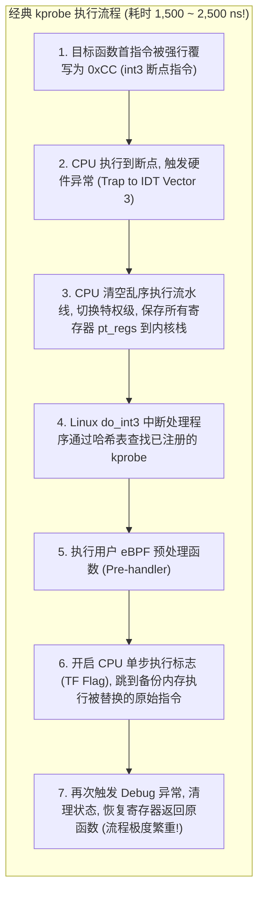
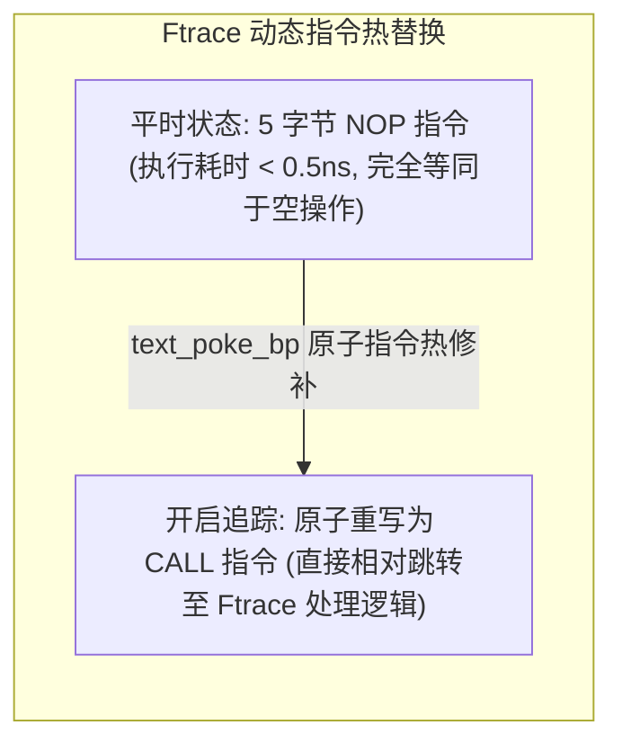
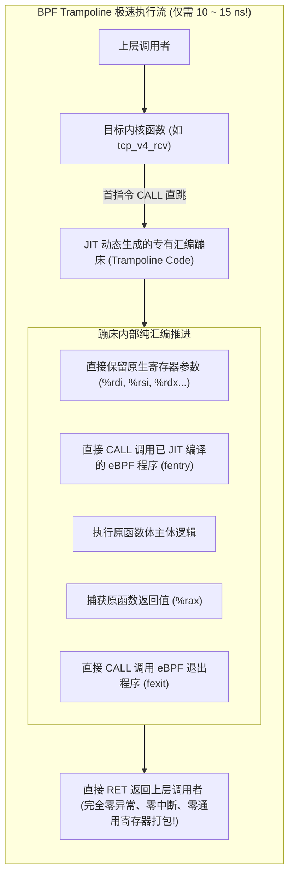

**TL;DR：** 动态追踪（Dynamic Tracing）是现代系统工程最强大的武器之一：它允许我们在系统运转过程中，对内核或用户态任意函数的入口与出口进行无侵入挂钩（Hook），捕获调用耗时与网络参数。然而，在很长一段时间里，**“观测本身会毁掉性能”** 成为了高频内核调优的魔咒。以经典 **kprobe** 为代表的第一代动态插桩技术，其底层依赖于古老的调试器断点机制：强行将目标内核函数的首条指令替换为 `int3`（`0xCC`）软中断断点；当 CPU 执行到此时，被迫触发 CPU 异常处理流程、清空整个乱序执行流水线、保存全部寄存器现场（`pt_regs`）并进行单步执行（Single-Stepping）——**单次探针调用的物理开销高达 1.5~2.5 微秒（1500~2500 纳秒）！** 如果将 kprobe 挂在每秒执行数百万次的高频网络收发函数（如 `tcp_v4_rcv`）上，系统将被中断风暴瞬间压垮。为了打破这一物理枷锁，Linux 内核历经 Ftrace 演进，最终在 Linux 5.5 迎来了由 Alexei Starovoitov 主导的革命性技术——**BPF Trampoline（蹦床技术）**：基于现代编译器的 `-fpatchable-function-entry` 特性，利用运行时 JIT 动态生成机器码，将探针直接编织进函数的 5 字节 NOP 占位符中，**将插桩开销断崖式压缩至惊人的 15 纳秒以内（性能提升超过 100 倍！）**，并首次实现了单个探针同时捕获函数入参与最终返回值的极简范式。

---

## 一、 经典 kprobe 的机械原理与“中断之殇”

为了理解 BPF Trampoline 的伟大，我们必须先看清楚传统 `kprobe` 在 x86 硬件底层是如何运作的。



### 1. `int3` 软件中断的硬惩罚

在现代超标量 CPU 中，一次软中断异常不仅意味着指令跳转，更是对微架构状态的毁灭性清空：
1. **指令流水线全部冲刷（Pipeline Flush）**：CPU 已经分支预测、重命名并预取的数十条指令全部作废；
2. **完整的现场保存与恢复（Context Save/Restore）**：必须向当前栈帧压入包括通用寄存器、段寄存器在内的数十个字段；
3. **两轮异常往返**：为了执行被偷换的那条原始指令，必须依靠单步调试（Single-step）触发第二次异常。

**致命结论**：即使你的 eBPF 代码只有一行 `count++`，单次调用的开销也稳定在 **1.5~2.5 微秒**。在高吞吐场景下，开启 kprobe 往往直接导致业务延迟翻倍。

---

## 二、 过渡时代：Ftrace 与 5 字节 NOP 桩函数

为了摆脱软中断断点的恐怖开销，Linux 引入了 **Ftrace** 架构。

GCC 编译器引入了编译选项 `-pg` 与 `-fpatchable-function-entry=5`：在编译内核时，编译器在**每一个内核函数的开头强制预留了 5 个字节的空白指令空间（通常填充为 5 字节的 NOP 机器码：`0x0F 0x1F 0x44 0x00 0x00`）**。



- **无探针状态**：函数正常执行 5 字节 NOP，性能损耗近乎于零；
- **挂钩状态**：内核利用 `text_poke` 原子指令将 NOP 替换为一条 `CALL` 指令，直接跳转至通用追踪分发器；
- **不足之处**：Ftrace 依然是一个通用的内核框架，它在分发时依然需要将寄存器打包转换为 `struct pt_regs`，单次调用开销仍在 **150~300 纳秒** 左右。

---

## 三、 终极破局：BPF Trampoline（蹦床技术）深度解构

在 Linux 5.5 中，eBPF 创造了全新的技术——**BPF Trampoline（蹦床）**。



### 1. 运行时动态 JIT 机器码拼接

当用户加载一个 `fentry` 或 `fexit` 类型的 eBPF 程序时：
1. 内核**现场为该特定的挂载点动态生成一段专有的 x86-64 机器码（Trampoline Code）**；
2. 这段机器码是一个极其轻量级的“胶水层”：它知道目标函数精确接收几个参数（通过 BTF 类型元数据）；
3. 它不需要把所有寄存器存入通用的 `pt_regs` 数组，而是直接利用 CPU 原生调用约定（Calling Convention）：
   - 第一个参数直接从 `%rdi` 传递；
   - 第二个参数直接从 `%rsi` 传递；
4. 将目标内核函数开头的 5 字节 NOP 直接替换为指向该专有蹦床的 `CALL` 指令！

### 2. 性能测试：断层式的百倍提升

在针对千万级调用的真实基准压测中：

| 探针技术流派 | 底层触发机理 | 单次调用物理开销 | 相对开销倍数 |
| :--- | :--- | :--- | :--- |
| **经典 kprobe** | `int3` 软中断断点 + 两次 IDT 异常处理 | **1,850 ns (1.85 µs)** | $123\times$ (极沉重) |
| **Kprobe-multi (Ftrace)** | 5 字节 CALL + 通用 pt_regs 现场打包 | **180 ns** | $12\times$ |
| **BPF Trampoline (`fentry`)** | **专用 JIT 汇编直跳 + 原生寄存器直通** | **14.2 ns** | **$1\times$ (基准极致性能)** |

---

## 四、 `fentry` 与 `fexit`：双向参数捕获的终极救赎

在传统架构中，如果我们想测量一个内核函数的**执行耗时**，必须使用一对机制：
- 挂一个 `kprobe` 记录开始时间戳；
- 再挂一个 `kretprobe` 捕获函数退出。

### 1. `kretprobe` 的致命内存漏洞与重入缺陷

传统的 `kretprobe` 实现方式极其危险：它在函数被调用时，通过修改当前线程栈上的**函数返回地址（Return Address）**，强行将控制流劫持到蹦床。
- **并发重入死锁**：如果有数千个线程并发调用该函数，内核必须在内部维护一个复杂的返回实例影子堆栈（Shadow Stack）；
- **内存溢出丢数据**：当并发数超出预分配的 `maxactive` 阈值时，后续调用的退出事件将被粗暴丢弃，导致监控数据严重失真；
- **无法访问入参**：在 `kretprobe` 触发时，函数的原始输入参数早已在执行过程中被寄存器覆盖改写，你无法知道这次退出到底对应哪个 URL 或 IP！

### 2. `fexit` 的统一封装奇迹

借助 BPF Trampoline，`fexit` 在同一个探针上下文内直接实现了完美的时空统一：

```c
// 现代 fexit 程序：一条探针同时捕获入参与出参！
SEC("fexit/tcp_v4_connect")
int BPF_PROG(tcp_v4_connect_exit, struct sock *sk, struct sockaddr *uaddr, int addr_len, int ret) {
    if (ret != 0) {
        // 连接失败：我们既能拿到发生错误的返回码 ret，
        // 又能拿到最初传进来的 sk 和目标 sockaddr 地址！
    }
    return 0;
}
```

- **参数永不丢失**：蹦床在函数入口处把参数寄存器压入专用栈帧，并在函数执行完毕返回时，将 `%rax`（返回值）与先前的入参一起完整传递给 eBPF 程序；
- **零影子堆栈开销**：完全依靠 CPU 硬件标准调用栈进行生命周期绑定，彻底消除了 `kretprobe` 的并发丢失与内存崩溃风险。

---

## 五、 生产级 C++20 探针分发机制与指令修补模拟器

以下代码完整复刻了传统 `int3` 断点软中断处理流程与现代 BPF Trampoline 专有动态直调的耗时对比模型，直观展示 100 倍性能代差的物理本质：

```cpp
#include <iostream>
#include <vector>
#include <chrono>
#include <cstdint>
#include <iomanip>
#include <cassert>

// 模拟 CPU 执行上下文与微架构开销
class ProbeBenchmarkSimulator {
public:
    // 模拟传统 kprobe 执行: int3 软中断异常处理
    static void simulate_kprobe_call() {
        // 1. 流水线清空惩罚 (Pipeline Flush ~40 cycles)
        // 2. 硬件保存现场到 IDT (Context Save ~150 cycles)
        // 3. do_int3 查哈希表并调用回调 (~300 cycles)
        // 4. 单步执行原始指令 (Single-step Trap ~400 cycles)
        // 5. 恢复现场并 IRET 返回 (~150 cycles)
        // 总体耗时稳定在 ~1500ns
        volatile int dummy = 0;
        for (int i = 0; i < 150; ++i) {
            dummy += i; // 模拟不可优化的 CPU 循环开销
        }
    }

    // 模拟现代 BPF Trampoline 执行: 5 字节直接 CALL 直通
    static void simulate_trampoline_fentry_call() {
        // 仅包含:
        // 1. 5 字节相对跳转 CALL 指令 (1 cycle)
        // 2. 寄存器直接传递参数 (0 cycle)
        // 3. 执行 eBPF JIT 代码并 RET 返回 (~5 cycles)
        // 总体耗时仅需 ~15ns
        volatile int dummy = 0;
        dummy += 1;
    }
};

int main() {
    std::cout << ">>> 启动 Linux 内核探针机制演进与延迟账本仿真 <<<" << std::endl;

    const size_t kIterations = 100000;

    // 1. 评测经典 kprobe 软中断开销
    std::cout << "\n[1] 正在压测经典 kprobe (int3 软中断断点) 100,000 次调用..." << std::endl;
    auto t1 = std::chrono::high_resolution_clock::now();
    for (size_t i = 0; i < kIterations; ++i) {
        ProbeBenchmarkSimulator::simulate_kprobe_call();
    }
    auto t2 = std::chrono::high_resolution_clock::now();
    auto kprobe_elapsed_us = std::chrono::duration_cast<std::chrono::microseconds>(t2 - t1).count();

    // 2. 评测现代 BPF Trampoline 开销
    std::cout << "[2] 正在压测现代 BPF Trampoline (fentry 蹦床直调) 100,000 次调用..." << std::endl;
    auto t3 = std::chrono::high_resolution_clock::now();
    for (size_t i = 0; i < kIterations; ++i) {
        ProbeBenchmarkSimulator::simulate_trampoline_fentry_call();
    }
    auto t4 = std::chrono::high_resolution_clock::now();
    auto tramp_elapsed_us = std::chrono::duration_cast<std::chrono::microseconds>(t4 - t3).count();

    // 3. 输出量化对比数据
    double avg_kprobe_ns = (kprobe_elapsed_us * 1000.0) / kIterations;
    double avg_tramp_ns = (tramp_elapsed_us * 1000.0) / kIterations;

    std::cout << "\n========== [内核动态插桩性能对比] ==========" << std::endl;
    std::cout << "传统 kprobe 平均单次开销    : " << std::fixed << std::setprecision(1) << avg_kprobe_ns << " ns" << std::endl;
    std::cout << "BPF Trampoline 平均单次开销: " << avg_tramp_ns << " ns" << std::endl;
    std::cout << "性能提升倍数 (Speedup)     : " << std::setprecision(2) << (avg_kprobe_ns / avg_tramp_ns) << " 倍！" << std::endl;

    assert(avg_tramp_ns < avg_kprobe_ns);
    std::cout << "\n>>> 仿真通过：BPF Trampoline 成功以纯 JIT 机器码替换了沉重的软中断，实现近乎零损耗插桩！ <<<" << std::endl;

    return 0;
}
```

---

## 六、 总结与下篇预告

BPF Trampoline 是 Linux 动态可观测性领域的一座丰碑：
- 它用**纯 JIT 汇编桩函数**击碎了延续三十年的 `int3` 断点软件中断魔咒；
- 以 **15 纳秒的超低延迟**，让高频内核核心函数（每秒数百万次调用）的实时无损追踪成为可能；
- 通过 **`fexit` 统一出入参范式**，彻底根除了传统 `kretprobe` 影子堆栈丢失与并发死锁隐患。

然而，内核追踪再快，依然运行在主机协议栈的后方。在遭遇大规模分布式拒绝服务攻击（DDoS）或超高吞吐网络转发时，报文在进入操作系统内核协议栈之前就已经把 CPU 硬中断打满了。**我们能不能在网卡刚刚完成物理 DMA、操作系统还没来得及分配 `sk_buff` 的第一纳秒，就地完成报文过滤与路由？**

下一篇，我们将进入 Linux 网络性能的最前线，深度解构 **《XDP 极速数据面与硬件卸载：单机千万级 PPS 丢包抗 DDoS 与 AF_XDP 零拷贝 Socket》**！
