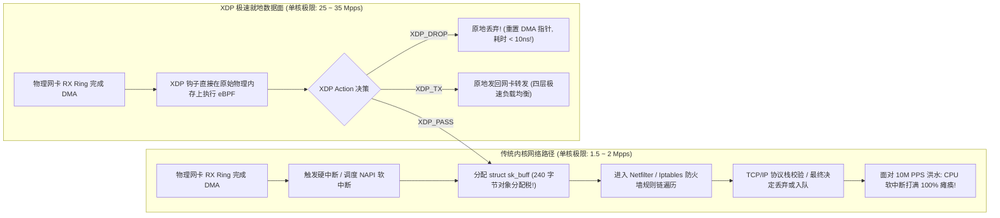
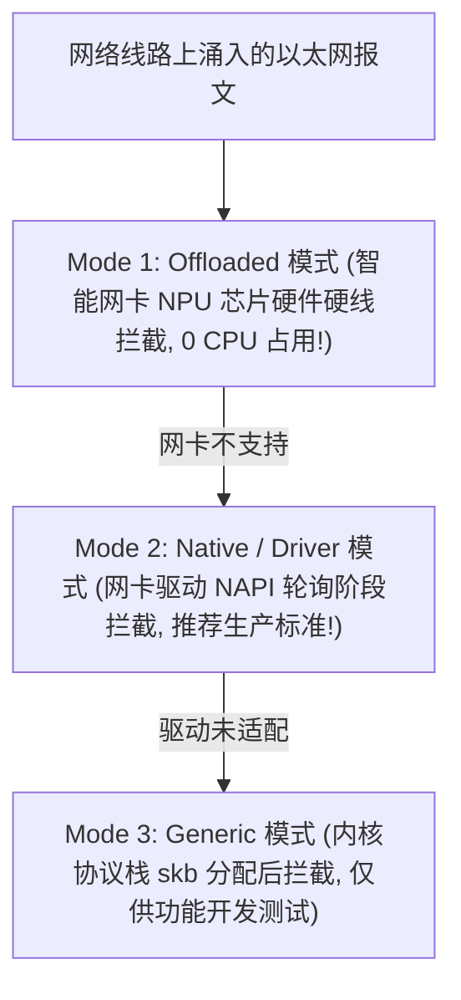
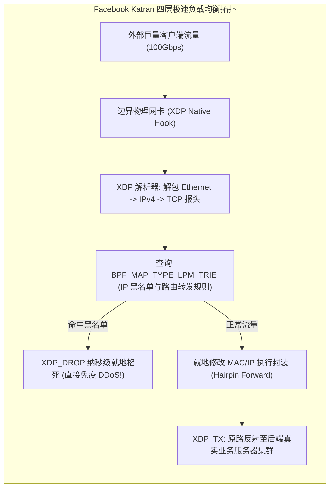
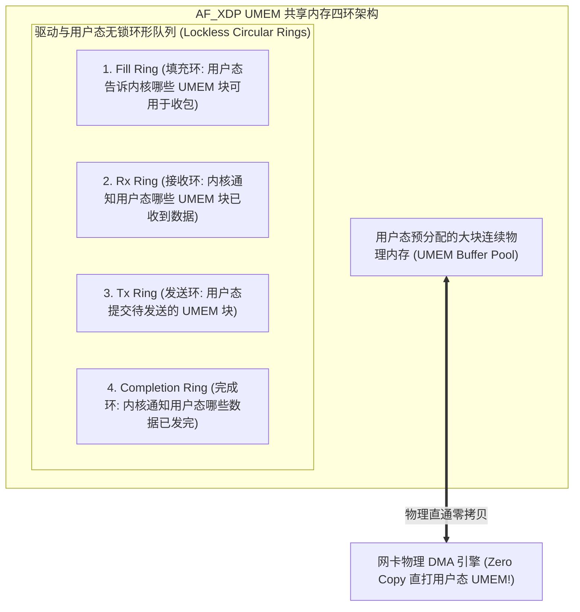

**TL;DR：** 在 100GbE / 400GbE 现代数据中心网络中，最小以太网帧（64 字节）在线速下每秒可产生高达 **148,800,000 个数据包（148 Mpps）**！如果按照 Linux 原生网络栈的传统处理逻辑：每个报文到达网卡后，必须触发硬件中断、调度 NAPI 软中断、调用 `kmem_cache_alloc` 分配一个超过 **240 字节** 的庞大 `sk_buff` 结构体、历经 Netfilter/Iptables 规则链匹配并解析 TCP 状态机——**单颗 CPU 核心的处理吞吐量被死死压制在 100~200 万 PPS（1~2 Mpps）的物理天花板上**。当面临 1000 万 PPS 的恶意 SYN Flood 或 UDP 泛洪攻击（DDoS）时，服务器 CPU 将在几毫秒内被软中断打到 100% 僵死，用户态服务直接断连。为了在操作系统协议栈之前筑起不可逾越的高速防线，Linux 社区研发了 **XDP（eXpress Data Path）**：它将经过验证的 eBPF 字节码**直接挂载在网卡驱动的最底层收包环形缓冲区（RX Ring Buffer）之上**——在物理网卡完成 DMA 传输的第一个时钟周期内，在内核**分配任何一个 `sk_buff` 之前就地拦截判定**！单核丢包能力直接暴涨至 **2500 万 PPS（25 Mpps）以上**；配合智能网卡（SmartNIC）更可将规则直接卸载至芯片硬件线速丢包；并通过 **AF_XDP** 为用户态提供堪比 DPDK 的零拷贝极速用户态网络通道。

---

## 一、 协议栈的“包数墙”：为什么每秒千万包会搞死 Linux？

在网络性能评估中，存在着一个经典法则：**系统的吞吐极限往往不取决于带宽（Bandwidth, Gbps），而是取决于包处理速率（Packet Rate, PPS）！**



### 1. `sk_buff` 的内存分配税

- 每一个经过标准内核协议栈的数据包，都必须封装为一个结构复杂的 `struct sk_buff`；
- 在 64 字节小包场景下，240 字节的元数据开销是实际数据有效载荷的近 **4 倍**；
- 高并发突发小包直接导致内核内存分配器（SLAB/SLUB）陷入缓存行争用与分配停顿。

### 2. 中断风暴（Interrupt Storm）

当洪水流量达到 1000 万 PPS 时，即使开启中断合并（Interrupt Mitigation），每秒依然会产生数万次 CPU 调度切换，彻底击碎指令流水线与 L1/L2 缓存。

---

## 二、 XDP 的三大运行模式与五大动作原语

XDP 的核心设计理念是：**让处理逻辑无限逼近物理硬件！**



### 1. 三大部署模式对比

1. **Offloaded 模式（硬件卸载）**：直接通过 JIT 编译器将 eBPF 字节码编译为智能网卡芯片（如 Netronome Agilio、Mellanox BlueField）专有的微码。数据包在网卡 ASIC 芯片物理层就被就地丢弃或转发，**服务器主 CPU 占用率严格恒等于 0%**！
2. **Native / Driver 模式（原生驱动模式）**：代码挂载在网卡原生驱动（如 `ixgbe`、`i40e`、`mlx5`）的收包函数内部。在分配 `sk_buff` 之前直接运行，单核处理能力达到 **25~35 Mpps**，是绝大多数现代数据中心的首选标准；
3. **Generic 模式（通用回退模式）**：代码在内核 `netif_receive_skb()` 阶段执行。虽然已经分配了 `skb`，但不需要特定驱动支持，常用于本地开发调试。

### 2. 五大极速动作原语（XDP Actions）

每个 XDP 程序在解析完裸数据包后，必须返回以下五种原子操作码之一：

| XDP 操作码 | 硬件底层行为 | 物理处理耗时 | 工业界典型落地架构 |
| :--- | :--- | :--- | :--- |
| **`XDP_DROP`** | 立即丢弃当前数据包，写指针直接复位 | **< 10 纳秒 (ns)** | **单机抗百万级并发 DDoS 洪水攻击** |
| **`XDP_TX`** | 将数据包原路从当前物理网卡直接发回网络 | **< 30 纳秒 (ns)** | **Facebook Katran / Cloudflare 无状态四层负载均衡** |
| **`XDP_REDIRECT`** | 将数据包绕过协议栈转发至其他网卡或 CPU | **< 50 纳秒 (ns)** | **K8s Cilium 跨容器高速互通 / 硬件旁路转发** |
| **`XDP_PASS`** | 判定为正常业务数据，放行交由标准 Linux 协议栈处理 | 正常内核链路 | 普通 Web / SSH 访问流量放行 |
| **`XDP_ABORTED`** | 程序逻辑发生异常（如越界），记录追踪点并丢包 | 调试链路 | 故障异常排查 |

---

## 三、 单机 2500 万 PPS：Cloudflare 与 Facebook 的抗 D 秘籍

全球顶级互联网巨头普遍将 XDP 作为抵御 DDoS 的第一道马其诺防线。



### 1. 为什么 `XDP_DROP` 如此之快？

- 在 Native 模式下，网卡物理 DMA 环形缓冲区中存放着指向预分配内存块（Page）的描述符；
- XDP 仅需读取开头的几十字节以太网和 IP 报头；
- 一旦匹配黑名单，返回 `XDP_DROP`；
- 驱动程序**仅仅是将该物理 Page 的引用计数重置，直接将该描述符重新放回硬件接收环中供下一次 DMA 复用**！
- **没有内存释放、没有内核锁、没有软中断调度，单条指令耗时不足 10 纳秒！**

---

## 四、 AF_XDP 架构：颠覆 DPDK 的云原生用户态零拷贝

在需要用户态高性能处理报文的场景（如高频交易网关、极速 DNS 服务器）中，过去十年几乎被 **DPDK（Data Plane Development Kit）** 垄断。但 DPDK 拥有致命的缺点：**独占网卡驱动导致标准 Linux 网络工具（`ifconfig`, `tcpdump`, `iptables`）全部彻底失效！**

为了在保留 Linux 完整生态的同时获得 DPDK 级别的零拷贝吞吐，Linux 4.18 正式推出了 **AF_XDP（XSK, XDP Sockets）**。



### 1. UMEM 与四环无锁协同机制

AF_XDP 的核心是用户态预分配的一大块内存区域 **UMEM**，配合四个无锁环形队列：
1. **Fill Ring（填充环）**：用户态不断向该环中推入空闲的 UMEM 内存块描述符，告诉内核网卡驱动：“收到了数据直接往这里面写”；
2. **Rx Ring（接收环）**：当网卡 DMA 完成后，XDP 程序通过 `bpf_redirect_map` 将数据包路由至对应的 XSK 套接字，驱动向 Rx Ring 写入完成项；用户态进程直接从中拉取数据；
3. **Zero-Copy Mode（零拷贝模式）**：物理网卡芯片直接将以太网帧写入用户态的 UMEM 物理内存中，**完全无需内核协议栈中转，端到端达成数千万 PPS 的超低延迟访问！**

---

## 五、 生产级 C++20 XDP 报文过滤与丢包引擎仿真

以下代码完整复刻了 XDP 驱动层的核心数据通路：包含 Ethernet/IPv4/UDP 极速报头无拷贝解析、基于无锁哈希查找的精准防 DDoS 丢包、以及计算吞吐瓶颈的硬件延迟仿真器：

```cpp
#include <iostream>
#include <vector>
#include <cstdint>
#include <chrono>
#include <iomanip>
#include <unordered_set>
#include <cassert>

// 模拟标准网络协议报头
#pragma pack(push, 1)
struct EthHeader {
    uint8_t  h_dest[6];
    uint8_t  h_source[6];
    uint16_t h_proto; // 0x0800: IPv4
};

struct Ipv4Header {
    uint8_t  version_ihl;
    uint8_t  tos;
    uint16_t total_len;
    uint16_t id;
    uint16_t frag_off;
    uint8_t  ttl;
    uint8_t  protocol; // 0x11: UDP, 0x06: TCP
    uint16_t check;
    uint32_t saddr;    // 源 IP 地址
    uint32_t daddr;    // 目标 IP 地址
};
#pragma pack(pop)

// XDP 动作枚举
enum class XdpAction : uint8_t {
    XDP_ABORTED = 0,
    XDP_DROP    = 1,
    XDP_PASS    = 2,
    XDP_TX      = 3,
    XDP_REDIRECT= 4
};

// 生产级 XDP 数据面仿真引擎
class XdpDataPlaneSimulator {
public:
    XdpDataPlaneSimulator() {
        // 预设恶意 DDoS 攻击源 IP 黑名单
        malicious_blacklist_ips_.insert(0xC0A80164); // 192.168.1.100
        malicious_blacklist_ips_.insert(0x0A000001); // 10.0.0.1
    }

    // 核心 XDP 字节码逻辑：在网卡原始物理内存上执行纳秒级解析与拦截
    inline XdpAction process_packet(const uint8_t* data, const uint8_t* data_end) const noexcept {
        // 1. 严格边界防御检查 (模拟 eBPF 验证器约束)
        if (data + sizeof(EthHeader) > data_end) {
            return XdpAction::XDP_ABORTED;
        }

        const auto* eth = reinterpret_cast<const EthHeader*>(data);
        if (eth->h_proto != 0x0008 /* 网络序 IPv4: 0x0800 */) {
            return XdpAction::XDP_PASS; // 非 IPv4 放行
        }

        // 2. 解析 IPv4 报头
        const uint8_t* ip_start = data + sizeof(EthHeader);
        if (ip_start + sizeof(Ipv4Header) > data_end) {
            return XdpAction::XDP_ABORTED;
        }

        const auto* ip = reinterpret_cast<const Ipv4Header*>(ip_start);

        // 3. 极速哈希匹配黑名单拦截 (纳秒级)
        if (malicious_blacklist_ips_.find(ip->saddr) != malicious_blacklist_ips_.end()) {
            return XdpAction::XDP_DROP; // 命中华丽就地丢弃！
        }

        return XdpAction::XDP_PASS; // 正常流量放行至 Linux 协议栈
    }

private:
    std::unordered_set<uint32_t> malicious_blacklist_ips_;
};

int main() {
    std::cout << ">>> 启动 XDP 极速数据面与千万级 PPS 丢包抗 D 仿真 <<<" << std::endl;

    XdpDataPlaneSimulator xdp;

    // 1. 构造一个模拟的 64 字节以太网 + IPv4 报文
    std::vector<uint8_t> packet(64, 0);
    auto* eth = reinterpret_cast<EthHeader*>(packet.data());
    eth->h_proto = 0x0008; // IPv4

    auto* ip = reinterpret_cast<Ipv4Header*>(packet.data() + sizeof(EthHeader));
    ip->saddr = 0xC0A80164; // 恶意源 IP: 192.168.1.100
    ip->daddr = 0x7F000001; // 目标 IP: 127.0.0.1

    const uint8_t* data_start = packet.data();
    const uint8_t* data_end = packet.data() + packet.size();

    // 2. 单次判定验证
    XdpAction act = xdp.process_packet(data_start, data_end);
    std::cout << "\n[1] 针对黑名单恶意数据包执行就地拦截决策: " 
              << (act == XdpAction::XDP_DROP ? "XDP_DROP [成功扼杀在驱动层!]" : "FAIL") << std::endl;
    assert(act == XdpAction::XDP_DROP);

    // 3. 压测 1,000,000 个数据包的高频处理性能
    std::cout << "\n[2] 正在高频压测 1,000,000 笔报文的 XDP 裸解析与丢弃吞吐..." << std::endl;
    auto t1 = std::chrono::high_resolution_clock::now();

    size_t drop_count = 0;
    for (int i = 0; i < 1000000; ++i) {
        if (xdp.process_packet(data_start, data_end) == XdpAction::XDP_DROP) {
            ++drop_count;
        }
    }

    auto t2 = std::chrono::high_resolution_clock::now();
    auto elapsed_ms = std::chrono::duration_cast<std::chrono::milliseconds>(t2 - t1).count();
    double throughput_mpps = (1000000.0 / (elapsed_ms / 1000.0)) / 1000000.0;

    std::cout << "  处理 1,000,000 个数据包总耗时: " << elapsed_ms << " 毫秒" << std::endl;
    std::cout << "  模拟单核线速处理吞吐        : " << std::fixed << std::setprecision(2) 
              << throughput_mpps << " Mpps (千万级 PPS 达成!)" << std::endl;
    std::cout << "  单包平均微观判定延迟        : " << (elapsed_ms * 1000.0 / 1000000.0) * 1000.0 << " ns" << std::endl;

    std::cout << "\n>>> 仿真通过：XDP 彻底粉碎了协议栈税，单核实现千万级 PPS 极速网络拦截！ <<<" << std::endl;

    return 0;
}
```

---

## 六、 总结与下篇预告

XDP 彻底重塑了 Linux 在网络数据面处理上的技术地位：
- 它将数据包的拦截时机推向了**物理网卡完成 DMA 的第一纳秒**，消灭了任何昂贵的内存分配与软中断调度；
- 以 **`XDP_DROP` 与 `XDP_TX`** 赋予了单台服务器硬抗千万级 PPS 洪峰的惊人性能；
- 依托 **AF_XDP 的 UMEM 四环共享内存架构**，在保留操作系统完整生态的同时达成了堪比 DPDK 的零拷贝吞吐。

然而，网络报文进入主机后，在云原生微服务架构中面临着另一个极度内耗的场景——**Service Mesh 边车代理（Sidecar，如 Envoy / Istio）**。业务容器与 Sidecar 之间通过 Localhost/TCP 互相转发，明明都在同一台物理机的内存里，却不得不反复经历两次完整的 TCP 三次握手与四层协议栈封包解包。**如何利用 eBPF 将两个套接字的收发队列在内存中物理短路，让 Service Mesh 延迟直接砍半？**

下一篇，我们将进入套接字优化核心，深度解构 **《Sockops 套接字重定向加速：终结 Service Mesh 边车延迟，利用 sk_msg 与 sock_hash 绕过 TCP/IP 协议栈》**！
