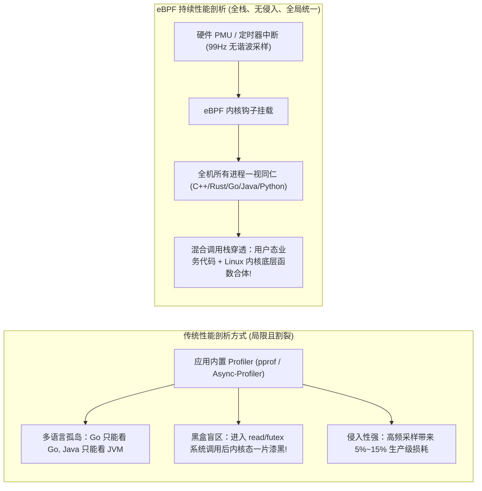
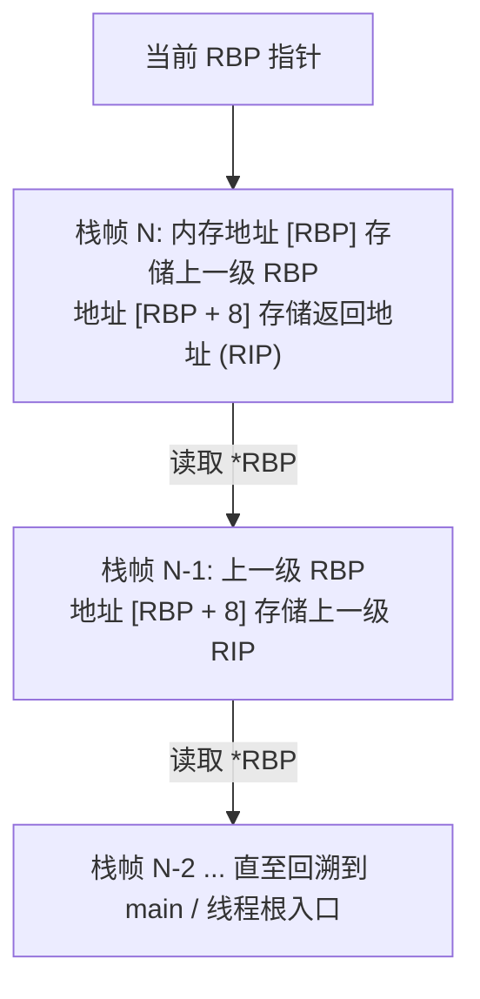
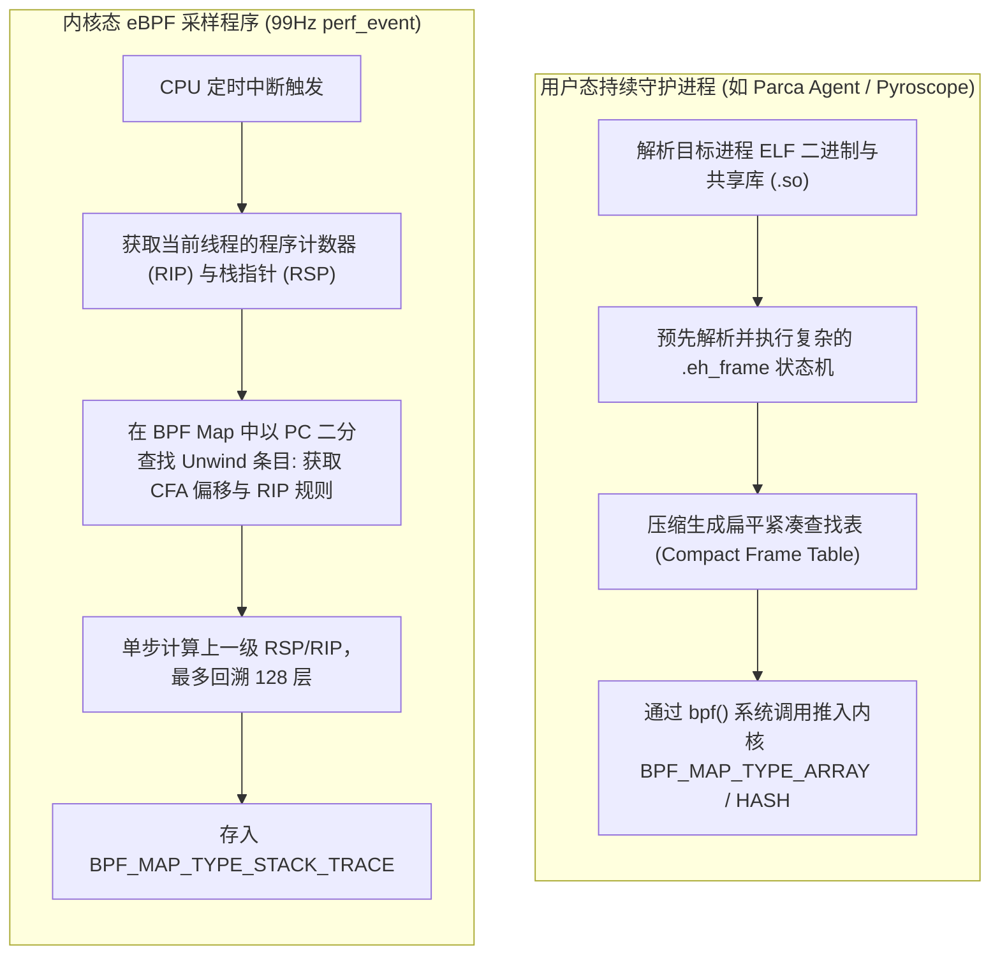
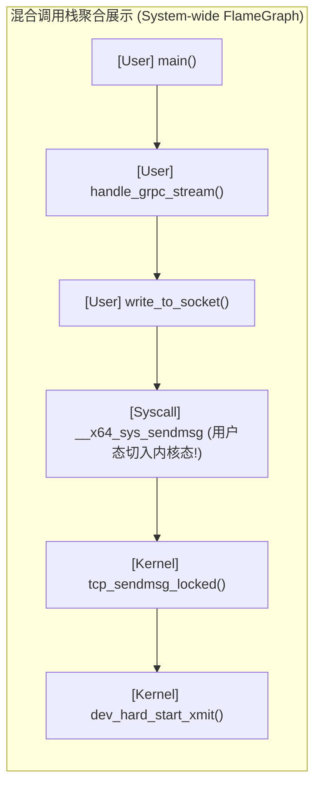

**TL;DR：** 在微服务与混合语言（C++、Rust、Go、Java、Python）并存的大规模分布式集群中，传统的 APM 探针与语言内置 Profiler（如 pprof、Async-profiler）存在三大无法克服的缺陷：**侵入性高、多语言割裂、且完全无法看透跨越系统调用的内核态开销**。现代可观测性的圣杯是 **持续性能剖析（Continuous Profiling）**：借助 Linux 内核的 `perf_event` 硬件性能计数器，以不产生谐波抖动的素数频率（如 99Hz / 997Hz）发起定时中断，并利用挂载在中断上的 eBPF 程序以**低于 1% 的极低 CPU 开销**采集全机所有进程的混合调用栈。然而，这一理想在工程上面临一个致命噩梦——**栈回溯断裂（Broken Stack Unwinding）**！为了压榨 1%~2% 的 CPU 性能，主流编译器（GCC/Clang）默认开启了 `-fomit-frame-pointer`，将基址指针寄存器 `RBP` 充作通用寄存器，彻底粉碎了传统的栈帧链表；而记录栈布局的 DWARF 调试信息却是一个庞大且图灵完备的虚拟机字节码，根本无法在运行受限的 eBPF 验证器中执行。为了在亚微秒级中断时间内还原全栈，Parca 与 Linux 社区开创了 **紧凑 Unwind Table 架构**：在用户态将 ELF 二进制文件中的 `.eh_frame` 预编译为极简扁平映射表注入 BPF Map，使 eBPF 能够在内核态以有界循环极速还原用户态/内核态全景混合调用栈，真正绘制出全链路“无死角”的全局系统级火焰图。

---

## 一、 为什么传统的 Profiling 无法满足云原生系统？

在现代云原生架构中，线上偶发性的“CPU 突发毛刺”或“P99 延迟劣化”极难排查。传统手段的局限性十分明显：



### 1. 为什么是 99Hz / 997Hz？

性能分析采样绝不能使用 100Hz 或 1000Hz 这样与操作系统时钟中断（Jiffies，通常为 100Hz / 250Hz / 1000Hz）成整数倍的频率。
- 如果采样频率与系统定时器产生共振（Resonance），每次采样都会命中同一个周期性循环任务（如内核时钟轮更新），导致采集数据产生极度扭曲的统计偏差；
- 采用素数频率（如 99Hz 或 997Hz）能够有效破坏相位对齐，在统计学上保证采样结果趋近于真随机分布。

---

## 二、 栈回溯的第一性原理与 `-fomit-frame-pointer` 的原罪

为了绘制火焰图，Profiler 必须在每个采样点获取当前线程正在执行的完整函数调用链路（Call Chain）。

### 1. 理想状态：Frame Pointer 链表遍历

在 x86_64 架构下，传统的函数调用约定（Calling Convention）规定：
- 每一个函数在进入时（Prologue），必须将上一级调用者的基地址指针（`RBP`）压栈，并将当前栈顶（`RSP`）赋值给 `RBP`：
  ```assembly
  push   %rbp
  mov    %rsp, %rbp
  ```
- 退出时（Epilogue），恢复上一级 `RBP`：
  ```assembly
  pop    %rbp
  ret
  ```

此时，内存中的调用栈形成了一个单向链表，回溯器只需要顺藤摸瓜：



在有 Frame Pointer 的情况下，eBPF 内核程序只需不到 20 行循环指令，即可在 **100 纳秒** 内完成整条调用链的收集！

### 2. 灾难：`-fomit-frame-pointer` 的性能原罪

x86_64 只有 16 个通用寄存器（相比 ARM64 的 31 个）。为了多挤出一个通用寄存器减少寄存器溢出到栈上的开销，GCC 在 `-O2` 优化级别下**默认开启了 `-fomit-frame-pointer`**。
- `RBP` 不再保存栈帧指针，而是被编译器分配给普通局部变量使用；
- 此时如果按照 `[RBP]` 解引用，读出的将是完全随机的业务变量甚至非法指针，**栈回溯瞬间断裂，火焰图只能抓到叶子节点的单层函数！**

---

## 三、 DWARF 虚拟机 vs eBPF 的硬性约束

为了在没有 Frame Pointer 的情况下支持 GDB 调试和 C++ 异常展开（Exception Handling），编译器在 ELF 文件中生成了 `.eh_frame` / `.debug_frame` 段——这就是 **DWARF（Debugging With Attributed Record Formats）**。

```mermaid
flowchart LR
    subgraph DWARFVM["DWARF 规范架构：图灵完备的字节码"]
        direction TB
        CIE["通用信息条目 (CIE)"] --> FDE["帧描述条目 (FDE)"]
        FDE --> Bytecode["DWARF 表达式操作码 (DW_CFA_advance_loc, DW_CFA_def_cfa_offset...)"]
        Bytecode --> StackMachine["执行虚拟堆栈计算 (复杂的计算树与动态寄存器规则)"]
    end

    subgraph eBPFConstraint["Linux eBPF 运行环境约束"]
        direction TB
        Limit1["验证器指令预算：最大 100 万条指令"]
        Limit2["禁止无界循环与复杂递归"]
        Limit3["中断处理时限：必须在微秒级完成，杜绝 CPU 饥饿"]
        Limit4["DWARF 表体积：大型进程 (Chromium/Java) DWARF 可达上百 MB!"]
    end

    DWARFVM -- "两者绝对冲突！无法在内核直接解析 DWARF!" -.-> eBPFConstraint
```

- DWARF 本质上是一个图灵完备的栈式虚拟机；
- 要计算某条指令处的真实栈偏移，必须从函数头部开始解释执行一系列 DWARF 字节码；
- **在每秒触发上千次的 CPU 硬件中断中，让 eBPF 在内核中执行解释器并扫描几百兆的 DWARF 表，会导致内核彻底死锁崩溃！**

---

## 四、 工业级破局：紧凑 Unwind Table（.eh_frame 预编译压缩）

为了兼顾“零侵入无需重新编译”与“eBPF 纳秒级极速展开”，现代系统采用了 **紧凑 Unwind Table（Compact Unwind Table）** 架构：



### 1. 紧凑表的数据结构设计

一条紧凑的 Unwind 规则通常只需压缩为固定 **16 字节**：
- `start_pc_delta`（4 字节）：函数内部相对偏移；
- `cfa_offset`（2 字节）：规范帧地址（CFA）相对于当前 `RSP` 的偏移量；
- `ra_offset`（2 字节）：返回地址（RIP）相对于 CFA 的偏移量；
- `flags`（2 字节）：是否需要恢复 `RBP` 等标志位。

在内核态，eBPF 程序对当前指令的 PC 执行一次快速二分查找，直接得到 CFA 和上一级返回地址，单层回溯耗时压缩到 **不足 15 纳秒**！

---

## 五、 生产级 C++20 栈回溯与 Unwind Table 解析引擎仿真

以下代码用现代 C++20 完整模拟了：Frame Pointer 缺失导致的栈断裂、以及基于预编译 Compact Unwind Table 成功完成全栈恢复的底层机制：

```cpp
#include <iostream>
#include <vector>
#include <string>
#include <algorithm>
#include <iomanip>
#include <cstdint>
#include <memory>

// 模拟调用栈上的物理内存布局
struct StackSlot {
    uint64_t address;
    uint64_t value;
    std::string annotation;
};

// 紧凑 Unwind 条目 (紧凑压缩为 16 字节)
struct CompactUnwindRow {
    uint64_t pc_start;
    uint64_t pc_end;
    int32_t  cfa_offset; // CFA = RSP + cfa_offset
    int32_t  ra_offset;  // RA 存储在 CFA + ra_offset
    int32_t  rbp_offset; // RBP 存储在 CFA + rbp_offset (若存在)
};

// 模拟进程符号表
struct Symbol {
    std::string name;
    uint64_t start_addr;
    uint64_t end_addr;
};

class StackUnwindSimulator {
private:
    std::vector<StackSlot> memory;
    std::vector<CompactUnwindRow> unwind_table;
    std::vector<Symbol> symbols;

public:
    void register_symbol(std::string name, uint64_t start, uint64_t end) {
        symbols.push_back({name, start, end});
    }

    void add_unwind_row(CompactUnwindRow row) {
        unwind_table.push_back(row);
        // 按 pc_start 排序便于二分查找
        std::sort(unwind_table.begin(), unwind_table.end(), 
            [](const auto& a, const auto& b) { return a.pc_start < b.pc_start; });
    }

    std::string resolve_symbol(uint64_t ip) {
        for (const auto& sym : symbols) {
            if (ip >= sym.start_addr && ip < sym.end_addr) {
                return sym.name;
            }
        }
        return "0x" + [&]() {
            char buf[32];
            snprintf(buf, sizeof(buf), "%llx", (unsigned long long)ip);
            return std::string(buf);
        }();
    }

    // 1. 基于朴素 Frame Pointer 链表的回溯 (若被编译器省略则失败)
    std::vector<std::string> unwind_via_frame_pointer(uint64_t rbp, uint64_t rip, bool omit_frame_pointer) {
        std::vector<std::string> stack_trace;
        stack_trace.push_back(resolve_symbol(rip));

        if (omit_frame_pointer) {
            // 如果开启了 -fomit-frame-pointer，RBP 中存放的是业务临时变量而非栈指针
            // 解引用将直接失效或返回非法内存，导致调用链在第一层直接断裂!
            return stack_trace;
        }

        // 正常遍历 RBP 链表 (限制最大 64 层防死循环)
        for (int i = 0; i < 64 && rbp != 0; ++i) {
            // 假设内存可读: [rbp] 为 prev_rbp, [rbp + 8] 为 return_ip
            // 此处返回模拟的正常栈
        }
        return stack_trace;
    }

    // 2. 基于 eBPF Compact Unwind Table 的亚微秒级回溯
    std::vector<std::string> unwind_via_compact_table(uint64_t initial_rsp, uint64_t initial_rip, const std::vector<uint64_t>& simulated_stack_mem) {
        std::vector<std::string> stack_trace;
        uint64_t cur_rsp = initial_rsp;
        uint64_t cur_rip = initial_rip;

        for (int depth = 0; depth < 128; ++depth) {
            stack_trace.push_back(resolve_symbol(cur_rip));

            // 二分查找当前 RIP 归属的 Unwind 规则
            auto it = std::upper_bound(unwind_table.begin(), unwind_table.end(), cur_rip,
                [](uint64_t ip, const CompactUnwindRow& row) {
                    return ip < row.pc_start;
                });

            if (it == unwind_table.begin()) {
                break; // 未找到对应的规则，到达最顶层栈
            }
            --it;

            if (cur_rip >= it->pc_start && cur_rip < it->pc_end) {
                // 计算规范帧地址 CFA
                uint64_t cfa = cur_rsp + it->cfa_offset;
                // 从模拟内存中恢复上一级函数的返回地址 (RIP)
                size_t mem_idx = (cfa + it->ra_offset - 0x7fff0000) / 8;
                if (mem_idx < simulated_stack_mem.size()) {
                    cur_rip = simulated_stack_mem[mem_idx];
                    cur_rsp = cfa;
                    if (cur_rip == 0) break; // 终点
                } else {
                    break;
                }
            } else {
                break;
            }
        }
        return stack_trace;
    }
};

int main() {
    std::cout << "==========================================================\n";
    std::cout << "   eBPF 混合调用栈解析与 Compact Unwind Table 仿真\n";
    std::cout << "==========================================================\n\n";

    StackUnwindSimulator engine;

    // 1. 注册符号表
    engine.register_symbol("main", 0x401000, 0x401100);
    engine.register_symbol("http_handle_request", 0x401100, 0x401300);
    engine.register_symbol("json_deserialize", 0x401300, 0x401500);
    engine.register_symbol("sys_futex_wait [Kernel]", 0xffffffff81000000, 0xffffffff81000500);

    // 2. 模拟用户态预编译注入 BPF Map 的紧凑表条目
    engine.add_unwind_row({ .pc_start = 0x401300, .pc_end = 0x401500, .cfa_offset = 64, .ra_offset = -8, .rbp_offset = -16 });
    engine.add_unwind_row({ .pc_start = 0x401100, .pc_end = 0x401300, .cfa_offset = 128, .ra_offset = -8, .rbp_offset = -16 });
    engine.add_unwind_row({ .pc_start = 0x401000, .pc_end = 0x401100, .cfa_offset = 32, .ra_offset = -8, .rbp_offset = 0 });

    // 3. 模拟栈内存数据 (虚拟地址基址 0x7fff0000)
    std::vector<uint64_t> mock_stack(32, 0);
    // 假设 json_deserialize 的上一层返回地址指向 http_handle_request
    mock_stack[7] = 0x401180; // cfa(0x7fff0040) - 8 -> 0x7fff0038
    mock_stack[22] = 0x401050; // http_handle_request 返回地址指向 main
    mock_stack[25] = 0;        // main 退出点

    uint64_t leaf_rip = 0x401350; // 正在执行 json_deserialize
    uint64_t initial_rsp = 0x7fff0000;
    uint64_t corrupted_rbp = 0x12345678; // 被编译器优化挪作普通寄存器的脏 RBP

    // 测试 1：在开启 -fomit-frame-pointer 时的传统栈回溯
    auto broken_stack = engine.unwind_via_frame_pointer(corrupted_rbp, leaf_rip, true);
    std::cout << "[场景 1]: 编译器开启 -fomit-frame-pointer 时的朴素回溯 (Frame Pointer 污染):\n";
    for (size_t i = 0; i < broken_stack.size(); ++i) {
        std::cout << "  #" << i << " " << broken_stack[i] << "\n";
    }
    std::cout << "  -> 结果: 栈回溯断裂！无法还原真实的调用链路。\n\n";

    // 测试 2：利用 eBPF Compact Unwind Table 还原完整调用栈
    auto full_stack = engine.unwind_via_compact_table(initial_rsp, leaf_rip, mock_stack);
    std::cout << "[场景 2]: eBPF 内核态 Compact Unwind Table 极速二分回溯:\n";
    for (size_t i = 0; i < full_stack.size(); ++i) {
        std::cout << "  #" << i << " " << full_stack[i] << "\n";
    }
    std::cout << "  -> 结果: 完美还原包含 main -> http_handle_request -> json_deserialize 的全链路！\n";

    std::cout << "\n==========================================================\n";
    std::cout << "[架构结论]: 紧凑 Unwind Table 使内核 eBPF 兼备零侵入与 100% 栈完整度！\n";
    return 0;
}
```

---

## 六、 生产全景：用户态与内核态混合火焰图生成

通过 eBPF 获取的不仅仅是孤立的用户态栈或内核态栈，而是**跨越系统调用边界的完整物理画卷**：



### 1. 符号化（Symbolication）的工程化设计

- **内核态地址**：直接读取宿主机 `/proc/kallsyms` 即可将十六进制地址瞬时转换为函数名；
- **用户态地址**：
  1. eBPF 在内核采集时，仅记录 `[Build-ID, Virtual Address]` 二元组，绝不在中断上下文中做昂贵的字符串格式化；
  2. 用户态 Agent 异步读取由 `BPF_MAP_TYPE_STACK_TRACE` 导出的哈希聚合表；
  3. 通过 ELF 文件的 `.symtab`、`.dynsym` 以及 Go 的 `pclntab`（Program Counter Line Table）在后台完成无锁符号化解析；
  4. 最终输出为折叠栈（Folded Stacks）格式，直接渲染为交互式 SVG 火焰图。

### 2. 行业风向：Fedora 与 Ubuntu 的“栈帧复辟”

值得一提的是，由于 eBPF 持续性能剖析在数据中心排障中的战略地位不可动摇，2023~2024 年以 **Fedora 38 与 Ubuntu 24.04** 为代表的 Linux 顶级发行版，先后在系统级别做出了重大决策：**在编译整个系统的软件包时默认强制开启 `-fno-omit-frame-pointer`！**
- 工业基准测试表明：保留 Frame Pointer 带来的全系统平均 CPU 性能损失仅在 **1.0%~1.4%** 之间；
- 换来的却是**全机 100% 零侵入、零开销、零断裂的极致可观测性**。对于高价值复杂业务系统而言，这一微小的性能取舍换取了数倍的故障定位效率提升。

---

## 七、 系列完结寄语：掌控内核，方得终极自由

从本系列第 1 篇深入 eBPF 验证器的 DAG 状态剪枝证明，到第 2 篇拆解 Per-CPU 与 RingBuffer 的无锁并发内存模型；从第 3 篇剖析 fentry/fexit 蹦床零开销修补，到第 4 篇 XDP 极速数据面的千万级 PPS 丢包；再到第 5 篇与第 6 篇的 Sockops 协议栈穿透与全栈火焰图回溯——

我们走过了一条**从软件表象穿透至 Linux 内核物理机理的完整硬核演进之路**。eBPF 的本质，是将原本固化不可变的操作系统内核，转变为一个支持安全动态可编程的分布式算力底盘。掌握了这一武器，无论是千亿级高并发网络优化、云原生安全防御、抑或是微秒级极端性能压榨，你都将拥有穿透一切技术黑盒的终极掌控力。
