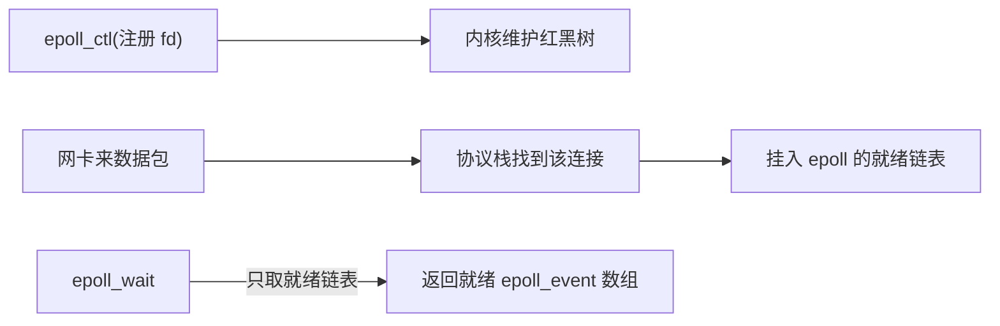
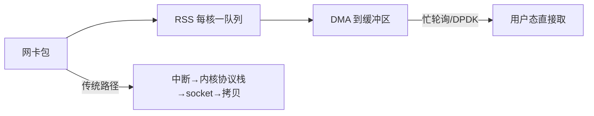

**TL;DR：** C10K（一万并发连接）不是"网络速度不够"，是**单核单位时间能检查多少 socket**的问题。select/poll 每次调用都要**全量扫描**全部 fd——一万个连接哪怕只活跃 10 个，也要扫一万个；epoll 让**内核登记"谁就绪了"**，每次 `epoll_wait` 只从就绪链表拿结果，复杂度从 O(N) 降到 O(就绪数)。C10M 时代连 epoll 的开销都嫌大：多队列（每 CPU 一条收包队列）+ 忙轮询（busy polling）+ 用户态收发（DPDK/XDP）把中断和拷贝一路压掉。本文把数据从网卡到应用这条路上的账单摊开。

## 一、select/poll 为什么到一万就崩

老式 `select` 把 fd 集合传给内核，内核逐一遍历检查是否就绪。每次调用都要扫全量：


三个开销：

- **拷贝**：每次调用都把整个 fd 集合从用户态拷进内核（位图再小也要拷全量）。
- **全量扫描**：一次系统调用 O(N)。
- **右到信息**：它只告诉你"有事件"，不告诉你是哪个 socket——应用还得再自己遍历一遍。

所以 select/poll 的 CPU 账是 **O(N) 每次 × N 次循环 = O(N²) 量级**，1 万连接就是时时扫描 1 万，CPU 很快被"找活干"占满。

## 二、epoll 的账本：注册、就绪、取就绪

epoll 把"查询"改成"事件订阅 + 就绪取用"两步：



三个关键数据结构：

1. **红黑树**：管理你注册的 fd（`epoll_ctl` 的 add/del/mod）。
2. **就绪链表**：协议栈处理完一个连接的包，就把它挂上这条链表。
3. **`epoll_wait`**：每次调用**只取链表头部的一段**，不扫整个 fd 集合；`maxevents` 只是每次最多取多少。

所以 epoll 的复杂度是 **O(就绪事件数)**，与总连接数 N 无关——**这就是从 C10K 迈过 10 万连接层次的算法原因**。

一个常被低估的细节：`EPOLLET`（边缘触发）与 `EPOLLLT`（水平触发）的差别在于"就绪状态要不要重复提醒"。LT 在你没读完之前会反复给事件（不易丢但要注意别重复处理）；ET 只提醒一次，接下来想读多少由你决定。用 ET 必须在循环里一直读到返回 `EAGAIN` 再停，否则就绪数据永远留在缓冲区里等不到下一次通知——ET 卡死是一个入门级常见事故。

## 三、C10M 时代：瓶颈移到协议栈与拷贝

2013 年的 C10M 演讲指出：即便 epoll 把事件分发做到极致，**瓶颈仍在内核网络栈**——每包中断、协议栈处理、内核到用户态的拷贝。三个发力方向：

1. **多队列网卡（RSS）**：每 CPU 一条收包队列，用中断亲和绑定到固定核，多个核各啃各的队列。
2. **忙轮询（busy polling / NAPI）**：CPU 不睡等中断，改成自己轮询 DMA 缓冲区有没有新包——省掉中断上下文切换，代价是空转耗 CPU。
3. **用户态收发（DPDK/XDP）**：应用直接操作用户态的内存池与网卡环形队列，完全绕开内核协议栈。



**这笔账的折中**：从"事件分发省 CPU"转向"把中断和拷贝都省掉"。它们省的是 CPU，付的是"专用内核线程 + 专用内存 + 不与原系统复用"。绝大多数业务 C10K 就够，C10M 是为极限密度（边缘节点、抗 DDoS）准备的。

## 四、复现：连接数翻百倍，延迟涨五十倍

本机实测（Linux 容器，OrbStack VM，Go `net/http` 服务 + `wrk`，loopback）：

```bash
# 100 连接基线
$ wrk -t2 -c100 -d5s http://localhost:8080/
  Latency   516.99us  650.58us   8.86ms   86.86%
  1302298 requests in 5.01s, 146.55MB read
  Requests/sec: 260120.35

# 10000 连接
$ wrk -t4 -c10000 -d10s http://localhost:8080/
  Latency    26.13ms   15.63ms 241.35ms   80.55%
  3090739 requests in 10.10s, 347.81MB read
  Requests/sec: 306019.97
```

| 配置 | 平均延迟 | 连接数比值 | 延迟比 |
| --- | --- | --- | --- |
| 100 连接 / 2 线程 | 0.52ms | 1× | 1× |
| 10000 连接 / 4 线程 | 26.13ms | 100× | **≈50×** |

三个观察：

1. **连接数涨 100 倍，延迟涨约 50 倍**：不是网络慢了，是内核每包路径的固定成本在放大——每条连接一个 socket 结构、一个接收队列，N 条连接就绪时 N 份唤醒与拷贝。延迟分布也变宽（max 241ms vs 8.9ms），从"每请求均匀"变成"排队波动"。
2. **QPS 反而更高（26 万→30.6 万）**：这是 wrk 客户端的线程数差异（2→4），不是服务端变快了——**loopback 压测下客户端往往先到底**，这是用的最多的坑：观察服务端要盯延迟与 sys 占比，别盯"Requests/sec 谁高"。
3. **sys 占比稳定**：压测期间服务端 CPU `usr ~25% / sys ~15% / sirq ~10% / idle ~50%`。高连接数下系统态没有飙升，就是 epoll 把"扫描全量"省掉的直接证据——换成 select，这些 CPU 会花在 `do_select` 的循环遍历上，`sys` 占比会顶上去。

**诚实注明**：本机复现是 loopback，延迟绝对值（26ms vs 30 万的吞吐）在真实网络下会不同，但**比值趋势成立**。另一个诚实的限制：如果压测连接都是空闲的，epoll 与 select 的差距会很小——差别只在"连接数大 + 同时就绪比例低"时显形。别拿空闲连接下的数字当结论。`perf top` 对比热点（`do_select` vs `epoll_wait`）需要宿主机上的容器运行时支持，本机（Docker Desktop/OrbStack）读不到内核符号表，这里用 sys 占比替代——在真机 Linux 上跑 `perf top` 能看到同一结论：epoll 路径热点扎在 `epoll_wait` 相关内核函数上，select 路径则是 `do_select`。

## 结论：C10K 的瓶颈从事件分发转向内核与拷贝

select/poll 的账是"每次全扫描、O(N)"，epoll 把它改成"就绪事件链表、O(就绪数)"——这是它能跨过 C10K 的算法原因。C10M 再往前，瓶颈从事件分发挪到中断与拷贝，解法是多队列、忙轮询、用户态收发。**每一层都是在换"钱从哪条路花得最值"。**

下一步：别信宣传，自己 `wrk -c10000` 压一次，同时用 `top`/`vmstat` 盯 sys 占比（真机 Linux 再加 `perf top`）——你手上那台几核机器，几分钟就能告诉你 epoll 的账本长什么样。别盯 QPS 绝对值（客户端可能才是瓶颈），盯"连接数翻番时延迟与 sys 占比怎么变"。

## 参考资料

1. epoll 手册（Linux man page）—— https://man7.org/linux/man-pages/man7/epoll.7.html
2. Dan Kegel：The C10K problem—— https://www.kegel.com/c10k.html
3. C10M：Defending the Internet at Scale（2013 演讲）—— https://static.usenix.org/venue/lisa2013/slides/graham.pdf
4. Linux 内核 eventpoll.c 实现—— https://github.com/torvalds/linux/blob/master/fs/eventpoll.c
5. 内核文档：NAPI 与忙轮询—— https://www.kernel.org/doc/html/latest/networking/napi.html

> 延伸阅读：epoll 就绪链表里到底等着什么，见[Socket 背压：慢消费者如何盯住你的服务](/writing/socket-backpressure-slow-consumer)；网络栈那部分数据的搬运账见[一次网络请求的数据被搬了几次](/writing/zero-copy-sendfile-io-uring)；连接关多的节奏与 TIME_WAIT 的代价见[TIME_WAIT 到底在保护谁](/writing/time-wait-connection-reuse)。
