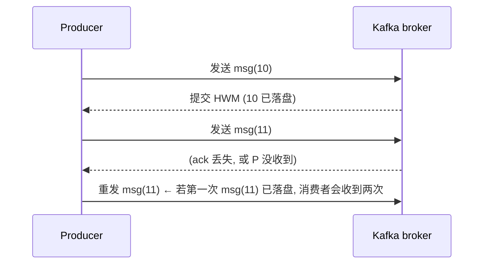
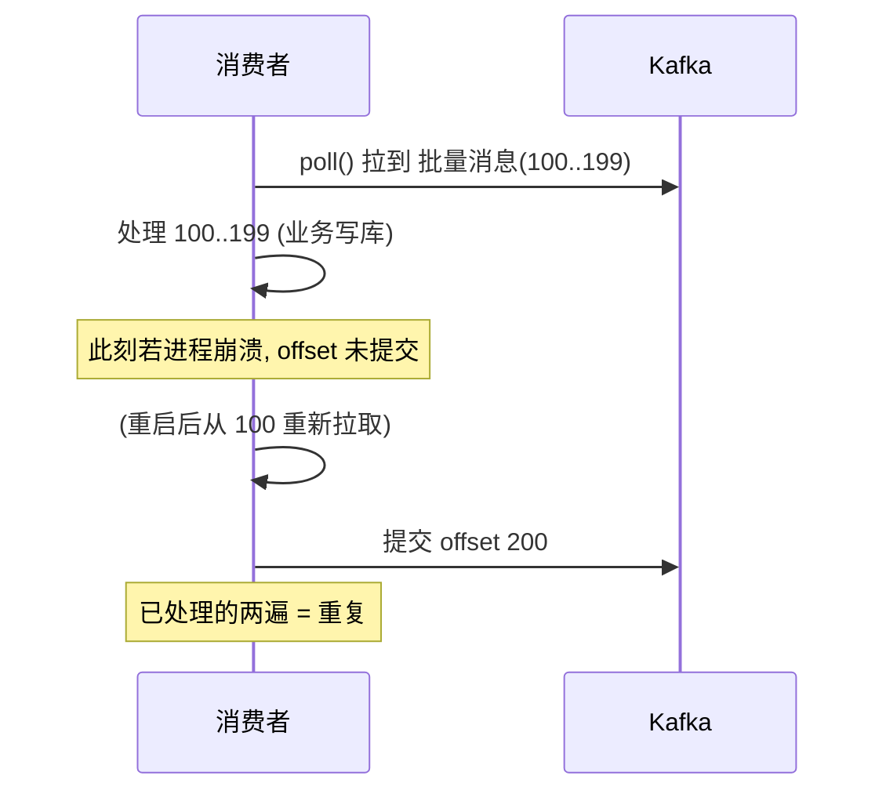
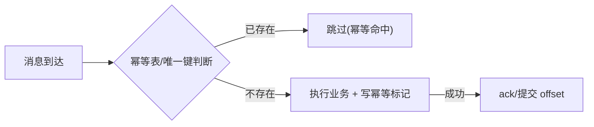

**TL;DR：** "exactly-once（刚好一次）"是消息领域**最贵的营销话术**：它不是一个可实现的投递语义，而是"at-least-once + 幂等消费"的组合拼图。原因在于**重复根本无法在传输层根除**——生产者提交 offset 前崩溃会重发、消费者处理成功后还没提交 offset 就崩溃会重收，这两处"语义缺口"是协议层解决不了的，只能用消费端的**幂等**来兜。本文沿一条消息的一生，数出它可能被"多处理一次"的全部场景，并给出把重复变成无害的实操。

## 一、三分法为什么是半真半假

教科书把投递语义切成三种：at-most-once（最多一次）、at-least-once（至少一次）、exactly-once（恰好一次）。听起来三选一，但真相是：

- **at-most-once**：发送方发了就忘、失败就丢——可用，但会丢数据。
- **at-least-once**：发送方发了之后一直重试到确认——**不丢，但可能重复**。
- **exactly-once**：不存在。不存在的原因是"交付"这件事本身就包含"确认"这个**时点**，而这个时点放在哪条路径上都有撞车窗口。

先记住这个判定：**有没有办法从"至少一次"变成"恰好一次"？ 答案是在消费侧做幂等**——让"同一个事务被处理两次"看起来像只处理了一次。所以工程界实际买的套餐是两样东西合起来：**at-least-once 的传输 + 幂等的消费**。

## 二、Producer：offset 提交窗口里藏着第一道重复

消息从生产者出发。Kafka 的生产者在"已发送"和"确认已落盘"之间有一个窗口。举例：



- 生产者把 ack 丢失当成失败，于是重发同一条消息。
- **重复窗口在此已经打开**：Kafka 的幂等生产者（`enable.idempotence=true`，且指定 `transactional.id`）确实能消除**同一 producer 进程内**的重发重复（靠 PID + sequence number），一旦 producer 重启，这个保障就消失了——Kafka 的"exactly-once"官方话术，指的就是**这一层**。

但行业对"exactly-once"的日常理解是"消费者只处理一次"，而这条从 producer 层就无法闭合。

## 三、Consumer：offset 提交窗口才是最大的重复源

消费者侧的定义窗口：**处理完一条消息之后、提交 offset 之前**。



**处理与提交之间的任意崩溃 = 重新消费 = 重复处理**。这是 at-least-once 的固有形态，任何消息系统（Kafka/RabbitMQ/Pulsar）都躲不开。区别只在窗口大小：

| 提交策略 | 窗口 | 后果 |
| :--- | :--- | :--- |
| 每处理一条就提交 | 极小（毫秒） | 性能差，但重复窗口小 |
| 批量处理完再提交 | 大（秒级） | 吞吐高，重复窗口大 |
| 处理前提交（auto.offset.reset=earliest） | 最大 | 几乎肯定重复 |

**工程结论：把 offset 提交窗口当作"设计好的重复窗口"对待**——窗口多大，系统就要能吞多大。

## 四、幂等消费：把重复变得无害

既然重复无法根除，正确的写法是**接受重复并把重复变无害**。两个核心套路：

**① 业务幂等键（协商性幂等）**

```sql
-- 用唯一键 + INSERT ... ON DUPLICATE（或 INSERT IGNORE）
INSERT INTO orders(id, amount, status) VALUES ('order-123', 10, 'PAID')
ON DUPLICATE KEY UPDATE id=id;

-- 或用独立幂等表: 消费前先插幂等表, 已存在则跳过
INSERT INTO idempotency_keys(message_id) VALUES ('mq-msg-uuid-001');
-- 冲突则说明这条处理过, 直接消费成功语义
```

**② 数据本身幂等（如 BTC 系统的扣款，同一条重复扣无可扣）**

```sql
UPDATE accounts SET balance = balance - 10 WHERE user_id=1 AND version=5;
-- 若这条已处理过(余额已扣), balance=... 版本对不上 → 0 行受影响 → 跳过
```

把这两招放进图片里，一条消息的生命走到"处理"之后，重复到达就只是"无害的分身"：



**幂等的两个元原则**：(a) 幂等键要能天然来自业务（order_id、user_id+amount），不要用"随机生成的 message_id"，因为重放环境里 message_id 可能一致但业务影响要判断；(b) 幂等写必须与业务写在**同一个事务**里（否则幂等表写了但业务没写，或反之）。

## 五、官方"exactly-once"在卖什么

Kafka 官方文档里有个术语 **EOS（Exactly-Once Semantics）**，它大致是"事务性 producer + 消费者事务"的组合，说的是**"把消息写入 Kafka 时、与消费时把数据写进业务库，放在同一个跨系统事务里"**。细看它有三个级，一层比一层窄：

- **级一（producer 幂等）**：让同一个 producer 进程内不重——靠 PID + sequence number，进程重启后作废。
- **级二（跨 Kafka 内读写）**：从 Kafka 读到 Kafka 再写出去不重——靠 transactional messages。
- **级三（消费者 + 自己的库）**：想让"消费 + 写业务库"原子——**官方在这里就退化成"你自己做幂等"了**。

也就是说：**连 Kafka 官方的"exactly-once"都只对 Kafka 自身有效；一旦边界跨出 broker（落到你的业务库），它就是"at-least-once + 自管幂等"**。这层认知，远比背"三种语义"更值钱。

## 六、落地清单

| 层 | 做法 | 兜底 |
| :--- | :--- | :--- |
| 生产者 | `enable.idempotence=true`；设计"发再重发"策略与超时 | 请求级幂等键 |
| 消费者 | 批量提交 offset；把重复窗口设计进容量 | 批量内重读可容忍 |
| 业务 | 幂等表或唯一键 + 同事务写 | 把重复从"错误"变成"无害" |
| 观测 | 幂等命中率、消费端延迟 | 幂等表就是一个数据库 |

## 结论

"恰好一次"不存在于消息传输层，只存在于"业务层幂等"的组合里。窗口不在于传输，而在于**"处理 vs 确认 vs 提交"的时序决定重复在哪出现**——对 producer 它出现在 ack 窗口，对消费者它出现在 offset 窗口。工程答案是"**设计好重复窗口 + 业务幂等**"，而"协商品实现幂等"必须与业务写在同一个事务内。这条认知比背"三种语义"更值钱。

下一步：把你系统里最核心的消费代码，补一张幂等表或唯一键（引用订单号），然后在测试环境模拟"重启消费者重复拉取"——你会亲眼看到重复是常态，把它兜住才是常态。

## 参考资料

1. Kafka 官方文档：Exactly-Once Semantics—— https://kafka.apache.org/documentation/#semantics
2. Kafka 官方文档：幂等生产者（enable.idempotence）—— https://kafka.apache.org/documentation/#producerconfigs
3. RabbitMQ 官方文档：Reliability（ack 与死信）—— https://www.rabbitmq.com/docs/reliability
4. 经典文章：The Trouble with Distributed Systems（Kleppmann, DDIA 第 8 章）—— https://dataintensive.net/

> 延伸阅读：本主题的两个切口——"发完再失败"的重试如何引爆，见[重试会放大一切错误：幂等性工程的完整账本](/writing/idempotency-engineering)；"多个库要原子改"与 Outbox 方案，见[分布式事务：2PC 为什么没人敢用](/writing/distributed-transactions-2pc-saga)；分布式系统的顺序与乱序问题，见[时间戳会骗人：时钟回拨与分布式系统的顺序幻觉](/writing/clock-skew-distributed-systems)。