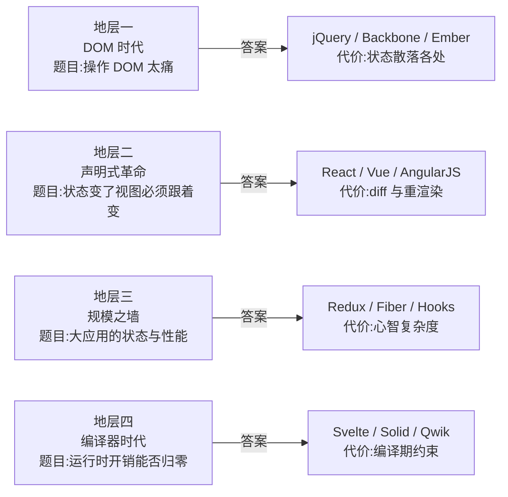
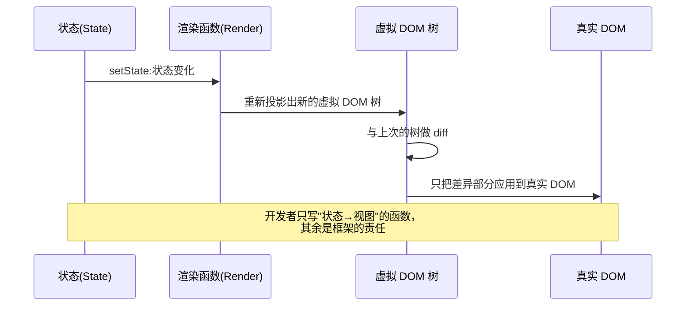
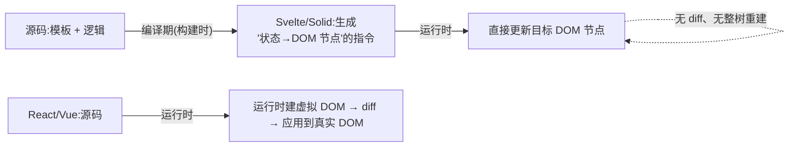

**TL;DR：** 前端框架的"乱"不是随机噪声，是四层地层：DOM 时代（手动操作 DOM 太痛）、声明式革命（状态与视图要自动同步）、规模之墙（大应用的状态与性能）、编译器时代（运行时开销能否归零）。每代都是"题目→答案→代价"的三元组，新框架出现 = 旧框架留下一道没答完的题。记住这个模型，比记住框架名单有用——名单会过时，模型不会。

## 一、乱象的真相：选择瘫痪是地层叠加的症状

站在 2026 年看前端，主流名单是：React、Vue、Angular、Svelte、Solid、Preact、Qwik、Lit……再加上配套的 Next.js、Nuxt、Astro，以及上一集[容器层](/writing/js-ecosystem-layers)里的一堆运行时。初学者面对这份名单的典型反应是"我该学哪个"，以及随之而来的焦虑：选错是不是就完了。

这个焦虑建立在一个错误前提上——好像这些框架是同一个问题的多个答案，选一个就完事了。不是的。它们其实是**四个不同时代的问题留下的答案**，时间上重叠、动机上接力。React 回答的问题和 Svelte 回答的问题不是一道题；把它们当成竞争对手，就像把电梯和楼梯当成竞争对手。

本文把这四代拆开，每代一个"题目→答案→代价"三元组。看完整张图你会得到两样东西：一份不需要背诵的框架地图，以及一个判断任何"新框架"的思维框架。

## 二、地层一 · DOM 时代：操作 DOM 太痛（~2005–2012）

2005 年之前，前端没有"框架"这个概念，只有 jQuery 之前的原生 DOM API。当年的痛点很具体：**用一个查得到元素、改得到内容、绑得上事件的 API，写一遍页面逻辑**。`document.getElementById` 加手动 `innerHTML` 拼接，代码里一半是"找元素、拼字符串"。jQuery（2006）把这一半压缩成 `$('#x').html(...)`——它回答的题目是"DOM 操作能不能不那么啰嗦"，答案是选择器 + 链式 API。

但 jQuery 没有回答下一道题：**状态与视图的一致性**。一个页面上有表单、列表、筛选器，用户改了一个输入框，列表要重新渲染，勾选框的状态要联动——用 jQuery 写，你得在十几个事件处理器里手动"更新相关的 DOM"。状态散落在一堆变量里，视图是状态的手工投影，改一处忘一处是常态。

于是 2010–2011 年，Backbone 和 Ember 把后端 MVC 的术语搬进浏览器：Model 存数据，View 监听 Model 变化自动重渲染。这是"前后端分离"叙事的开端，也是第一次"框架感"进入前端。它们的代价是 MVC 的血统病：**谁监听谁、谁通知谁的关系网络**，应用一大，连线的复杂度失控（"Observer Hell"）。

地层一的遗产是两件事：DOM 可以被打包抽象（jQuery 教会了我们），状态与视图必须被自动同步（Backbone 教会了我们）。这两道题都没有被彻底解决，它们被地层二的答案接管了。

## 三、地层二 · 声明式革命：状态变了，视图必须跟着变（2013–2015）

2013–2014 是决定今天格局的两年：AngularJS（2010 年诞生，2013 年前后进入主流视野）、React（2013 开源）、Vue（2014）。它们回答的是同一道题，但给了三个不同的答案，从此分道扬镳。

**AngularJS 的答案：双向绑定。** 模板里写 `{{name}}`，模型改视图自动变，视图改模型也自动变。直觉、好用，但它把"状态在变"这件事做成了隐式：任何一次点击都可能触发"脏检查"，框架每轮把所有绑定扫一遍。性能在绑定数量上来后崩盘，且"到底哪条路径在更新什么"变得不可追踪。

**React 的答案：声明式 + 单向数据流 + 虚拟 DOM。** 核心动作只有一个：**把"当前状态"投影成一份 UI 描述（虚拟 DOM 树），跟上次的树 diff，把差异应用到真实 DOM**。状态变了就整体重新投影，不需要你手动指出"哪里变了"；UI 只是状态的函数。代价也立即出现：每次状态变化都重新构建整棵树，diff 一棵树的成本必须有人付——虚拟 DOM 就是为这个设计的缓冲层。

**Vue 的答案：中间态。** Evan You 2014 年给出的第三条路是：模板（不是 JSX）+ 响应式（不是显式 setState）+ 渐进式（能当库用，也能长成框架）。它在"AngularJS 的直觉"和"React 的严谨"之间取了一个被大量开发者认为最舒服的位置——模板接近 HTML 心智、响应式自动追踪依赖、组件边界清晰。

地层二真正的分岔点，是**模板 vs JSX**：UI 描述用"类 HTML 模板"（Angular/Vue 路线，约束强、非 JS 开发者友好）还是"嵌在 JS 里的函数调用"（React 路线，图灵完备、无语法死角）。这场争论到今天都没结束，Vue 后来提供了 JSX 支持、React 也有了模板工具，但两条路线的忠实信徒依然壁垒分明。

地层二留下的未答题：diff 一棵大树的成本没有消失，只是从"手写同步"变成了"框架替你 diff"；大型应用的状态问题也还没人真正解决。

## 四、地层三 · 规模之墙：大应用的状态与性能（2015–2019）

2015 年之后，单页应用开始承载真正的业务复杂度，地层二的答案撞上了墙。这面墙有两个立面：**状态**和**性能**。

**状态立面：组件状态一多，数据流就失控。** 两个不相关的组件要共享一份数据、跨页面维持一份"用户登录态"、撤销重做需要状态的完整历史——"UI 是状态的函数"这句话本身没错，但"状态放哪、谁改它"没有任何约定。Redux（2015）给出的答案是：把状态集中到一个 store，只允许通过纯函数 reducer 修改，组件只读不写。它用一条铁的纪律（单向 + 纯函数）换来了可预测性，代价是样板代码与心智成本——"为了简单先引入复杂"的经典案例，后来被大量简化替代品（Zustand、Jotai）证实。

**性能立面：整棵树重建的成本，在深层组件上被放大。** React 的 diff 是按组件递归进行的，父组件一变，整棵子树跟着重投影。两个方向同时开工：Fiber（2017，React 16）把渲染拆成可中断的调度单元，为"并发渲染"铺路；Hooks（2019，React 16.8）把组件从"类"的强制结构中解放出来——类组件的生命周期钩子把逻辑按时间切碎，Hooks 按**逻辑分组**，同一个功能的 state/effect 靠在一起。Vue 3（2020）的对应答案是 Composition API + 基于 Proxy 的响应式重写。

地层三还有一个独立的转折：**Angular 1 → 2 的断裂（2016）**。Angular 2 用 TypeScript 重写、组件化、完全不向后兼容——AngularJS 时代的应用基本要重写。这个断裂是一个公开的教训：全家桶路线（框架替你把路由、状态、HTTP、表单全部定好）的好处是开箱即用，坏处是框架升级 = 全栈迁移。Angular 之后的路线收敛为"框架 + 生态拼装"的中间形态，而"要不要帮你把什么都做了"这道题，至今仍是选型时最朴素的分歧。

地层三的未答题：**运行时到底需要多厚**。Redux、Fiber、Hooks 都在"接受虚拟 DOM 成本"的前提下做优化，但有人开始质疑这个前提本身。

## 五、地层四 · 编译器时代：运行时开销能否归零（2019–）

第四个答案的起点是一个质疑：**虚拟 DOM 是不是多余的一层？** diff 是为了避免"无脑重渲染"的浪费，但如果编译器能在编译期就精确知道"状态 X 变 → 只有 DOM 节点 Y 需要改"，那 diff 和整棵树重建都不需要存在。

**Svelte（2019，3.x）**把框架搬进编译期：组件在编译时被拆成"状态 → 直接操作对应 DOM 节点"的指令，运行时只留几 KB 的调度代码。虚拟 DOM 从 Svelte 的产物里消失了。**Solid（2021）**用同样的思路但保留了 JSX：编译期把模板解析成细粒度响应式（signals），状态更新直接定位到消费它的 DOM 节点。**Qwik（2023）**更进一步，把"可恢复性"做成目标：服务端序列化应用状态，浏览器端不执行一遍"hydrate 重建"，而是用户交互到哪、代码才加载到哪。

四代走到这里出现了奇妙的收敛：**所有阵营都在向"细粒度响应式"（signals）靠拢**。Vue 3 的 Proxy 响应式本质上是 signals；Angular 在 16/17 也引入了 signals；Svelte 5 用 runes 重建响应式；甚至 React 也推出了编译期优化（React Compiler），试图把"手动 memo"自动化。**"编译期做多少、运行时留多少"取代"用不用虚拟 DOM"成了新的分界线**——前一场战争的赢家，正在用后一场战争的规则重赛。

地层四的代价同样真实：编译期方案把灵活性前移到了构建时（动态运行时行为的表达要绕弯子）、生态与调试工具还在追赶（React 的工具链优势依然巨大）。以及一个必须诚实说的限制：**微基准里细粒度方案赢得很漂亮，真实应用里差异往往被网络、渲染、内存分配吞掉**——选框架从来不是选基准分数。

## 六、统一模型：框架 = 对"状态→视图"路径的取舍

把四层地层并成一张横截面表：

| 地层 | 题目 | 代表答案 | 遗留代价 |
| :--- | :--- | :--- | :--- |
| 一 · DOM 时代 | 操作 DOM 太痛 | jQuery、Backbone、Ember | 状态散落，同步靠手工 |
| 二 · 声明式革命 | 状态变了视图必须跟着变 | React、Vue、AngularJS | 树重建成本，状态无约定 |
| 三 · 规模之墙 | 大应用的状态与性能 | Redux、Fiber、Hooks、Vue 3 | 心智复杂度、运行时厚度 |
| 四 · 编译器时代 | 运行时开销能否归零 | Svelte、Solid、Qwik | 编译期约束、生态追赶 |

这张表的读法只有一条：**看一个框架时，先问它回答的是哪一层的问题，再问它把哪一层的代价留了下来**。这样你看到的就不是"又一个新框架"，而是"地层四对地层二的一次重新谈判"。

顺带澄清一个常年被混在一起的三胞胎——**虚拟 DOM**（框架内存里的 UI 描述，上文的 diff 对象）、**Shadow DOM**（浏览器原生 Web Components 的样式/结构封装，2016 年进入规范）、**真实 DOM**（浏览器渲染出来的文档对象）。三者名字相近、机制完全不同：前两者是"框架内部的数据结构"和"浏览器的标准能力"，谁也不是谁的替代品。

## 结论

前端框架的名单是四代问题留下的地层，每一代都在回答上一代没答完的题，同时留下自己的账。选择瘫痪的解法不是"背下所有框架"，而是**把框架还原成题目**：它解决什么问题、把什么代价留给了谁。

对正在入门的人，一个直接的推论：**学第一遍的时候选一个主流的、地层二/三积累最厚的框架（React 或 Vue），因为你要的是生态和教程的密度；地层四的框架留到第二遍学**——那时你已经知道 diff 在替谁付账，Svelte/Solid 的"没有 diff"才有参照系。选型的完整路线图，见本系列下一篇。

下一步：打开任一框架的官方教程，把"状态 → 视图"的最小例子亲手写一遍（例如 React 的计数器），然后在浏览器 DevTools 里看一次真实 DOM 的变化——虚拟 DOM 的账就开始有感觉了。

## 参考资料

1. React 官方文档（虚拟 DOM、Reconciliation、Fiber）—— https://react.dev/learn/render-and-commit 、 https://react.dev/reference/react/useState
2. React 官方博客：React v16.0（Fiber 发布，2017）—— https://reactjs.org/blog/2017/09/26/react-v16.0.html
3. React 官方博客：Hooks 发布（16.8，2019）—— https://reactjs.org/blog/2019/02/06/react-v16.8.0.html
4. Vue 官方文档（响应式原理、Composition API、Proxy 重写）—— https://vuejs.org/guide/extras/reactivity-in-depth.html
5. AngularJS 与 Angular 2 重构历史（Google 官方博客）—— https://blog.angular.dev/
6. Redux 官方文档（动机、单向数据流、reducer）—— https://redux.js.org/introduction/motivation
7. Svelte 官方文档（编译器思路、runes）—— https://svelte.dev/docs
8. Solid 官方文档（signals、细粒度响应式）—— https://www.solidjs.com/docs/latest
9. Qwik 官方文档（resumability、可恢复性）—— https://qwik.dev/docs/concepts/resumable/
10. JS Framework Benchmark（微基准，注意其局限）—— https://krausest.github.io/js-framework-benchmark/
11. MDN：Shadow DOM（与虚拟 DOM 无关的浏览器原生封装）—— https://developer.mozilla.org/en-US/docs/Web/API/Web_components/Using_shadow_DOM

> 延伸阅读：框架跑在什么容器里、引擎与运行时如何排列组合，见[V8 加减法：一个 JS 引擎的五种包装](/writing/js-ecosystem-layers)；四层地层的框架如何在三根轴上排位、以及完整选型路线，见[前端框架真正差在哪：渲染、响应式与状态](/writing/frontend-framework-taxonomy)。
