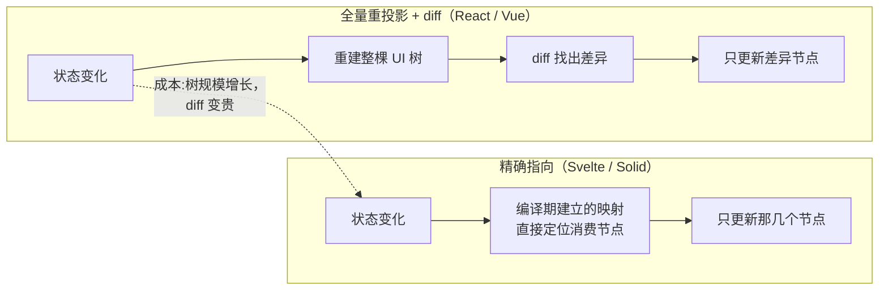
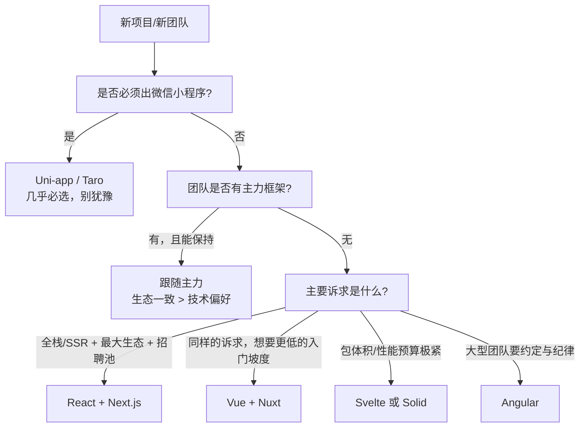

**TL;DR：** 主流框架之间的差异可以压缩到三根轴上：**渲染模型**（状态变化后，怎么更新 DOM——全量重投影 + diff，还是精确指向更新）、**响应式模型**（状态变化如何被发现——显式通知，还是依赖自动追踪）、**状态管理**（状态放哪——组件本地、全局 store、还是服务端状态）。React 与 Vue 的差异、Svelte 与 Solid 的差异、Angular 的转向，都是这三根轴上的位置移动。选型时真正起作用的是生态与团队心智，不是轴上的技术细节——决策树见第五节。

## 一、三根轴：先把"这是什么问题"讲清楚

上一篇[前端框架为什么这么乱](/writing/frontend-framework-history)把历史压成了四层地层。这一篇给一张地图：任何框架，都可以用三根轴定位。每一根轴，都先问"这是哪道题"，再看答案的端点在哪。

### 轴一：渲染模型——状态变了，谁负责更新 DOM

每框架都要回答：**状态变化之后，用什么方式把变化变成 DOM 更新？**

一端的答案是**全量重投影 + diff**：状态一改，把整棵 UI 描述树重新构建一遍，与上次的树比较，只把差异应用上去。这是 React（虚拟 DOM）与 Vue 的路数。它不关心"具体哪里变了"——开发者不需要说，框架自己 diff。代价是树重建的成本随规模增长，需要 memo 之类的手段手动控制。

另一端的答案是**精确指向**：编译期（Svelte）或细粒度响应式（Solid）预先建立"状态 → 它消费了哪些 DOM 节点"的映射，状态一改，直接更新那几个节点。没有整树重建，也没有 diff。

中间态是 React 的演进方向：memo 手动跳过子树，React Compiler（2024）把"跳过哪些"自动化——方向没变（还是全量投影的框架），只是把 diff 前的剪枝做得更聪明。

### 轴二：响应式模型——状态变化怎么被发现

第一根轴回答"更新怎么做"，第二根轴回答"**变化怎么被感知**"。

一端的答案是**显式通知**：代码必须主动说"我要改状态"——React 的 `setState`/`useState`。框架收到通知才知道要重投影。显式的代价是纪律（忘记调用就永远不更新），好处是可预测（更新必然来自一个明确的调用点）。

另一端的答案是**依赖自动追踪**：框架在"读"状态的那一刻记住"谁读了它"，状态写入时自动通知所有读者。Vue 的 `ref`（Proxy 拦截读写）、Solid 的 signals 都是这个机制。开发者不需要手动触发更新——"读即订阅，写即通知"。代价是追踪的隐式性：一个状态被谁消费，需要调试器帮忙看清。

这组对比可以浓缩成一句直觉：**React 问"你改了什么，告诉我"，Vue/Solid 问"你读了什么，我记住了"。** Angular 的 Zone.js 一度是第三种形态——把浏览器 API 全部打补丁，任何异步回调结束后扫描整棵树"有没有可能变了"，隐式到极端、成本也到极端；Angular 16+ 引入 signals 后，已经明显在向自动追踪的端点靠拢。

### 轴三：状态管理——状态放哪、谁有权改

前两轴回答"状态怎么流动"，第三轴回答"**状态存在哪**"。按位置分三档：

1. **组件本地**：状态随组件生灭。只服务一个组件的状态放这里，这是默认起点，也是被滥用最少的一档。
2. **全局 store**：跨组件/跨页面共享的状态（登录态、购物车、主题），需要脱离组件存在。Redux、Zustand、Vuex/Pinia 都是这一档的实现，差异在纪律严格度（纯函数 reducer vs 直接修改）。
3. **服务端状态**：来自 API 的数据（用户列表、订单），它不"属于"任何组件，有自己的生命周期（缓存、失效、重取）。React Query/SWR/Apollo 是这一档的专门答案，核心洞察是：**服务端状态不该塞进全局 store**——它需要的是缓存层而不是状态机。

第三档是被误解最多的：很多人把"组件间的共享数据"和"来自服务端的数据"混进同一个 store，然后发现逻辑复杂得失控。分开之后，全局 store 只剩薄薄一层，真正难做的缓存/重试/失效交给专门工具。

## 二、主流框架在三根轴上的位置

| 框架 | 渲染模型 | 响应式模型 | 状态档位 | 形态 |
| :--- | :--- | :--- | :--- | :--- |
| React | 虚拟 DOM + diff | 显式（setState） | 生态丰富（Redux/Zustand/Query） | 库，拼装生态 |
| Vue | 虚拟 DOM + diff | 自动追踪（Proxy） | 内置 Pinia + 生态 | 渐进式框架 |
| Svelte | 编译期精确指向 | 自动追踪（signals/runes） | 内置 store | 编译器 |
| Solid | 编译期精确指向 | 自动追踪（signals） | 轻量 store | 编译器 + JSX |
| Angular | 模板 + 变更检测（→signals） | Zone.js → signals | 内置 DI 全家桶 | 全家桶框架 |
| Preact | 虚拟 DOM + diff | 显式（同 React API） | 同 React 生态 | 3KB 的 React 兼容层 |

这张表就是"框架差异"的完整答案：它们不是四五个不同的世界，而是三根轴上的几个坐标点。读表的三条快结论：

- **React 的位置是"显式 + 全量"**：预测性强、生态最厚，但细粒度更新它天然做不到——它的优化方向是"减少 diff 前的重建量"。
- **Vue 与 Solid/Svelte 共享"自动追踪"，在渲染轴上分居两端**：Vue 自动追踪 + diff，Solid/Svelte 自动追踪 + 精确指向。
- **Angular 是唯一在往轴上移动的框架**：从隐式扫描（Zone.js）转向 signals，承认了"自动追踪 + 精确指向"是更好的坐标。

## 三、一个常被混为一谈的概念：框架 vs 库 vs 运行时

选型讨论里最容易卡壳的其实不是三根轴，而是三个层级的名词：**库、框架、运行时**。

- **库**：你调用它（React、Vue 核心都只是库），路由、状态、请求是外部拼装。
- **框架**：它调用你，把路由/状态/结构都替你定好（Angular、Next.js、Nuxt 这类"全家桶/全栈"）。
- **运行时**：上一集[容器层](/writing/js-ecosystem-layers)的 Node/Bun 是运行时；RN 的 Hermes 也是。

React 与 Angular 的争论有一半是层级的争论——拿"框架"的批评（替你决定太多）去批评一个"库"，不成立。先分清它是库还是框架，再谈它做得好不好。

## 四、选型决策树：什么时候选什么

技术细节的结论是：**三根轴上没有任何一个坐标是"绝对更好"**，所以选型决策树的第一层不是技术轴，而是约束条件：

每条分支的"为什么"：

- **小程序 → Uni-app/Taro**：国内业务"必须有小程序"时，这是出口问题，不是审美问题。
- **跟随主力**：团队里已有五年 React 经验的人，换 Vue 的隐性成本（心智、招聘、存量代码）远大于三根轴上的收益。
- **React vs Vue**：两者三根轴都极近，真正的差异是生态密度（React）与入门坡度（Vue 的模板更接近 HTML 心智）。选它俩没有技术上的错误答案，只有"团队谁会"的答案。
- **Svelte/Solid**：要的是"运行时薄"与"细粒度"，前提是团队消化得了编译期约束、生态没那么厚。
- **Angular**：要的是"框架替你决定"，适合必须统一约定的大型团队。

**"框架不重要"的悖论**：说"框架不重要"的人，通常指的是三根轴上的差异不重要——这基本正确；但框架的生态、招聘池、工具链、社区惯性非常重要。所以正确的结论是：**技术轴上选谁都行，生态与心智上必须认真选**。

## 五、如果重新学，我会怎么走

给正在入门的人一条具体的路（也是给转给团队新人的清单）：

1. **先把原生 HTML/CSS/JS 走完一遍**，至少能手写"点击按钮改列表"这种 DOM 操作——没有这一步，后面所有"框架帮你省了事"都没有参照系，你会把框架当魔法。
2. **选 React 或 Vue 之一，完整写完一个真实应用**（不是待办清单：一个有列表、筛选、表单、路由、本地存储的应用）。这一遍要理解的只有三件事：组件、状态、props。
3. **再学第二个框架，写同一个应用**。此时你才会真正感到三根轴的存在——"哦，原来这个框架不需要 setState，它自己知道"。
4. **然后才轮到状态管理与 SSR**：服务端状态用专门工具，全局状态用最薄的一档。
5. **最后再回头看 Svelte/Solid**——"没有 diff"的世界，只有知道 diff 在替谁付账的人才能欣赏。

顺序的关键是第 3 步：**第二个框架是第一个框架的说明书**。只学一个框架的人，会把框架的约定当成语言的语法；学过两个的人，才能看出哪些是约定、哪些是原理。

## 结论：框架选型先看渲染、响应式与状态三根轴

框架差异 = 三根轴上的坐标：渲染模型、响应式模型、状态管理。记不住框架名单没关系，记住三根轴就够判断任何新框架——新框架无非是把某个端点再推远一点，或者把某个代价再换一种付法。

选型时，约束条件排在技术轴前面：出口（小程序）、团队主力、生态与招聘池。入门时，按第五节的路走——先原生，再一个框架写完整应用，再用第二个框架做对照。

下一步：如果你已选定入门框架，把第五节第 2 步的那个"真实应用"清单打开，列出来，做完它；做完再读下一篇之前，先回去翻一遍本系列第一篇的"地层表"——两篇一起读，地图就闭合了。

## 参考资料

1. React 官方文档：Render and Commit（全量投影模型）—— https://react.dev/learn/render-and-commit
2. React 官方文档：useMemo 与 React Compiler（diff 前的剪枝）—— https://react.dev/reference/react/useMemo
3. Vue 官方文档：Reactivity in Depth（Proxy 自动追踪）—— https://vuejs.org/guide/extras/reactivity-in-depth.html
4. Svelte 官方文档：Runes（5.x 的 signals 化响应式）—— https://svelte.dev/docs/svelte/what-are-runes
5. Solid 官方文档：Reactivity（signals 与细粒度更新）—— https://www.solidjs.com/docs/latest
6. Angular 官方文档：Signals（16+ 引入，替代 Zone.js 变更检测）—— https://angular.dev/guide/signals
7. TanStack Query 官方文档（服务端状态的缓存层定位）—— https://tanstack.com/query/latest
8. Redux 官方文档：Motivation（全局状态的问题域）—— https://redux.js.org/introduction/motivation
9. Preact 官方文档（3KB 的 React 兼容层）—— https://preactjs.com/
10. 各框架包体积参考（Bundlephobia）—— https://bundlephobia.com/

> 延伸阅读：这些框架跑在什么容器里、引擎与运行时如何排列组合，见[V8 加减法：一个 JS 引擎的五种包装](/writing/js-ecosystem-layers)；三根轴背后的四层历史地层，见[前端框架为什么这么乱：四代问题与解法](/writing/frontend-framework-history)。
