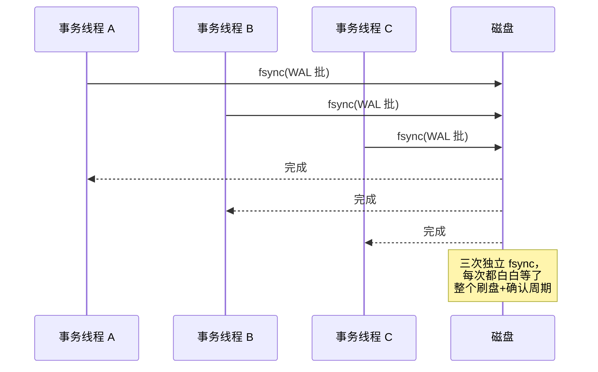
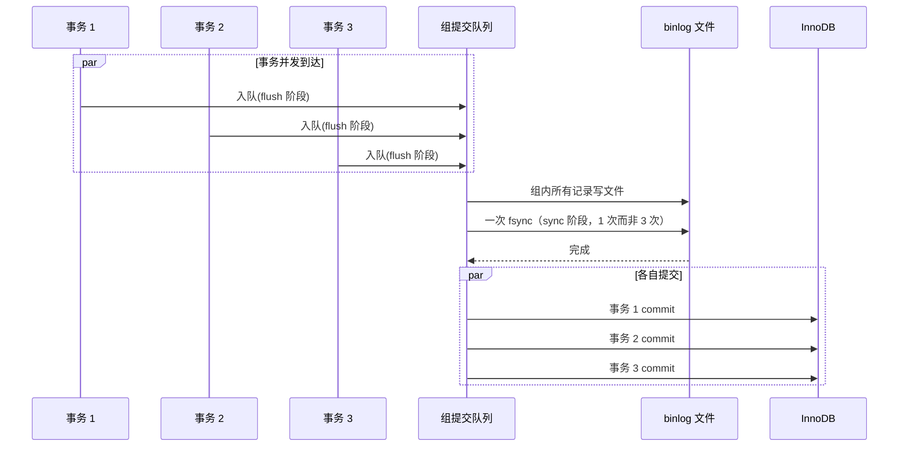

**TL;DR：** fsync 是持久化的唯一时点，也是提交路径上唯一的同步等待。数据库宁可慢，是因为 fsync 的语义无法绕过：write() 只把数据交进内核页缓存，断电一样丢。group commit 把"一次事务一次 fsync"变成"一批事务一次 fsync"，把吞吐从"1 / fsync 延迟"的锁死中解放出来，代价是批内最慢的成员决定整批的提交延迟。降档（synchronous_commit=off 之类）只是把账期拉长，每降一档都有一句必须写清楚的价签：能丢多久。

## 一、write() 返回了，数据却没到磁盘

先做一个实验。在一个空目录里写一个文件：

```bash
# 示意输出：strace 统计一次批量写入中的系统调用耗时
$ strace -c -e trace=write,fsync,fdatasync dd if=/dev/zero of=f bs=1M count=128 status=none
% time     seconds  usecs/call     calls    errors syscall
------ ----------- ----------- --------- --------- ----------------
 96.25    0.014295        28.6         1           fdatasync
  3.75    0.000551         0.0       128           write
```

`dd` 的 128 次 `write()` 每次都立刻返回成功——这不是数据已经到磁盘的证据，而是内核收下了一笔债务：脏页进了页缓存，真实落盘被推迟。`write()` 的系统调用语义是"把数据拷贝进内核页缓存"，仅此而已。页缓存里的脏页什么时候落到磁盘，由内核的写回机制（writeback）决定：`dirty_expire_centisecs`（默认 3000，即 30 秒）后、`dirty_ratio`（默认 20%）内存被脏页占满时、或后台 flusher 线程周期性唤醒时。断电时这些债务全部作废——`write()` 返回成功而数据蒸发，是内核完全合法的行为。

所以"持久化"必须由另一个系统调用完成：`fsync()`。它做两件事：**把该文件的所有脏页排队刷到设备；然后发一条 flush 命令，等设备确认"我缓存里的数据也落盘了"**。第二件事是设备侧的：SSD 内部的 DRAM 写缓存、机械盘的磁盘缓存都在这条命令里被强制清空。`fsync()` 返回成功 = 数据在断电后依然存在，这才是数据库能对外说"提交成功"的唯一依据。


*图注：write() 只走到页缓存；fsync 的职责是走完剩下的全部路径，直到设备确认。图中的任何一层缓存都可能撒谎，见第五节。*

这套语义有个直接推论：**fsync 是提交路径上唯一无法绕过的同步点**。一个事务的提交等于"WAL 记录被 fsync"，其余工作（改页、追加日志到缓冲区）都可以在内存里完成。于是数据库的提交延迟 ≈ fsync 延迟，数据库的提交吞吐 ≈ "单位时间内能做多少次 fsync"——这就是本文全部问题的起点。

写这篇文章时，我特意把 WAL 那篇[WAL 是数据库的命根子](/writing/wal-crash-recovery)里讲过的内容（torn write、checkpoint、档位表、硬件防线的清单）留在那边，这篇只谈 fsync 本身：它的语义、它的延迟去哪了、group commit 怎样把它的次数压下来。

## 二、一次 fsync 的时间去哪了

fsync 的延迟不是恒定的。同一块盘上，空闲时和写满时测出来的数字可以差一个数量级。先给一个量级参考（顺序写场景，`pg_test_fsync` 或 `fio` 实测常见区间）：

| 设备 | 单次 fsync 延迟 | 说明 |
| :--- | :--- | :--- |
| NVMe SSD（数据中心级） | 约 0.1–1 ms | 空闲时接近 100µs；有积压时到毫秒级 |
| SATA SSD | 约 0.5–3 ms | 消费级盘无掉电保护，语义存疑 |
| 机械盘（7200rpm） | 约 8–15 ms | 每次 sync 都要等盘片转到位 |

两个反直觉的事实藏在数字后面：

**第一，fsync 延迟 ≈ 等待前面积压的 IO 清空。** 内核刷这个文件的脏页时，要与设备上已有的写请求竞争。设备队列越满，flush 等得越久。所以 fsync 的延迟波动，主要不是"这次 sync 本身慢"，而是"前面欠了多少账"。这也是为什么把 `dirty_ratio` 调大、让内核攒更多脏页，反而会放大单次 fsync 的延迟——你的提交在替整个系统还债。

**第二，fsync 和 fdatasync 不是同一件事。** `fsync()` 除了刷数据，还刷文件元数据（inode、目录项）；`fdatasync()` 只管数据。对固定大小、预先分配的 WAL 段文件，元数据几乎不变，所以 `fdatasync` 通常更快，这正是 PostgreSQL 在 Linux 上默认 `wal_sync_method=fdatasync` 的原因[^fsync]。RocksDB 的 `recycle_log_file_num` 复用旧文件也是为了省掉元数据刷新的开销。第一节的 strace 已经能看出这层差别：128 次 `write()` 只占百分之几的时间，真正的时间几乎全堆在最后一次同步刷盘上。

`pg_test_fsync` 是 PostgreSQL 自带的工具，把这台机器上五种 `wal_sync_method` 的平均延迟逐一打出来，文档里它的用途写得很直白——"determine fastest wal_sync_method for PostgreSQL"：

```bash
# 示意输出：pg_test_fsync 在本机（NVMe）的实测区间
$ pg_test_fsync
...
Open file 'pg_fsync_test', w+b.  Writing 4000 random 8kB buffers
Performing 10,000 fsync operations per method
	fdatasync                                2056.988 ops/sec    0.486 msec/op
	fsync                                    2046.113 ops/sec    0.489 msec/op
	open_sync                                2060.224 ops/sec    0.485 msec/op
	open_datasync                            2006.456 ops/sec    0.498 msec/op
```

注意一个陷阱：**`pg_test_fsync` 测的是"这台机器此刻的延迟"，不是"这台设备会不会撒谎"**。它证明不了 fsync 语义可靠，只回答"fsync 是不是瓶颈"这个前提问题。设备撒谎的检测要靠别的手段（见第五节）。

## 三、每次提交都 fsync，吞吐被一把锁锁死

现在把数学摆出来。单线程、每次提交一次 fsync 的模型下：

**提交吞吐 ≈ 1 / fsync 延迟**

这是硬上限：线程只能"提交 → 等 fsync 返回 → 再提交"，串行循环。fsync 1ms，吞吐上限就是每秒约 1000 次提交；fsync 10ms，就掉到每秒约 100 次。这个模型解释了所有"为什么加并发也没有用"的困惑——多个线程各自等自己的 fsync，互不合并，锁还在：



三个线程的 fsync 是三个独立请求，每个都完整地走一遍"排队 → 刷盘 → 确认"。吞吐依然是约 1/fsync，只是并发把等待藏进了别的线程里。

这就是 group commit 的全部动机：**如果三个事务的 WAL 记录本来就在同一个缓冲区里挨着，为什么不能让一个人去 fsync，三个人一起等？**

## 四、group commit：把 fsync 从"次数"变成"批次"

### 4.1 原理：leader-follower，一次 fsync 服务一批

group commit（组提交）的结构一句话：**多个提交者并发时，第一个到达的人成为 leader，把整批的日志刷走；其余人看到自己的 LSN 已被刷过，直接返回成功，不重复 fsync**。WAL 是纯顺序追加，这保证了"挨在一起的记录，一次 fsync 全部覆盖"——PostgreSQL 官方文档对它的定义就是一句话："one fsync of the WAL file may suffice to commit many transactions"。

```go
// group commit 概念示意（非任何数据库的真实源码）
func commit(w *WALWriter, buf *WALBuffer) error {
    lsn := buf.Append(commitRecord) // 1. 追加自己的 COMMIT 记录，拿到 LSN

    w.group.Lock()
    if w.flushedLSN < lsn {         // 2. 自己是否落后于最新 flush 位置
        w.flushedLSN = lsn
        w.fsync()                   // 3. 只有 group leader 执行真正的 fsync
    }
    w.group.Unlock()                // 4. 其余线程醒来发现自己的 LSN 已落盘
    return nil                      // 5. 向客户端返回 COMMIT
}
```

吞吐模型随之改变：**提交吞吐 ≈ 批次大小 × (1 / fsync 延迟)**。fsync 1ms、平均一批 20 个事务，吞吐就能从约 1000 tps 拉到约 2 万 tps。批次大小由并发度决定：并发越高，同一时刻排队等提交的人越多，批越大——这正是"数据库并发越高，group commit 收益越明显"的原因。

### 4.2 PostgreSQL：从 commit_delay 到默认的自动组提交

PostgreSQL 的提交路径是 `XLogInsertRecord`（把记录追加进 WAL 缓冲区）加 `XLogFlush`（把缓冲区刷到磁盘），后者主要在事务提交时触发。组提交在早期版本里并不自动：`commit_delay` 参数让 leader 在持有锁后先睡一会儿，等更多人加入本批再刷，需要配合 `commit_siblings` 规定"至少攒几个"才值得等。这个设计的本质是"用延迟换批次"——主动等，批次才够大。

到 9.5 以后，组提交变成了默认路径上的自动行为：等待者不再重复抢锁做 fsync，而是直接阻塞在"刷盘完成"这个事件上，leader 的 fsync 完成即唤醒整批。`commit_delay` 默认 0，高并发下的组提交依然发生——"在同一时间窗口内到达的提交"自然共享同一批，不需要 leader 额外睡觉。`commit_delay` 只在你刻意想放大批次时才有意义，而放大批次 = 人为增加提交延迟，绝大多数场景不值得。

这里有个容易被误读的点：**"每次提交都 fsync"不等于"每个事务单独调用一次 fsync"**。commit 时 flush 的是 WAL 缓冲区，里面通常攒着多个事务的记录，一次 fsync 覆盖整批。真正的"一事务一 fsync"只在并发为 1 时近似成立。

### 4.3 MySQL：为什么 5.6 之前做不到，之后才做到

MySQL 的组提交史是一段更长的弯路，值得单独讲，因为它把 group commit 的难点暴露得最清楚。

5.6 之前，MySQL 的提交路径上有两次必须的 fsync，而且**互不合并**：先 InnoDB prepare 阶段 fsync redo log，再 binlog 落盘阶段 fsync binlog。两个文件、两次等待、顺序执行，一个事务的提交被钉死在"2 × fsync 延迟"上，且并发事务之间完全独立——binlog 的 fsync 没有合并机制。这组"两把锁串行"的问题让 5.6 之前的 MySQL 在 `sync_binlog=1` + `innodb_flush_log_at_trx_commit=1` 的默认档位下，吞吐被 fsync 延迟锁死。

5.6 的修复是"三阶段组提交"：把提交路径拆成 **flush（把各自的 binlog cache 写入文件）→ sync（一次 fsync 刷整组 binlog）→ commit（InnoDB 层提交）** 三个阶段，每个阶段都是"一个 leader 干活、整组人共享"：



三个阶段各自有锁（`LOCK_flush`、`LOCK_sync`、`LOCK_commit`），组长持锁干活、组员排队等结果。fsync 的次数从"事务数 × 2"变成"组数 × 2"——批次的粒度从单个事务提升到整个并发组。

这个演进史说明一件事：**group commit 不是数据库的某种"优化技巧"，而是提交路径的默认正确形态**。5.6 之前 MySQL 的问题不是"没做优化"，而是架构上把两次 fsync 串在了无法共享的路径上。

### 4.4 三引擎的组提交横截面

| 维度 | PostgreSQL | MySQL InnoDB + binlog | RocksDB |
| :--- | :--- | :--- | :--- |
| **合并单位** | WAL 缓冲区 | flush / sync / commit 三阶段组 | 写队列里的 WriteBatch 组 |
| **触发方式** | 并发到达自动组批 | 阶段锁 + leader-follower | 写线程排队，同步写共享一次 fsync |
| **代价** | 批内最慢决定批延迟 | 阶段间等待放大了尾延迟 | 单写线程等待整组 |
| **手动旋钮** | `commit_delay`（默认 0） | `binlog_group_commit_sync_delay`（默认 0） | `WriteOptions.sync`（默认 false） |

### 4.5 组提交的代价：批次是别人替你做决定的等待

组提交优化的不是延迟，是吞吐。这个区分必须清楚：**批内所有成员拿到结果的时间 = 批内最后一个成员的日志就绪时间 + 一次 fsync**。也就是说，你的事务可能本来 0.5ms 就能提交，因为要等批里最慢的人，实际花了 1ms。批越大，吞吐越高，单事务延迟的尾部越长——这是组提交的固定税。

所以 group commit 之后，数据库的提交延迟分布会变"胖"：p50 下降（多数人搭了便车），p99 上升（最慢的成员带动整批）。性能评估看 p99 而不是 p50 的人，会误判"group commit 让数据库变慢了"。它没有，它只是把延迟从"每个事务各自承担"变成了"批内均摊"。

## 五、降档：账期拉长，价签必须写清楚

fsync 的等待还能不能更少？能，但只有一种方式：**减少"必须等待 fsync 的提交"的占比**，即放宽账期。WAL 那篇的[档位表](/writing/wal-crash-recovery)已经把这笔账算完，这里只重复结论和一个前提：

- `synchronous_commit=off` 不是关掉 WAL，是让提交不等 fsync，由后台 `wal_writer` 周期性刷（`wal_writer_delay` 默认 200ms）——丢最近约 200ms 内的已确认事务；
- `innodb_flush_log_at_trx_commit=0/2` 同理，账期拉长到约 1 秒；
- 降档的前提是两件事同时成立：压测证明瓶颈在提交路径的 fsync 上，且业务写得出一句"能丢多久"。缺任何一个，都留在默认档。

为什么数据库"宁可慢"？因为默认档位的语义最简单：提交成功 = 已落盘。降档是把"成功"的定义改了，改成"成功 = 已进缓存，稍后落盘"——这是对客户端的撒谎，必须知道谎言的最长有效期。

最后一种情况比降档更危险：**fsync 失败了，但系统假装成功**。Linux 上 fsync 返回 EIO 时，内核可能随后"清掉"这个错误标记，紧接着对同一批数据的第二次 fsync 返回成功——写入已经被丢弃，却看起来一切正常。PostgreSQL 为此把关键路径（WAL、checkpoint）上的 fsync 失败直接 PANIC：让崩溃恢复从上次 checkpoint 重放，把失败的写重做一遍。带电池的 RAID 控制器（BBU）如果驱动不转发 FLUSH CACHE 命令、虚拟化平台不透传写、消费级 SSD 没有掉电保护（PLP），fsync 都会"撒谎"。数据库对 fsync 的信任没有替代品：**fsync 语义依赖硬件不撒谎，数据库能做的只是把失败当灾难处理**。

## 结论：group commit 让持久性成本按批次摊平

回到开头的问题：数据库为什么宁可慢，也要等 fsync？答案分三层：

1. **语义层**：write() 只到页缓存，fsync 才到设备——"提交成功"这个概念本身必须建立在一个无法绕过的同步点上，否则就是谎报。
2. **性能层**：等 fsync 不等于吞吐低。group commit 把成本从"每事务一次"摊成"每批一次"，用批内均摊的延迟换取数量级上的吞吐；觉得"fsync 慢"之前，先确认自己的提交路径有没有走到 group commit（并发够不够、`commit_delay` 之类旋钮有没有被乱动）。
3. **决策层**：降档唯一合法的理由，是压测证明 fsync 是瓶颈、且业务明确写下了可接受丢失窗口。写不出来的，默认档就是答案。

下一步可做的事，就三条命令：

```bash
$ pg_test_fsync                              # 这台机器上 fsync 到底多慢
$ SHOW synchronous_commit;                   # 现在欠多久的账
$ SHOW innodb_flush_log_at_trx_commit;       # MySQL 同理（如果用的是 MySQL）
```

## 参考资料

1. PostgreSQL 官方文档：Write-Ahead Logging (WAL)（"one fsync of the WAL file may suffice to commit many transactions"）—— https://www.postgresql.org/docs/current/wal-intro.html
2. PostgreSQL 官方文档：WAL Configuration（XLogInsertRecord / XLogFlush、commit_delay、checkpoint_completion_target）—— https://www.postgresql.org/docs/current/wal-configuration.html
3. PostgreSQL 官方文档：WAL Reliability（fsync 语义与硬件缓存）—— https://www.postgresql.org/docs/current/wal-reliability.html
4. PostgreSQL 官方文档：pg_test_fsync —— https://www.postgresql.org/docs/current/pgtestfsync.html
5. MySQL 官方文档：Binary Log Group Commit（flush/sync/commit 三阶段）—— https://dev.mysql.com/doc/refman/8.4/en/binary-log-group-commit.html
6. MySQL 官方文档：innodb_flush_log_at_trx_commit —— https://dev.mysql.com/doc/refman/8.4/en/innodb-parameters.html#sysvar_innodb_flush_log_at_trx_commit
7. RocksDB Wiki：Write Ahead Log (WAL)（WriteOptions.sync 与组写入）—— https://github.com/facebook/rocksdb/wiki/Write-Ahead-Log-(WAL)
8. LWN：Postgres, fsync, and OSs（fsync 错误语义与 PANIC 处理）—— https://lwn.net/Articles/753184/
9. Linux 内核文档：dirty_expire_centisecs / dirty_ratio 写回参数 —— https://docs.kernel.org/admin-guide/sysctl/vm.html

> 延伸阅读：fsync 只是 WAL 纪律的一个零件——日志先行、崩溃恢复与 checkpoint 的完整账本，见[WAL 是数据库的命根子](/writing/wal-crash-recovery)；复制延迟的账单与读路径设计的三种姿势，见[主从复制延迟 300ms 的账单：读路径设计的三种姿势](/writing/replication-lag-read-paths)。

[^fsync]: 严格说还有 `fdatasync`——只刷数据不刷文件元数据；`O_SYNC`/`O_DSYNC` 把同步语义搬进 `open()` 标志。本文统称 fsync，指"把数据送到稳定存储并等待确认"这组语义。
