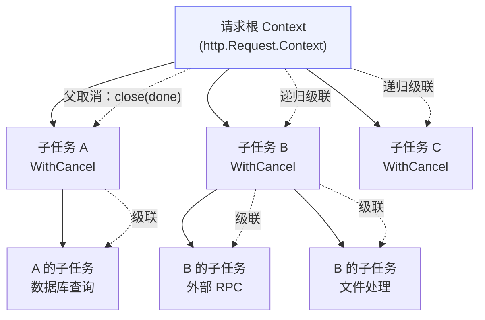
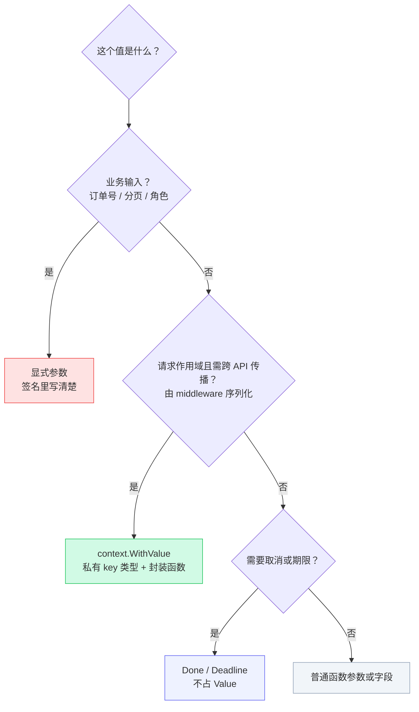

**TL;DR：** `context.Context` 只该回答三个问题：这次工作取消了吗（`Done`/`Err`）、最晚什么时候结束（`Deadline`）、当前进程内有哪些请求范围的基础设施元数据（`Value`）。跨进程传播不能靠 `Value` 自动完成，还需要显式编码到 HTTP header、RPC metadata 或消息字段。Context 由四种实现嵌套成一条链，取消沿树向下传播、期限是越传越短的预算；业务参数走显式参数，资源清理走 `defer`，这几条边界划清楚，代码的诚实程度就上来了。

## 一、Context 只回答三个问题

`context.Context` 是 Go 服务端代码里最常见、也最容易被滥用的接口。它看起来什么都能干，于是常常被当成方便的隐式参数表。先看它真正的形状：

```go
type Context interface {
    Deadline() (deadline time.Time, ok bool)
    Done() <-chan struct{}
    Err() error
    Value(key any) any
}
```

四个方法、一个通道（`Done()`）+ 一个 deadline 时间点：`Done()` 返回一个只读 channel，取消时被关闭；`Err()` 说明取消原因；`Deadline()` 给出最晚完成时间；`Value(key)` 按 key 取元数据。一个函数接收 Context，通常只需要回答三个问题：

1. **这次工作是否已经取消？**——`Done()` 关闭、`Err()` 是 `context.Canceled` 还是 `context.DeadlineExceeded`。
2. **最晚应该在什么时候结束？**——`Deadline()` 给出时间点，超过它就该停下来。
3. **当前进程里有哪些请求范围的基础设施元数据？**——`Value()` 可以取 trace ID、认证主体等信息；如果它们要跨进程传递，必须由 tracing/RPC middleware 显式序列化和恢复。

业务参数不在这份清单里。订单号、分页大小和权限策略应该以明确的参数或类型出现。这句话不是风格偏好，是接口设计的结果：Context 的传递是隐式的，而函数签名里的参数是显式的；把业务参数塞进 Context，等于给每个函数藏了一个编译器看不见的入参。

## 二、四种实现，一条链

标准库的 Context 没有魔法，`Background()` 返回的只是一个零值的 `emptyCtx`。真正的行为来自另外三种实现，它们通过嵌套组合成一条链：

| 实现 | 职责 | 关键字段 | 创建方式 |
| :--- | :--- | :--- | :--- |
| `emptyCtx` | 空 Context，永不取消、无期限、无值 | 无 | `Background()` / `TODO()` |
| `cancelCtx` | 手动取消，取消时级联子节点 | `done`、`err`、`children` | `WithCancel(parent)` |
| `timerCtx` | 到期限自动取消 | 内嵌 `cancelCtx` + `timer` | `WithTimeout` / `WithDeadline` |
| `valueCtx` | 携带一个 key-value | 内嵌 `Context` + `key`/`val` | `WithValue(parent, k, v)` |

每个 `WithCancel` / `WithTimeout` / `WithValue` 都是在外层包一层新节点。于是每次 `ctx.Value(key)` 都是一次沿链向上的线性查找——不是从全局容器里取数，而是从当前节点出发，逐层比较 key，找到第一个匹配就返回：


*图注：`ctx.Value` 是链式查找而不是容器读取——从调用点沿 parent 指针向上，逐层比对 key；业务参数混进这条链，每个中间层都多一个隐式入参。*

这也解释了为什么官方要求 **key 使用私有类型而不是 string**：字符串 key 在同一请求的不同包之间可能撞车（`"user"` 在 A 包是用户名、在 B 包是用户对象），查找只认类型 + 值相等。私有 key 类型把撞车概率降到零：

```go
type ctxKey int

const traceIDKey ctxKey = 0

func WithTraceID(ctx context.Context, id string) context.Context {
    return context.WithValue(ctx, traceIDKey, id)
}

func TraceID(ctx context.Context) string {
    if id, ok := ctx.Value(traceIDKey).(string); ok {
        return id
    }
    return ""
}
```

封装函数把类型断言的丑陋细节留在包内，调用方永远看不到 `ctxKey` 是什么。

## 三、取消：协作式信号，向下传播

`WithCancel` 创建的是一个 `cancelCtx`，它维护一张 `children` 表。父节点被取消时，会递归取消所有子节点——取消信号沿树向下传播：



创建子任务时，继续传入已有的 Context：

```go
func (s *Service) LoadProfile(ctx context.Context, id string) (Profile, error) {
    profile, err := s.repo.Find(ctx, id)
    if err != nil {
        return Profile{}, fmt.Errorf("load profile: %w", err)
    }
    return profile, nil
}
```

不要在调用链中某处用 `context.Background()` 重新开始——那会切断上游的超时和取消信号，让已经失去意义的工作继续消耗资源。`Background()` 的正确使用场景只有两个：main 函数的根、以及库函数在调用方没传 Context 时的兜底。

**关键认知：取消是协作式的，但取消传播不是“只关一个 channel”。** `cancel()` 会记录取消错误与 cause、关闭或标记 `Done()`，递归取消子节点，并清理父子关系；它不会强行中断正在执行的业务函数。真正停止工作的是每个 goroutine 自己对 `Done()` 的监听。如果一段代码接收了 Context 却从不检查它，那么取消对它的工作循环毫无作用，资源照常泄漏。最典型的泄漏是这种“信号发了没人听”：

```go
// 泄漏版：错误写法——worker 没有任何退出分支,ctx 取消对它毫无作用
func leak(ctx context.Context) {
    ch := make(chan int)
    go func() {
        for {
            select {
            case n := <-ch:
                handle(n)
            default:
                work()
            }
        }
    }()
}
```

```go
// 修复版：正确写法——select ctx.Done(),取消信号到达即收尾退出
func leakFixed(ctx context.Context) {
    ch := make(chan int)
    go func() {
        for {
            select {
            case n := <-ch:
                handle(n)
            case <-ctx.Done():
                return // 取消信号到达,退出
            default:
                work()
            }
        }
    }()
}
```

去掉 `case <-ctx.Done()` 那一路，这个 goroutine 就再也停不下来。**取消信号的价值，等于接收方监听的数量。**

### 源码解剖：一次 cancel() 调用，源码里发生了什么

"协作式取消"落到标准库源码里只有三十来行。以 Go 1.25.1 为例，`cancelCtx.cancel()` 的核心流程是三步：**先写 err，再 close(done)，最后递归取消子节点**（摘自 Go 1.25.1 src/context/context.go:547-577）：

```go
// cancelCtx.cancel()(L547-577,节选)
func (c *cancelCtx) cancel(removeFromParent bool, err, cause error) {
    if err == nil {
        panic("context: internal error: missing cancel error")
    }
    ...
    c.mu.Lock()
    if c.err.Load() != nil {
        c.mu.Unlock()
        return // already canceled
    }
    c.err.Store(err)
    c.cause = cause
    d, _ := c.done.Load().(chan struct{})
    if d == nil {
        c.done.Store(closedchan)
    } else {
        close(d)
    }
    for child := range c.children {
        child.cancel(false, err, cause) // 递归取消子 context
    }
    c.children = nil
    c.mu.Unlock()
    if removeFromParent {
        removeChild(c.Context, c)
    }
}
```

这个顺序是刻意设计的，三条都值得记住：

1. **先 `err.Store(err)` 再 `close(d)`**：下游 goroutine 从 `Done()` 醒来时，`Err()` 一定已非 nil。反过来先 close 再写 err，监听方会读到 nil 的 Err，取消原因就丢了；
2. **`done` 懒创建、只 close 一次**：channel 在第一次调用 `Done()` 时才创建，存放在 `atomic.Value` 里；`err.Load() != nil` 的分支保证 cancel 只生效一次，不会重复 close；
3. **递归清空 children**：`for child := range c.children { child.cancel(false, ...) }` 之后置 nil——"取消沿树向下传播"的源码定义就是这四行，父节点取消的瞬间整棵子树同步走完。

`WithTimeout` 创建的 `timerCtx` 在此基础上多一步：提前 cancel 时**停掉定时器**（摘自 Go 1.25.1 src/context/context.go:677-689）：

```go
// timerCtx.cancel()(L677-689):提前 cancel 会 stop 定时器
func (c *timerCtx) cancel(removeFromParent bool, err, cause error) {
    c.cancelCtx.cancel(false, err, cause)
    if removeFromParent {
        removeChild(c.cancelCtx.Context, c)
    }
    c.mu.Lock()
    if c.timer != nil {
        c.timer.Stop()   // 关键:定时器被停掉,不会泄漏
        c.timer = nil
    }
    c.mu.Unlock()
}
```

这也是第五节 `defer cancel()` 那条纪律的源码依据：提前 cancel 时 `timer.Stop()`（L685）立即执行，计时器马上释放，不用等期限到期；漏掉 defer，timer 只能等到期才被回收——循环里高频创建 `WithTimeout`，堆积的 timer 就是实打实的泄漏。

而"父取消 → 子级联"在绝大多数情况下**不需要任何额外 goroutine**。`WithCancel(parent)` 创建子 context 时，`propagateCancel` 按路径处理（摘自 Go 1.25.1 src/context/context.go:473-527）：

```go
// propagateCancel(L473-527,节选):父→子级联的三路策略
func (c *cancelCtx) propagateCancel(parent Context, child canceler) {
    c.Context = parent
    done := parent.Done()
    if done == nil {
        return // parent 永远不取消
    }
    select {
    case <-done:
        child.cancel(false, parent.Err(), Cause(parent)) // 父已取消
        return
    default:
    }
    if p, ok := parentCancelCtx(parent); ok {
        p.mu.Lock()
        if err := p.err.Load(); err != nil {
            child.cancel(false, err.(error), p.cause)
        } else {
            if p.children == nil {
                p.children = make(map[canceler]struct{})
            }
            p.children[child] = struct{}{}   // 注册进父的 children,零额外 goroutine
        }
        p.mu.Unlock()
        return
    }
    ... // 父类型未知:起一个 goroutine 监听(最后一个兜底)
}
```

各条路径：父从不取消 → 什么都不注册；父已取消 → 立即取消子；父是标准 `cancelCtx`/`timerCtx` → 把子注册进 `p.children`，父取消时在父的 cancel() 里同步递归，零额外 goroutine；父实现了 `afterFuncer`（`AfterFunc`）→ 注册回调；只有父类型完全未知的自定义 Context，才起一个常驻 goroutine 监听兜底。

这个设计把"用 Context 传值"从风格建议变成实现约束：级联依赖的是**派生时刻的注册**——只有 `With*(parent)` 调用时，子节点才被登记进父的 children。任何不经过当前链派生的用法（比如中途用 `context.Background()` 重开、把别的 Context 塞给子任务）都绕过了 propagateCancel 的注册时机，上游的取消信号再也到不了这一支——这就是"不切断 Context 链"这条惯例的源码根据。

## 四、AfterFunc 与取消原因：取消的两种现代姿势

第三节看的是"取消怎么传播"，这一节看两个相对新（Go 1.20/1.21）的能力：**取消时干什么** 与**取消为什么**。

**`context.AfterFunc`（Go 1.21+）**：注册一个"ctx 取消后要跑的回调"，回调在**独立 goroutine** 里执行，且最多跑一次。源码里是 `a.once.Do(func() { go a.f() })`——`once` 保证幂等，`go` 保证不阻塞取消路径。典型用途是给"没法 select ctx.Done()"的资源安排退场：

```go
// AfterFunc：ctx 一旦取消，回调在独立 goroutine 执行（最多一次）
stop := context.AfterFunc(ctx, func() {
    f.Close() // 慢速资源的关闭挪出取消路径，取消不会被它拖住
})
defer stop() // 正常路径退出时撤销回调；stop() 返回 false 说明已触发

<-ctx.Done() // 之后可以确定回调要么已跑、要么已撤销
```

`stop()` 返回 false 表示回调已经（或即将）执行——判断"清理是否完成"靠它，别自己猜时序。和 `defer cancel()` 的差别：cancel 管"要不要继续"，AfterFunc 管"结束后顺手做什么"。

**`WithCancelCause`（Go 1.20+）**：给取消一个**原因**。`cancelCause(err)` 把 err 记进 ctx，下游用 `context.Cause(ctx)` 取出来，从而区分"为什么取消"：

```go
// WithCancelCause：取消时带上原因，下游据此分类处理（Go 1.20+）
ctx, cancelCause := context.WithCancelCause(parent)
cancelCause(errClientDisconnected) // 客户端断开

select {
case <-ctx.Done():
    if errors.Is(context.Cause(ctx), errClientDisconnected) {
        // 客户端断开：不值得重试
    }
    return ctx.Err() // 其他原因：按策略决定是否重试
case result := <-resultCh:
    return result
}
```

三条规则记清楚：

1. **cause 沿树传播**：第三节源码里的 `c.cause = cause` 与 `propagateCancel` 的 `child.cancel(false, err.(error), p.cause)`——父带原因取消，整棵子树拿到的是同一个 cause；
2. **没有 cause 时退化为 sentinel**：不带原因取消，`Cause` 返回 `context.Canceled`；期限到期返回 `context.DeadlineExceeded`；
3. **标准库不帮你填原因**：`net/http` 服务端在客户端断开时 cancel 请求 ctx，但**不设置 cause**——`context.Cause(r.Context())` 拿到的只是 `Canceled`。想让下游区分"用户断开"和"主动关闭"，必须自己在中间件里用 `WithCancelCause` 包一层。

## 五、期限：越传越短的预算

`WithTimeout` 是 `WithDeadline` 的语法糖：`now + d`。它创建的是 `timerCtx`，到期后自动调用 cancel，`Err()` 返回 `context.DeadlineExceeded`：

```go
ctx, cancel := context.WithTimeout(ctx, 100*time.Millisecond)
defer cancel() // 即使提前返回也释放计时器

var profile Profile
err := db.QueryRowContext(ctx,
    "SELECT name, email FROM users WHERE id = $1", id,
).Scan(&profile.name, &profile.email)
```

**defer cancel() 不是可选项。** `WithTimeout` 会启动一个真实的计时器，函数返回但没调用 cancel，计时器就会一直等到期才被回收。defer 保证两条：提前返回时立即撤销派生 Context（下游尽早收到取消），以及计时器及时释放。

漏掉 defer 的后果是计时器堆积：在 `for` 循环里高频创建 `WithTimeout`，每个 Context 的计时器都要等到期才被回收，堆积起来就是实打实的内存泄漏。

期限是一条**只减不增** 的预算链：入口处定了 500ms，每经过一层 `WithTimeout(100ms)`，剩余预算就在缩小。这符合直觉——服务端在用户等待时间内要完成的事是有限的，每一层都只该收紧、不该放宽。

给已经超时的 Context 再加时间（比如用 `context.WithTimeout(context.Background(), ...)` 重造），等于把上游的耐心全部作废。

HTTP 服务的入口把整个请求的生命周期绑定在 `r.Context()` 上：客户端断开、服务超时都会关闭它。正确的做法是把它一路传下去，数据库、Redis、下游 RPC 全都消费同一份预算，而不是各自 `Background()` 一遍。

## 六、错误包装与取消的区分：errors.Is 是你的分类器

`context.Canceled` 与 `context.DeadlineExceeded` 是 Go 里最著名的两个哨兵错误，但把取消当错误处理时有个常见误判：**「`ctx.Err() == context.Canceled` 说明用户断开了」**。错在两层：

1. `==` 不认包装。`fmt.Errorf("query: %w", ctx.Err())` 包装过后，`==` 永远不成立——哨兵错误的比较必须走 `errors.Is`；
2. 就算走 `errors.Is`，`Canceled` 也只说明"被取消了"，分不清是客户端断开、服务端主动 cancel 还是上游级联——那是第四节 `Cause` 的活。

正确的分类姿势：

```go
func classify(err error) {
    switch {
    case errors.Is(err, context.DeadlineExceeded):
        // 预算耗尽：记超时账、考虑限流告警，但别把锅甩给下游
    case errors.Is(err, context.Canceled):
        // 被取消：查 cause 再决定要不要重试
    default:
        // 真正的业务错误
    }
}
```

两个工程含义：

- **统计口径**：超时和取消在监控里应该分开记——超时是"系统没来得及"，取消往往是"调用方不想要了"。混在一起，容量规划和对外的 SLO 都会失真；
- **重试策略**：`DeadlineExceeded` 值得按预算分配重试，`Canceled` 且 cause 是"客户端断开"时重试毫无意义（没人听了）。重试逻辑判定的是错误**分类**，不是错误**对象**——所以所有分支都走 `errors.Is`。

## 七、取消不是清理

`ctx.Done()` 告诉协程"可以停了"，却不会替你关闭文件、回滚事务或回收连接。取消只是信号，资源清理仍然需要清晰的所有权和 `defer`：

```go
func (s *Service) DoWork(ctx context.Context, id string) error {
    conn, err := s.pool.Acquire(ctx)
    if err != nil {
        return err
    }
    defer conn.Release() // 资源生命周期由 defer 负责

    select {
    case result := <-resultCh:
        return result, nil
    case <-ctx.Done():
        return Result{}, ctx.Err()
    }
}
```

把 cancel 当"清理工具"用是常见的认知错位：有人看到 `defer cancel()` 就以为它负责关闭连接——它只负责撤销 Context，连接池的归还、文件的关闭是 `defer conn.Release()`、`defer f.Close()` 的职责。两者是不同层的东西：**cancel 管理的是"还要不要继续"，defer 管理的是"结束后留下什么"。**

## 八、Value 要克制：元数据通道，不是参数口袋

适合放进 Context 的值通常满足两个条件：**属于请求作用域，并需要沿当前进程的调用链传播**；它的来源或去向可能位于 HTTP/RPC 等进程边界，但序列化和恢复必须由 middleware 或客户端库完成。第二个条件是它**不属于业务输入**，没有它业务照样能算，只是日志或鉴权上下文不完整。典型例子是 trace ID、认证主体、区域信息。官方文档说这些值可以随请求跨越进程或 API 边界，但 `Context` 本身不负责跨进程传输。

真正容易踩的坑是把业务参数塞进去：

```go
// 反模式：业务参数走 Value
ctx := context.WithValue(ctx, ctxKey("user_id"), userID)
ctx = context.WithValue(ctx, ctxKey("page"), 2)
ctx = context.WithValue(ctx, ctxKey("role"), "admin")
service.ListOrders(ctx) // 签名上看不出依赖什么

// 正解：显式参数
service.ListOrders(ctx, ListOrdersInput{
    UserID: userID,
    Page:   2,
    Role:   "admin",
})
```

反模式的代价在改动时显现：函数签名看不出它依赖 `"user_id"` 这个字符串键，重构改名、删除依赖时编译器完全不帮忙；测试时想构造一个最小调用，也得先拼一堆 `WithValue`。隐式依赖的代码，测试成本是显式依赖的好几倍。

判断一个值该不该进 Context，走这棵决策树：



一次完整流转把上面的原则串起来——**入口注入一次，中间层只透传**：

```go
// 入口中间件：整条链上唯一需要 WithValue 的地方
func traceMiddleware(next http.Handler) http.Handler {
    return http.HandlerFunc(func(w http.ResponseWriter, r *http.Request) {
        id := r.Header.Get("X-Trace-ID")
        if id == "" {
            id = newTraceID() // 没有就生成一个
        }
        w.Header().Set("X-Trace-ID", id)
        ctx := WithTraceID(r.Context(), id) // 注入点
        next.ServeHTTP(w, r.WithContext(ctx))
    })
}

// 任意下游层：只传 ctx，不传 id
func (s *Service) Handle(ctx context.Context, userID string) error {
    log.Printf("handle: trace=%s user=%s", TraceID(ctx), userID)
    return s.repo.Update(ctx, userID)
}
```

注意中间层（`Handle` 到 `repo.Update`）不需要任何 `WithValue`——第二节的链式查找保证 `TraceID(ctx)` 沿 parent 链找到注入点。**Value 只在入口写一次，中间层只负责传 ctx**；如果发现某层在反复 `WithValue` 同一个 key，那是设计气味：要么入口注入晚了，要么这个值根本不是请求作用域的。

## 九、工程惯例：边界落进代码

最后是几条写进代码审查 checklist 的惯例，每条都对应上面某一节的边界：

| 惯例 | 对应的边界 | 违反时的症状 |
| :--- | :--- | :--- |
| Context 永远是函数第一个参数 | 取消与期限是链路级属性 | 签名里藏隐式依赖 |
| 不把 Context 存进 struct 字段 | 生命周期必须显式随调用传递 | 悬挂 ctx 无法测试、生命周期错乱 |
| 不用 `context.Background()` 重开链路 | 取消必须向下传播 | 超时失效、goroutine 泄漏 |
| `defer cancel()` 紧跟创建 | 期限是预算，提前释放 | 计时器堆积、内存泄漏 |
| 业务参数走显式参数 | Value 只放跨边界元数据 | 测试成本翻倍、重构不报错 |
| Value 用私有 key + 封装函数 | 查找沿链比对类型与值 | 包间 key 撞车、散落类型断言 |

还有两个常见误用值得点名。一是把 `WithCancel` 的 cancel 存到别处、当作"全局停止按钮"异步调用——这会让 Context 的生命周期脱离创建它的调用，`ctx.Done()` 的语义从"请求结束"变成"某个时刻被外部关闭"，竞态与悬挂随之而来。

二是 `context.TODO()` 的误用：它应当只出现在"还没决定用哪个 Context"的过渡期，上生产前必须替换成真正的根 Context 或显式参数。

服务退出场景有一条便捷路径：`signal.NotifyContext` 把 SIGTERM/SIGINT 变成可取消的 Context，配合 `errgroup` 可以让整个服务按同一份取消信号优雅停机，而不是每个组件各写一套退出逻辑：

```go
ctx, stop := signal.NotifyContext(context.Background(), os.Interrupt, syscall.SIGTERM)
defer stop()

g, ctx := errgroup.WithContext(ctx)
g.Go(func() error { return server.ListenAndServe() })
g.Go(func() error { return worker.Run(ctx) })
```

## 十、把边界写进机器检查

checklist 靠人记，机器检查才靠得住。三个工具把前面几节的边界变成 CI 里跑不过去的门禁：

| 边界 | 工具 | 抓什么 |
| :--- | :--- | :--- |
| cancel 必须被调用 | `go vet` 内置的 lostcancel | 拿到 cancel 却丢弃、未调用 |
| Context 必须向下传 | golangci-lint 的 contextcheck | 接收 ctx 却用 `Background()`/`TODO()` 调子函数 |
| 没有 goroutine 泄漏 | go.uber.org/goleak | 测试结束时还在跑的 goroutine |

**lostcancel** 是 Go 官方分析器，`go vet ./...` 默认就带，报错形如 "the cancel function returned by context.WithCancel should be called, not discarded, to avoid a context leak"。它抓的是第五节那种"漏 defer"的静态版本——cancel 直接被丢弃。

**contextcheck**（golangci-lint 生态）检查的是另一种切断：函数签名收了 `ctx`，内部却拿 `context.Background()` 去调子函数——编译器不拦的"悄悄重开链路"。它把第一节"取消必须向下传播"变成一条 lint 规则。

**goleak**（Uber）把第三节的协作式取消变成可验证的断言：`go.uber.org/goleak` 的 `goleak.VerifyTestMain(m)` 挂进 `TestMain`，测试结束时枚举所有存活 goroutine，多一个都让测试失败——全仓库测试因此成为泄漏检测器。

三个工具各有盲区：lostcancel 抓不到"调了但太晚"的 cancel，contextcheck 管不到跨包调用，goleak 只测得到测过的路径——但它们把最容易犯的静态错误变成 CI 期的红色报错，剩下的交给 code review。

## 十一、一个常见的误解：超时一到，下游并不会自动停下

`WithTimeout` 到期后，cancel 会把 `DeadlineExceeded` 写进 err、关闭或标记 `Done()`，并沿 Context 树传播；**它不会中断任何正在执行的业务代码**。下游 goroutine 是否真的退出，取决于它是否 select `Done()`；而每次 select 都是瞬时的，它只是"这一刻查一次信号"，不是"持续被打断"。

最典型的反例是阻塞在同步 I/O 上的 goroutine：`net.Conn.Read` 不会因为 ctx 取消而返回——cancel 只是关了一个 channel，内核的 socket 缓冲区并没有监听它。要让阻塞的 Read 被打断，必须显式设 deadline：`conn.SetReadDeadline(time.Now())`。`http.Request.Context()` 之所以"看起来"能打断请求，是因为 http.Server 在连接层做了额外工作（客户端断开时主动 cancel 请求 ctx，见 `Request.Context` 的文档），不是 Context 自己会魔法；`database/sql` 的 `QueryContext` 能响应取消，同样是驱动的配合。

结论：**ctx 取消是"信号到达"，不是"指令执行"。** 信号之后还停在阻塞 I/O 上的 goroutine，该交给 deadline 管——这与[优雅停机](/writing/graceful-shutdown-in-go)里"Shutdown 只等请求自然完成、不强制打断"是同一个原则。

可运行演示（从仓库根目录）：`cd experiments && go run ./context-leak`，观察泄漏版 goroutine 数（修复版随 ctx 取消全部退出，泄漏版一个都不少）。

## 十二、阻塞 I/O 与驱动配合：取消是怎么穿过去的

第十一节说"阻塞的 `net.Conn.Read` 不会因为 ctx 取消而返回"，但 `database/sql` 的 `QueryContext` 明明一取消就返回——差别在**驱动**。`database/sql` 自己不做任何 I/O，它把 ctx 转交给驱动接口（`DriverContext`/`ConnContext`），由驱动决定怎么打断阻塞的调用。两种典型策略：

- **pgx：给连接设一个过去的 deadline**。`conn.SetDeadline(time.Date(1, 1, 1, ...))` 让阻塞中的读立即以超时错误返回，连接完好，可以继续复用（issue #1794）；
- **lib/pq：直接关连接**。粗暴但有效——正在跑的查询立刻失败，代价是这条连接被销毁，下次查询要新建（issue #1325）。

选驱动时"取消是否优雅"是可测量的差异：高并发下，动不动关连接的驱动会让连接池频繁重建，`net/http` 侧表现为等待连接、延迟毛刺。

自己写阻塞 I/O 时没有驱动帮忙，模式是"**deadline 打断，ctx 决定还要不要等**"：

```go
// 自管阻塞 I/O：Read 由 deadline 打断，ctx 决定是否继续等
type readResult struct{ n int; err error }

res := make(chan readResult, 1)
go func() {
    n, err := conn.Read(buf)
    res <- readResult{n, err}
}()
select {
case r := <-res:
    return r.n, r.err
case <-ctx.Done():
    conn.SetReadDeadline(time.Now()) // 打断阻塞的 Read，读协程立刻返回
    <-res
    return 0, ctx.Err()
}
```

这套模式的要点：读协程的唯一职责是"执行 Read 并把结果交出来"，主流程只做选择；`SetReadDeadline` 是唯一能让阻塞 syscall 返回的机制——这正是第十一节那句"该交给 deadline 管"的可执行版本。

## 参考资料

1. Go 官方博客：Context and Cancellation —— https://go.dev/blog/context-and-cancellation
2. Go 官方文档：context 包（Value 的请求作用域语义、API 边界定位与 key 使用建议）—— https://pkg.go.dev/context
3. Go 官方博客：Go Concurrency Patterns: Pipelines and Cancellation —— https://go.dev/blog/pipelines
4. Go 官方博客：Go Concurrency Patterns: Context —— https://go.dev/blog/context
5. Go 标准库源码：context/context.go（cancelCtx / timerCtx / valueCtx 实现）—— https://github.com/golang/go/blob/master/src/context/context.go
6. errgroup 官方文档：WithContext 与取消传播 —— https://pkg.go.dev/golang.org/x/sync/errgroup
7. golang.org/x/tools：lostcancel 分析器（go vet 内置的 cancel 泄漏检查）—— https://pkg.go.dev/golang.org/x/tools/go/analysis/passes/lostcancel
8. golangci-lint：contextcheck 检查器（Context 未向下传递的检查）—— https://golangci-lint.run/usage/linters/#contextcheck
9. goleak：go.uber.org/goleak（goroutine 泄漏检测）—— https://pkg.go.dev/go.uber.org/goleak
10. pgx issue #1794：用 SetDeadline 打断阻塞 I/O 的实现讨论 —— https://github.com/jackc/pgx/issues/1794
11. lib/pq issue #1325：context 取消时直接关闭连接的实现 —— https://github.com/lib/pq/issues/1325

> 延伸阅读：Context 的取消信号最终要落在"正在跑的 goroutine 愿不愿意听"上，而 goroutine 的调度切换代价，见[从晶体管到 Go 协程：图解 Linux 上下文切换的物理本质与硬核源码](/writing/understanding-context-switching-from-cpu-to-goroutines)。
