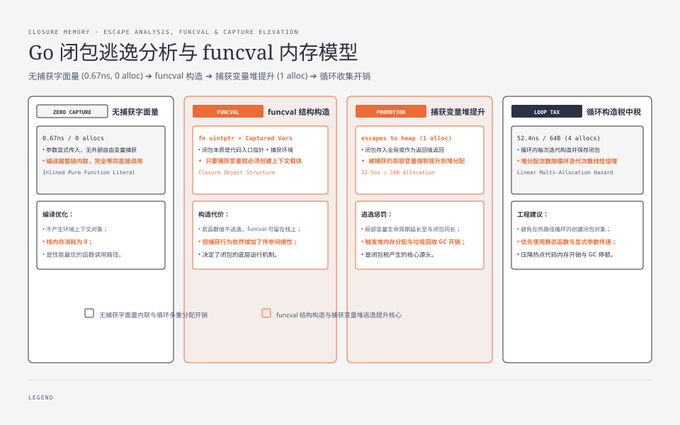

**TL;DR：** 闭包没有一个脱离代码形状的固定价格。当前 Go 1.25.1/arm64 的统一快照里，无捕获的立即执行函数字面量是 **0.6669ns/0 allocs**；保存一个捕获 `value` 的函数值并跨迭代调用是 **12.47ns/16B/1 alloc**；循环收集 4 个回调是 **52.39ns/64B/4 allocs**。第一条不是“所有立即执行闭包”的证明，而是无捕获、可内联路径的下界；后两条同时改变了存活边界、捕获环境和调用方式。判断闭包成本要看捕获什么、活多久、是否内联以及调用方是否把它装进集合。


---



## 一、逃逸分析怎么对待闭包：捕获变量提升

闭包的本质是“函数 + 环境”，但**没有自由变量的函数字面量并不构成需要保存环境的闭包**。先看两个形状：

```go
// 无捕获：参数显式传入，函数值可能被完全内联。
sum += func(value int) int { return value + 1 }(i)

// 有捕获：value 是外层变量，函数值需要携带它。
value := i
callback := func() int { return value + 1 }
```

对真正捕获变量的闭包，Go 编译器通常要处理三件事：

1. **内联决策**：闭包体小且调用点可见 → 整链内联（闭包体直接展开进调用处）；
2. **捕获变量判定**：被闭包引用的局部变量，若闭包**逃逸**（越过函数返回边界存活），变量提升到堆；
3. **闭包对象构造**：`funcval` 结构体（指向闭包体代码的指针 + 捕获变量槽），同样按逃逸决定分配位置。

如果把一个无捕获函数创建后立即调用且不存储，编译器可能把它折叠成与直接调用相同的指令；要把“没有闭包税”写成结论，必须在目标版本用 `go tool compile -S` 或 `go build -gcflags=-S` 检查，而不能从一次 ns/op 反推汇编。当前入口的 `BenchmarkClosureImmediate` 测量的是无捕获函数字面量；`BenchmarkClosureEscaping` 才通过返回值和全局存储保留捕获函数值。

## 二、实测：三个场景的账

| 场景 | ns/op | B/op | allocs |
|---|---|---|---|
| 立即执行、无捕获函数字面量 | **0.6669** | 0 | 0 |
| 存入全局后再调用（逃逸） | **12.47** | 16 | **1** |
| 循环构造 4 个闭包 | **52.39** | 64 | **4** |

读法（固定 `-benchtime=1s -cpu=8` 的一次运行）：

1. **0.6669 vs 12.47 不是单变量实验**。后者同时引入了捕获环境、函数值保存和 `//go:noinline` 的调用边界；它能说明两条真实路径的形状差异，不能把 11.8ns 差值全部归因给“逃逸”。
2. **内联与逃逸是两个维度**：当前入口没有把 `noinline` 单独当作普遍结论，也不能只看到一个 `0 allocs` benchmark 就断言所有闭包调用都会被折叠。
3. **循环捕获是税中税**：每次迭代构造闭包，分配次数与迭代数线性增长。Go 1.22 起循环变量绑定语义修复了经典错误，但正确性修复没有消除闭包对象的分配。

## 三、-m 是闭包税的地图

逃逸分析的可视化（`go build -gcflags='-m=2'`），三个模式对应三种税：

```
./bench_test.go:...: func literal escapes to heap in makeClosure:
  from value (captured by a closure)      ← 捕获变量提升
./bench_test.go:...: func literal escapes to heap              ← 闭包对象分配
./bench_test.go:...: make(...) escapes to heap in BenchmarkClosureLoopCollection:  ← 存储容器分配
```

`escapes to heap` 是编译器的逃逸分类，不是一条“每出现一次就分配一次”的计数器；实际分配次数仍要用 `-benchmem` 或 profile 验证。闭包场景的排查三步：`-gcflags=-m` 找 `func literal` 行 → 看逃逸源（`from X captured by a closure`）→ 决定能否缩短生命周期（立即执行、显式传参、减少捕获），再用 benchmark 验证。


## 四、生产判断：三个场景三种策略

| 场景 | 策略 | 依据 |
|---|---|---|
| 无捕获函数字面量立即执行 | 放心写，但以目标版本检查 | 0.6669ns，0 allocs 的本机基线，不代表捕获闭包 |
| 闭包存进结构体/传给 API（回调） | 可接受，但别在热循环构造 | 12.47ns/1 alloc 起步 |
| 热循环内构造闭包（`sort.Slice` 回调、go func） | 先测，再考虑提出循环 / 显式参数 | 当前每轮构造 4 个回调为 52.39ns/4 allocs，不外推固定常数 |
| 捕获大对象 | 只捕获需要的字段，必要时再评估指针 | 指针可能减少复制，但也可能延长大对象存活；不能把它当成免费优化 |

最常见的热循环误用：在循环里同时发射 goroutine 和构造捕获回调。这里至少有两个独立问题：goroutine 生命周期/调度成本，以及闭包捕获和参数传递方式；不能把另一个 benchmark 的 ns/op 直接相加。先用 `-gcflags=-m` 看逃逸，再按业务等待、取消和并发度测整个路径。

## 五、结论：闭包优化先拆捕获与存活边界


当前快照说明三件事：无捕获函数字面量可以被优化到 0 alloc；保存捕获函数值会引入函数值/环境的存活问题；循环收集会把每个回调的构造和集合成本叠加。它不提供“闭包每次固定多少 ns”的常数。生产判断应先缩小捕获集合、明确生命周期和取消语义，再用目标 workload 的 `-benchmem`、逃逸输出和 profile 验证是否值得改写。

下一步可做的事：对循环内的 `go func`、`sort.Slice` 或异步回调分别跑 `-gcflags=-m`，记录捕获字段、存活时间和调用并发，再做“显式参数 / 提出循环 / 保留闭包”的同语义对照；不要只根据 alloc 数字改写可读性更好的代码。

## 参考资料

1. Go 源码 `cmd/compile/internal/analysis/escape.go`（逃逸分析）、`runtime/runtime2.go`（funcval）—— Go 1.25.1 本机源码
2. Go 官方博客《Escape analysis in Go》—— https://go.dev/blog/escape-analysis
3. 前作：[goroutine 栈：2KB 起步与 8.2ns/层](/writing/go-goroutine-stack-growth)、[benchmark 的七宗罪](/writing/go-benchmark-pitfalls)

实验入口：`experiments/go-runtime-boundary/bench_test.go`（`BenchmarkClosure*`）；原始输出：`evidence/go-runtime-boundary/2026-08-16-local/raw/closure-defer-panic.txt`。
