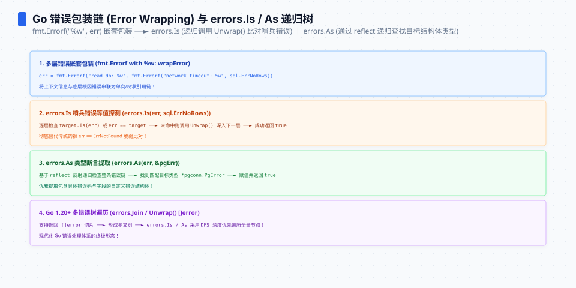

**TL;DR：** 错误链的成本分配与直觉相反：**查询便宜、构造贵**。统一 benchmark（Go 1.25.1/arm64）测得 `errors.Is` 遍历 10 层链 **38.05ns**（每层约 4ns，线性），而 `fmt.Errorf("%w")` 每包装一次 **141.8ns/71B/3 allocs**，`errors.Join` **147.1ns/56B/2 allocs**。这些是当前命令下的一轮基线，不是语言固定常数。稳定的工程结论是：热路径可以用哨兵值表达分类，日志边界再添加上下文；不要为了每一层“人话”都付格式化和分配税。


---


## 一、Is 的实现：循环解链，一次类型断言

`errors.Is`（errors/wrap.go:44）的实现是教科书级的简单循环：

```go
func is(err, target error, targetComparable bool) bool {
	for {
		if targetComparable && err == target {   // 1. 先比哨兵
			return true
		}
		if x, ok := err.(interface{ Is(error) bool }); ok && x.Is(target) {
			return true                          // 2. 自定义 Is 方法
		}
		switch x := err.(type) {                 // 3. 解链
		case interface{ Unwrap() error }:
			err = x.Unwrap()                     //   单链
		case interface{ Unwrap() []error }:
			for _, err := range x.Unwrap() {     //   多链（errors.Join）
				if is(err, target, ...) { return true }
			}
			return false
		default:
			return false
		}
	}
}
```

每轮循环 = 一次 `==` + 一两次类型断言 + 一次解链——当前入口实测 10 层链为 **38.05ns**，从无链 4.845ns 到 1/3/10 层呈近似线性增长。这就是为什么深链查询通常不是第一热点：遍历成本随比较次数线性增长，但真正要警惕的是另一头的构造。




## 二、实测：查询线性、构造昂贵

| 操作 | ns/op | B/op | allocs |
|---|---|---|---|
| 直接比较哨兵 `err != nil && err == sentinel` | **2.08** | 0 | 0 |
| `errors.Is`（无链） | **4.85** | 0 | 0 |
| `errors.Is` 1 层链 | **7.84** | 0 | 0 |
| `errors.Is` 3 层链 | **14.95** | 0 | 0 |
| `errors.Is` 10 层链 | **38.05** | 0 | 0 |
| `errors.New` | **14.11** | **16** | **1** |
| **`fmt.Errorf("%w")` 一次包装** | **141.8** | **71** | **3** |
| `errors.Join` 两个错误 | **147.1** | **56** | **2** |

读法：Is 每层约 4ns 线性增长、零分配；而**一次 `%w` 包装约等于三次十层链查询**。热路径上每个错误经过 3 层包装，查询约 12ns，包装却已经花掉约 425ns 和 9 个分配——**账全在包装时刻**。`fmt.Errorf` 还要解析格式串、拼接上下文、分配包装结构，因此不能只看 `errors.Is` 的遍历成本。

## 三、语义与性能的双重判断：Is 与 As 各买什么

`errors.Is` 卖的是**值语义**：链上有没有一个**相等**于 target 的错误（哨兵、自定义 Is）。`errors.As` 卖的是**类型语义**：链上有没有**类型匹配**的节点；它的实现路径与 `Is` 不同，成本应按错误类型和链形状单独测量，不能复用 `Is` 的数字。

| 需求 | 用 | 成本 |
|---|---|---|
| "这个错误是不是哨兵 X" | `errors.Is` | 4.85ns + 约 3.6ns/层 |
| "错误码是多少"（自定义类型） | `errors.As` | 需要按类型路径单独测量 |
| 热路径最简判断 | 直接比较哨兵 | 2ns |
| 组合多个错误来源 | `errors.Join` | 本次基线 147.1ns/56B/2 allocs |

**Join vs %w 的选择也是语义选择，不应只看本次 benchmark**：当前入口里 Join 的分配数和字节数并不低于 `%w`，因为 Go 版本会影响实现路径；Join 做聚合，`%w` 负责把一个原因包进上下文。若热路径只需要分类，哨兵或预构造错误比每次构造二者都更清楚。


## 四、生产判断：错误链的设计规则

1. **热路径返回错误：哨兵 + 直接比较**。日志/框架层想包装就包装，业务热循环里 `%w` 包装是一次约 142ns/3 allocs 的税，每层都包等于把税乘链长。
2. **链可以深，但要纯**。10 层约 40ns 的查询不是问题；问题在 10 层重复构造包装。用预构造错误或自定义 `Unwrap` 保持热路径稳定。
3. **检查一次 vs 每层检查**：Is 停在第一个匹配（target 在上层就快），把常见错误包在表层。
4. **fmt.Errorf 的 `%v` 不是 `%w`**：`%v` 只拼字符串不建链（更便宜但不解链）——要链就用 `%w` 或 Join，别混用。

## 五、结论：错误链查询便宜，包装分配才是热点


错误链的性能真相：**查询是便宜的一方（约 4ns/层，10 层 38.05ns），构造是贵的一方（`%w` 141.8ns/3 allocs）**。设计推论：链深度通常不是首要问题，重复包装和格式化才是；哨兵或预构造错误适合热路径，`%w` 留给需要上下文的边界层，`errors.Join` 只在多错误语义确实成立时使用。

下一步可做的事：在代码里 grep `fmt.Errorf`，凡是热路径（每请求多次）上带 `%w` 的，改成哨兵/Join；用 `errors.Is` 的深链对照本表验证你的链的查询成本。

## 参考资料

1. Go 源码 `errors/wrap.go`（Is/is/As/as）、`errors/join.go`（Join）—— Go 1.25.1 本机源码
2. Go 官方博客《Error handling and Go》—— https://go.dev/blog/error-handling-and-go
3. 前作：[mallocgc 解剖](/writing/go-mallocgc-allocator)、[benchmark 的七宗罪](/writing/go-benchmark-pitfalls)

实验入口：`experiments/go-runtime-boundary/bench_test.go`（`BenchmarkErrors*`、`BenchmarkFmtErrorfWrap`）；原始输出：`evidence/go-runtime-boundary/2026-08-16-local/raw/errors-interface-pool-map.txt`。本篇没有把 `errors.As` 的旧数字继续当作当前基线。
