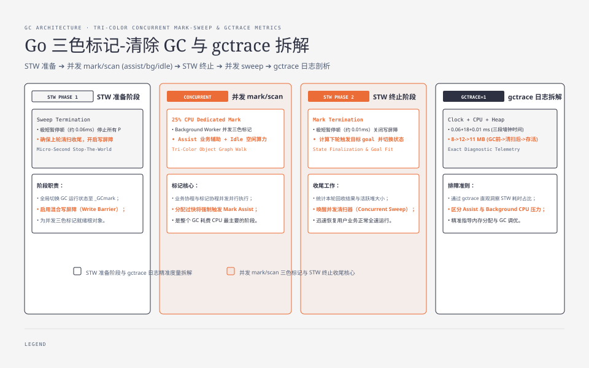
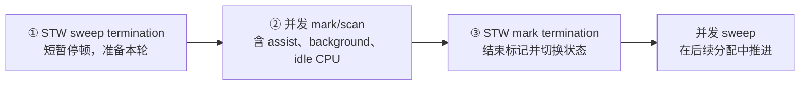
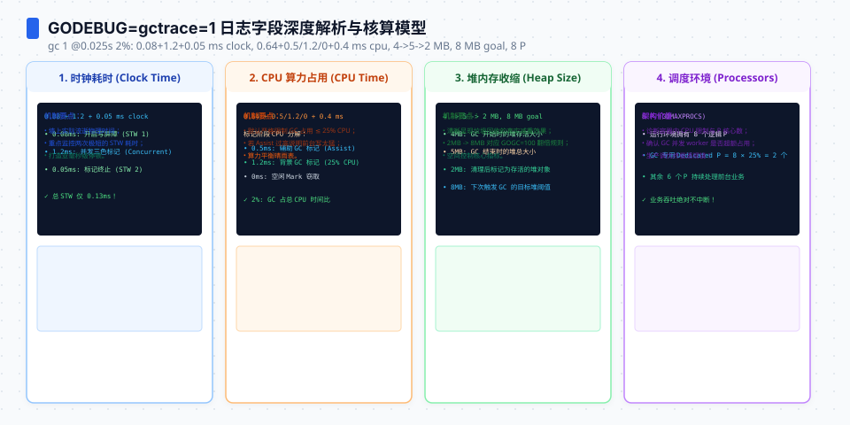

**TL;DR：** Go 的垃圾回收是**并发标记-清除（concurrent mark-sweep）**，但“并发”不等于“零停顿”：一次收集仍包含 **STW sweep termination、并发 mark/scan、STW mark termination** 三段。Go 1.25.1 的 `gctrace=1` 输出还会给出三段墙钟时间、mark/scan 的 assist/background/idle CPU 时间、`heap start → heap end → live heap`、goal、栈、全局变量和 P 数。统一实验保留 1,000,000 个指针密集对象时，单次本机运行在 `GOGC=50/100/200` 下分别出现 3/2/1 个 GC 周期；这只是该输入形状的观测，不是调参定律。先减少可扫描的可达对象，再用 `GOGC` 与 `GOMEMLIMIT` 测量取舍。


---



## 一、GC 不是一次“全停清扫”，而是三段不同语义的工作

Go 1.25.1 的一次 GC 循环在 `gctrace` 里长这样；官方文档明确提醒，输出格式会随版本变化：

```
gc 1 @0.000s 7%: 0.061+18+0.010 ms clock, 0.49+1.8/8.6/0+0.086 ms cpu, 8->12->11 MB, 8 MB goal, 0 MB stacks, 0 MB globals, 8 P
```



`gctrace` 中最容易读错的是 `+` 号。当前格式按下面的语义读：

| 片段 | 读法 | 这次实验要回答的问题 |
| --- | --- | --- |
| `0.061+18+0.010 ms clock` | 三段墙钟时间依次对应 sweep termination、并发 mark/scan、mark termination | 哪个阶段占据墙钟时间 |
| `0.49+1.8/8.6/0+0.086 ms cpu` | 三段 CPU 时间；中间 mark/scan 再拆成 assist/background/idle | GC 是业务线程帮忙多，还是后台 worker 多 |
| `8->12->11 MB` | GC 开始堆、结束 sweep 后堆、最终 live heap | 本轮真正回收了多少 |
| `8 MB goal` | 下一次触发 GC 的目标堆大小 | 当前 GOGC/内存限制把节奏推到哪里 |
| `0 MB stacks, 0 MB globals, 8 P` | 可扫描栈、全局变量和参与的处理器数 | 根集合和并行度有多大 |

因此，“GC 大头在 mark”不能只看一条旧格式样张；要先确认运行时版本和字段。并发 mark/scan 的墙钟时间通常与可扫描的活对象图相关，但 CPU 还会受到分配速率、辅助标记和核数影响。

Go 换来的不是“零停顿”，而是把一次大头工作拆成并发阶段，并将必须全局一致的部分压缩成两次 STW 边界。




## 二、用同一个可配置程序采集真实现场

```go
// experiments/go-runtime-boundary/cmd/gc-trace/main.go
package main

import (
    "flag"
    "fmt"
    "runtime"
)

type item struct {
    left  *item
    right *item
    next  *item
}

func main() {
    n := flag.Int("n", 1_000_000, "number of pointer-rich objects to retain")
    flag.Parse()

    items := make([]*item, 0, *n)
    var previous *item
    for i := 0; i < *n; i++ {
        current := &item{left: previous, right: previous, next: previous}
        items = append(items, current)
        previous = current
    }

    runtime.KeepAlive(items)
    fmt.Printf("objects=%d gomaxprocs=%d\n", len(items), runtime.GOMAXPROCS(0))
}
```

这是实验入口的完整可运行版本，源文件位于 `experiments/go-runtime-boundary/cmd/gc-trace/main.go`。三根指针是刻意设计：它让 mark/scan 有可扫描的对象图，避免把一个指针少的字节数组误当成 GC 标记压力。

```bash
cd experiments
go build -o /tmp/github-blog-gc-trace ./go-runtime-boundary/cmd/gc-trace
GOGC=100 GODEBUG=gctrace=1 /tmp/github-blog-gc-trace -n=1000000 2>&1 | rg '^(gc|objects=)'
# 当前一次输出见 evidence/go-gc-gctrace-account/2026-08-16-local/raw/gogc-100.txt
```

这里先 `go build` 再运行二进制，而不是直接把 `GODEBUG` 传给 `go run`：后者还会启动编译过程，可能把编译器自己的 GC 输出混进现场。读数重点有两块：

1. `0.061+18+0.010 ms clock` 是三段墙钟时间，不是旧版本的“四段固定相位”；
2. `8->12->11 MB` 是 GC 开始、sweep termination 后和最终 live heap 的变化；
3. `0.49+1.8/8.6/0+0.086 ms cpu` 中间的三个数字分别是 assist、background 和 idle mark/scan CPU 时间。

**单位是毫秒，而且 CPU 时间可以跨多个 P 累加**：当前样本的并发 mark/scan 墙钟时间是 18ms，但其中部分工作由多个处理器并行完成；不能把 CPU 时间总和直接称为用户请求停顿。

在同一台 Apple M1 Pro、同一个二进制和 `-n=1000000` 输入下，本次三组运行得到：

| `GOGC` | GC 行数 | 观察到的 heap/live 形状 | 可得出的结论 |
| ---: | ---: | --- | --- |
| 50 | 3 | `8->9->9`、`12->15->15`、`20->22->22 MB` | 目标更紧，周期更频繁 |
| 100 | 2 | `8->12->11`、`19->29->28 MB` | 默认值下本次输入触发两轮 |
| 200 | 1 | `8->10->10 MB` | 目标更宽，本次输入只触发一轮 |

这是一次单机、单进程、单一对象图的对照；它没有证明 `GOGC=200` 对线上延迟更好。真实服务还要同时看分配速率、请求延迟、CPU、RSS、`GOMEMLIMIT` 和 OOM 风险。

## 三、什么让标记变贵（真正要修的几种税）

分配本身便宜（bump allocator 挪指针），贵的是"它留下了多少可扫描的东西"。三笔高税：

1. **大量小指针对象**：实验中每个 `&item{}` 都有三个指针槽，`[]*item` 还要作为根集合逐个扫描；对象数量和可扫描字段一起决定 mark/scan 的工作量。
2. **逃逸**：局部变量不逃逸就放栈上（零 GC 成本），一旦逃逸就进堆。少逃逸 = 少缴标记税（`go build -gcflags=-m` 能看逃逸结论）。
3. **finalizer**：带 finalizer 的对象不会在第一次变得不可达时立即回收；finalizer 还要在独立 goroutine 上运行，完成前的回收时机不可当作资源释放协议。日常别拿它替代显式 `Close`。

减压方向：在语义允许时使用值语义（`[]T` 优于 `[]*T`）、减少长期可达的指针图、让大对象尽早脱离根集合；`sync.Pool` 只适合可丢弃的临时对象，不能用来掩盖所有权和生命周期错误。


## 四、GOGC 和 GOMEMLIMIT 是两个不同的旋钮

`GOGC`（默认 100）控制的是**相对活跃堆的增长目标**：当自上次 GC 后新分配的数据达到上次 GC 后 live heap 的这个百分比时触发下一轮。近似公式是：

```text
下一次目标堆 ≈ 上次 live heap × (1 + GOGC / 100)
```

- 调大（200/400）：目标堆更宽，通常减少周期次数和 GC CPU，但可能增加 live heap、RSS 和单轮 mark 工作。
- 调小（20/50）：目标堆更紧，通常更频繁地回收，可能降低堆峰值，但会增加 GC 调度和辅助标记压力。

`GOMEMLIMIT` 是运行时的**软内存上限**，覆盖 Go 堆及运行时管理的其他内存；它不是把每次暂停压到某个毫秒数的旋钮。容器有明确内存边界时，应把它与 RSS、非 Go 内存和业务负载一起压测，避免把 limit 设到运行时只能持续 GC 的位置。

```bash
GOGC=100 GODEBUG=gctrace=1 /tmp/github-blog-gc-trace -n=1000000 2>&1 | rg '^gc ' | wc -l
GOGC=200 GODEBUG=gctrace=1 /tmp/github-blog-gc-trace -n=1000000 2>&1 | rg '^gc ' | wc -l
```

**先看现象再转旋钮**：如果 gctrace 里 mark/scan 根本不是主税，调 GOGC 意义不大；调参前先用火焰图、runtime/metrics 和请求级 p95/p99 确认不是系统调用或锁竞争——方法见[先采样再优化：perf 火焰图](/writing/perf-flamegraph-sampling)。

## 五、诚实框定：gctrace 是当前版本的诊断输出，不是性能合同

本文的相位解释依据 Go 1.25.1 的 `go doc runtime`，三组 ms 输出取自 2026-08-16 的 Apple M1 Pro、`darwin/arm64` 本机运行。**你的 Go 版本、核数、GOMAXPROCS、对象图和输入规模不同，数字和字段格式都可能不同**；复制程序并保存原始 stderr，才算得到自己环境的证据。这个实验只证明可配置小程序的 GC 行为，不证明任何线上服务的停顿、吞吐或 OOM 边界。

## 六、结论：先减少可扫描对象，再用 gctrace 选择 GOGC

Go 的并发 GC 不是“没有停顿”，而是把必须全局协调的工作压缩到两个 STW 边界，把 mark/scan 的大头并发执行。**先减少长期可达的指针对象、明确逃逸和 finalizer 的边界，再用同一负载比较 GOGC；不要把一次 gctrace 的漂亮数字当作生产 SLO。** 诊断流程应固定为：保存版本与命令 → 看三段 clock/CPU 与 heap goal → 对照请求延迟和 RSS → 只改一个旋钮重跑。

## 参考资料
1. Go 官方 runtime 包文档（GC 行为）—— https://pkg.go.dev/runtime
2. Go 官方博客：Go 1.5 并发 GC—— https://go.dev/blog/go15gc
3. Go 运行时 GODEBUG / gctrace 输出说明—— https://pkg.go.dev/runtime#hdr-GODEBUG
4. Go 官方 wiki：编译器优化与逃逸分析—— https://go.dev/wiki/CompilerOptimizations
5. Go 运行时环境变量（GOGC、GOMEMLIMIT）—— https://pkg.go.dev/runtime

实验入口：`experiments/go-runtime-boundary/cmd/gc-trace/main.go`；构建命令、环境和原始 gctrace：`evidence/go-gc-gctrace-account/2026-08-16-local/`。

> 延伸阅读：GC 造成的瞬时 CPU 波动与限流器怎么共生，见[限流、熔断与降级](/writing/rate-limiting-circuit-breaker)；GC 线程与业务线程抢 CPU，底层还是[从 CPU 到 Go 协程：上下文切换](/writing/understanding-context-switching-from-cpu-to-goroutines)的调度账。
