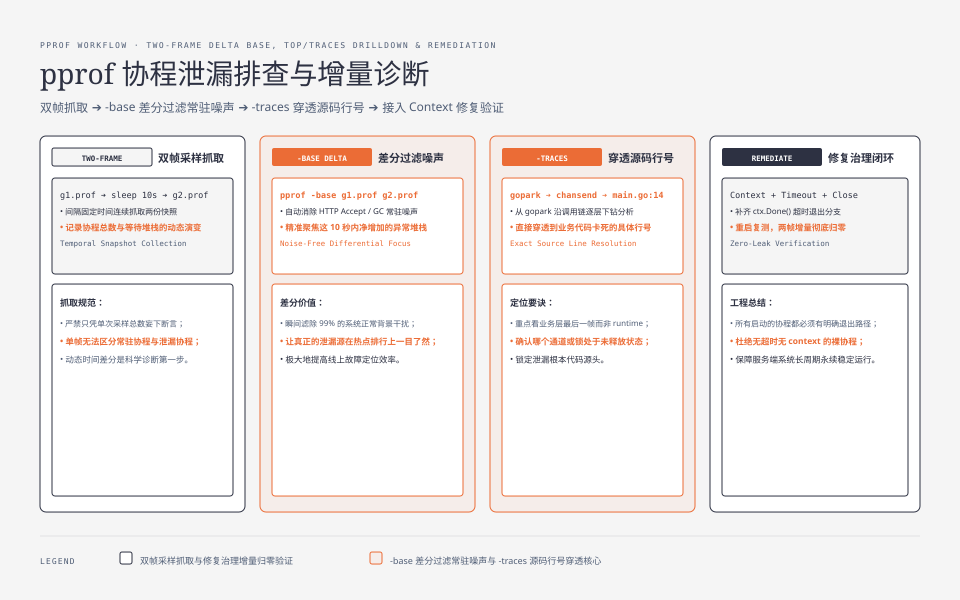

**TL;DR：** goroutine 泄漏和内存泄漏是两种病，但不能把 heap 当成唯一裁判：内存泄漏看 `heap` 视图（Alloc 差值），goroutine 泄漏看 `goroutine` 视图（总数 + 分组 + 栈）。仓库内 Go 1.25.1 probe 固定启动 3×300 个阻塞 goroutine，`goroutine` profile 按 `leakOnSend`、`leakOnReceive`、`leakOnSelect` 各计 300；同时记录 `heap_alloc` 与 `stack_inuse`，不把某一轮内存数字外推成“完全隐形”。定位命令是：`go tool pprof -top` 看聚合热点，`-traces`/`debug=1` 看卡死在哪一行。生产模式包括 chan 发送阻塞、chan 接收阻塞、select 无取消分支，以及未释放的 ticker/后台任务。


---


## 一、先纠正直觉：内存没涨 ≠ 没泄漏

上一篇文章（[Go 内存泄漏与 pprof 的账本](/writing/go-memory-leak-pprof)）里，goroutine 只是"三张账"里的一张。这次把它单独拎出来，因为它在实践里被误诊得最狠：**服务内存曲线平稳、GC 正常，但 goroutine 数稳步上涨**，直到某个凌晨 OOM 或文件描述符耗尽。

原因在于 goroutine 的成本结构：阻塞在 channel 上的 goroutine 可能主要体现为 runtime 栈、调度元数据和它持有的引用，不一定像业务 `make([]byte, ...)` 那样在 heap profile 里归因到泄漏函数。数字还受 Go 版本、栈增长、profile 采样和 goroutine 所持对象影响。每个卡死的 goroutine 背后却都是一个**永远不完成的逻辑**：连接没释放、任务没结束、资源没人收。OOM 可能是晚期症状，也可能先表现为调度、文件描述符或下游资源耗尽。


## 二、实验：同一批泄漏，两把尺子量出两种结果

仓库内的 `experiments/go-goroutine-leak-pprof/main.go` 不依赖 HTTP 服务：每种阻塞形状固定启动 300 个 goroutine，等待它们都进入阻塞点，再读取 `runtime.NumGoroutine`、`runtime.MemStats` 和 `pprof.Lookup("goroutine")`。命令：

```bash
cd experiments
go run ./go-goroutine-leak-pprof -per-kind 300
```

本机 Go 1.25.1 的稳定部分输出为：

```text
go=go1.25.1 per_kind=300 leaked=900 goroutines=901 heap_alloc=677952 stack_inuse=2359296
profile_group=main.leakOnSend count=300 source_line=14
profile_group=main.leakOnReceive count=300 source_line=19
profile_group=main.leakOnSelect count=300 source_line=24
```

这里最重要的不是 `heap_alloc` 或 `stack_inuse` 的单次字节数，而是 profile 把 900 个阻塞 goroutine 按**等待形状和源码位置**分成三组。脚本故意不把 `heap_alloc` 写成“差值 0”：栈、调度元数据、channel 和 profile 采样会随版本和运行状态变化；heap 视图是辅助账，不是 goroutine 泄漏的替代指标。完整 raw 与环境记录在 `evidence/go-goroutine-leak-pprof/2026-08-17-local/`。

## 三、三种读法：-top、-traces、debug=1 各自回答什么

| 命令 | 回答的问题 | 该命令能提供的证据 |
|---|---|---|
| `go tool pprof -top goroutine.prof` | 哪个函数名下积累最多 | 聚合热点；`gopark` 常在 flat 层出现，需继续看 cum/调用者 |
| `go tool pprof -traces goroutine.prof` | 每组 goroutine 的完整调用链 | 从 `gopark` 下钻到 `chansend`/`chanrecv`/你的函数 |
| `curl :6060/debug/pprof/goroutine?debug=1` | 逐组原始栈 + 行号 | 分组计数、等待位置和源码行；适合在线快速确认 |

`-top` 的用法有一个细节：goroutine profile 的"flat"在 `runtime.gopark` 上（100%），**你要看的是 cum 列的下钻**——`-top` 默认 8 行不够就 `-nodecount`，或直接 `-traces` 看全栈。`debug=1` 适合在线看：不带文件，一行 curl 出分组和行号。

抓取命令（两次采样算增量，和 heap 的做法一样；需要服务暴露 pprof）：

```bash
curl -s localhost:6060/debug/pprof/goroutine > /tmp/g1.prof && sleep 10
curl -s localhost:6060/debug/pprof/goroutine > /tmp/g2.prof
go tool pprof -base /tmp/g1.prof -top /tmp/g2.prof   # 增量：这 10 秒新长的都归谁
```




## 四、四种真实生产模式：怎么读栈，怎么修

goroutine 泄漏的生产模式就那么几类，栈一眼能认：

| 模式 | 栈特征 | 修复方向 |
|---|---|---|
| chan 发送阻塞 | `chansend` → 你的函数 → `ch <- x` 行 | 加超时（`select` + `time.After`）或保证消费方存在 |
| chan 接收阻塞 | `chanrecv` → 你的函数 → `<-ch` 行 | 谁生产谁负责关闭；`context` 取消时退出 |
| select 全阻塞 | `selectgo` → 全是永不触发的 case | 至少一个 case 可取消（`ctx.Done()`） |
| `time.Ticker` 未 Stop | `time.Sleep` / `runtime.timerproc` | 不用的 Ticker 立即 `Stop()`，`time.After` 用 `select` 包 |

判别的关键不是"看到 gopark"，而是**读栈里你自己那一层**：卡在哪个 channel、哪一行，那个 channel 的配对端在哪。修复的本质都是同一句话：**阻塞的 goroutine 必须能被人为结束**——要么有消费者、要么有超时、要么能被 context 取消。

## 五、排查的快速流程（增量对比法）

1. **两次采样算增量**：`curl` 抓 `g1.prof`，等 5-10 秒抓 `g2.prof`，`go tool pprof -base g1.prof -top g2.prof`——只看新长的，忽略常驻（HTTP server、GC 等）；
2. **确认总数在涨**：`debug=1` 第一行 `goroutine profile: total N`，隔几秒再看一次；
3. **`-traces` 找到新增分组的栈**：新分组名 = 泄漏现场，`main.go:17` 就是卡死的行；
4. **按上表对号入座修**：加超时 / 补关闭 / 接 context；
5. **验证**：修完重启，再抓两次，增量应该归零。

常驻 goroutine 是正常噪音（HTTP server 的 `Accept`、pprof 自身、`runtime` 内部），`-base` 增量法自动把它们滤掉——这是为什么一定要用两帧对比，而不是看单帧总数。

## 六、结论：goroutine 泄漏要用 profile 和可结束性定位

goroutine 泄漏与内存泄漏是两种病，尺子不能混用：heap 账平稳也不能替代 goroutine profile，profile 里不断增长的等待组才是直接证据。排查路径固定为“两帧增量 + goroutine 视图”：`-top` 定位聚合热点、`-traces` 读栈、`debug=1` 在线看行号，然后按四种生产模式对号修。写代码时的防线只有一句话：**每个 goroutine 都要能被结束**——消费者、超时、context，至少有一个。

下一步可做的事：先运行 `experiments/go-goroutine-leak-pprof` 观察三种等待组，再拿线上最可疑的服务抓两帧 goroutine profile 做增量对比；把生产代码里所有裸 `<-ch`、`ch <- x` 和 `select`（没有 `ctx.Done()` case 的）过一遍，逐处回答“它怎么被结束”。

## 参考资料

1. Go 官方 pprof 文档（goroutine 视图与四种 profile）—— https://pkg.go.dev/runtime/pprof
2. Go 官方调试指南（pprof 一节含 goroutine）—— https://go.dev/doc/diagnostics
3. 前作：[Go 内存泄漏与 pprof 的账本](/writing/go-memory-leak-pprof)、[Go GC 时间账本](/writing/go-gc-gctrace-account)、[Go 调度器的三张表](/writing/go-scheduler-gmp-preemption)
