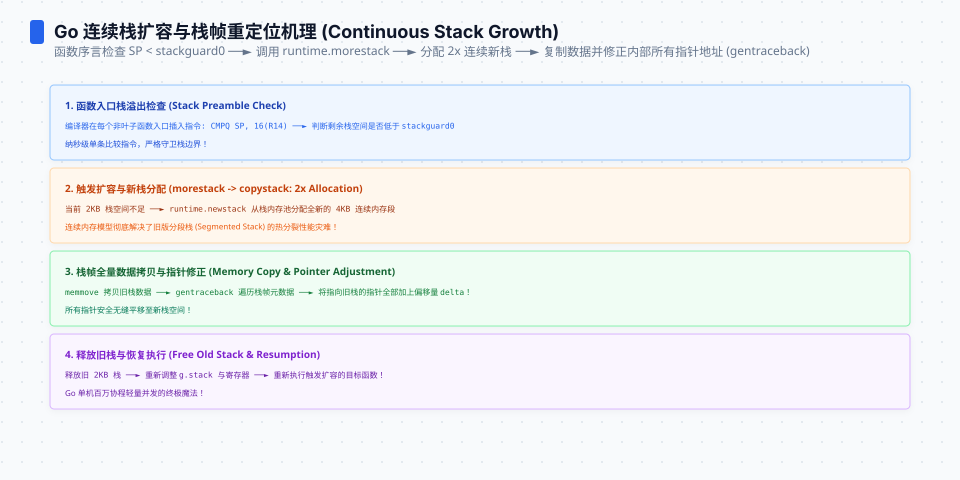
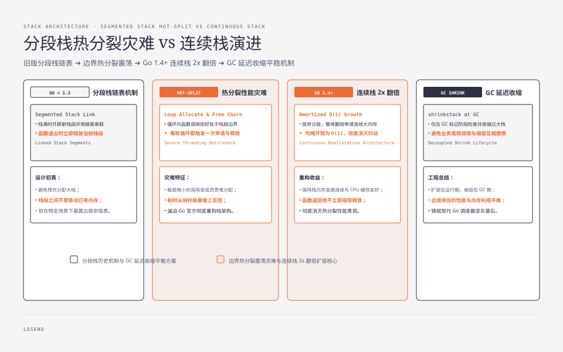

**TL;DR：** goroutine 的栈从 `stackMin = 2048` 字节起步，空间不足时分配约 2 倍的新栈，把旧栈内容搬过去，再修正指向旧栈的指针。一次本机 evidence snapshot 中，复用 `WaitGroup` 发射并等待一个 goroutine 的完整生命周期为 **380.3ns/op、16B/1 alloc**；在每个 sample 都使用新 goroutine、且只计时递归本身的 probe 中，1,000/100,000/1,000,000 层递归中位数分别为 **61.833µs、4.224542ms、41.959750ms**。这些数字证明的是当前函数帧、编译器和机器下的总耗时，不是“创建指令成本”、固定的栈大小或生产 p99。真正需要避开的不是递归这个词，而是不可控的大栈帧、深调用链和没有生命周期管理的 goroutine。


---


## 一、2KB 起步与连续栈：把常驻空间换成搬家成本

Go 的 goroutine 栈是可移动的连续栈。Go 1.25.1 的 `runtime/stack.go` 中，`stackMin = 2048`；当当前栈放不下下一帧时，runtime 会申请更大的连续区域，把旧栈搬过去，并通过 `adjustinfo` 修正栈内指针。下一次容量通常按 2 倍增长，但“最终栈有多大”不能只由递归深度决定，还取决于每层函数帧的大小。

这笔交易有两面：

- 初始栈小，很多短命 goroutine 不必一开始就携带传统线程的固定大栈；1,000,000 个 goroutine 乘以 2KiB 只能得到约 2GiB 的初始逻辑栈字节，不能直接当作 RSS，也没有包含 runtime、调度器和对象本身的开销；
- 一旦栈增长，旧栈要整体搬运，栈上的指针还要被逐个修正。越晚发生的增长，单次要处理的字节和指针越多。


不要把这理解成“每次函数调用都在复制栈”。搬家只发生在增长点；但增长点的成本是一次集中成本，不能用平均 ns/op 掩盖它的尾部形状。




## 二、一次本机 probe：生命周期成本与递归总耗时不是一回事

实验入口是 `experiments/go-runtime-boundary/`，原始输出保存在 `evidence/go-goroutine-stack-growth/2026-08-16-local/`。环境是 Go 1.25.1、Darwin arm64、Apple M1 Pro；递归 probe 每个 sample 都从一个新 goroutine 开始，计时器在 goroutine 内、递归调用前启动，所以递归数字不包含 goroutine 创建和 join。

| 操作 | 当前 snapshot | 测量边界 |
|---|---:|---|
| `BenchmarkGoroutineCreateJoin` | **380.3ns/op、16B/1 alloc** | 发射 goroutine、执行一次 `WaitGroup.Done`、等待返回；不是纯创建指令成本 |
| 递归 1,000 层 | **61.833µs**（61.833ns/层） | 新 goroutine 内的递归总耗时，中位数/5 次 |
| 递归 100,000 层 | **4.224542ms**（42.2454ns/层） | 同上；包含该深度下触发的栈增长 |
| 递归 1,000,000 层 | **41.959750ms**（41.9597ns/层） | 同上；不把某一次 `copystack` 单独拆出 |

复现命令：

```bash
cd experiments
go test ./go-runtime-boundary -run '^$' -bench '^BenchmarkGoroutineCreateJoin$' -benchmem -benchtime=1s -cpu=8
go run ./go-runtime-boundary/cmd/stack-growth -depths=1000,100000,1000000 -repeats=5
```

这里有两个容易被 benchmark 误导的地方：

1. **生命周期 benchmark 不是函数调用 benchmark**。它包含 goroutine 的调度和 `WaitGroup` 同步，适合回答“这个形状的短任务发射成本大约是什么量级”，不适合回答“创建一个 goroutine 的 runtime 指令固定是几 ns”。
2. **递归 probe 是总耗时，不是栈增长成本剖析**。它能说明深度、函数帧和栈扩容共同形成的总账，却不能把 41.959750ms 拆成“普通递归多少、每次 `copystack` 多少”。要研究单次毛刺，还需要 trace 或专门把增长点隔离的实验。

这也解释了为什么不能把本篇数字与《[channel 的容量边界](/writing/go-channel-hchan-cost)》的 send-only 基准、或《[锁的成本是排队不是加锁](/writing/go-lock-cost-futex-rwlock)》的并发争用基准放在同一张“谁更快”的表里：操作和同步边界不同，数字即使接近也没有可比性。

## 三、栈帧大小决定增长频率：深度只是一个代理变量

栈增长触发条件是“下一帧放不下”，不是“递归次数达到某个固定阈值”。因此同样 100,000 层递归，下面两种函数可能走完全不同的路径：

| 函数形状 | 增长频率 | 单次增长的风险 |
|---|---|---|
| 小帧、少量局部变量 | 需要更深调用链才触发增长 | 单次搬运可能较小，但深度仍可能把栈推到很大 |
| 含 KB 级局部数组的帧 | 很少几层就可能触发增长 | 每次扩容搬运的旧栈更大，毛刺更集中 |
| 把大 buffer 放在堆上、栈上只保留描述符 | 栈帧较小 | 用一次堆分配换掉重复的栈搬运；仍需测 GC 和生命周期 |

如果最终栈从 2KiB 扩到 128MiB，按 2 倍扩容时被复制的旧栈大小是：

```text
2KiB + 4KiB + ... + 64MiB ≈ 128MiB
```

这是搬运字节数的几何级数，不是固定的延迟，也不是最终栈的 2 倍。真正延迟还受内存带宽、栈扫描中的指针数量、调度和 CPU 状态影响。没有对目标函数做 frame-size 与 trace 测量，就不应该把某个“1–10ms”写成通用毛刺价格。

工程上的反直觉结论是：**递归深度不是唯一的风险指标，栈帧形状才决定增长点在哪里。** 大局部数组、深递归解析器和把不受控数据放在栈上的函数，都应该先用 `-gcflags=-m=2`、trace 或 profile 看清楚，再决定改成迭代、移动到堆，还是限制输入深度。




## 四、栈可以移动，所以栈地址不能离开它的生命周期

`copystack` 不是一个裸 `memmove`。栈上可能有局部变量地址、闭包捕获、defer 参数以及 runtime 维护的调度指针；搬家后这些地址都必须按新旧栈的偏移修正。这个机制让 goroutine 可以长大，也给 unsafe 和 cgo 设了边界：

- 不要把指向栈变量的地址保存到一个会跨越栈增长的外部结构里；
- 不要假设一个栈地址在函数继续执行后仍然稳定；
- cgo 指针规则与 `unsafe` 的生命周期规则必须单独遵守，不能用“这次递归没崩”证明地址长期有效。

这和《[string ↔ []byte 的复制边界](/writing/go-string-byte-conversion)》里的共享底层存储是同一种工程问题：性能优化把生命周期责任从 runtime/语言合同转移给了调用者；只要所有权和存活期说不清，零拷贝或栈地址优化就不值得做。

## 五、生产判断：把短任务、深调用和生命周期分开决策

| 场景 | 判断 | 必须补的证据 |
|---|---|---|
| 短命 goroutine（任务分发） | 当前 benchmark 是约 380ns 的一个本机生命周期 snapshot，不等于业务请求成本 | 任务排队、I/O 等待、取消、错误传播和尾延迟 |
| 深递归（树、解析器、编译器） | 先限制输入深度或改迭代；当前 probe 显示深度增加会带来毫秒级总耗时 | 目标输入分布、最大深度、trace 中的增长点 |
| KB 级局部数组 | 优先评估 `make`/堆对象和复用 buffer | GC、峰值 RSS、对象复用和逃逸分析 |
| 大量并发 goroutine | 初始栈小不代表总内存免费 | goroutine 数、栈增长分布、堆、调度延迟和取消率 |
| 需要跨函数保存地址 | 不要依赖栈地址稳定 | `unsafe`/cgo 合同、逃逸分析与 race/压力测试 |

`maxstacksize` 是 runtime 的硬保护，但它只是防止栈无限增长，不是深递归的性能许可证。goroutine 的生命周期也必须由 `context`、关闭 channel 或明确的 owner 管理；栈会增长并不意味着泄漏的 goroutine 会自动消失。

## 六、结论：低初始栈不是免费，而是把成本推迟到增长点

Go 用 2KiB 起步的可移动连续栈，换来了低初始空间和自然的深调用能力；代价是栈增长时要复制旧栈并修正指针。当前本机 probe 可以支持三个窄结论：一个带 `WaitGroup` 的 goroutine 生命周期约为 **380.3ns**；递归 1,000,000 层的总耗时约 **41.959750ms**；这些数值都绑定在当前函数帧、Go 版本、架构和运行方式上，不能外推为固定 runtime 价格或生产延迟。

下一步可执行的检查是：对热路径运行 `go test -gcflags='all=-m=2'`，找出 KB 级局部数组和不必要的栈逃逸；再用 `go tool trace` 或 profile 验证深调用链是否真的触发了可见的增长毛刺。先拿到目标 workload 的 raw，再决定限制深度、改迭代或移动 buffer。

## 参考资料

1. Go 源码 `runtime/stack.go`（`stackMin`、栈增长、`copystack`、`adjustinfo`）—— Go 1.25.1 本机源码
2. Go 官方博客《Contiguous stacks》—— https://go.dev/blog/contiguous-stacks
3. Go 官方文档《Go Scheduler》系列—— https://go.dev/wiki/MutexOrChannel
4. 本文实验入口：`experiments/go-runtime-boundary/bench_test.go`、`experiments/go-runtime-boundary/cmd/stack-growth`
5. 本文 evidence snapshot：`evidence/go-goroutine-stack-growth/2026-08-16-local/`
6. 前作：[goroutine 泄漏不是内存泄漏](/writing/go-goroutine-leak-pprof)、[channel 的容量边界](/writing/go-channel-hchan-cost)、[Go 调度器的三张表](/writing/go-scheduler-gmp-preemption)
