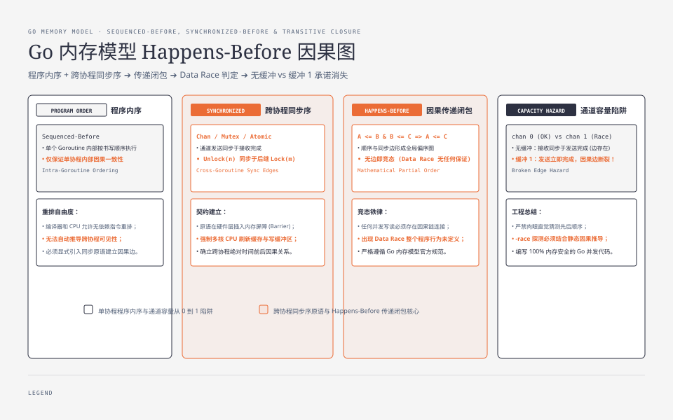
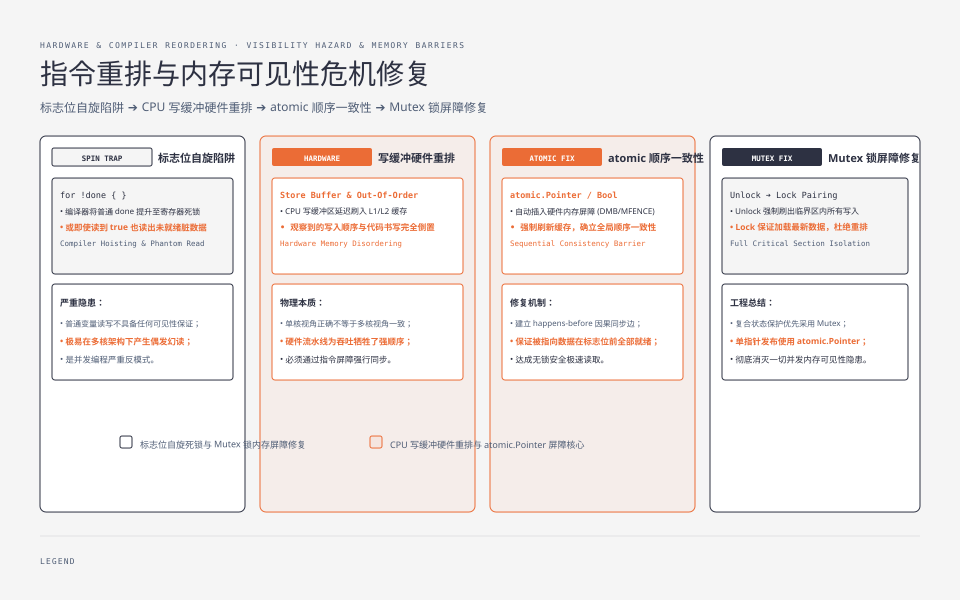

**TL;DR：** 两个 goroutine 访问同一个变量，代码里的先后顺序不是证据，happens-before 才是。Go 内存模型把 goroutine 创建、channel、锁、原子操作等同步关系写成了可验证的边；本文重点拆三组最容易误读的规则：channel 按发送与接收配对，锁按 `Unlock(n)` 到后续 `Lock(m)` 配对，原子操作按顺序一致性建立观察关系。肉眼排序不作数，内存模型是合同，`-race` 只能在实际执行路径上帮助发现竞态，不能替你证明所有路径都无竞态。


---



## 一、不直觉的起点：容量从 0 变 1，保证消失

《The Go Memory Model》给出了两段几乎相同的代码，第一段带缓冲：

```go
var c = make(chan int, 10)
var a string

func f() {
	a = "hello, world"
	c <- 0
}

func main() {
	go f()
	<-c
	print(a)
}
```

这份文档保证：一定打印 `hello, world`。规则很简单——对 channel 的发送，同步于"对应的接收完成"。

再看第二段，收发顺序反过来、且换成无缓冲 channel：

```go
var c = make(chan int) // 无缓冲
var a string

func f() {
	a = "hello, world"
	<-c
}

func main() {
	go f()
	c <- 0
	print(a)
}
```

官方同样保证打印 `hello, world`，因为**无缓冲 channel 的接收同步于对应发送的完成**——接收先于发送完成，等于多了一条反向的边。

然后文档用一句话埋了最容易被跳过的坑：把上面 `make(chan int)` 换成 `make(chan int, 1)`，保证就没了。"它可能打印空串、崩溃，或者做其他任何事。"容量从 0 变成 1，逻辑一行没改，语言却收回承诺。要讲清为什么，必须拆开"happens-before"。

## 二、没有边，就是数据竞争

Go 内存模型把一次执行建模成两样东西：

1. **程序内序（sequenced before）**：单个 goroutine 内部，按书写顺序执行的先于关系。`a = "hello"` 先于 `c <- 0`，这是语言本来的命令。
2. **同步序（synchronized before）**：跨 goroutine 唯一能建立的部分序——发送/接收、加锁/解锁、原子操作等同步点之间的边。

两者取传递闭包，就是 happens-before。规则只有一条：

> 对同一个变量的两次访问（至少一次是写），若它们之间没有 happens-before 关系，就构成 data race。发生 data race 时，程序行为不做任何保证。

注意措辞：不是“偶尔出错”，而是**程序不再享有数据竞争程序的可推理保证**。读到旧值或其他未被同步关系约束的结果都不能作为合同。最直观的官方案例是：

```go
var a string
var done bool

func setup() {
	a = "hello, world"
	done = true // 普通字段，不是原子
}

func main() {
	go setup()
	for !done {
		time.Sleep(1 * time.Millisecond)
	}
	print(a) // 可能打印空串：done 与 a 之间没有 happens-before
}
```

就算循环里 `done` 最终变 true，`a` 也不保证可见——`done` 是普通读写，不是同步点。这是官方文档原样的反例。

## 三、channel 的三条款：容量 C 是账目偏差

channel 的条款一共三条（`go.dev/ref/mem`）：

| # | 条款 | 适用 |
| --- | --- | --- |
| 1 | 发送同步于对应接收完成 | 所有 channel |
| 2 | 接收同步于对应发送完成 | **仅无缓冲**（C=0） |
| 3 | 第 k 次接收同步于第 k+C 次**发送**完成 | 缓冲容量 C |

条款 3 是缓冲 channel 的真正语义：向容量 C 的 channel 发一条消息，接收方"要等到 k+C 条发送都完成"才与发送建立边。换句话说，**缓冲不是"队列多放几个"，而是记账时向后做了 C 次偏移**。

回到第一节的例子。无缓冲 C=0：主 goroutine `c <- 0` 会一直被卡住，直到 goroutine 的 `<-c` 完成；条款 2 把接收排在发送之前，于是 `a` 的写 → 接收 → 发送完成 → 主函数读 `a`，全链建立。容量 C=1：发送不等接收，`c <- 0` 立即完成；`print(a)` 与 `a = "hello, world"` 之间没有任何边，竞争成立。

`-race` 可以在这条执行路径上把竞态报告出来，但它不是静态证明器。当前仓库的可运行入口是 `experiments/go-happens-before/main.go`：

```go
func bufferedSignal() {
	c := make(chan int, 1)
	var a string
	go func() {
		a = "hello, world"
		<-c
	}()
	c <- 0
	fmt.Println(a)
}
```

```bash
cd experiments/go-happens-before
go run -race main.go buffered
go run -race main.go unbuffered
```

把 `make(chan int, 1)` 改成 `make(chan int)`（无缓冲）后重跑：

`buffered` 命令应报告 data race 并以非零状态结束；`unbuffered` 命令输出 `hello, world` 且不应报告 race。原始 stdout/stderr、Go 版本和命令保存在 `evidence/go-happens-before/2026-08-17-local/`。即使这两个命令都通过，也只覆盖这两个小程序的执行路径。

缓冲 1 的 channel 当信号，是生产环境第一高频的隐性竞态：代码看起来"发完信号再读数据"，实际发的只是"我有货了"，接收方却没有关于数据的承诺。




## 四、锁和 Once：配对契约

`sync.Mutex`/`RWMutex` 在内存模型里只有一条[2]：

> 对任意锁 l，n 次 `Unlock()` 同步于第 m 次 `Lock()` 返回（总有 n < m）。

翻译：谁先拿到第二次锁，就必须看到第一次 Unlock 之前的一切写。这才是"锁内写、锁外读安全"的来源——不是锁里面有个管家，而是**拿到锁的时刻意味着拿到了契约**。TryLock 值得单独说一句：成功等价于 Lock，但失败不建立任何边——拿 TryLock 失败当"没锁"的信号再读数据，就是裸奔。

另一族被低估的契约是 `sync.Once`：**`once.Do(f)` 里 f 的执行完完成，同步于任何返回**。这正是懒初始化"进来的人都看到完整值"的底层条款；`WaitGroup` 同理：`Done` 到零之后，`Wait` 返回前的所有写在 `Wait` 返回后可见。

## 五、原子：一本独立的账

`sync/atomic` 不归 channel 条款管，它自带合约：

> 所有原子操作按全局顺序（sequentially consistent）执行；原子 A 的结果若被原子 B 观察到，则 A 同步于 B。

这意味着：**每个原子操作本身就是一个同步点**。下面的代码是安全的：

```go
var done atomic.Bool
var data string

func produce() {
	data = "ready"
	done.Store(true)
}

// 另一个 goroutine：
for !done.Load() {
}
fmt.Println(data) // 一定看到 "ready"
```

`done.Store(true)` 之后的写，对 `done.Load() == true` 之后的读可见。这就是自旋等待（busy-wait）唯一正确的写法：**标志本身必须是原子**，普通转折不行（见第二节反例）。Go 的原子操作语义与 C++ 的 `memory_order_seq_cst` 对齐[3]。

但原子公约也有边界：它保证“原子之间”的顺序关系，并不帮你把一组普通字段的读取变成不可分割快照。要设计“原子读标志 + 普通字段”，必须让发布和读取的顺序关系完整覆盖字段生命周期；如果需要一致地读取多字段，通常应使用锁、不可变快照或专门的数据结构。不要根据 API 名字推断某个并发容器内部只使用一种同步原语。

## 六、选择表：先看你需要哪条边

| 需求 | 该用 | 依据的边 |
| --- | --- | --- |
| 把值安全交给另一个人 | 无缓冲 channel | 条款 2（收先于发完成） |
| 异步队列（上限 C） | 直接通过 channel 传递数据 | 需要共享旁路状态时，再补锁/原子 |
| 保护一片共享内存 | Mutex / RWMutex | Unlock(n) → Lock(m) |
| 懒初始化（多 reader 同读） | sync.Once | f 完成先于所有 Do 返回 |
| 单 bit 状态标志 | atomic.Bool | 原子全局序 |
| 计数器 | atomic.AddInt64 | 原子全局序 + no lock |

**最容易翻车的组合**：缓冲 channel 当“信号”，却把真正的数据放在旁路普通变量里。channel 中传递的值本身受发送/接收关系保护；旁路变量不一定受同一条边保护。生产做法是把数据直接放进消息，或为旁路状态补上完整的锁/原子发布合同。

## 七、结论：跨 goroutine 读写必须有一条 happens-before 边

happens-before 不是"编译器小抄"，是 Go 内存模型全部保证的唯一载体。它要求你每次跨 goroutine 访问共享内存时，都能说清"这一读和那一写之间的边由谁建立"——channel 收发、锁的解锁加锁、原子的单序，三选一。说不清，就让 `-race` 替你说：跑一次

```bash
go test -race ./...        # 应覆盖会并发访问共享状态的测试路径
```

`-race` 报告竞态时就是可操作的失败信号；没有报告不等于所有输入、调度和代码路径都被证明安全。最诚实的一句话是：**并发安全不是“我认为它会看到”，是“我能指出边由谁建立”**。每省一行同步，暂时的本地运行都看不出来，直到某次未覆盖的交错把问题暴露出来。

## 参考资料

1. Go Memory Model（官方原文）—— https://go.dev/ref/mem
2. Go 1.19 Release Notes：atomic 内存模型（顺序一致性条款）—— https://go.dev/doc/go1.19
3. ThreadSanitizer / go -race 使用指南 —— https://go.dev/doc/articles/race_detector
4. Boehm & Adve, PLDI 2008：DRF-SC（无竞争程序顺序一致性）—— https://dl.acm.org/doi/10.1145/1375581.1375591

> 延伸阅读：happens-before 假设了缓存一致性按协议工作，硬件的"共享"真相见[多核的假象：缓存一致性（MESI）与伪共享这笔税](/writing/mesi-cache-coherence-false-sharing)；锁的配对契约的代价与升级路径，见[锁的成本是排队不是加锁：futex、自旋与内核唤醒的三档价目](/writing/go-lock-cost-futex-rwlock)。
