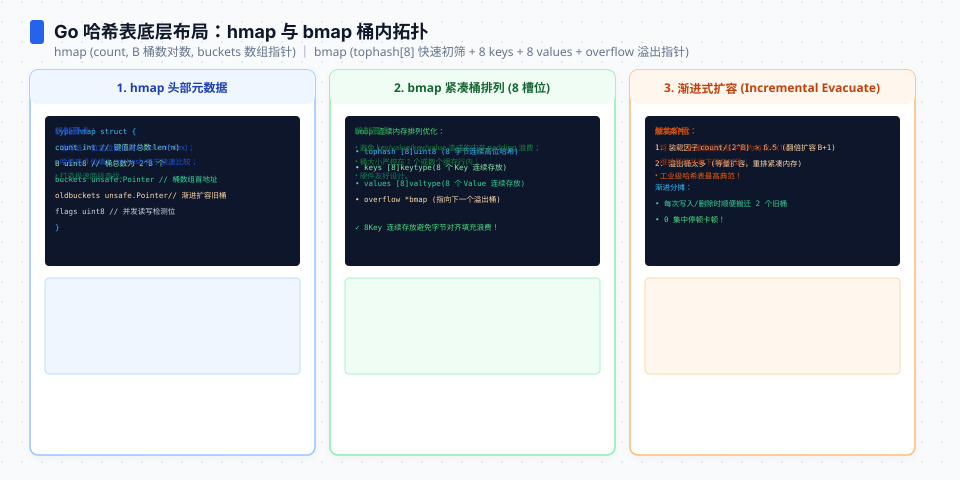

**TL;DR：** Go map 是哈希表：8 槽 bucket + tophash 首字节筛子 + 溢出链 + 负载因子约 6.5 的增量扩容。统一 benchmark（Go 1.25.1/arm64）测得查找从 8 项到 65536 项约 **9.16–9.34ns**；10 万项插入不预分配是 **12.67ms/9.31MB**，预分配是 **9.45ms/5.81MB**。同一字符串 key 形状下，slice 线性查找从 8 项的 **17.55ns** 增长到 1024 项的 **393.6ns**；拐点受 key 类型、编译器和数据布局影响，不应背成固定的“64 项定律”。写代码时：能预估规模就 `make(map, n)`；小集合是否用 slice，用目标 key 和访问模式测量。


---


## 一、hmap 解剖：8 槽 bucket、tophash、溢出链

Go 1.25 默认的 map 实现是经典哈希表（`runtime/map_noswiss.go`，Swiss table 仍在 `GOEXPERIMENT=swissmap` 实验状态）。核心结构：

```go
type hmap struct {
	count     int    // 元素数
	B         uint8  // bucket 数量的 log2（2^B 个 bucket）
	hash0     uint32 // 随机哈希种子（每次创建 map 都不同）
	buckets    unsafe.Pointer // 2^B 个 bucket
	oldbuckets unsafe.Pointer // 扩容时的旧桶数组（平时为 nil）
	nevacuate  uintptr        // 扩容迁移进度指针
}

type bmap struct {
	tophash [8]uint8 // 每个 key 哈希的高 8 位
	// 后面跟着 8 个 key、8 个 elem、1 个 overflow 指针
}
```

三个设计决策决定性能画像：

1. **每个 bucket 8 个槽**：哈希值的前 8 位（tophash）先当筛子——先比对 tophash，全不同直接跳过，省掉 key 比较；同 tophash 才需要完整比较 key。
2. **哈希种子 hash0 随机**：每次建 map 种子不同，攻击者无法构造哈希碰撞队列（防 HashDoS）。代价是同一个 key 在不同 map 里哈希不同——所以遍历顺序随机是设计承诺，不是 bug。
3. **负载因子 13/16 ≈ 6.5**：桶均元素超过 6.5 就翻倍扩容。6.5 是"查找快（桶不深）"和"内存省（桶不满）"的折中点。




## 二、查找为什么 O(1)：tophash 筛子 + fast key 通道

实测（Go 1.25.1，8 核）命中查找：

| map 规模 | 查找耗时 | 对比 |
|---|---|---|
| 8 项 | **9.16ns** | 基线 |
| 64 项 | **7.77ns** | ×0.85 |
| 1024 项 | **8.80ns** | ×0.96 |
| **65536 项** | **9.34ns** | **×1.02（8192 倍数据）** |

**8192 倍的数据量，在这组 benchmark 中只改变约 2%**——这就是哈希表的均摊 O(1)：哈希定位桶是常数时间，桶内 8 槽线性但深度恒定（负载因子锁死）。对比同场景的线性查找（见第四节），这是数量级差异；2% 是当前输入和机器的观测，不是跨版本常数。

三个细节值得知道：

- **hit/miss 是两条不同路径**：miss 可能在 tophash 或 key 比较阶段提前返回，但本批统一入口尚未保存 miss 对照数字，因此本文不把“miss 一定更快”写成当前实验结论。
- **key 类型会改变成本**：运行时对 `map[int]` 和 `map[string]` 有专门的 fast path；当前证据只覆盖字符串 key，不能把字符串数字外推到所有 key。
- **bucket 仍是有限常数**：单次查找近似 O(1) 不等于所有 map 都一样快，溢出桶、哈希函数、缓存命中和 key 比较都会改变尾部。

## 三、写路径：负载因子、翻倍扩容、增量迁移

插入 10 万字符串 key（实测）：

| 方式 | 耗时 | 内存 |
|---|---|---|
| `var m map[string]int`（零预分配） | **12.67ms** | **9.31MB** |
| `make(map[string]int, 100000)` | **9.45ms（-25.7%）** | **5.81MB（-37.6%）** |

25.7% 的耗时税和 37.6% 的内存税来自扩容：负载因子 6.5，10 万项需要 `2^B×6.5 ≥ 100000` → B=14（16384 桶）。零预分配从 B=0 起步，每超过 6.5×2^B 就翻倍——全程约 14 轮扩容，累计迁移的旧桶数组按几何级数叠加（约等于最终桶数的 2 倍），溢出桶和中间代桶全是净开销。预分配让桶数组一步到位，一次迁移都没有。

但扩容的"瞬间卡顿"并不存在，这是 Go 的另一个设计：**增量迁移**。触发扩容时（`hashGrow`）只新建桶数组并记录 `oldbuckets`，之后每次插入/删除顺路迁移两个桶（`growWork`：当前桶 + `nevacuate` 进度桶），全部迁完才释放旧数组。代价是扩容期间查找要同时查新旧两处，换来无毛刺的写路径——大数据量批量插入时尤其明显。

删除是 O(1)（实测 8.0ns）：只清槽位不缩容——**map 删除后内存不回落**（bucket 数组不收缩），长生命周期 map 的删除堆积会让内存膨胀，这是 map 作为缓存的一个真实限制。


## 四、拐点实验：小数据集合 slice 更便宜

同一个"按 string 找 int"场景，slice 线性查找 vs map（查找目标固定在末尾，最坏情况）：

| 规模 | slice 线性 | map | 谁赢 |
|---|---|---|---|
| 8 项 | **17.55ns** | **9.16ns** | map（当前字符串基线） |
| 64 项 | **133.1ns** | **7.77ns** | map |
| 1024 项 | **393.6ns** | **8.80ns** | map |

当前字符串 key 基准在 8 项就由 map 领先；这不是反驳“小集合可用 slice”，而是说明拐点依赖 key 表示、比较成本、访问位置和 benchmark 写法。若集合是整数、结构体很小、需要稳定顺序，slice 仍可能更合适；不要把 64 当作跨项目阈值。遍历同理：map 遍历顺序随机，需要稳定顺序时还要排序，整体成本可能反转。

## 五、生产判断：map 的账怎么付划算

| 场景 | 选择 | 依据 |
|---|---|---|
| 小集合 | slice 或 map，按 key/访问模式实测 | 当前字符串基线 8 项 map 仍更快 |
| 大集合、按 key 查 | map | 8192 倍数据只改变约 2% 的查找时间 |
| 规模可预估 | `make(map, n)` 预分配 | 10 万项省约 25.7% 时间、37.6% 字节 |
| key 是 int/string | 直接用 | fast path，别包成 struct |
| 长生命周期缓存 | 警惕删除不缩容 | 内存只涨不落，考虑重建或换 LRU |
| 需要有序遍历 | slice + sort 或排序结构 | map 遍历随机 + 排序税 |

最容易被忽视的一条：**make(map, n) 的 n 是数量级承诺，不是精确值**——写 `make(map[string]int, 0)` 等于没预分配。批量载入数据前先算一次规模（或干脆 `make(map[string]int, 粗估)`），扩容税直接消失。

## 六、结论：map 的性能边界由桶、扩容和 key 形状共同决定


Go map 的账本由 bucket、负载因子、key fast path 和增量迁移共同决定：当前字符串基准从 8 项到 65536 项约 9ns 量级，写路径预分配则少约 25.7% 时间和 37.6% 字节。slice 与 map 没有跨项目固定拐点，必须把 key 类型、查找位置和是否需要排序一起测；遍历顺序随机、删除不缩容仍是 map 的结构性限制。

下一步可做的事：把代码里 `make(map[X]Y)` 的调用点扫一遍，容量为 0 的补上数量级；小集合的 map 换成 slice 验证拐点。

## 参考资料

1. Go 源码 `runtime/map_noswiss.go`（hmap、bmap、hashGrow/growWork/evacuate）—— Go 1.25.1 本机源码
2. Go 官方文档《Maps》—— https://go.dev/blog/maps
3. 前作：[string ↔ []byte：零拷贝的边界](/writing/go-string-byte-conversion)、[Go 锁成本](/writing/go-lock-cost-futex-rwlock)

实验入口：`experiments/go-runtime-boundary/bench_test.go`（`BenchmarkMapLookupSizes`、`BenchmarkSliceLookupSizes`、`BenchmarkMapInsert*`）；原始输出与命令：`evidence/go-runtime-boundary/2026-08-16-local/`。
