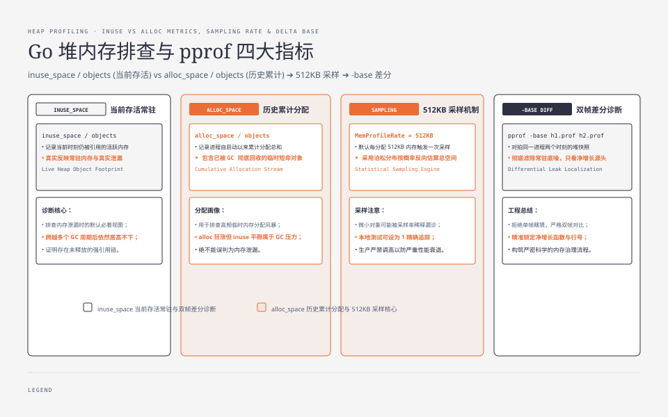
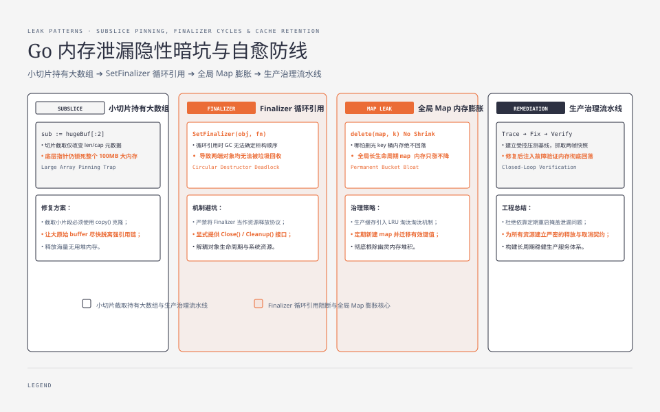

**TL;DR：** 内存泄漏的证明方法不是“某一刻内存很高”，而是**同一进程两个时刻的差**。`go tool pprof` 默认看 `inuse_space`，但它不能替代 `MemStats` 和 goroutine profile：`Sys` 涨不等于 `HeapAlloc` 涨，`TotalAlloc` 狂涨不等于对象仍被引用，goroutine 泄漏也可能主要体现为栈/调度资源。仓库内 probe 固定保留 32×64KiB 缓冲并阻塞 100 个 goroutine，记录前后 HeapAlloc、对象数和 goroutine 数；正确姿势是先看总账，再用 `-base` 对拍两帧。


---



## 一、先分清三本账：RSS、HeapAlloc 与 goroutine

“进程内存涨了”至少可能指三件不同的事：

| 观察对象 | 它回答什么 | 不能直接推出什么 |
| --- | --- | --- |
| RSS / `Sys` | 进程从操作系统保留了多少地址空间或物理页 | 不等于仍被业务对象引用；GC 后的空闲页可能暂时留在进程里 |
| `HeapAlloc` / `HeapObjects` | 当前 Go 堆中仍被认为存活的字节和对象数 | 不包含所有线程栈、文件映射、内核 socket 缓冲和外部进程资源 |
| goroutine profile | 有多少 goroutine，以及它们按调用栈分成哪些等待组 | 不直接告诉你每组持有了多少业务对象 |

因此有两种常见误判：RSS 涨了就判定堆泄漏，或者 HeapAlloc 没明显变化就忽略不断增加的 goroutine。正确的问题不是“哪个数字大”，而是“哪个资源在同一时间窗口内持续增长、由谁持有、能否释放”。

## 二、用受控输入建立两帧基线

仓库内的 `experiments/go-memory-leak-pprof/main.go` 把“仍被引用的缓冲”和“卡住的 goroutine”放在同一个进程里，先取基线，再创建固定数量的资源并取第二帧：

```bash
cd experiments
go run ./go-memory-leak-pprof --chunks 32 --chunk-bytes 65536 --stuck 100
```

本机 Go 1.25.1 的一次输出：

```text
go=go1.25.1 chunks=32 chunk_bytes=65536 retained_bytes=2097152 stuck=100
heap_alloc_before=130288 heap_alloc_after=2283792 heap_delta=2153504 objects_before=166 objects_after=400 goroutines_before=1 goroutines_after=101
```

这次输入有两个可手算的分母：保留缓冲为 `32 × 65536 = 2097152` 字节；goroutine 输入为 100 个，前后差为 100。`heap_delta` 比输入缓冲多 `56352` 字节，来自切片、运行时和 profile/对象元数据；它不应被写成所有 Go 版本都相同的固定开销。

这个 probe 的价值是把“泄漏”拆成可检查的持有关系：`store` 保留了字节，阻塞 goroutine 保留了执行体和等待关系。它运行完就退出，不证明服务重启后会恢复，也不模拟连接、文件描述符或下游队列泄漏。原始输出与环境记录在 `evidence/go-memory-leak-pprof/2026-08-17-local/`。

## 三、读 heap profile：采样、索引与基线都不能混用

`go tool pprof` 的 heap profile 默认关注 `inuse_space`，也就是当前仍在使用的空间；`alloc_space` 关注进程生命周期内累计分配的空间。两者回答的不是同一个问题：

1. **小对象可能被采样稀释**：`runtime.MemProfileRate` 默认按约 512KiB 的累计分配间隔采样，不是“每个对象都记录”。本地诊断可以把采样率调到 1，但 profile 变大、运行成本上升，不能把这个设置直接带进生产。
2. **`alloc_space` 狂涨不等于泄漏**：如果 `TotalAlloc` 快速上涨而 `inuse_space` 在 GC 后回落，可能是分配风暴，不是对象永久被引用。
3. **profile 需要时间基线**：单帧只能告诉你当前热点；两帧的 `-base` 才能过滤掉常驻对象，观察净增长来自哪条调用路径。

服务已经暴露 `net/http/pprof` 时，保留同一进程的两帧：

```bash
curl -s localhost:6060/debug/pprof/heap > /tmp/heap.1.prof
sleep 10
curl -s localhost:6060/debug/pprof/heap > /tmp/heap.2.prof

go tool pprof -sample_index=inuse_space -base /tmp/heap.1.prof /tmp/heap.2.prof
go tool pprof -sample_index=alloc_space /tmp/heap.2.prof
```

goroutine 视图要单独采样，不能从 heap profile 的函数排名替代：

```bash
curl -s 'localhost:6060/debug/pprof/goroutine?debug=1' > /tmp/goroutine.2.txt
```

看二进制 profile 时，`-top` 适合回答“谁的累计值最高”，`-traces` 适合回答“调用链在哪里等待”；看 `debug=1` 文本时，第一行的总数和每组栈尾的业务行号通常更快定位阻塞点。上一组 `go-goroutine-leak-pprof` 的 probe 就是用三组源码行把这件事固定下来。




## 四、三个误报：现象相似，修复动作完全不同

| 现象 | 误认为 | 更可能的解释 | 下一步证据 |
| --- | --- | --- | --- |
| RSS 持续高，但 HeapAlloc 在 GC 后回落 | 堆泄漏 | Go 保留了可复用页，或是内存碎片/缓存 | 同时看 `HeapAlloc`、`HeapSys`、`Sys` 和 GC 后快照 |
| `TotalAlloc` 每秒狂涨 | 对象泄漏 | 高频临时分配，GC 正在回收 | 对拍 `inuse_space` 与 `alloc_space`，看 GC 频率和分配热点 |
| goroutine 数暴涨，HeapAlloc 不明显 | 没有资源问题 | goroutine 可能卡在 channel、锁、网络或 ticker | 两帧 goroutine profile，按等待栈和源码行分组 |

“HeapAlloc 高且稳定才是泄漏”的说法仍然太粗。更可靠的判断是：对象在多个 GC 周期后仍由业务根引用，且增长与输入或请求数相关；如果资源是 goroutine、socket、FD 或外部队列，就必须看对应账本，不能只看 heap。

## 五、从 profile 走到修复：每种增长都要有释放路径

拿到增长分组后按这个顺序排查：

1. 先固定窗口和输入量：请求数、并发、payload、GC 设置与采样间隔必须记录，否则两帧没有可比性；
2. 用 `HeapAlloc/HeapObjects` 判断对象是否跨 GC 存活，用 `goroutine?debug=1` 判断等待组是否持续增加；
3. 对照等待栈找释放条件：消费者是否存在、`context` 是否能取消、`Ticker` 是否 `Stop()`、连接和文件是否关闭；
4. 修复后注入同一个故障：主动取消、慢消费者、下游断开或重复请求，确认资源回落，而不是只确认接口返回 200。

阻塞任务至少要有一个可结束分支：

```go
func consume(ctx context.Context, jobs <-chan Job) error {
	for {
		select {
		case <-ctx.Done():
			return ctx.Err()
		case job, ok := <-jobs:
			if !ok {
				return nil
			}
			if err := handle(job); err != nil {
				return err
			}
		}
	}
}
```

这段代码只展示取消合同，不等于完整的 worker 生命周期：调用方仍要 `cancel`，发送方仍要关闭或停止生产，错误路径还要释放连接和临时缓冲。真正的回归测试应断言取消后 goroutine 数、队列长度和连接占用在窗口内回落。

## 六、结论：泄漏是时间窗口里的持有关系

内存泄漏不是“RSS 高”或“某张 profile 看起来吓人”，而是同一进程在可比输入下，资源跨 GC/取消边界持续增长，且能沿引用或等待栈找到持有者。Heap profile 解决对象空间问题；`MemStats` 区分堆与进程保留；goroutine profile 解决执行体等待问题。三者必须放在同一时间线上。

本机 probe 只证明受控的 32×64KiB 缓冲和 100 个阻塞 goroutine 会在两帧指标中留下可观察差异；它不证明线上服务的泄漏速度、profile 采样精度或恢复时间。下一步应在目标服务上保存两帧 raw，注入取消/慢消费者故障，并把“资源最终回落”写进测试，而不是用重启掩盖增长。

## 参考资料

1. Go 官方 `runtime.MemStats` 文档（`Alloc`、`Sys`、`Heap*`）—— https://pkg.go.dev/runtime#MemStats
2. Go 官方 `runtime/pprof` 文档（heap、goroutine 与采样）—— https://pkg.go.dev/runtime/pprof
3. Go 官方诊断指南（pprof 工作流）—— https://go.dev/doc/diagnostics
4. 前作：[Go GC 时间账本](/writing/go-gc-gctrace-account)、[goroutine profile 的读法](/writing/go-goroutine-leak-pprof)
