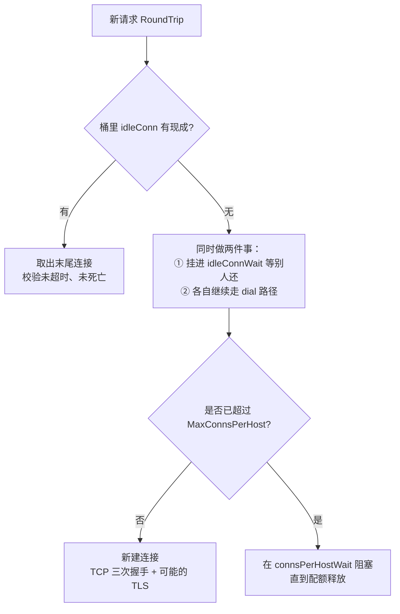

**TL;DR：** HTTP/1.1 的 Keep-Alive 语义是「连接默认复用」，但 Go `http.Transport` 的默认值把这个承诺打了一个大折扣：`MaxIdleConnsPerHost=2`——每条宿主最多留 2 条空闲连接。并发一高，空闲槽位立刻不够，取不到现成连接的请求只能新建，付一笔 TCP 握手 + TLS 握手的「复用税」。本机实测（macOS / Go 1.25.1 / 回环 127.0.0.1 / handler 固定 5ms）：50 并发 × 15000 请求，默认池新建约 3580 次连接（约 24% 的请求付了税），调大到 `MaxIdleConnsPerHost=100` 后只新建 49 次。回环上这笔税被 ~0.1ms 的 RTT 掩盖，吞吐几乎不变；把并发推到 200，默认池进入震荡区（四次重复吞吐 1.1k~16.2k req/s、p99 到秒级），调大池稳定在 ~29.3k req/s。四个旋钮各管一摊：**前三个管复用**（`MaxIdleConnsPerHost` 每宿主空闲上限、`MaxIdleConns` 全局空闲上限、`IdleConnTimeout` 空闲寿命），**第四个管并发配额**（`MaxConnsPerHost` 是每宿主连接硬上限，语义与其余三个完全不同）。

## 一、反直觉：Keep-Alive 说「默认复用」，Go 的默认值却在劝你「每条宿主只养 2 条」

HTTP/1.1 的持久连接语义是：一次 TCP 连接服务多个请求，省掉重复握手（RFC 7230 §6.3）。到 Go 这里，`DefaultTransport` 的实现是：

| 参数 | 默认值 | 语义 |
|---|---|---|
| `MaxIdleConns` | 100 | 全局最多保留的空闲连接总数 |
| `MaxIdleConnsPerHost` | 2 | 每条宿主最多保留的空闲连接数（0 时用 `DefaultMaxIdleConnsPerHost=2`，负数=不限） |
| `IdleConnTimeout` | 90s | 空闲连接超过这个时间自己关闭（0=永久） |
| `MaxConnsPerHost` | 0 | 每宿主连接数硬上限，含 dial 中/活动/空闲（0=不限） |

第一眼的反直觉就在第二行：**池子默认只给每条宿主留 2 条空闲连接**。它对付的是「连接泄漏」焦虑——防止把太多连接挂在一堆 host 上睡大觉——但对高并发打单点上游的应用，这就是把 Keep-Alive 的复用承诺从「默认复用」削成了「只在 2 条槽位内复用」。

这 2 条意味着什么：任何时刻，这条宿主最多 2 条连接可以被「还回来等复用」。第 3 条完成请求的连接回来时，池子放不下，**直接关闭**。下一波并发请求里，只能靠这 2 条存量去接，多出来的全部新建。复用税就是这么收起来的。

## 二、Transport 的池长什么样：按 scheme+host+proxy 分桶，取连接有两条路

`Transport` 内部把空闲连接存在 `map[connectMethodKey][]*persistConn`（源码 `transport.go`），key 是 `{proxy, scheme, addr, onlyH1}`——**scheme + host:port + 代理**，只 HTTP/1.1 的请求还会单独标记。所以同一台机器上 `http://api` 和 `https://api` 是两个桶，各自的 `MaxIdleConnsPerHost` 互不相欠。桶内按「最近最少用」排序，新还回的连接追加在末尾。

每个请求取连接的路径只有两条（源码 `getConn`/`dialConn` 的决策树）：



两个值得注意的实现细节：

1. **`idleConnWait` 是「晚绑定」队列，不是「合并 dial」队列**：池子 miss 后，每个请求会**同时**做两件事——把自己压进 `idleConnWait[key]`（接收别人还回来的连接，源码 `putIdleConn` 注释里的 socket late binding），**同时继续走自己的 dial 路径**。也就是说，并发请求 miss 池子后各自都会新建连接，`idleConnWait` 只让「恰好有人还了连接」的请求省掉这次新建；**阻止并发连接数爆发的唯一闸门是 `MaxConnsPerHost`**（源码 `connsPerHostWait`）。复用税的来源正是「没人合并 dial」，并发请求各自开新连接。
2. **`MaxConnsPerHost` 是全状态计数**：dial 中、活动、空闲全部算在内，超了就阻塞。它是硬配额，不是复用参数——语义见第 §四。

## 三、每连接成本账：一次新建 = TCP 1.5 RTT + TLS 1~2 RTT，还要服务端的 SYN/accept 队列买单

一次新建连接的税分成两段：

- **TCP 三次握手**：SYN → SYN+ACK → ACK，约 1.5 RTT 才把连接建立起来（ACK 可以捎带数据，但首字节通常等下一个 RTT 的请求体）。
- **TLS 握手**（HTTPS 场景）：TLS 1.2 完整握手 2 RTT，TLS 1.3 完整握手 1 RTT（RFC 8446），0-RTT 只对带 PSK 的恢复会话成立。逐字节握手本身还有 CPU 开销（ECDHE 协商），这是并发之外的纯算力税。

合起来，一条 HTTPS 新连接从 0 到首字节约 **2.5~3.5 RTT**。这笔税是串行加在「没命中池子」的那个请求的首字节之前的。以跨区 RTT 30ms 为例（公网常见量级，非本机测得，见实验入口）：一次新建就吃掉约 90ms 的串行延迟——而这 90ms 里 TCP/TLS 握手在服务端毫无产出，只是占着 CPU。

更隐蔽的一半在服务端：每个新建连接都要过 SYN 队列与 accept 队列（机制见 [TCP 握手也要排队](/writing/tcp-syn-queue-backlog)）。客户端池子 miss 越频繁，服务端被灌进的新连接越多；当 dial 突发超过 listen backlog，内核静默丢包，客户端看到的是握手超时，而不是拒绝——这正是上一篇文章讲的「connection timed out」的另一个源头。**复用税不只是客户端的事，它在服务端的队列和 accept() 里有一份账单。**

## 四、四个旋钮怎么调：语义、典型值，以及为什么「调大空闲数」不总是对的

| 参数 | 管什么 | 典型调法 | 常见坑 |
|---|---|---|---|
| `MaxIdleConnsPerHost` | 每宿主空闲复用上限 | 高并发打单点上游时提到 `≈ 峰值并发` | 默认 2，是绝大多数 miss 的根因 |
| `MaxIdleConns` | 全局空闲总上限 | 多 host 客户端时按 `Σ 各宿主` 设 | 默认 100，host 多了会先被全局上限砍 |
| `IdleConnTimeout` | 空闲连接寿命 | `< 中间层/NAT 的空闲超时` | 设太大：LB 先断，客户端复用死连接 |
| `MaxConnsPerHost` | 每宿主并发硬上限 | 想限流/防打爆对端时设 | 与复用无关，是配额不是池 |

为什么「调大空闲数」不是无脑正确：

1. **每连接一个 fd + 一份 socket 缓冲**。客户端进程的 fd 上限（`ulimit -n`）就是硬约束；连接在客户端本地，但**服务端同样为每条空闲连接养着一个 goroutine + 一个 fd**——Go 的 `http.Server` 默认 `IdleTimeout=0`（不主动断空闲连接），客户端挂多少条 idle，服务端就挂多少条睡着的 goroutine。为几十条多余连接拉高 per-host，等于把「复用收益」换成「两端的内存与 fd」，收益递减。
2. **空闲连接会死，且死在你最不想的时候**。云环境里 LB/NAT 的空闲超时（常见 60s~300s 量级）会静默回收长空闲连接；客户端不知道，下一次取出来直接用，撞上一个被服务端/中间层断掉的 socket。Go 的 Transport 对这种「已成功用过的连接上遇到网络错误」的请求会自动换一条新连接重试（源码 `roundTrip` 的 `shouldRetryRequest`，仅当连接被复用过、且请求可重放，才会重试），但你白付了一个往返 + 一次新建税。所以 `IdleConnTimeout` 要**小于**中间层空闲超时，让客户端在 LB 之前主动关掉，而不是撞死连接。
3. **两个上限有交互**。`MaxIdleConns=100` 是全局的：你面向 60 个 host，per-host 就算提到 10，60×10=600 也被全局 100 砍掉，系统按 LRU 淘汰最久未用的空闲连接（`idleLRU.removeOldest`）。调 per-host 前先问一句「总共会同时空闲多少条」。
4. **`MaxConnsPerHost` 是配额不是池**。它把 dial 中/活动/空闲全算进去，超了就阻塞。本机实测（200 并发、其余调大、`MaxConnsPerHost=5`）：新建仅 4 次，吞吐被压在 826 req/s（≈ 5 连接 × 1/5ms），p50 延迟涨到 235ms——这就是排队。用 Little 定律的话说（见[连接池的容量是算出来的](/writing/connection-pool-math-timeout)），`MaxConnsPerHost` 是池容量的**硬上界**：吞吐上限 = 配额 × 1/单请求服务时间，超过的部分全部变成排队延迟。

## 五、HTTP/2 把「复用」从连接级换成流级：默认的 2 条在 h2 面前基本没意义

HTTP/2 的多路复用改变了这笔账的性质（机制详见 [HTTP/2 的队头阻塞](/writing/http2-head-of-line-blocking)）。h2 里一条连接承载多个**并发流**，一个请求只占一个流，不再占一条连接。Go 服务端的默认 `MaxConcurrentStreams=250`（源码 `h2_bundle.go` 的 `http2defaultMaxStreams`），也就是一条连接同时跑 250 个并发请求都放得下。

于是「复用」的单位从连接换成了流：

- **池子的意义变了**。h2 下每 host 只需保留 1 条空闲连接就够了——新请求来了在这条连接上开流，250 个并发槽位吃下绝大多数负载；`MaxIdleConnsPerHost=2` 这个数字在 h2 面前不再构成瓶颈。这就是为什么同一套默认 `Transport`，压 h2 端点和压 h1 端点是两个世界。
- **不复用老连接也划算**。h1 下每请求新建 = 每次付 TCP+TLS 全税，所以要拼命复用。h2 下即使某条连接要换，新建成本摊在 250 个流上，单位成本低两个数量级——「重连」的惩罚大幅变小。
- **注意这是双层配置**：`Transport` 本身是 h1/h2 共用的（`DefaultTransport` 里 `ForceAttemptHTTP2=true`，会让 HTTPS 在 TLS ALPN 能协商出 h2 时走 h2，协商不出则回退 h1），但旋钮语义不能照搬 h1：`IdleConnTimeout` 对 h2 仍生效（h2 传输自己管 idle 定时器，未设时回退到 `Transport.IdleConnTimeout`），而 `MaxIdleConns`/`MaxIdleConnsPerHost` 基本不被 h2 连接池引用——h2 的并发由流承载，每 host 只需保留少量连接。排查时先确认上游到底走的是 h1 还是 h2，再谈旋钮。

## 六、实验入口：本机起上游，压默认池 vs 调大池

代码在 `experiments/go-nethttp/`（`cmd/server` 起本地上游并统计 accept，`cmd/bench` 包装 `DialContext` 精确计数新建连接）。复现命令：

```bash
cd experiments
go run ./go-nethttp/cmd/server   # 终端 1：本地 HTTP/1.1 上游，18765 数据口 / 18766 统计口
go run ./go-nethttp/cmd/bench -workers 50 -requests 300                       # 默认池（-requests 300 为每 worker 请求数，50×300=15000）
go run ./go-nethttp/cmd/bench -workers 50 -requests 300 -perhost 100 -maxidle 100  # 调大池
```

本机实测核心输出（macOS 25.5.0 / Go 1.25.1 / 回环 / handler 固定 `time.Sleep(5ms)`，完整原始输出见 `experiments/go-nethttp/README.md`）：

| 场景（200 并发 × 100 请求） | 新建连接（dial） | 复用率 | 吞吐 | p99 |
|---|---|---|---|---|
| 默认池（per-host=2） | 9695~14911 | 25%~52% | 1.1k~16.2k req/s（四次重复震荡） | 58ms~1.27s |
| 调大池（per-host=250, maxidle=250） | 229 | 98.9% | 29.3k req/s | 15.3ms |

50 并发 × 300 请求/worker（共 15000 请求）的稳定对比：默认池新建约 3580 次（约 24% 的请求付了税），调大池新建 49 次（99.7%）；**但回环吞吐几乎不变（约 7.3k~8.0k req/s 对 7.6k~8.0k）**——这笔税被 ~0.1ms 的回环 RTT 盖住了，它要跨真实网络（RTT 几十毫秒）才变成可见的延迟与吞吐差。200 并发时默认池的震荡正是 §三 讲的机制：空闲槽位太少 → 大量请求同时 dial → 服务端 accept/SYN 队列被持续灌 → 连接建立路径成为瓶颈。以上是本机一次性观察，波动巨大，只能作现象引用，不是稳定分界线。

> 复现提示：`IdleConnTimeout` 的回收行为可以单独看——`bench -idle-timeout 2s` 跑完等 5s，再 `curl http://127.0.0.1:18766/stats`，返回 `"open":0`，证明空闲连接被按时回收。服务端视角可用 `ss -tan`（Linux）或 `lsof -i :18765` 观察连接数。

## 七、结论：先量 miss 率，再动旋钮；回环测不出这笔税

复用税的排查顺序是：**先确认池子的 miss 率，再谈调参**。落地三步：

1. 打点记录 Transport 每次 dial 的时刻与 host（包装 `DialContext`，`experiments/go-nethttp` 的 `cmd/bench` 就是这个做法）。若一段时间内 dial 次数接近请求次数，池子基本没用；dial 数远小于请求数，才说明复用在生效。
2. 单点上游高并发：把 `MaxIdleConnsPerHost` 提到 `≈ 峰值并发`，同时确认全局 `MaxIdleConns ≥ Σ 各 host 的空闲上限`；`IdleConnTimeout` 设成小于中间层空闲超时（常见 60s~300s 量级），让客户端先于 LB 断掉，不撞死连接。
3. 想限流时才用 `MaxConnsPerHost`，它是配额不是池，收益在排队延迟里，不在复用里。

诚实说三点局限：**本实验在回环上跑，复用税的真实延迟放大要跨网 RTT 才显形**；200 并发默认池的震荡是不稳定现象，量级可复现、精确值不能当分界线；h2 下的旋钮语义与 h1 不同，别拿这份参数表直接套 HTTPS+h2 的上游。TLS 握手的逐字节成本与优化见 [TLS 握手深潜](/writing/tls-handshake-deep-dive)。

## 参考资料

1. Go `net/http` 包 `Transport` 文档（各默认值与字段语义）：https://pkg.go.dev/net/http#Transport
2. Go 标准库源码 `src/net/http/transport.go`（`DefaultTransport` 默认值、`DefaultMaxIdleConnsPerHost=2`、`connectMethodKey{proxy,scheme,addr,onlyH1}` 分桶、`idleConn`/`idleConnWait`）
3. Go 标准库源码 `src/net/http/h2_bundle.go`（服务端默认 `http2defaultMaxStreams=250`、客户端假设 `http2defaultMaxConcurrentStreams=1000`）
4. RFC 7230 §6.3（HTTP/1.1 持久连接）：https://www.rfc-editor.org/rfc/rfc7230
5. RFC 8446（TLS 1.3，握手 RTT 结构）：https://www.rfc-editor.org/rfc/rfc8446
