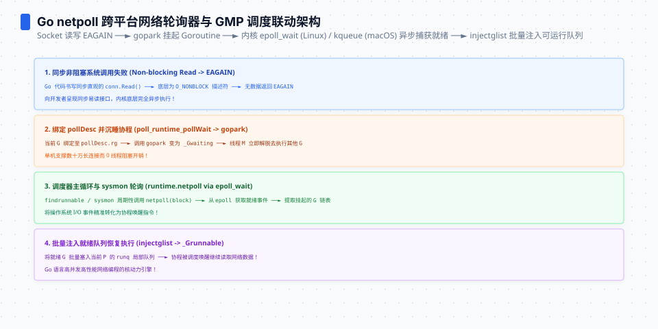

**TL;DR：** 阻塞在 socket 读的 goroutine 不吃线程，因为 Go 把『I/O 等待』定义在 G 层而不是 M 层：`conn.Read` 撞上 `EAGAIN` 时走 `netpollblock` → `gopark`，G 挂到 `pollDesc` 等待位上，M 原地继续跑 runq 里的下一个 G——OS 线程数只数"忙的 M"，与等待的 G 数量无关。本机 macOS/Go 1.25.1 的 1000 个 socket 阻塞读观测到 `OS threads=8`；这只是当前机器与输入规模的一次快照。事件就绪后 netpoll 把内核事件翻译成可运行 G：`netpoll()` 返回一个可运行列表，阻塞在 `epoll_wait` 里的那个空闲 M **就地直接跑列表的第一个**（最快的路径），其余 G 经 `injectglist` 追加到各 P 的 runq 尾部；`runnext` 的插队只发生在 deadline 提前到期或 fd 关闭/取消这类特殊唤醒上，不是正常数据到达。边界是 **pollable**：socket/pipe 走 netpoll，普通文件 IO 与裸 syscall 是阻塞系统调用，M 被钉死在内核里。谁在跑 epoll_wait：没有常驻 netpoll 线程——空闲 M 在 `findrunnable` 里带超时阻塞进 `epoll_wait`（同一时刻至多一个），sysmon 每约 10ms 兜底轮询。


---


## 一、反直觉：100 万个阻塞读为什么没有变成 100 万个线程

8 个线程的服务，为什么能同时挂着十万个 socket 连接？如果每个阻塞读都占一个线程，8 个线程只能服务 8 个连接，第 9 个请求就得排队。可"每连接一个 goroutine、全量阻塞在 `conn.Read`"是 Go 服务最普通的写法，线程数就是不动。账本说明问题在哪一层：

| 等待的实体 | 每个占什么资源 | 100 万时的账单 |
| --- | --- | --- |
| 线程（M） | 用户态线程栈（约 8MB 地址空间预留）+ 内核调度实体 | 内存先爆，创建 µs 级 |
| goroutine（G） | 初始 2KB 栈（按需增长）+ 一个 pollDesc | 至少约 2GB 内存，线程数不变 |

100 万个阻塞读消耗的是 100 万个 G，不是 100 万个线程。但账本没解决直觉难题：**M 凭什么能"不等"？** 阻塞读的"等数据"如果最终仍由一个 M 睡在内核里承担，线程数还是会被顶上去。

答案在 [GMP 那篇](/writing/go-scheduler-gmp-preemption)没答完的地方：goroutine 阻塞时 M 可以"换乘客"，前提是**这个等待能被运行时观察和解除**。epoll 只负责告诉内核"哪个 fd 就绪了"（内核侧见[epoll 的一生](/writing/epoll-c10k-c10m)）；把"fd 就绪"翻译回"某个 G 该醒了"的，是 netpoller。




## 二、netpoller 的位置：pollDesc 与四次交接

netpoller 的主体在 `runtime/netpoll.go`（平台无关：`pollDesc`、`pollCache`、`netpollblock`/`netpollunblock`/`netpollgoready`）和 `runtime/netpoll_epoll.go`（Linux 的 epoll 实现；macOS 对应 `netpoll_kqueue.go`）。每个登记进 netpoller 的 fd 挂一个 `pollDesc`，从 `pollCache` 池子里批量分配；`netpollopen` 把 fd `EPOLL_CTL_ADD` 进全局 epfd，注册 `EPOLLIN | EPOLLOUT | EPOLLRDHUP | EPOLLET`——**边缘触发**，内核只在状态变化时通知一次，读的人要把缓冲读空。

一次"事件从内核到 G 重新上 CPU"是四次交接：


- **第 1 交**：`internal/poll.FD.Read`（`internal/poll/fd_unix.go`）先做一次 `syscall.Read`，撞上 `EAGAIN` 且 pollable 时，走 `waitRead` → `runtime_pollWait` → `netpollblock`，把 G 挂上 `pd.rg` 后 `gopark`。
- **第 2 交**：数据到达，内核把 fd 标记就绪，阻塞中的 `epoll_wait` 返回这个 fd。
- **第 3 交**：`netpoll()`（`netpoll_epoll.go`，每次 `epoll_wait` 最多取 128 个事件）对每个就绪 fd 调 `netpollready` → `netpollunblock(pd, 'r', true)`，把挂在 `pd.rg` 上的 G 取下来收进 `toRun` 列表。
- **第 4 交**：`netpoll()` 把就绪 G 收进一个 `gList` 返回；阻塞在 `epoll_wait` 里的那个 M 从列表头部 `pop` 出第一个**就地直接执行**（这是最快的"不排队"路径），其余 G 经 `injectglist` 标成 `_Grunnable` 追加到各 P 的 runq 尾部。`runnext` 的插队（`netpollgoready` → `ready(gp, ..., true)` → `runqput(next=true)`）只发生在两类特殊唤醒：deadline 提前到期、fd 关闭/取消——不是正常数据到达。

## 三、挂起与唤醒：gopark 之后 M 去跑了谁

`netpollblock` 两个动作决定一切：先把 `pd.rg` 用 CAS 从 `nil` 置成 `pdWait`（保证一个 pollDesc 每方向同时只挂一个等待的 G，并发重复调用会被 throw）；再 `gopark` 把当前 G 从 `_Grunning` 切成 `_Gwaiting`。gopark **只停这个 G，不停 M**——M 回到调度循环，从本 P 的 runq/runnext 拿下一个 G 继续，只是换了个乘客。

"谁在等内核事件"比多数文章说的更精确：**没有常驻的 netpoll 线程**。一是空闲 M 在 `findrunnable`（`proc.go`）发现 runq 空、有 netpoll waiters 时，以无 P 身份调 `netpoll(delay)` 阻塞进 `epoll_wait`，等到最近事件或 timer 截止；`sched.lastpoll` 保证同一时刻至多一个 M 在等。二是 sysmon 每约 10ms 做一次非阻塞 `netpoll(0)` 兜底（`proc.go`），这是"恰好没有 M 在等"时的最坏延迟上界。

还有个易忽略的主动唤醒 `netpollBreak`：deadline 被改早、或出现更早 timer 时，它往内部 eventfd 写一字节（`netpoll_epoll.go`），让阻塞中的 `epoll_wait` 立刻返回重算，否则新 deadline 要等自然超时才被感知。

**唤醒后的调度路径分两条**：正常数据就绪时，`netpoll()` 返回的列表第一个 G 由阻塞中的 M **就地直接执行**（它刚被 `epoll_wait` 叫醒、P 是现成的，这是最快的路径），其余 G 走 `injectglist` 追加到 runq 尾部排队；只有 deadline 提前到期、fd 关闭/取消这类特殊唤醒，才走 `netpollgoready` → `ready(gp, ..., true)` → `runqput(next=true)` 插进 runnext（单槽，插进去会把原占位者踢回 runq）。所以"刚有数据就插队"不是通用行为——正常数据到达没有 runnext 特权，最速路径是 polling M 就地执行第一个。


## 四、边界：socket 阻塞不吃线程，文件阻塞照样吃

上面整套机制只对 **pollable** 的 fd 生效：

| | pollable（socket / pipe） | 非 pollable（普通文件 / 目录） |
| --- | --- | --- |
| fd 登记 | `runtime_pollOpen` → `epoll_ctl(ADD)` 成功 | Linux 返回 `EPERM`；macOS/BSD 在 `os/file_unix.go` 排除 `S_IFREG`/`S_IFDIR` |
| 阻塞时 | `netpollblock` → `gopark`，G 挂起，M 换乘客 | 直接 `syscall.Read` 阻塞，M 钉死在内核 |
| G 状态 | `_Gwaiting`，可唤醒 | 卡在 `_Psyscall`，运行时无法预占 |
| 线程数 | ≈ GOMAXPROCS，与 N 无关 | 看负载，可能涨到 ~N |

**为什么磁盘文件读会钉死 M**：Linux 的 epoll 拒绝对普通文件 `EPOLL_CTL_ADD`（`EPERM`），`runtime_pollOpen` 失败，fd 被标成不可 poll；macOS/BSD 则是 `os/file_unix.go` 里对 `S_IFREG`/`S_IFDIR` 直接跳过 netpoller。殊途同归：`FD.Read` 里 `fd.pd.pollable()` 为假，退化成裸阻塞 `syscall.Read`，M 睡在内核里，运行时也不知道它卡住（`_Psyscall`）。

**线程数涨不涨是条件性的**（`proc.go` 的 `retake`/`handoffp`）：sysmon 发现 P 卡在 `_Psyscall` 超约 10ms 就收走交给另一 M，主要在有可运行 G 需要替补时（`handoffp` 另有 GC/trace 等触发条件，这里取主路径）`startm` 新开线程。全部 G 都在阻塞时线程数停在 ≈ GOMAXPROCS（M 被钉着但没人要替补）；有可运行 G 抢 P 槽时每个被钉的 M 补一个替补，线程数往 N 顶——Linux 经典可复现，macOS 时序不确定（见第五节）。这也是"并发读一堆磁盘文件的 Go 服务线程数实打实涨"的根。

## 五、实测与退化点：什么时候 netpoll 也救不了你

实验脚手架在 `experiments/go-netpoll/`，四个可运行命令（仓库根目录执行）：

```bash
cd experiments
ulimit -n 30000                       # 每条连接 2 个 fd，N 大时要先抬上限
go run ./go-netpoll/cmd/wakeup -n 10000 -rounds 3        # 1: N 个阻塞读的线程数 + 批量唤醒延迟
go run ./go-netpoll/cmd/wakeup -n 1 -rounds 20000 -settle 500us -init-sleep 20ms   # 2: 单连接隔离唤醒延迟
go run ./go-netpoll/cmd/raw-syscall -n 64                # 3: 裸阻塞 syscall 的线程数（当前 + 峰值）
go test ./go-netpoll -bench WakeupLatency -benchtime=3s -run '^$' -count=3           # 4: 微基准
```

本次本机快照使用 `-n=1000`，不是 1 万连接的普遍承诺：批量唤醒 `p50=2.999ms / p90=7.344ms / p99=7.623ms / max=7.725ms`，隔离单连接为 `43µs / 76µs / 374µs / 615µs`；64 个 raw `syscall.Read` 在 macOS 本次 `OS threads(now)=8, peak=8`。大批量延迟包含顺序写入的排队，raw syscall 是否拉高线程数还依赖是否有 runnable work；完整 stdout 与环境见 `evidence/go-netpoll-wakeup-scheduling/2026-08-16-local/`。

两个诚实前提：一是**数据常驻就绪时没有 netpoll 这回事**——socket 永远有数据时不撞 `EAGAIN`，G 根本不 park，这是忙等不是阻塞；二是**绕开 `internal/poll` 就退化成钉 M**——裸 `syscall.Read`、cgo、把 fd 拿出去自己 read 都绕过 `netpollblock`（`cmd/raw-syscall` 测的就是这条退化路）。退化点总结：**netpoll 只在"走 internal/poll 且 pollable 且真撞到 EAGAIN"时生效**，少一条，阻塞就从 G 层掉回 M 层。

## 六、结论：阻塞是 G 层概念，线程只数忙的 M

回到开头。100 万个阻塞读不撑爆 8 个线程，靠的是 Go 把"I/O 等待"从 M 层抬到 G 层，netpoll 是中间的翻译器：**内核就绪事件 → 可运行 G**，polling M 就地跑第一个、其余注入 runq 排队。这套设计成立的前提（pollable + internal/poll + 真阻塞），以及失效的退化点（磁盘文件、裸 syscall、常驻就绪），就是"阻塞不吃线程"这句话的完整边界。

排查"线程数异常"先分清阻塞种类：pprof 里 G 卡在 `IO wait`（netpoll，G 层）还是卡在 `syscall`（M 层）。前者调连接数/读缓冲，后者先确认 fd 是不是绕过了 netpoll。下一步：读一遍 `runtime/netpoll.go` 的 `netpollblock` 和 `netpoll_epoll.go` 的 `netpoll`，跑第五节四个命令回填数字。

## 参考资料

1. Go 源码 `runtime/netpoll.go`（pollCache、netpollblock/netpollready/netpollunblock/netpollgoready）—— https://github.com/golang/go/blob/master/src/runtime/netpoll.go
2. Go 源码 `runtime/netpoll_epoll.go`（netpollinit/netpollopen/netpollBreak/netpoll）—— https://github.com/golang/go/blob/master/src/runtime/netpoll_epoll.go
3. Go 源码 `runtime/proc.go`（findrunnable 的 netpoll(delay)、sysmon 10ms 兜底、retake/handoffp、goready/injectglist/runqput）—— https://github.com/golang/go/blob/master/src/runtime/proc.go
4. Go 源码 `internal/poll/fd_unix.go`（FD.Read 的 EAGAIN→waitRead 路径与 pollable 判断）—— https://github.com/golang/go/blob/master/src/internal/poll/fd_unix.go
5. Go 源码 `os/file_unix.go`（S_IFREG/S_IFDIR 排除 kqueue 的 pollable 决策）—— https://github.com/golang/go/blob/master/src/os/file_unix.go
6. Go 源码 `runtime/sys_darwin.go`（libc syscall 包装里的 entersyscall/exitsyscall）—— https://github.com/golang/go/blob/master/src/runtime/sys_darwin.go
7. 本机复现快照：`evidence/go-netpoll-wakeup-scheduling/2026-08-16-local/`；其中的 Darwin 结果不能替代 Linux epoll 或真实网络压测。

> 延伸：epoll 就绪链表怎么来的，见[内核侧 epoll 的一生](/writing/epoll-c10k-c10m)；GMP 三表与 10ms 抢占见[调度器的三张表](/writing/go-scheduler-gmp-preemption)；G 与线程的切换成本见[从 CPU 到 goroutine 的上下文切换](/writing/understanding-context-switching-from-cpu-to-goroutines)；监听循环在关停时的退出路径见[Go 优雅关停](/writing/graceful-shutdown-in-go)。
