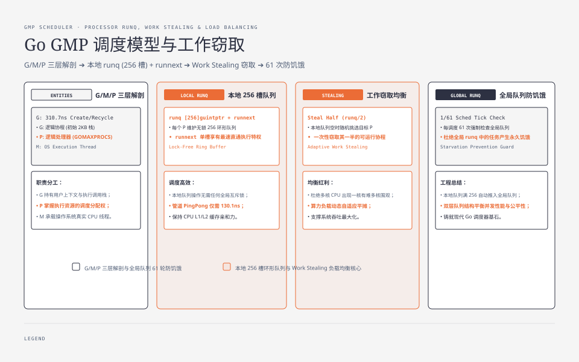
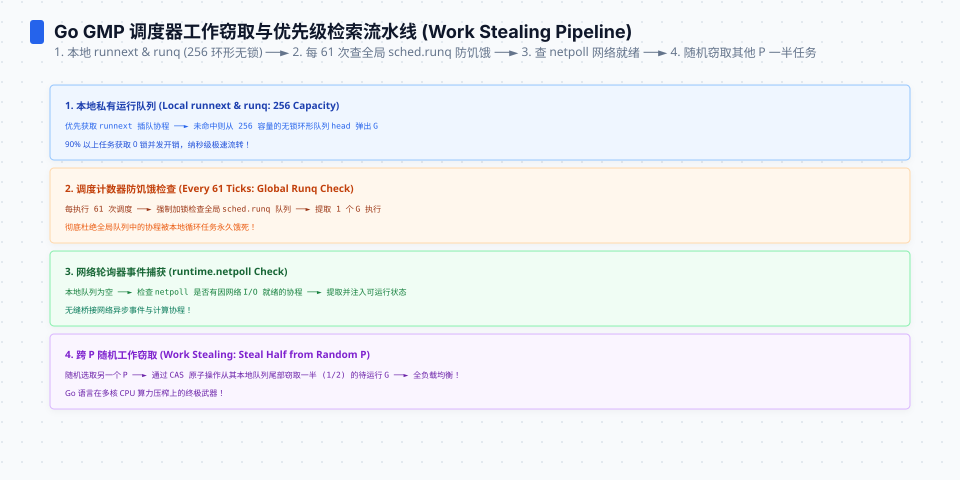
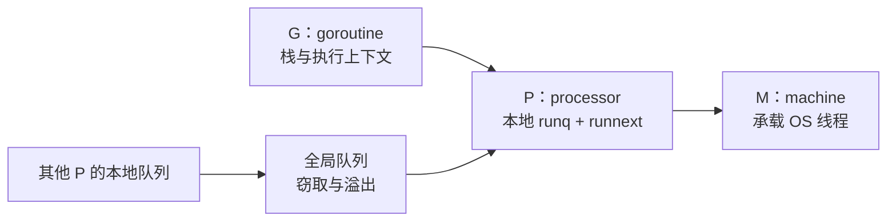
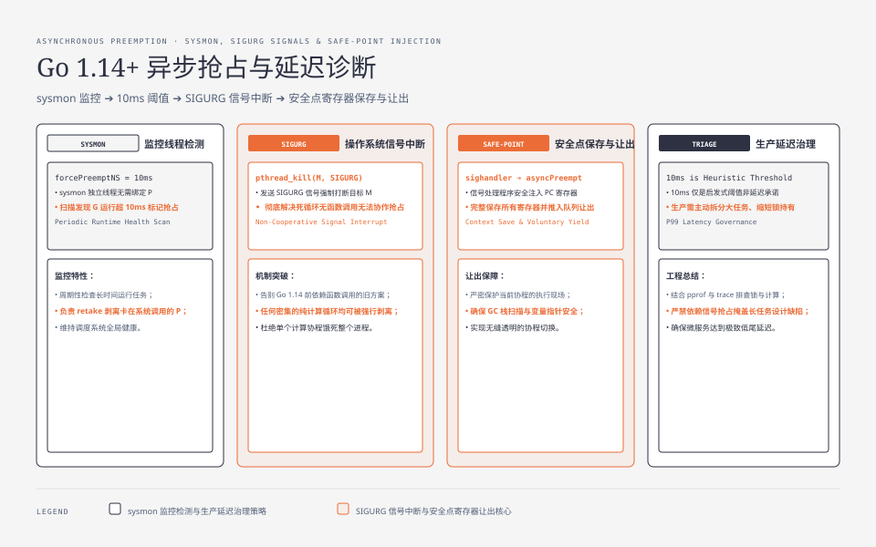

**TL;DR：** Go 调度的三笔账不能混成一个“调度延迟”：当前 benchmark 在 `-cpu=8`、Go 1.25.1、Apple M1 Pro 上一次运行测到 goroutine 创建/回收 **310.7ns**、无缓冲 channel 传递 **130.1ns**；源码层的异步抢占触发阈值是 `forcePreemptNS` 的 10ms。G/M/P 各管一件事：G 是执行体，P 持有可运行队列，M 承载 OS 线程。**创建/传递的本机稳态成本，不等于排队和抢占的线上尾延迟**；先确认慢在固定成本、阻塞、队列还是长计算。


---



## 一、先纠正直觉：goroutine 便宜，但不是零成本

“goroutine 便宜”是相对于创建 OS 线程和维护大块栈而言，不是免费。当前 benchmark 的两个操作都很窄：一个 goroutine 启动后立即 `Done()`，另一个 goroutine 通过无缓冲 channel 接收 `b.N` 次整数；它们不能直接代表业务请求。

| 操作 | 本机 `ns/op` | 这个数字能说明什么 |
| --- | ---: | --- |
| goroutine 创建/回收 | 310.7 | 该 benchmark 输入下的启动、排队和完成成本 |
| channel 双 G 传球 | 130.1 | 该无缓冲同步形状的传递成本 |
| 无锁原子计数 | 未在同一 benchmark 中测量 | 不与调度路径直接等价 |

创建成本来自栈、调度上下文和队列管理；具体分配与回收路径会受编译器、Go 版本、`GOMAXPROCS` 和 benchmark 结构影响。每秒百万次的线性外推只能作为容量预算起点，不能替代并发服务的 trace、pprof 和尾延迟。




## 二、三张表：G 是执行体，P 是调度权，M 是 OS 线程



- **G（goroutine）**：带有栈和执行上下文的用户态执行体。可以很多，但每个 G 都可能持有 channel、锁、连接或业务对象。
- **P（processor）**：调度 Go 代码所需的逻辑处理器，数量固定为 `GOMAXPROCS`。默认值由 Go 版本、机器和容器 CPU 配额共同决定；本次 benchmark 的 `-cpu=8` 只是实验参数，不是所有环境的默认值。P 有本地 run queue 和 `runnext` 优先槽。
- **M（machine）**：承载 OS 线程的 runtime 结构。M 阻塞在系统调用时，runtime 可以安排其他 M 运行可执行的 G；因此 M 的数量不等于 `GOMAXPROCS`。

调 `GOMAXPROCS` 调的是同时执行 Go 代码的 P 数量，不是线程总数，也不是队列长度。应用把“G 多”误当成“CPU 并发更多”，就会把等待、排队和资源占用一起推迟到生产环境。

## 三、异步抢占：10ms 是 runtime 阈值，不是延迟承诺

Go 1.14 起支持异步抢占。runtime 中的 `forcePreemptNS` 是触发抢占检查的时间阈值：

```go
const forcePreemptNS = 10 * 1000 * 1000 // 10ms
```

这个常量不能被翻译成“每个 G 每 10ms 获得一次时间片”，更不能翻译成“其他请求最多等待 10ms”。运行时还要处理：

1. sysmon 发现某个 G 长时间占用 P 后请求抢占；
2. G 在可安全抢占的位置响应请求，安全点和函数形状会影响观察到的时间；
3. 如果 G 阻塞在系统调用，P 可以被交给其他可运行的 G，M 数量也可能变化；
4. 锁等待、GC、OS 调度和队列排队都可能成为比抢占阈值更大的延迟来源。

所以“10ms”适合解释 runtime 为什么会尝试打断长计算，不适合作为实时 SLO。要回答某个请求的 p99，必须测完整请求路径和竞争条件。




## 四、验算：把 benchmark 与调度现场分开

benchmark 工件在 `experiments/go-scheduler-boundary/bench_test.go`。命令固定 Go 包、输入形状、预热时间和 `-cpu=8`：

```bash
cd experiments
go test ./go-scheduler-boundary -run '^$' -bench '^(BenchmarkGoroutineCreate|BenchmarkChannelPingPong)$' -benchmem -benchtime=500ms -count=1 -cpu=8
```

本机 Go 1.25.1、Darwin arm64、Apple M1 Pro 的一次输出：

```text
BenchmarkGoroutineCreate-8    1972687   310.7 ns/op   17 B/op   1 allocs/op
BenchmarkChannelPingPong-8    4582046   130.1 ns/op    0 B/op   0 allocs/op
```

这两个数字只支持“该输入和参数下的稳态操作成本”。它们不支持把 channel 传递时间当作上下文切换时间，也不支持把创建成本直接外推成 HTTP 请求延迟。完整 raw 与环境记录在 `evidence/go-scheduler-gmp-preemption/2026-08-17-local/`。

若要观察 runtime 现场，可在自己的服务上打开 `GODEBUG=schedtrace=250,scheddetail=1`，同时记录 Go 版本、`GOMAXPROCS`、负载和完整输出。`runqueue`、`schedticks` 和线程数是某个时间点的调度快照，不能拿一行 schedtrace 推导“每 10ms 换一次人”，也不能替代 pprof 或延迟分布。

## 五、诊断决策：先找慢在创建、阻塞还是排队

| 症状 | 首要假设 | 证据 | 常见动作 |
| --- | --- | --- | --- |
| 大量小任务让 CPU 突然升高 | 创建/回收成本或任务过碎 | benchmark + CPU profile + 任务计数 | 比较 worker pool，不要先凭感觉引入池 |
| 请求偶发毫秒级延迟 | 长计算、锁等待或队列排队 | trace、mutex/block profile、p99 | 缩短临界区、拆分计算或主动让出 |
| 系统调用多时线程数上涨 | M 在等待 syscall | schedtrace、runtime/trace、线程 profile | 调整 I/O 模型和并发上限，别把 P 当线程池 |
| G 数持续上涨 | goroutine 生命周期没有关闭路径 | 两帧 goroutine profile、等待栈、资源计数 | 增加 context、超时、关闭或消费者；见[goroutine profile 的读法](/writing/go-goroutine-leak-pprof) |

关键区分：**310.7ns 和 130.1ns 是本机稳态 benchmark 数字，10ms 是 runtime 抢占阈值，不是最坏延迟合同**。业务变卡时先看 trace、pprof 和延迟分布哪一段占最多；如果创建为主，再比较 worker pool；如果偶发延迟，先确认是长计算、锁等待、系统调用还是队列排队（见[锁的成本](/writing/go-lock-cost-futex-rwlock)）。

## 六、结论：调度器优化要围绕可测的等待路径

Go 调度器没有一个可以替代所有问题的“快慢数字”：创建和 channel 传递是微秒以下的局部操作，P 队列决定可运行任务如何等待，异步抢占只是 runtime 对长计算的纠偏机制。生产决策应按证据分层：

1. 任务很小且创建成本占比低，直接使用 goroutine，先保持代码简单；
2. 任务量达到每秒百万级或创建/回收在 profile 中占比明显，再用同语义 benchmark 比较 worker pool；
3. 有硬延迟要求时，不把 10ms 常量写成 SLO，必须测锁、GC、syscall、队列和 OS 调度的联合尾部。

下一步：运行仓库 benchmark 建立本机基线，再对目标服务采集 trace、goroutine/block profile 和 p99；只有当两类证据指向同一等待路径，才调整 `GOMAXPROCS`、池化或任务切分。

## 参考资料

1. Go 源码 `runtime/proc.go`（`forcePreemptNS`、retake、preemptone、schedtrace）—— https://github.com/golang/go/blob/go1.25.1/src/runtime/proc.go
2. Go 源码 `runtime/runtime2.go`（G、P、M 与 run queue）—— https://github.com/golang/go/blob/go1.25.1/src/runtime/runtime2.go
3. Go 官方 `runtime.GOMAXPROCS` 文档—— https://pkg.go.dev/runtime#GOMAXPROCS
4. Go 调度跟踪环境变量—— https://go.dev/wiki/GODEBUG

> 延伸：goroutine 切换的另一半是锁排队（[锁的成本](/writing/go-lock-cost-futex-rwlock)）；调度器的内存账是 GC 停顿，不是同一个问题（[Go GC 时间账本](/writing/go-gc-gctrace-account)）；并发先后关系由 [happens-before](/writing/go-happens-before) 约束。
