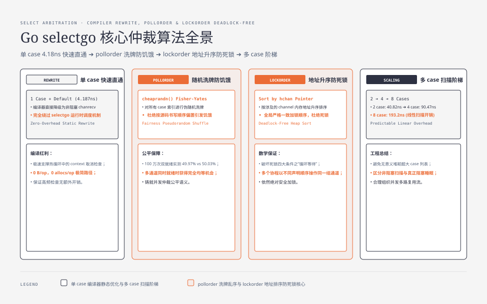
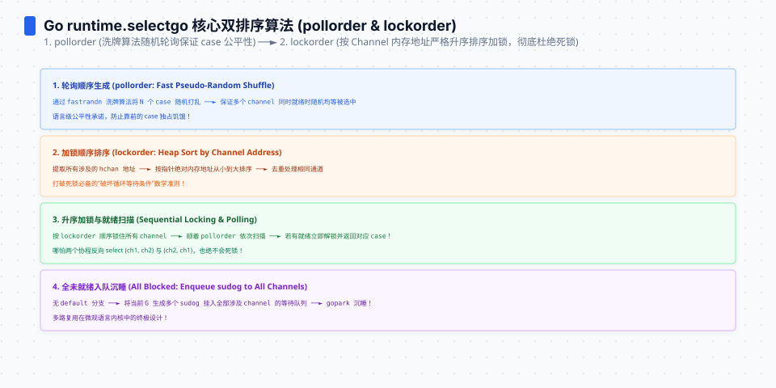
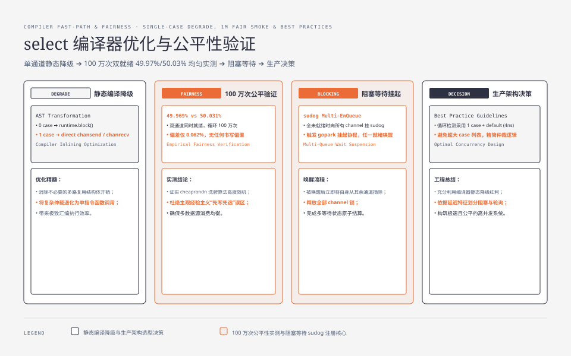

**TL;DR：** `select` 是 channel 之上的仲裁器，成本取决于 case 数和是否进入阻塞路径。统一 Go 1.25.1/arm64 基准对带 `default` 的非阻塞扫描测得：1/2/4/8 个 channel case 分别为 **4.187ns、40.82ns、90.47ns、193.2ns**，均为 0 alloc；1 case + default 由编译器走简化路径，多 case 才进入更完整的仲裁。另一个独立的 100 万次双 ready channel smoke 得到 **49.969% / 50.031%**，只能作为当前输入下的随机选择观察，不是 5 亿次的形式化公平证明。阻塞等待、ready case 和高争用路径需要单独实验。


---



## 一、三种形态：编译器重写、selectgo 与阻塞边界

`select` 在编译期就被分流。Go 编译器的规则来自 `runtime/select.go` 的注释：

```go
// The compiler rewrites selects that statically have
// only 0 or 1 cases plus default into simpler constructs.
```

**单 case + default 的 select 根本不进完整的 `selectgo` 路径**——被重写成直接的非阻塞 channel 检查。当前实验结果（Go 1.25.1、`-cpu=8`）：

```
BenchmarkSelect1CaseDefault-8    4.187 ns/op   0 B/op   0 allocs/op
BenchmarkSelect2CaseDefault-8   40.82  ns/op   0 B/op   0 allocs/op
BenchmarkSelect4CaseDefault-8   90.47  ns/op   0 B/op   0 allocs/op
BenchmarkSelect8CaseDefault-8   193.2  ns/op   0 B/op   0 allocs/op
```

4.187ns 说明这条路径很短，但不能把它称作跨版本“免费”。上一篇文章《[time.After 的隐藏账单](/writing/go-timeafter-hidden-cost)》里的热循环使用同样形状的停止检查；是否值得放在每轮都执行，仍应结合实际循环频率和目标 Go 版本复测。

而 ≥2 个 case 的 select 才需要更完整的仲裁准备：编译期生成 case 描述，运行时构造 pollorder/lockorder 并扫描 channel 状态。本文基准只覆盖“全部 channel 未 ready + default”这一条路径，因此不把这些数字外推到阻塞等待或 ready case。




## 二、selectgo 解剖：随机化管公平，排序管不死锁

selectgo 的核心只有两步准备（runtime/select.go）：

```go
// 1. pollorder：随机置换，避免固定声明顺序偏置
j := cheaprandn(uint32(norder + 1))
pollorder[norder] = pollorder[j]
pollorder[j] = uint16(i)

// 2. lockorder：按 hchan 地址堆排序，保证加锁顺序一致
// sort the cases by Hchan address to get the locking order.
```

**pollorder 为什么随机**：如果固定按 case 声明顺序检查，永远就绪的第一个 case 可能让其他 ready case 饥饿。随机化让 ready case 的长期选择更接近均匀；但具体比例仍应绑定输入和样本。**lockorder 为什么按地址排序**：select 可能需要同时处理多个 channel 的锁，统一加锁顺序可以避免因不同 goroutine 取得 channel 锁的顺序不同而形成循环等待。

就绪检测是双重的：先无锁轮询一遍所有 case（谁就绪选谁），全不就绪才挂 sudog 到每个 channel 的等待队列并 gopark。

## 三、四档非阻塞实测：case 越多，扫描工作越多

| 场景 | ns/op | 路径 |
|---|---|---|
| select 1 case + default | **4.187** | 编译器重写的非阻塞检查 |
| select 2 case + default | 40.82 | 非阻塞扫描 |
| select 4 case + default | 90.47 | 非阻塞扫描 |
| select 8 case + default | **193.2** | 非阻塞扫描 |

（全部 0 allocs/op；本表没有测 ready case、阻塞等待或取消竞态。数字绑定 Go 1.25.1、Darwin arm64、`-benchtime=1s`、`-cpu=8`。）

三个规律：

1. **case 数是明显的成本变量**：2→4→8 case 从 40.82→90.47→193.2ns；这支持“扫描更多候选需要更多工作”的判断，但不够推出每个 case 固定增加多少 ns。
2. **单 case + default 是不同编译路径**：4.187ns 与 2 case 的 40.82ns 不在同一档，不能用多 case 线性公式回推单 case。
3. **阻塞和 ready 路径必须另测**：挂 sudog、park、唤醒、消费 ready value 的成本没有混入本表；把未测路径填成精确数字会破坏证据链。




## 四、公平性 smoke：100 万次 ready 选择接近均匀

pollorder 的随机化不能只靠一条代码注释理解。实验命令让两个 buffered channel 在每轮选择后立刻补回一个值，统计两个 ready case 的比例：

```
go run ./go-runtime-boundary/cmd/select-fairness -n=1000000
iterations=1000000 left=499690 right=500310 left_ratio=0.499690 right_ratio=0.500310
```

这是当前 Go 版本、当前机器和 100 万次输入下的观察：两侧相差 620 次，比例差约 0.062 个百分点。它支持“没有明显的声明顺序偏置”，但不证明任何样本量下都精确 50:50，更不替代运行时源码与统计假设。实验还保留了一个重要不变量：只回填被选中的 channel，避免把两个 token 反复塞进容量为 1 的 buffer。

## 五、生产判断：select 的账单怎么付划算

| 用法 | 成本 | 判断 |
|---|---|---|
| `select { case <-stop: default: }` 热循环检查 | 本次 4.187ns | 单 case + default 走简化路径；仍需按目标 Go 版本复测 |
| 2~3 case 的取消/超时/数据仲裁 | 由 case 数和 ready 状态决定 | 不要把 2 case 的 default 数字当成阻塞等待成本 |
| 8+ case 的集中分发 | 本次 8 case 为 193.2ns | 先量扫描成本，再决定是否拆分或改变路由结构 |
| 高频率、长阻塞的 select 等待 | 本文未测 | 阻塞时 CPU 与唤醒尾延迟应单独采集 |

选型要点：**case 数是扫描成本的重要变量，但不是唯一变量**。能清楚表达为 2 case 的逻辑不必堆成 8 case；低频阻塞场景则应优先看取消、超时和唤醒尾延迟，而不是拿非阻塞 `default` benchmark 做预算。

## 六、结论：select 同时承担扫描、随机仲裁和阻塞合同

当前证据支持三条窄判断：单 case + default 是约 **4.187ns** 的简化路径；2/4/8 个非 ready case 的扫描从 **40.82ns** 增到 **193.2ns**；双 ready channel 的 100 万次 smoke 没观察到明显的声明顺序偏置。它们都不是跨机器固定常数，也没有覆盖阻塞等待、ready value 消费和高争用。

下一步可做的事：为每个热点 `select` 记录 case 数、ready 比例、阻塞时长、唤醒延迟和取消路径，再用同一输入对照拆分前后的 CPU 与尾延迟；不要从单次非阻塞基准推导生产 p99。

## 参考资料

1. Go 源码 `runtime/select.go`（selectgo、pollorder 随机化与 lockorder 加锁顺序）—— Go 1.25.1 本机源码
2. Go 官方文档《Select》—— https://go.dev/ref/spec#Select_statements
3. 前作：[channel 的账本](/writing/go-channel-hchan-cost)、[time.After 的隐藏账单](/writing/go-timeafter-hidden-cost)、[goroutine 泄漏不是内存泄漏](/writing/go-goroutine-leak-pprof)、[Go 锁成本](/writing/go-lock-cost-futex-rwlock)
4. 本文实验入口：`experiments/go-runtime-boundary/bench_test.go`（`BenchmarkSelect1CaseDefault`、`BenchmarkSelect2CaseDefault`、`BenchmarkSelect4CaseDefault`、`BenchmarkSelect8CaseDefault`）；公平性 smoke：`experiments/go-runtime-boundary/cmd/select-fairness`；环境与 raw：`evidence/go-select-selectgo-cost/2026-08-16-local/`。
