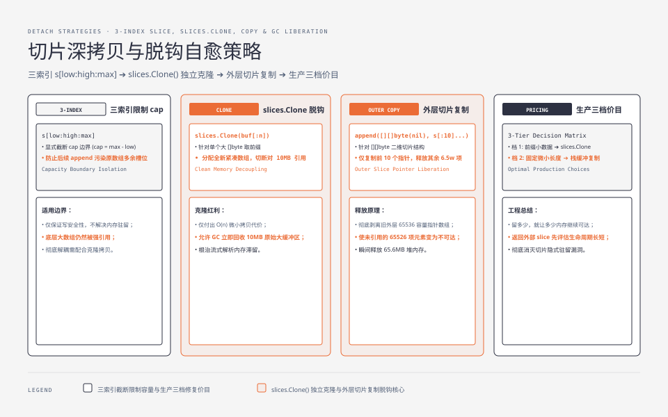

**TL;DR：** `s[:keep]` 截断只收窄**窗口**，不释放**底层数组**——只要还有切片引用它，整块内存一直活着。统一入口在 Go 1.25.1/arm64 下用 65536 个 1KiB 切片复现：`ret := all[:10]` 返回后 GC 的 `HeapAlloc` 在三次独立运行中为 **68,812,032–68,817,376 字节（约 65.6MiB）**；复制外层切片、只让前 10 个元素继续可达后为 **140,688–146,032 字节（约 138–143KiB）**。这两个数包含运行时基线和对象开销，不是“有效数据大小”。修法要按数据形状选：`[][]byte` 只保留少量引用时复制外层 slice；单个大 `[]byte` 只留前缀时用 `slices.Clone`，代价是一次 O(n) 拷贝。


---


## 一、直觉错在哪里：以为截断等价于删除

`big[:10]` 写起来像"把 big 砍到 10 个元素"，直觉上内存也随之缩小。但 slice 是三元组：**指针 + 长度 + 容量**。截断改的只是长度（len），指针不动——它依然指向那块可能很大的底层数组，容量（cap）也原样保留。GC 判定存活的标准是"有没有被引用"，而 `big[:10]` 与被截断前共享同一个底层数组，GC 没法分清楚"你只用了 10 个"，它看到的是整个数组被引用。

这就是"窗 vs 房"模型：`s[:10]` 是把窗户开小，房子（底层数组）一砖不少。

## 二、实测：同一份输入，65.6MiB 与 148KiB 的滞留差别

完整可运行代码（文末），核心是两种写法的对照：

```go
// 反例：先收下全部，再截断
func parseLines(total, keep int) [][]byte {
	var all [][]byte
	for i := 0; i < total; i++ {
		all = append(all, make([]byte, 1024))
	}
	return all[:keep] // 窗口收窄，数组整体保留
}

// 正例：复制外层 slice，让未保留的元素不再被结果引用
func parseLinesCopy(total, keep int) [][]byte {
	var all [][]byte
	for i := 0; i < total; i++ {
		all = append(all, make([]byte, 1024))
	}
	return append([][]byte(nil), all[:keep]...)
}
```

本机（Apple M1 Pro，Go 1.25.1，`darwin/arm64`）运行统一入口：

```bash
cd experiments
go run ./go-runtime-boundary/cmd/slice-retention -mode=retained -total=65536 -keep=10 -width=1024
go run ./go-runtime-boundary/cmd/slice-retention -mode=copied -total=65536 -keep=10 -width=1024
# 一次输出示例：
# mode=retained total=65536 keep=10 width=1024 heap_alloc=68817376 len=10 cap=65536
# mode=copied  total=65536 keep=10 width=1024 heap_alloc=146032   len=10 cap=10
```

`runtime.MemStats.HeapAlloc` 是调用 `runtime.GC()` 后的瞬时读数；它还包含 Go 运行时和切片头的开销，因此不要把它直接写成“底层数组精确占用”。但 `len/cap` 已经把因果关系暴露出来：反例返回的 `cap` 仍是 65536，结果仍持有那块外层切片数组；正例新建了一个容量为 10 的外层数组，未保留的 65526 个 `[]byte` 指针随旧 `all` 一起变得不可达。

如果需要测累计分配，可以另外用 `go test -benchmem`；它回答的是“总共分配了多少”，不是“GC 后还留了多少”：

| 写法 | 累计分配 | GC 后堆占用 |
| --- | --- | --- |
| `all[:keep]` 截断返回 | 输入仍创建 65536 个 1KiB 对象 | **68,812,032–68,817,376 B（约 65.6MiB）**，`cap=65536` |
| 复制 `all[:keep]` 的外层引用 | 输入仍创建同样的对象 | **140,688–146,032 B（约 138–143KiB）**，`cap=10` |

两种写法都先创建同样的输入；区别在返回值是否继续持有外层数组。反例里 65536 个 `[]byte` 指针都仍能从底层数组扫描到，正例里只有前 10 个指针被复制到新数组。**这就是“内存泄漏”在 Go 里的常见形态：不是谁忘了释放，而是一个悄悄保住了整块数组的引用。**

和上一篇文章（[内存指标无感 ≠ 没有问题](/writing/go-memory-leak-pprof)）呼应：`TotalAlloc` 和 `HeapAlloc` 回答的是两件事。服务如果反复创建并丢弃大输入，累计分配会很高但不一定滞留；如果把一个小 slice 返回到长生命周期对象里，`HeapAlloc` 和 pprof 的 `inuse_space` 才会暴露被引用的大对象。

## 三、三种最常见的踩坑场景

1. **日志/CSV 解析只留前 N 行**（上面就是）：读 10 万条只分析前 100 条，`lines[:100]` 把其余 9.99 万条的全部分配钉死在堆上。
2. **HTTP 响应体取前缀**：`resp.Body` 读到 10MB，只要前 1KB（比如流式解析前几行判断格式），`buf[:1024]` 就是 10MB 滞留。
3. **缓冲区复用**：一次申请了几十 MiB 的读缓冲，只把前 1KiB 作为结果返回；如果结果对象比这次请求活得久，返回的窗口会把整块缓冲一起钉住。`bytes.Buffer.Bytes`、自建读缓存和协议解码器都要检查这个生命周期关系；需要独立所有权时复制，而不是只改长度。

判断口诀：**返回的 slice 如果只是底层窗口的一部分，且底层数组还会继续变大，就该拷**。




## 四、修复的三档价目

| 场景 | 修法 | 代价 |
| --- | --- | --- |
| 只留前 N 行、数组很大 | `slices.Clone(s[:n])` 或 `append([]T(nil), s[:n]...)` | 一次 O(n) 拷贝，n 远小于原长时几乎免费 |
| 每次只取前 1KB | 复制到自己的固定缓冲 | 4KB 栈内数组，零堆分配 |
| 需要原切片语义（修改反射回原数组） | 不能拷，明确"引用即持有"的清单 | 无拷贝，但必须显式管理生命周期 |

写代码时的基本纪律：**返回给别人用的 slice，先问一句"它会不会比它引用的数组活得短"**——会，就拷。

## 五、验证：先看 HeapAlloc，再用 inuse_space 定位来源

`go test -bench` 时用 `-benchmem` 看 `B/op` 只是第一步（看的是分配）；**滞留**要用 `pprof` 的 inuse_space：

```bash
go test -run TestSubslice -bench . -benchmem -memprofile=mem.out
go tool pprof -sample_index=inuse_space mem.out
```

`inuse_space` 视图会列出“采样时仍活着的对象”及其分配栈；反例的主要保留路径会回到 `parseLines` 的 `make([]byte, 1024)`，正例只留下前 10 个元素和运行时基线。这个 profile 命令是诊断路径，文章的最小复现仍以 `slice-retention` 命令为准：**GC 周期的存在让“分配多”不等于“滞留多”，大多数性能工具默认统计前者。**

## 六、结论：切片共享数组时，容量决定旧数据能否被释放

截断是切窗不是拆房：`s[:n]` 只缩小窗口，底层数组在最后一个引用消失前一直活着。当前 65536×1KiB 的三次复现中，滞留读数约为 **68.8MB**；复制外层引用后降到约 **0.14MB**。换更大输入时，滞留量会按输入规模增长，但具体倍数必须在目标机器上重跑。修法不是“见 slice 就拷”，而是区分数据形状：`[][]byte` 复制需要保留的外层引用，单个大 `[]byte` 则克隆需要保留的字节。**留多少，就让多少内存继续可达。** 这也和 goroutine 泄漏那篇（[goroutine 泄漏不是内存泄漏](/writing/go-goroutine-leak-pprof)）是同一个骨架：Go 没有“释放”，只有“不再被引用”。

下一步可做的事：grep 代码里所有 `[:N]` 截断（尤其 `[:10]`、`[:100]` 字面量），逐个问"底层数组还会长大吗、被截断的切片活得比它长吗"；顺手跑一次 `-memprofile + inuse_space` 把滞留大对象找出来。

## 参考资料

1. Go 官方博客 Slice 语义（header 三元组）—— https://go.dev/blog/slices-intro
2. `slices.Clone` 文档—— https://pkg.go.dev/slices#Clone
3. 前作：[goroutine 泄漏不是内存泄漏](/writing/go-goroutine-leak-pprof)、[Go 内存泄漏与 pprof 的账本](/writing/go-memory-leak-pprof)

实验入口：`experiments/go-runtime-boundary/cmd/slice-retention/main.go`；本机命令、环境和原始输出：`evidence/go-slice-subslice-hold/2026-08-16-local/`。
