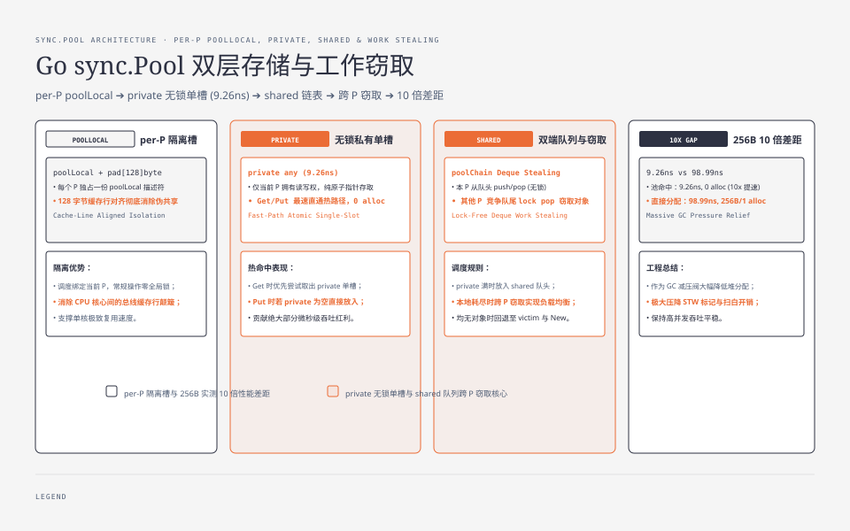
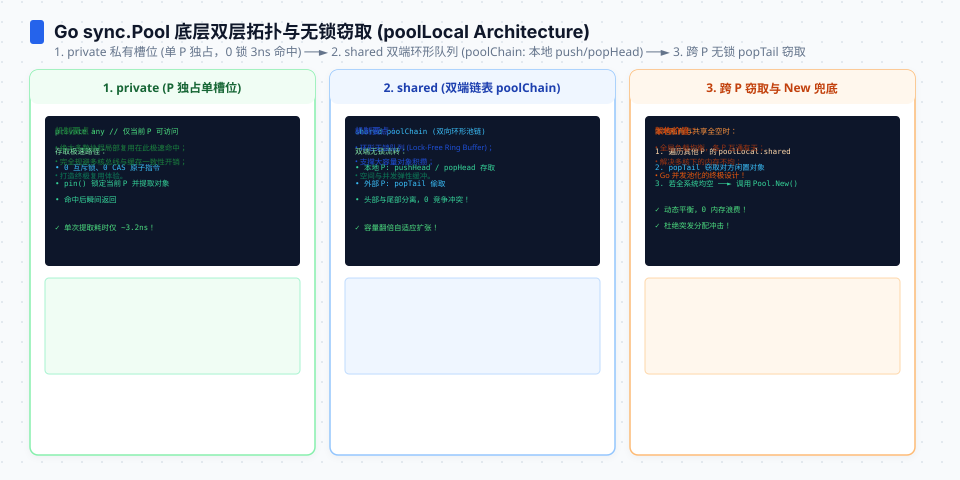
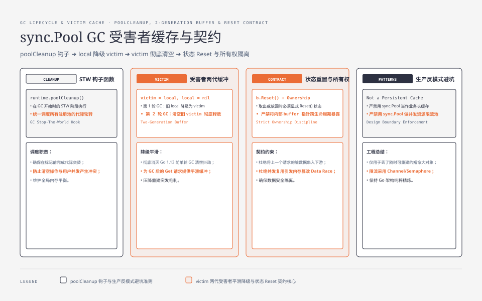

**TL;DR：** sync.Pool 的正确心智模型是"**GC 的减压阀**"，不是"通用缓存"。统一 benchmark（Go 1.25.1/arm64）测得：256B 对象池命中 Get+Put **9.26ns/0 allocs**，直接分配 **98.99ns/256B/1 alloc**。但这只是热命中路径；GC 可以清理池，victim 只提供有限的延迟保留，Get 也必须允许返回新对象。当前证据没有把 GC 后的成本压成一个跨运行稳定常数。池的正确用法是“丢了也能重建”的短命大对象，永远不要依赖它保存业务状态。


---



## 一、设计：per-P 私有化 + victim 两代回收

sync.Pool 的核心是 `poolLocal`（每 P 一份，sync/pool.go）：

```go
type poolLocal struct {
	poolLocalInternal // private any + shared poolChain
	pad [128 - ...]byte // 防 false sharing
}
```

两个机制构成它的全部行为：

1. **每 P 一份私有槽**：Get 先取本 P 的 `private`（无锁）；没有则从本 P 的 `shared` 队列（无锁 pop）；还没有才去别的 P 偷（有锁），最后才轮 victim 和 New。**热点在私有槽上，锁只在偷取路径出现**——这就是约 9ns 热命中的来源。
2. **victim 两代回收**：GC 时（poolCleanup）不直接清空，而是把当前代整体降级为 `victim`，下一轮 GC 才真正清掉 victim。它给“GC 后仍需 Get”的场景留了有限缓冲，但不应被当成持久化承诺；本次基准没有把 GC 本身和 Get 重新构造拆成稳定的延迟数字。




## 二、实测：10 倍差距与 GC 耦合

本机实测（Go 1.25.1，arm64 8 核，256B 对象）：

| 场景 | ns/op | 说明 |
|---|---|---|
| 池 Get+Put（单线程） | **9.26** | 私有槽热命中路径 |
| 直接分配 256B | **98.99** | 对照（mallocgc 路径） |
| GC 后 Get / 重建 | 未在本次基准固定量化 | 受 GC 时机、victim 和 `New` 实现影响 |

读法：

1. **约 10 倍差是池存在的理由**：当前 256B 对照是 98.99ns，池热命中是 9.26ns；这只是相同输入、相同编译器和一次命令的基线。
2. **GC 是池的敌人也是池的语义**：每次 GC 都可能清理池。你的程序分配率越高 → GC 越频繁 → 池被清得越勤 → 重建越多。**池的收益与 GC 压力负相关**，不能只看热命中数字。
3. **victim 是缓冲不是保险**：只多活一代（两次 GC 之间）。高频 GC 下 victim 形同虚设。

## 三、什么时候该用池：256B 分界线

| 对象大小 | 直接分配 | 池 | 判断 |
|---|---|---|---|
| ≤16B（tiny 合并） | 应先测直接分配 | 还有池元数据与 GC 语义 | 通常不值得引入池 |
| 256B | **98.99ns 基线** | **9.26ns 热命中** | 只有在可接受丢失时考虑 |
| 4KB+ | 需要目标 workload 基线 | 可能节省更明显 | 先测 GC 与复用率，再决定 |
| 生命周期长（缓存/连接） | — | — | 别用池，用长期持有 |

分界线不能只由 256B 一个数字决定：当前 256B 基线是池 9.26ns、直接分配 98.99ns，但小对象的直接分配、池命中率、GC 频率和对象重建成本都要放进同一 workload 测量。**池只应该装"重建贵且生命周期短"的大对象**——连接、大 buffer、解析器中间结构。




## 四、反模式：把池当缓存

最常见的误用：把"想缓存的东西"塞进 sync.Pool，期望它留到下次用。池的三条纪律与此相悖：

1. **GC 会清池**：缓存期望持久，池承诺只活两代 GC——缓存用池等于"定时全清"；
2. **Get 可能返回 nil/新对象**：代码必须处理"没拿到"——这意味着池不是可靠的缓存语义；
3. **Put 的对象不能假设会被复用**：只是"可能"。

要持久缓存，自己持有对象（map + 锁，或分片）；要降低 GC 压力，用池装临时大对象。**池解决的是"频繁创建销毁"不是"需要记住"**——这是它与缓存最根本的语义差。

## 五、对象合同：Pool 不负责清零、关闭或限量

`sync.Pool` 只负责“这里可能有一个同类型对象”，不负责对象生命周期。调用方要补齐三件事：

```go
import (
	"bytes"
	"sync"
)

var buffers = sync.Pool{
	New: func() any { return new(bytes.Buffer) },
}

func render(input []byte) []byte {
	b := buffers.Get().(*bytes.Buffer)
	b.Reset() // 清掉上一次调用的长度；必要时还要覆盖敏感内容
	defer buffers.Put(b)

	// 使用期间不能把 b.Bytes() 交给一个会跨出本次生命周期的消费者，
	// 除非消费者完成后仍由同一份所有权合同负责归还/复制。
	b.Write(input)
	return append([]byte(nil), b.Bytes()...)
}
```

1. **重置状态**：`Put` 不会清空 slice、map、buffer 或捕获的引用；忘记 `Reset` 可能把上一次请求的数据带进下一次请求，既是正确性 bug，也可能是数据泄露。
2. **明确所有权**：返回 `Bytes()` 的别名后立刻 `Put`，消费者仍在读时，下一次 `Get` 可能复用并改写同一底层数组。池化不能替代复制、引用计数或发送完成信号。
3. **释放外部资源**：连接、文件、锁、订阅和带后台 goroutine 的对象不应仅靠 `Put` 归还；它们有显式 Close/Cancel 合同，池只适合可丢弃的内存对象。
4. **不要把池当容量上限**：`sync.Pool` 没有稳定的最大数量，也不提供等待语义。若必须限制并发内存或连接数，应使用 semaphore、channel 或有明确容量的资源池。

这也是安全边界：若对象承载 token、用户输入或压缩后的敏感数据，`Reset` 只调整长度不一定擦除底层字节；是否需要清零应按威胁模型和实际 buffer 生命周期决定，不能把 `sync.Pool` 当作安全擦除机制。

## 六、结论：sync.Pool 是可丢弃对象的复用提示，不是缓存


sync.Pool 是"GC 的减压阀"：per-P 私有槽给出约 9ns 的热命中，当前 256B 对照约 99ns；代价是池与 GC 频率耦合，GC 后必须允许重建。使用边界清晰：短命、可丢弃、重建成本明显高于 Get/Put 的对象才考虑用池；小对象先让分配器处理，要持久缓存的别用池。判断池是否有效的终极指标不是单次 ns/op，而是**目标服务在真实分配率下的 GC CPU、驻留内存和 p99 是否改善**。

下一步可做的事：把你代码里的 sync.Pool 过一遍，GC 频率对比（`GODEBUG=gctrace=1`）；凡池里装小对象或依赖池做缓存的，改直接分配或长期持有。

## 参考资料

1. Go 源码 `sync/pool.go`（poolLocal、victim、poolCleanup）、`runtime/syncpool.go` —— Go 1.25.1 本机源码
2. Go 官方文档《sync.Pool 的语义》—— https://pkg.go.dev/sync#Pool
3. 前作：[mallocgc 解剖](/writing/go-mallocgc-allocator)、[Go GC 时间账本](/writing/go-gc-gctrace-account)

实验入口：`experiments/go-runtime-boundary/bench_test.go`（`BenchmarkSyncPool256`、`BenchmarkAllocate256`）；原始输出：`evidence/go-runtime-boundary/2026-08-16-local/raw/errors-interface-pool-map.txt`。GC 清理与 victim 语义以 [sync.Pool 官方文档](https://pkg.go.dev/sync#Pool) 和源码为准，本次 benchmark 不把 GC 后延迟伪装成稳定常数；新增的对象合同示例也没有声称它能替代有容量的连接池。
