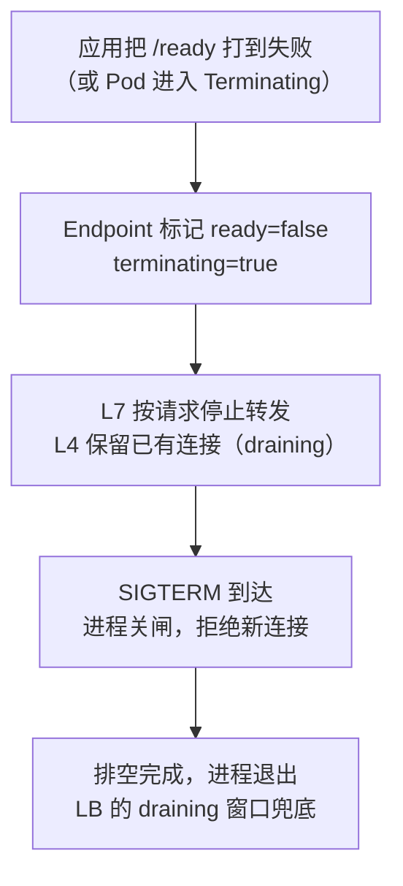
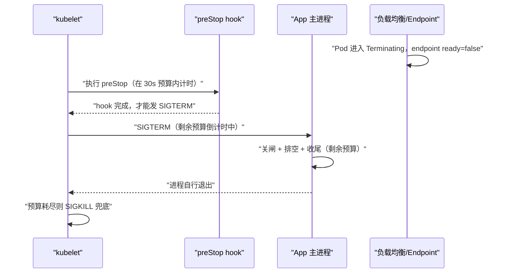
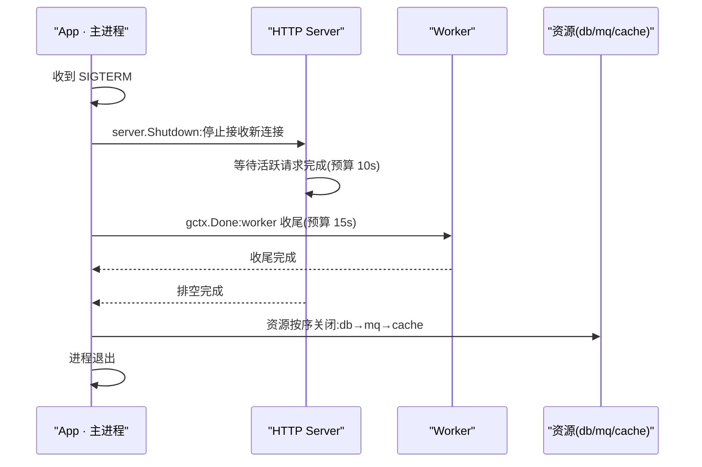

**TL;DR：** 优雅停机不是"收到信号后随便等一等"，是一笔有时间上限的预算：关闸（停新）→ 排空（处理中请求完成）→ 收尾（后台任务结束）→ 兜底（关资源、刷缓冲），四步顺序固定，总时长不得超过 K8s 的 `terminationGracePeriodSeconds`（默认 30s）。用 `signal.NotifyContext` + `http.Server.Shutdown` + `errgroup` 把流程串成确定代码，每一步都有独立预算；窗口耗尽后 SIGKILL 兜底，所以**停机代码必须幂等**——SIGKILL 可能落在任何一步。

## 一、停机窗口：一次发布里的 30 秒

服务每天都在被反复停掉：发布、扩容缩容、节点驱逐、集群升级、抢占式实例回收。每一次停止，都是一次"用户请求还在路上、而进程正在消失"的交接。如果交接做不好，表现为三件事：正在处理的请求被硬生生掐断（客户端看到 EOF/超时）、后台任务半途而废（消息没消费完、状态没刷盘）、新请求打向正在消失的实例（负载均衡还没摘除它）。

优雅停机（graceful shutdown）解决的就是这三件事。它的正式定义是：**在有限时间内，停止接收新工作、完成已有工作、干净地释放资源，然后退出。** 关键限定词是"有限时间"——停机不能无限期等慢请求，K8s 默认只给你 30 秒，超时直接 SIGKILL。所以优雅停机的本质是一道预算题：30 秒怎么分给"排空请求"、"收尾任务"、"关资源"三件事。

先看信号到达之后的完整时间线：


*图注：SIGTERM 到达即开始倒计时——关闸在前，排空与收尾并行，资源关闭最后；任何一步超预算，进程被 SIGKILL，之前的工作全部作废。*

## 二、信号链：SIGTERM 从内核到你的代码

进程的终止信号由内核投递。SIGTERM（15）的默认行为是终止进程，所以**什么都不做的程序，收到 SIGTERM 就死**——这正是大多数"停机丢请求"事故的根源：进程没注册任何 handler，信号一到直接退出，in-flight 请求全部断开。

K8s 删除 Pod 时的完整流程（kubelet 视角）：

1. 进入 Terminating 状态，从 Service Endpoint 摘除，负载均衡不再分发新流量；
2. 并行执行 preStop hook（若定义）并发送 SIGTERM 给容器主进程；
3. 等待 grace period（默认 30s）内进程自行退出；
4. 超时后发送 SIGKILL（9），内核直接终结进程。

两个容易被忽略的事实：第一，**摘除 Endpoint 与 SIGTERM 之间没有等待协议**——上游可能还在向这个实例发请求，所以进程自己必须拒绝新连接；第二，**preStop hook 也在 grace period 内计时**，如果 hook 里做的是 `sleep 20`，留给应用真正排空的时间只剩 10s。

信号本身还有一个镜像侧的细节：容器运行时投递的信号默认是 SIGTERM，但镜像里用 `STOPSIGNAL` 指令声明过别的信号时，kubelet 会尊重镜像声明，投递那个信号而不是 SIGTERM（K8s 官方文档原话："Many container runtimes respect the STOPSIGNAL value defined in the container image and, if different, send the container image configured STOPSIGNAL instead of TERM"）。如果你的镜像为了别的原因设过 `STOPSIGNAL`，而 Go 代码只注册了 `syscall.SIGTERM`，信号链会在最外层断掉——这条链上每一环都要对账。

在 Go 里注册信号处理，标准做法是 `signal.NotifyContext`——它把信号转成可取消的 Context，与 `errgroup` 天然配合：

```go
ctx, stop := signal.NotifyContext(context.Background(), os.Interrupt, syscall.SIGTERM)
defer stop()
```

`os.Interrupt`（SIGINT）通常用于本地 Ctrl+C 调试，`syscall.SIGTERM` 是 K8s 的正式信号。从这一行开始，程序的生命周期有了一个统一的"总闸"。

## 三、进程形态：PID 1 与信号转发

kubelet 的 SIGTERM 不是发给你"以为"的那个进程，而是发给容器 PID namespace 里的 1 号进程。这一条决定了下面所有的坑。

容器运行时创建容器时，容器内的主进程就是 PID 1。问题在于，**PID 1 是谁，取决于镜像的启动写法**。三种形态，三种命运：

| 镜像启动写法 | PID 1 是谁 | SIGTERM 到达谁 | 结果 |
| :--- | :--- | :--- | :--- |
| `CMD ["/app/server"]`（exec 形式） | 应用本身 | 应用直接收到 | 优雅停机正常 |
| `CMD ["sh", "-c", "/app/server"]` | sh | sh 收到 | sh 的默认行为是立即退出，**不转发给子进程**；应用继续跑，grace period 耗尽后被 SIGKILL，等于没有优雅停机 |
| `ENTRYPOINT ["/entrypoint.sh"]`（脚本里直接调命令） | 脚本的 shell | shell 收到 | 同上，脚本不转发，应用被连坐 |

`sh -c` 吞信号的机制并不神秘：SIGTERM 发给 sh 后，sh 按默认处置退出，子进程成了没人通知的孤儿；内核里 PID 1 退出会触发整个 PID namespace 的清理（SIGKILL 所有剩余进程），应用甚至来不及做任何收尾。这是容器世界里最常见的"优雅停机失效"现场：不是代码没写对，是信号压根没到代码手里。

修法有三种，按优先级排：

1. **让应用做 PID 1**。Dockerfile 用 exec 形式，entrypoint 脚本结尾用 `exec` 替换自身进程：

```dockerfile
# 反模式：sh 是 PID 1，吞掉 SIGTERM
CMD ["sh", "-c", "/app/server"]
# 正确：exec 形式，应用就是 PID 1，信号直达
CMD ["/app/server"]
```

```bash
#!/bin/sh
# entrypoint.sh 结尾：反模式
/app/server "$@"

# 正确写法：exec 让 server 替换掉 shell，成为 PID 1
exec /app/server "$@"
```

2. **用 tini / dumb-init 这类 init 进程做 PID 1**。它们的本职工作是两件：收到信号后转发给子进程、回收孤儿进程。适合"镜像里跑着多个进程、不想大改启动脚本"的场景（tini 见 https://github.com/krallin/tini，dumb-init 见 https://github.com/Yelp/dumb-init）。

3. **真要用 shell 包装，就自己做转发**。要么在脚本里 trap 信号并手动 kill 子进程，要么用 preStop hook 代劳（下一节展开）——总之，把"信号必须到达应用"当成显式的代码职责，而不是指望 shell 好心。

为什么 kubelet 只投递给 PID 1？因为信号投递的对象在内核层面就是 PID namespace 的 init 进程，容器运行时没有义务也没办法遍历你进程树里每个进程挨个通知。**信号转发是应用侧的责任，系统不会替你转发。** 这也是为什么优雅停机代码必须自己监听信号——从内核到你的 handler，中间每一层都可能短路。

## 四、就绪探针与流量摘除：把"摘流量"做成确定的顺序

回到信号链的第一步：摘除 Endpoint。这一步的细节决定"新请求会不会打向正在消失的实例"。

先纠正一个常见混淆：**探针失败和进程终止是两回事**。readiness 探针失败 → Pod 从 Service Endpoint 摘除，但 Pod 继续跑，探针恢复后还会加回来；liveness 探针失败才触发重启。摘除是"流量层面的隔离"，终止是"进程层面的结束"，两者可以解耦——这也正是"先摘流量、再停进程"的抓手。

K8s 删除 Pod 时，Endpoint 的状态变化是确定的：Pod 进入 Terminating 的瞬间，EndpointSlice 里对应的条目被标记为 `ready: false`、`serving: true`、`terminating: true`。K8s 官方教程的原话是："In Kubernetes, endpoints that are terminating always have their ready status set as false... existing load balancers will not use it for regular traffic"——常规负载均衡器看到 `ready=false` 就不再路由新流量。但注意两个"但是"：

- **L7 与 L4 的摘除粒度完全不同**。L7 负载均衡（ALB、nginx 按 HTTP 请求转发）摘除后不再派发新请求；L4 负载均衡（AWS NLB 按 TCP 连接转发）摘除后**已有连接会被保留**（connection draining），连接上仍然可以发起新请求。AWS 官方文档明确写着：目标 deregister 后，"the load balancer can continue to send traffic to the target"（只要目标健康且连接不空闲）。
- **摘除存在传播延迟**。AWS 文档同样写明：deregister 后目标仍可能收到新连接，因为"configuration propagation delay"——摘除指令从控制面下发到数据面需要时间。NLB 的 deregistration delay 默认 300 秒（可配 0-3600 秒），期间连接不断开。

所以"探针失败 → 摘除 → 排空"的正确顺序是：



这条链上最常被省略的一环是 D 与 C 的重叠期：**摘除没完成时 SIGTERM 已经到达（第二节的事实一），进程必须在摘除生效前自己拒绝新连接**——`http.Server.Shutdown` 关 listener 的动作正是干这个的。反过来，如果进程收到 SIGTERM 立刻退出（不排空），而 L4 负载均衡还在往这个连接上派新请求，客户端拿到的就是连接重置。

生产里最常见的组合拳是：发布系统先把实例的 readiness 打到失败 → 等 LB 摘除窗口（对 NLB 这类连接级 LB，这个窗口受传播延迟影响，秒级）→ 再删 Pod 触发 SIGTERM。摘除窗口等多久，正是下一节 preStop 的用武之地。

## 五、preStop 的正确用法：它不解决问题，只买时间

preStop hook 的官方时序有一条硬约束：**hook 必须执行完，SIGTERM 才会发出**，而且 grace period 的倒计时从 hook 执行前就开始了。K8s 官方文档给了个经典算例：grace 60s，preStop 跑 55s，应用正常停止需要 10s，55 + 10 > 60，应用被强杀。所以 preStop 不是"多出来的时间"，它是从你的 30 秒预算里切出去的一块。另有一个细节：preStop 超时后 kubelet 会给一次性的 2 秒宽限，但那只是给 hook 收尾的，不是给应用的。

preStop 只有两个正当用途：

**用途一：拖延，等流量摘除。** K8s 官方教程的 nginx 示例就是这么干的——preStop 里 `sleep`，让进程在摘除传播延迟内继续活着服务存量连接（官方例子是 grace 120s + sleep 180s，注释里写明"all this time nginx will keep processing requests"）。适用场景：外部 LB（尤其 L4）摘除慢，而你不想让进程在摘除完成前退出。

**用途二：转发信号给子进程。** 当镜像形态没法改成"应用做 PID 1"（第三节），可以用 preStop 代替 shell 转发：

```yaml
lifecycle:
  preStop:
    exec:
      command: ["/bin/sh", "-c", "kill -TERM $(cat /run/app.pid)"]
```

### 反模式：`sleep 5` 的预算算术

网上流传的"给 preStop 加个 `sleep 5`"是个典型的预算误算。把 30 秒的账摆开就清楚了：`30s = preStop 拖延 + 应用排空 + 后台收尾 + 余量`。`sleep 5` 意味着应用真正能用的排空时间从 30s 缩到 25s，**每一秒 sleep 都是从应用手里抢的**——而 preStop 的本意是给应用争取时间，方向完全反了。更糟的是 `sleep 5` 是拍脑袋的固定值：LB 摘除传播延迟如果超过 5 秒，它兜不住；如果远小于 5 秒，它白白烧掉预算。拖延应该对准可测量的对象（LB 摘除确认、draining 状态），而不是一个常数。

还有一个版本差异值得知道：Kubernetes 1.25 起 preStop 支持原生 `sleep` 动作（SleepAction），由 kubelet 自己计时执行，不再需要容器里有 shell 去跑 `exec`——好处是容器已经退出的场景也能执行。但它同样落在 grace period 预算里，不改变上面的算术。



结论：**preStop 的正确用法是买时间（等摘除）或传话（转发信号），不是无脑 sleep。** 能用 exec 形式让应用做 PID 1、用 readiness 摘流量，就尽量不要让 preStop 承担它不擅长的活。

## 六、排空：先关闸，再放水

优雅停机最容易做错的一步是**顺序**。直觉上的做法是"收到信号先把全局 Context cancel 掉，让所有请求尽快退出"——这是反模式。`cancel()` 会立即让 in-flight 请求的所有下游调用（数据库查询、RPC）提前返回错误，请求根本来不及正常完成，等于亲手把"优雅"变成"加速失败"。

正确的顺序是：**先关闸（停止接收新工作），再放水（等已有的做完）。** `http.Server.Shutdown` 的设计正对应这一步——它先关闭 listener 停止接收新连接；排空期间 keep-alive 连接上已到达的新请求仍会被正常处理，只是响应后连接会被关闭；然后等待活跃连接上的请求自然完成，最后处理空闲连接：

```go
var drainTimeouts atomic.Int64 // 排空超预算次数，见验证章节

srv := &http.Server{Addr: ":8080", Handler: mux}

g, gctx := errgroup.WithContext(ctx)

// 任务 1：正常服务
g.Go(func() error {
    return srv.ListenAndServe()
})

// 任务 2：监听信号，触发排空
g.Go(func() error {
    <-gctx.Done() // SIGTERM 到达

    drainCtx, cancel := context.WithTimeout(context.Background(), 10*time.Second)
    defer cancel()

    if err := srv.Shutdown(drainCtx); err != nil {
        // 10s 后还没排空完：强制关闭，把剩余请求交给上游重试
        drainTimeouts.Add(1) // 预算爆了的计数器
        log.Printf("drain timeout (%v), forcing close", drainCtx.Err())
        return srv.Close()
    }
    return nil
})

if err := g.Wait(); err != nil && !errors.Is(err, http.ErrServerClosed) {
    log.Fatalf("server: %v", err)
}
```

`Shutdown` 的行为细节值得逐条说清：

- 它**不中断** 正在处理的请求，只等它们完成——这是"排空"语义；
- 空闲的 keep-alive 连接会被 Shutdown 轮询并主动关闭（该行为与 `IdleTimeout` 无关，Go 1.19 与 1.20 实现一致）；
- 传入的 `drainCtx` 是排空预算：到期后 `Shutdown` 返回 `context.DeadlineExceeded`，此时**连接仍在**，必须调 `srv.Close()` 强制断开，否则进程永远不会退出，K8s 会在 30s 整点补一发 SIGKILL。

**这里就是"幂等"的第一课：** 排空超时被 SIGKILL 打断是常态，不是异常。客户端侧必须有重试（见[重试会放大一切错误](/writing/idempotency-engineering)），服务端侧排空超时的请求必须能被安全重放——这条纪律贯穿整个停机流程。

### 源码解剖：Shutdown 怎么知道"排空完了"

前面代码里 `srv.Shutdown(drainCtx)` 的"排空完成"是怎么判定的？标准库没有"等所有请求完成"的直接等待——答案在源码里：**轮询**（摘自 Go 1.25.1 src/net/http/server.go:3179-3215）：

```go
// Shutdown(L3179-3215,节选)
func (s *Server) Shutdown(ctx context.Context) error {
    s.inShutdown.Store(true)
    s.mu.Lock()
    lnerr := s.closeListenersLocked()   // ① 关 listener:新连接一律拒绝
    for _, f := range s.onShutdown {
        go f()
    }
    s.mu.Unlock()
    s.listenerGroup.Wait()              // 等 accept 循环退出

    pollIntervalBase := time.Millisecond
    nextPollInterval := func() time.Duration {
        interval := pollIntervalBase + time.Duration(rand.Intn(int(pollIntervalBase/10))) // 10% jitter
        pollIntervalBase *= 2
        if pollIntervalBase > shutdownPollIntervalMax {
            pollIntervalBase = shutdownPollIntervalMax
        }
        return interval
    }

    timer := time.NewTimer(nextPollInterval())
    defer timer.Stop()
    for {
        if s.closeIdleConns() {
            return lnerr // ② 轮询:空闲连接全关即"排空完成"
        }
        select {
        case <-ctx.Done():
            return ctx.Err()
        case <-timer.C:
            timer.Reset(nextPollInterval()) // 指数退避 1ms→500ms
        }
    }
}
```

流程分两段：① 关 listener、等 accept 循环退出——这是"关闸"，新连接一律拒绝；② 进入轮询循环，`closeIdleConns()` 返回 true 才算排空完成。连接是活跃还是空闲，判断依据是连接状态位（摘自 Go 1.25.1 src/net/http/server.go:3230-3252）：

```go
// closeIdleConns(L3230-3252,节选)
func (s *Server) closeIdleConns() bool {
    s.mu.Lock()
    defer s.mu.Unlock()
    quiescent := true
    for c := range s.activeConn {
        st, unixSec := c.getState()
        if st == StateNew && unixSec < time.Now().Unix()-5 {
            st = StateIdle // 5s 没读到首请求头
        }
        if st != StateIdle || unixSec == 0 {
            quiescent = false
            continue
        }
        c.rwc.Close() // 主动关闭空闲连接
        delete(s.activeConn, c)
    }
    return quiescent
}
```

四个值得记住的点：

1. **活跃请求让 quiescent=false**：正在处理请求的连接状态是 StateActive，不进入关闭分支、也不计入"空闲"，`closeIdleConns` 返回 false，Shutdown 继续等。`activeConn` 这张 map 就是 in-flight 计数；
2. **连接在各自的 goroutine 里自然结束**：Shutdown 从不打断活跃连接，处理它们的 `c.serve` 协程照常跑完，结束后由连接自己的清理逻辑从 activeConn 里摘掉——排空是"等"，不是"赶"；
3. **轮询间隔 1ms 指数退避到 500ms，带 10% jitter**：`pollIntervalBase` 每轮翻倍、封顶 `shutdownPollIntervalMax`（摘自 Go 1.25.1 src/net/http/server.go:3150-3157）。jitter 让多个实例不会同步轮询；这条常量上面的注释还留了一句 "…but that is left as an exercise for the reader"（把"找到不轮询的更优解"留给读者），是标准库里少见的彩蛋；
4. **空闲判定只看状态位，与 IdleTimeout 无关**：Shutdown 只认 `StateIdle`，从不读任何超时配置——这就是本章开头那条"该行为与 `IdleTimeout` 无关，Go 1.19 与 1.20 实现一致"的源码依据。

可运行演示（从仓库根目录）：`cd experiments && go run ./graceful-shutdown`，观察"慢请求在 Shutdown 后仍 200"——慢请求跑在自己的 goroutine 里，Shutdown 的轮询照常关掉空闲连接，唯独不碰它。

## 七、长连接与 WebSocket 的排空：Shutdown 管不到的地方

排空章节说的都是"普通 HTTP 请求"。还有一类连接 Shutdown 完全不知道：**被 Hijack 走的连接**。WebSocket 升级、SSE 长连接、自定义 TCP 隧道，升级完成后连接从 `http.Server` 的 `activeConn` 管理里脱离，`Shutdown` 的轮询永远等不到它变成空闲。官方文档的原话："Shutdown does not attempt to close nor wait for hijacked connections such as WebSockets. The caller of Shutdown should separately notify such long-lived connections of shutdown and wait for them to close, if desired."——**排空这类连接是调用方自己的责任**。

后果很具体：进程收到 SIGTERM，`Shutdown` 把 HTTP 请求排空完返回 nil，`errgroup` 所有任务结束，`main` 返回，进程退出——期间 WebSocket 客户端什么都没收到，连接被内核 RST 掐断。对 IM、推送这类业务，客户端看到的是"连接静默死亡"，重连后才发现消息断档。

正确的排空策略是三段式的：

1. **维护一张被劫持连接的注册表**（`sync.Map` 记 `net.Conn`）；
2. SIGTERM 后先发协议层的关闭通知——WebSocket 是 close frame（1001 Going Away），让客户端知道"服务端要走了，去重连"；
3. 给一个短窗口（比如 2s）等客户端自行关闭，超时后 `SetDeadline` + `Close` 强制断开，保证进程按时退出。

```go
// 长连接排空：Hijack 之后的连接，Shutdown 一无所知，必须自己管
var hijacked sync.Map // net.Conn -> struct{}

// /ws handler 里（WebSocket 升级完成后）：
conn, _, err := http.NewResponseController(w).Hijack()
if err != nil {
    return
}
hijacked.Store(conn, struct{}{})
defer hijacked.Delete(conn)

// SIGTERM 后、Shutdown 之前（或之后）排空长连接：
// 1. 真实项目里先发 WebSocket close frame（1001 Going Away）；
// 2. 等一个短窗口让客户端收到并自行关闭；
// 3. 窗口到点，SetDeadline + Close 强制断开——进程才能按时退出。
hijacked.Range(func(k, _ any) bool {
    conn := k.(net.Conn)
    _ = conn.SetDeadline(time.Now().Add(2 * time.Second))
    _ = conn.Close()
    return true
})
```

客户端侧的对策同样重要：收到 close frame 就主动重连，重连后对未确认的写入做幂等重放（回到排空章节那条纪律）。WebSocket 业务最常见的故障模式不是"没排空"，而是"排空了自己、把不确定性丢给了客户端"。

## 八、收尾：后台任务需要独立预算

请求排空只管 HTTP 层。很多服务还有后台工作：消费队列、轮询任务、定时刷缓存、指标上报。它们的收尾不能挂在 `Shutdown` 上，需要用同一个 `gctx` 监听取消，并给自己定预算：

```go
// 任务 3：后台 worker，监听同一个信号
g.Go(func() error {
    return worker.Run(gctx) // 内部 select gctx.Done() 后收尾
})
```

worker 的收尾契约：收到 `gctx.Done()` 后，停止拉取新任务，把**已拉取未完成** 的任务处理完或交还（消息队列的 ack 语义决定选哪种），然后返回。这里有两个常见事故：

- **worker 不监听取消**：信号来了它还在消费队列，进程被 SIGKILL 时消息半途而废，要么丢要么重复——取决于队列的 ack 时机；
- **worker 监听取消但无限收尾**：比如等一个永远不来的 ack。给收尾也设 deadline，超时放弃，把工作交还给"重试"这条安全网。

预算的分配原则是：**排空与收尾并行，但各自独立计时，且必须合计小于 gracePeriod。** 如果排空 10s、收尾 15s、资源关闭 2s，加起来 27s——在 30s 的窗口里只剩 3s 余量，任何一个 GC 停顿或慢请求都可能超预算。留 5s 余量是底线。



## 九、资源关闭：最后一步，顺序固定

请求排空完、worker 收尾完，才轮到资源。顺序固定为：**连接池 → 消息客户端 → 缓存/持久化缓冲**。顺序颠倒的典型事故：先关了数据库连接池，然后一个慢请求回填缓存，连接池已关，返回错误——排空阶段的努力白费。

```go
// 排空与收尾都完成后：
db.Close()          // 1. 数据库连接池
mq.Close()          // 2. 消息队列客户端（先停止消费，再关闭连接）
cache.Close()       // 3. Redis 连接池
flusher.Flush()     // 4. 日志/指标缓冲最后落盘
```

资源关闭同样要有预算意识：`Close()` 可能阻塞（比如连接池在等 in-flight 归还）。多数客户端支持带 Context 的关闭，没有的用 `time.AfterFunc` 兜底。这里的纪律是**关闭动作越靠后，越不能依赖网络**——到这一步，网络调用理论上只该有本地清理。

## 十、幂等停机：SIGKILL 可能落在任何一步

第一节说过"窗口耗尽后 SIGKILL 兜底"，这一节把它变成一张账本。SIGKILL 没有时序承诺，它可能落在停机流程的任何一步，每一格的后果和应对都不同：

| SIGKILL 落在哪一步 | 服务端留下的状态 | 客户端看到什么 | 客户端怎么配合 |
| :--- | :--- | :--- | :--- |
| 关闸前后 | 新请求仍在到达（LB 还没摘除完） | 连接拒绝 / 超时 | 幂等重试，落到健康实例 |
| 排空阶段 | in-flight 请求中断，事务回滚 | EOF / 连接重置 | 带幂等键重试（见[幂等性工程](/writing/idempotency-engineering)） |
| 收尾阶段 | 已拉取未完成的任务半途而废 | 任务延迟或重复 | 队列至少一次投递 + 消费端去重 |
| 资源关闭阶段 | 日志/指标缓冲未刷盘 | 监控缺一段数据 | 缓冲先落盘，或接受丢失 |

这张表的共同点是：**任何一步被中断后，服务端都无法声称"恰好完成"**，客户端必须能区分"成功、失败、未知"三种状态并安全重放——这正是幂等键要解决的。停机代码的幂等性不是加分项，是预算数学的直接推论：既然 SIGKILL 一定可能来，那每一步的"半途而废"都必须被设计成无害的。

## 十一、验证：停机是一场演练，不是一次运气

优雅停机写得对不对，靠上线前排练验证。最小演练清单：

```bash
# 1. 发一个持续 8s 的慢请求
curl --max-time 15 -s "http://service:8080/slow" &

# 2. 触发滚动重启（生产用 rollout restart 保持副本数）
kubectl rollout restart deployment/your-service

# 3. 观察该请求是否完整返回 200（而非 EOF/连接重置）
wait

# 4. 检查进程退出前日志：排空完成、资源关闭顺序无报错
kubectl logs pod/your-service-xxxx --tail=50 | grep -E "shutdown|draining"
```

| 验证项 | 通过标准 |
| :--- | :--- |
| 慢请求存活 | in-flight 请求在 SIGTERM 后仍正常返回 200 |
| 新请求被拒 | 排空期间新连接返回连接拒绝/503，而不是挂起 |
| 退出时长 | 进程在 gracePeriod 内自行退出，无 SIGKILL 记录 |
| 资源关闭顺序 | 日志显示 db → mq → cache → flusher 顺序无报错 |
| 重复停机 | 连续 10 次演练零失败（幂等性） |

生产可观测性上，把"停机结果"变成指标。除了第六节代码里的 `drainTimeouts` 计数器（每次 `Shutdown` 返回 `DeadlineExceeded` 就 +1，进程重启会清零，必须推到指标系统），还要看两个数字：**被 SIGKILL 的实例数** 和**排空超时次数**。前者是 K8s 视角的"窗口爆了"，后者是应用视角的"预算不够"——两者长期大于零，说明要么慢请求分布超出了预期，要么预算分配（比如给了 preStop 太多、留给排空的太少）有问题，值得单独开一张故障复盘。**优雅停机的质量 = 被 SIGKILL 的实例比例**，这个数字长期不为零，就说明停机流程里还有说不清楚的部分。

## 十二、一个常见的误解：Shutdown 超时不会强制断开活跃请求

`drainCtx` 到期后，`Shutdown` 只是从 `select` 的 `case <-ctx.Done(): return ctx.Err()` 分支带着 `context.DeadlineExceeded` 返回（摘自 Go 1.25.1 src/net/http/server.go:3208-3210）——**活跃连接一个都不会被自动关闭**。慢请求继续跑，进程继续挂着，看起来像"卡死"。

这正是前面代码里 `return srv.Close()` 那一行存在的原因：`Shutdown` 返回 error 只代表"排空预算花完了"，强制断开是调用方的责任——`srv.Close()` 才会真正关闭所有连接，进程得以退出。漏掉这行，进程永远不退出，K8s 在 gracePeriod 整点补一发 SIGKILL：你的"优雅停机"在调度器眼里只是"拖满 30 秒再被杀"。

结论：**ctx 是给 Shutdown 的预算闹钟，不是强拆工具。** 闹钟响了，拆不拆、怎么拆，得自己决定。

## 参考资料

1. Go 官方文档：http.Server.Shutdown（排空语义与 ctx 预算）—— https://pkg.go.dev/net/http#Server.Shutdown
2. Go 官方文档：signal.NotifyContext —— https://pkg.go.dev/os/signal#NotifyContext
3. Kubernetes 文档：Pod Lifecycle（Terminating 流程、preStop 与 grace period 计时、2 秒宽限）—— https://kubernetes.io/docs/concepts/workloads/pods/pod-lifecycle/
4. Kubernetes 文档：终止容器（terminationGracePeriodSeconds 与 SIGKILL 兜底）—— https://kubernetes.io/docs/concepts/workloads/pods/pod-lifecycle/#pod-termination
5. errgroup 官方文档：WithContext 与取消传播 —— https://pkg.go.dev/golang.org/x/sync/errgroup
6. Go 标准库源码：net/http/server.go（Shutdown / closeIdleConns / shutdownPollIntervalMax 实现）—— https://github.com/golang/go/blob/master/src/net/http/server.go
7. Kubernetes 文档：Container Lifecycle Hooks（preStop 必须先于 SIGTERM 完成、grace period 在 hook 前开始倒计时、55+10 算例、sleep action）—— https://kubernetes.io/docs/concepts/containers/container-lifecycle-hooks/
8. Kubernetes 教程：Explore Termination Behavior for Pods And Their Endpoints（terminating endpoint 的 ready/serving/terminating 状态）—— https://kubernetes.io/docs/tutorials/services/pods-and-endpoint-termination-flow/
9. AWS 官方文档：NLB 目标组属性（deregistration delay 默认 300s、传播延迟、connection termination）—— https://docs.aws.amazon.com/elasticloadbalancing/latest/network/edit-target-group-attributes.html
10. tini：容器 PID 1 与信号转发 —— https://github.com/krallin/tini
11. dumb-init：容器 init 进程（信号转发 + 孤儿收割）—— https://github.com/Yelp/dumb-init

> 延伸阅读：停机排空超时后，客户端重试会放大错误——幂等键、状态机与重试预算的完整账本，见[重试会放大一切错误：幂等性工程的完整账本](/writing/idempotency-engineering)；信号从内核投递到进程的机制细节，见[从晶体管到 Go 协程：图解 Linux 上下文切换的物理本质与硬核源码](/writing/understanding-context-switching-from-cpu-to-goroutines)。
